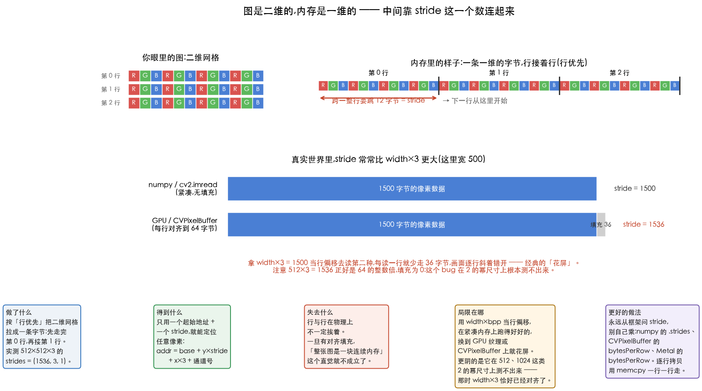
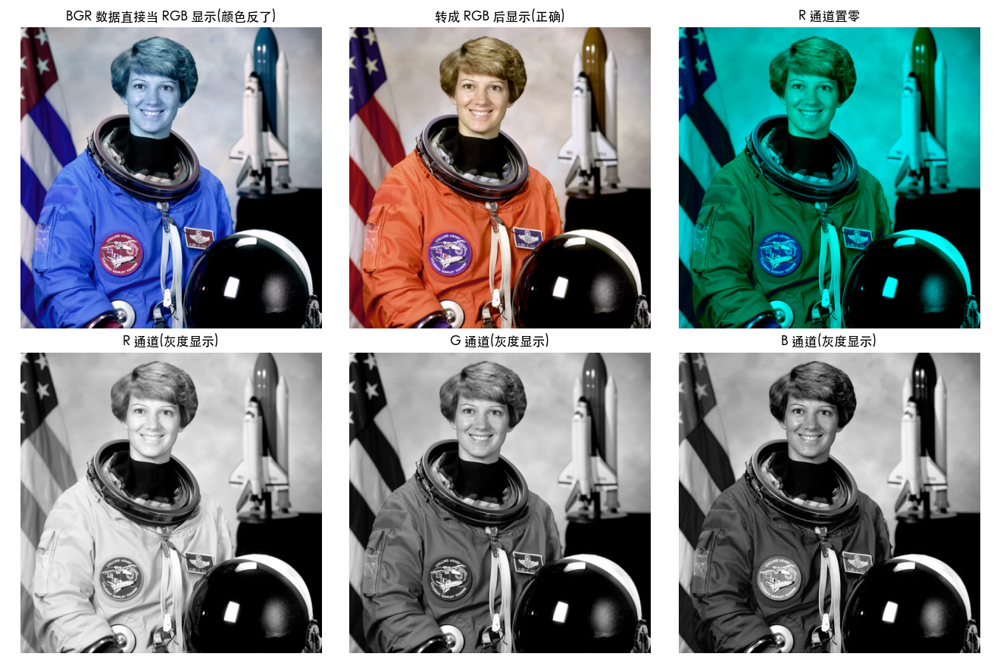
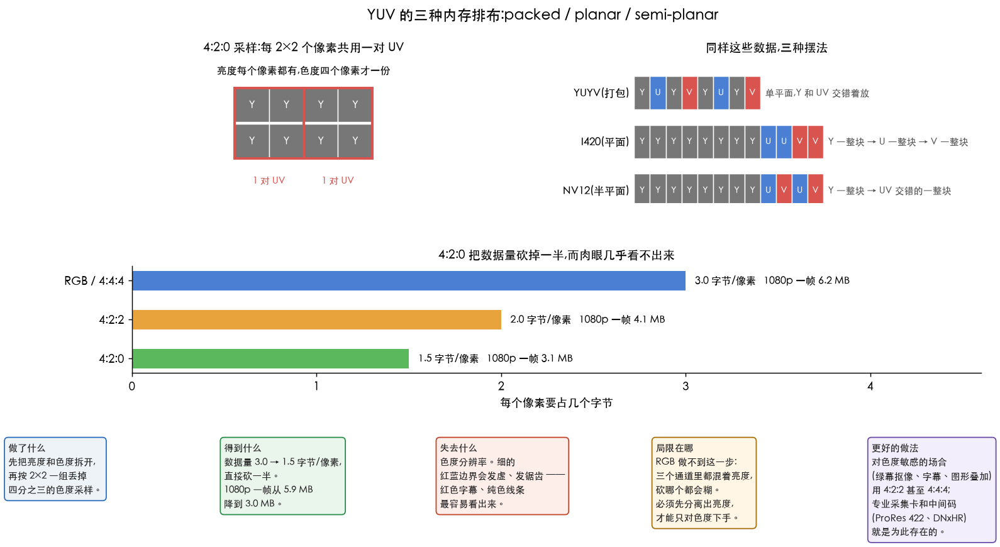

# 图像的内存布局

> 对应 Gonzalez《数字图像处理》2.4 节(数字图像的表示)。这是全套笔记的第一篇,
> 也是唯一一篇**完全不讲算法**的 —— 它只回答一个问题:
> **你手里那张图,在内存里到底是一串什么样的数字。**

> **怎么读这篇**
>
> | 有多少时间 | 看哪几节 |
> | :--- | :--- |
> | **只有 10 分钟** | `先讲人话` + `一、一维内存怎么装二维图` |
> | **第一遍学** | 再加 `二、通道顺序` `三、YUV 为什么要拆成平面` |
> | **踩坑时回来查** | `四、I420 用的哪套标准` `附:Metal 骨架要点` |

> **动手验证**:[`01_hello_image.py`](../../Python-Prototyping/Ch01_02_Fundamentals/01_hello_image.py)、
> [`00_yuv_warmup.py`](../../Python-Prototyping/Ch06_Color_Processing/00_yuv_warmup.py)
> 配图由 [`06_memory_layout_figures.py`](../../Python-Prototyping/Ch01_02_Fundamentals/06_memory_layout_figures.py) 生成。

---

## 先讲人话

后面几十篇都在讲「怎么处理图像」,但处理之前得先知道**处理的对象是什么**。

答案朴素得有点扫兴:**一张图就是一长串数字**,别的什么都没有。
没有「像素对象」,没有「二维数组」这种物理实体 —— 内存是一条直线,
从头到尾就是一个接一个的字节。

于是所有的麻烦都来自同一件事:

> **图是二维的(甚至是三维的:高 × 宽 × 通道),内存是一维的。
> 把前者塞进后者,总得定一套规矩 —— 而不同的人定了不同的规矩。**

这一篇就是把那些规矩摊开:

| 要定的规矩 | 不同的人是怎么定的 | 定错了会怎样 |
| :--- | :--- | :--- |
| 一行走完接下一行,还是一列走完接下一列 | 图像界统一是**行优先** | (这条没分歧) |
| 一行占多少字节 | 紧凑的 `width×3`,或者**对齐到 16/64 的倍数** | 逐行斜着错开 → **花屏** |
| 三个通道谁先谁后 | OpenCV 是 **BGR**,别人多半是 RGB | **红蓝对调** |
| 亮度和色度怎么摆 | packed / planar / semi-planar 三派 | 读出来是乱码 |
| 白是 255 还是 235 | full range / limited range | 对比度凭空少一截 |

这五行里没有一条是「算法」,但**它们贡献了音视频开发里绝大多数的诡异 bug** ——
因为程序不会报错,它只是默默地把数据读歪。

---

## 一、一维内存怎么装二维图

### 规矩:行优先

从左上角出发,**先走完第 0 行的所有像素,再接第 1 行**,一直到最后一行。
每个像素内部,三个通道的字节挨在一起(这叫**交错 / interleaved**)。



左边是你眼里的图,右边是它在内存里真实的样子 —— 一条拉直的字节。

实测 `cv2.imread` 读一张 512×512 的彩色图:

```python
print(bgr.shape)     # (512, 512, 3)   → (高, 宽, 通道),这个顺序叫 HWC
print(bgr.strides)   # (1536, 3, 1)    → 跨一行/一列/一通道,各要跳多少字节
```

`strides` 这三个数就是「怎么从坐标算地址」的全部答案:

```text
算法:定位像素 (y, x) 的第 c 个通道
输入:图的起始地址 base、strides = (行跨度, 列跨度, 通道跨度)
输出:那个字节在内存里的地址

addr ← base + y × 行跨度 + x × 列跨度 + c × 通道跨度
```

512×512×3 的情况下就是 `base + y×1536 + x×3 + c`。
1536 = 512 × 3,看起来就是「宽 × 每像素字节数」。

### 坑:stride ≠ 宽 × 3

**这是这一节唯一真正要记住的事。**

GPU 纹理、`CVPixelBuffer`、视频解码器的输出缓冲区,
几乎都会把**每一行的起始地址对齐到 16 / 64 / 256 字节的倍数** ——
因为对齐之后,SIMD 指令和显存控制器才能按整块搬运,快很多。

于是一行的实际跨度(**stride**,iOS 里叫 `bytesPerRow`)会比 `width×3` 大一截,
多出来的那几个字节是**填充(padding)**,里面是垃圾数据,不属于任何像素。

上图下半部分画的就是这件事:宽 500 的图,紧凑时一行 1500 字节,
对齐到 64 之后变成 **1536**,每行多出 36 字节的填充。

如果你按 `width×3 = 1500` 去算行偏移:

- 第 0 行:对的
- 第 1 行:少走 36 字节 → 读到的是上一行末尾的数据
- 第 2 行:少走 72 字节 → 错得更远

画面会**逐行斜着错开**,这就是经典的花屏。

> **它为什么特别难查**:512、1024、1920 这些常用尺寸,`width×3` 恰好已经是
> 64 的整数倍(1536、3072、5760),填充为 0,`width×3` 和真实 stride 正好相等。
> **代码在这些尺寸上跑得好好的**,一换成裁剪过的奇怪尺寸就炸。
>
> **正确做法只有一条:永远从框架问 stride,别自己乘。**
> numpy 的 `.strides`、`CVPixelBuffer` 的 `CVPixelBufferGetBytesPerRow`、
> Metal 纹理的 `bytesPerRow`。逐行拷贝时一行一行 `memcpy`,
> 源和目标各用各的 stride。

---

## 二、通道顺序

### OpenCV 给的是 BGR

`cv2.imread` 返回的数组,第 0 个通道是**蓝**,不是红。
这是 OpenCV 早年跟着 Windows 位图格式定下来的,一直没改 ——
改了会让全世界的存量代码一起崩。

把 BGR 的数据直接丢给 matplotlib(它按 RGB 理解),红蓝就对调了:



*左上角那张的皮肤发蓝、宇航服从橙变蓝 —— 就是 R 和 B 被互换的结果。
下面一排是三个通道各自当灰度图看:注意**橙色的宇航服在 R 通道里最亮、在 B 通道里最暗**,
这正是「橙色 = 红多蓝少」的直接体现。*

```python
rgb = cv2.cvtColor(bgr, cv2.COLOR_BGR2RGB)   # 给 matplotlib 之前转一下
```

> **一句话判据**:图片只要跨了库的边界,就先确认通道顺序。
> 这和跨系统传 YUV 要先确认 range(第四节)是同一个道理 ——
> **数据本身不带说明书,约定是靠人对齐的。**

---

## 三、YUV 为什么要拆成平面

### 先问:为什么不直接传 RGB

因为**色度可以偷工减料,而 RGB 不给你偷的机会**。

人眼有个很实用的特性:对**亮度**的分辨力远高于对**颜色**的分辨力。
同样是模糊一半,亮度糊了你一眼看出,颜色糊了几乎无感。

那就把颜色的分辨率砍掉一半 —— 数据量直接少一半,肉眼还看不出来。

**但这件事必须先把亮度分离出来才能做。**
RGB 的三个通道里**都混着亮度信息**,砍哪个通道都会把亮度一起砍掉,画面直接糊。
YUV 先用一次矩阵乘法把「多亮」(Y)和「什么颜色」(U、V)拆开,
之后就能只对 U、V 下手,Y 保持全分辨率。

> 这就是[亮度、Luma 与线性光](../02-intensity/03-luma-and-linear-light.md)那篇的工程动机 ——
> 分离亮度不只是为了「正确」,更是为了**能压缩**。

### 三种摆法

拆开之后,Y、U、V 这三份数据在内存里怎么摆,又有三派:



| 类型 | 代表 | 内存排布 | 谁在用 |
| :--- | :--- | :--- | :--- |
| **打包 / packed** | YUYV | `Y U Y V Y U Y V …`,单平面交错 | 老式采集卡、USB 摄像头 |
| **平面 / planar** | **I420**(YUV420P) | Y 一整块 → U 一整块 → V 一整块 | ffmpeg、编码器 |
| **半平面 / semi-planar** | **NV12** | Y 一整块 → UV 交错的一整块 | **iOS 摄像头**、硬件编解码器 |

**I420 和 NV12 只差一件事:UV 是分成两块,还是交错在一块里。**
其余完全相同 —— 所以两者互转只是把 UV 重新穿插一遍,不涉及任何计算。

> iOS 摄像头默认给的是 `kCVPixelFormatType_420YpCbCr8BiPlanarVideoRange`,
> 也就是 NV12 + limited range,**两个关键词都在名字里**:
> `BiPlanar` = 两个平面(半平面),`VideoRange` = limited range。

### 4:2:0 到底省了多少

`4:2:0` 的意思是**每 2×2 个像素共用一对 UV**。算一下每像素的字节数:

```
4:4:4(不砍)   Y 1   + U 1    + V 1    = 3.0 字节/像素
4:2:2(砍一半) Y 1   + U 0.5  + V 0.5  = 2.0 字节/像素
4:2:0(砍四分之三) Y 1 + U 0.25 + V 0.25 = 1.5 字节/像素
```

1080p 一帧从 5.9 MB 降到 3.0 MB —— **整整一半,而且这还是在任何压缩之前**。

> **代价是色度分辨率。** 细的红蓝边界会发虚、发锯齿,
> 红色字幕和纯色线条最容易看出来。
> **想做得更好**:对色度敏感的场合(绿幕抠像、字幕叠加、图形合成)用 4:2:2 甚至 4:4:4 ——
> ProRes 422、DNxHR 这类中间码就是为此存在的。

---

## 四、I420 用的哪套标准

上面说的都是「怎么摆」,这一节说「值本身是按哪套公式算的」。

RGB 转 YUV 有好几套系数(BT.601 / BT.709 / BT.2020),取值范围还分 full / limited。
**这四种组合互不兼容,而 API 通常不告诉你它用的是哪一种。**

办法是**拿纯色块去探**:白、黑、红各送一张进去,看吐出来什么。

用 `cv2.COLOR_RGB2YUV_I420` 实测([`00_yuv_warmup.py`](../../Python-Prototyping/Ch06_Color_Processing/00_yuv_warmup.py)):

| 输入 RGB | Y | U | V | 说明了什么 |
| :--- | :-- | :-- | :-- | :--- |
| 白 (255,255,255) | **235** | 128 | 128 | 白不是 255 → **limited range** |
| 黑 (0,0,0) | **16** | 128 | 128 | 黑不是 0 → 同上 |
| 红 (255,0,0) | 82 | 90 | 240 | 三套标准给的 Y 各不相同,见下 |

第三行是用来分辨系数的。纯红的 Y 在三套组合下分别是:

| 组合 | 纯红的 Y | 和实测 82 比 |
| :--- | ---: | :--- |
| **BT.601 + limited** | ≈ 82 | ✅ 对上了 |
| BT.601 + full | ≈ 76 | 差 6 |
| BT.709 + limited | ≈ 63 | 差 19 |

两个结论一次读出来:**OpenCV 的 I420 是 BT.601 + limited range**。

> 按公式手算是 `16 + 219×0.299 = 81.48`,实测 82 —— 差的那半级来自**定点实现**:
> 经典写法是 `Y = ((66R + 129G + 25B + 128) >> 8) + 16`,
> 用 66/256 去近似 0.2568,结果偏大一点点。
> **这半级不影响判断**,因为另外两套差的是 6 和 19,量级完全不同。

再用整张图验证一遍:按 BT.601 limited 手写逆变换,与 `cv2.COLOR_YUV2RGB_I420` 逐像素比 ——

| 假设的标准 | 平均误差 | 最大误差 |
| :--- | ---: | ---: |
| **BT.601 + limited** | **0.39** | **1** |
| BT.709 + limited | 2.33 | 18 |
| BT.601 + full | 10.02 | 21 |
| BT.709 + full | 9.96 | 28 |

第一行的最大误差只有 1,说明**残差纯粹是取整**,猜对了;
其余三行差一个数量级。BT.709 那组的误差集中在肤色和橙色上,肉眼可见地偏移。

> **通用逆变换**(记这个就不用背三套矩阵):
>
> ```text
> 归一化(limited range):Y′ = (Y − 16) / 219,  C′ = (C − 128) / 224
>
> R = Y′ + 2(1 − Kr)·Cr′
> B = Y′ + 2(1 − Kb)·Cb′
> G = (Y′ − Kr·R − Kb·B) / Kg,   其中 Kg = 1 − Kr − Kb
>
> BT.601:  Kr = 0.299,   Kb = 0.114
> BT.709:  Kr = 0.2126,  Kb = 0.0722
> BT.2020: Kr = 0.2627,  Kb = 0.0593
> ```
>
> 三套标准的差别**只在 Kr、Kb 两个数上**,公式结构完全一样。
>
> **想做得更好**:别靠探测,靠元数据 ——
> `ffprobe -show_entries stream=pix_fmt,color_range,color_space` 一次问清楚。
> 探测法是用来验证对方有没有骗你的,不是日常做法。

---

## 小结

| 问题 | 答案 |
| :--- | :--- |
| 图在内存里是什么 | 一长串字节,行优先,通道交错 |
| 怎么从坐标算地址 | `base + y×stride + x×3 + c` |
| **stride 等于 width×3 吗** | **不一定**。有对齐填充时更大,必须问框架要 |
| 为什么这个坑难查 | 512/1024/1920 这些尺寸恰好已经对齐,测不出来 |
| OpenCV 给的是 RGB 吗 | **不是,是 BGR**。跨库传图先确认通道顺序 |
| 为什么要转 YUV | 先分离亮度,才能只砍色度 —— RGB 不给你这个机会 |
| I420 和 NV12 差在哪 | 只差 UV 是分两块还是交错在一块 |
| 4:2:0 省多少 | 3.0 → 1.5 字节/像素,一半 |
| OpenCV 的 I420 是哪套 | BT.601 + limited range(白 235、黑 16) |

---

## 附:Metal 骨架要点

*(这一节是本仓库 `Metal-Implementation/` 的工程记录,和上面的原理无关,
第一遍可以跳过。)*

- `Metal-Implementation/DIPMetalEngine/` 是一个 SwiftPM 可执行包,
  `swift run` 直接跑,不需要 xcodeproj。
- 全屏 quad 用 `vertex_id` 现算 4 个角(triangle strip),不需要顶点缓冲;
  aspect-fit 通过缩放 NDC 坐标实现。
- 纹理加载用 `.SRGB: false`(按原始字节透传)。
  做模糊时要回头处理 sRGB / 线性空间的问题 ——
  见[亮度、Luma 与线性光](../02-intensity/03-luma-and-linear-light.md)第七节。
- 后续每周的滤镜只需换 fragment 或插一个 compute pass,这个骨架不用动。

### 遗留问题

- [ ] `MTKTextureLoader` 加载出的 pixelFormat 是 BGRA 还是 RGBA?
      (实测 `rawValue = 80`,待查表确认)
- [ ] iOS 端拿到 `CVPixelBuffer` 的 NV12 两个平面时,`bytesPerRow` 和 `width`
      实际差多少?(回工作项目里打印一次,正好印证第一节那个坑)

---

## 相关文档

- [02-rounding-and-float.md](02-rounding-and-float.md) —— 知道了值怎么存,接着是值怎么算
- [03-lut.md](03-lut.md) —— 「8 位只有 256 种可能」这个事实能换来多大的便宜
- [03-luma-and-linear-light.md](../02-intensity/03-luma-and-linear-light.md) —— Y 到底是什么、limited range 的完整账
