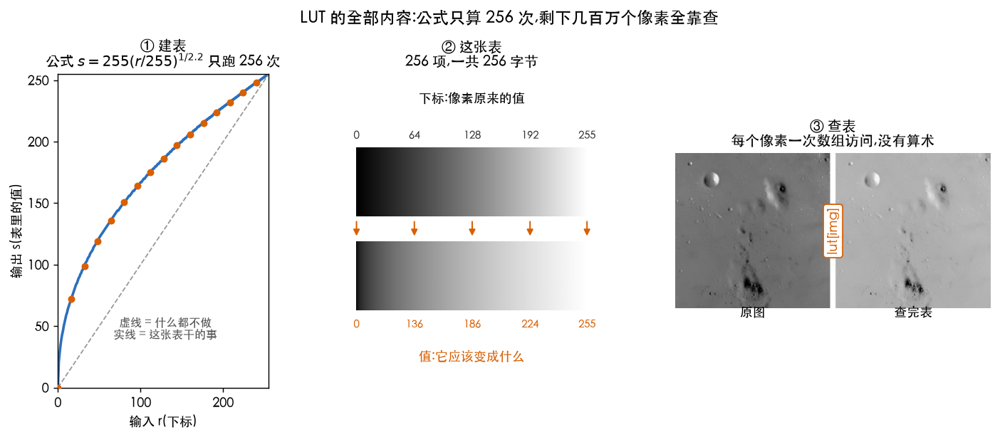
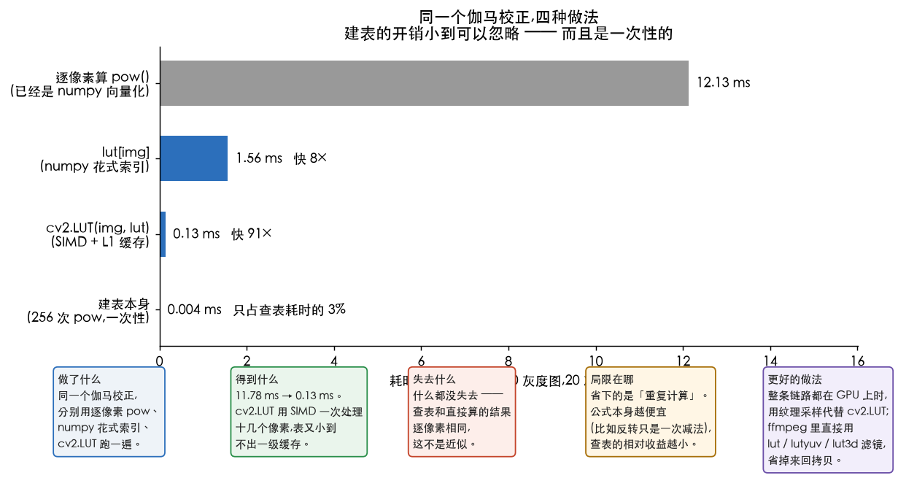
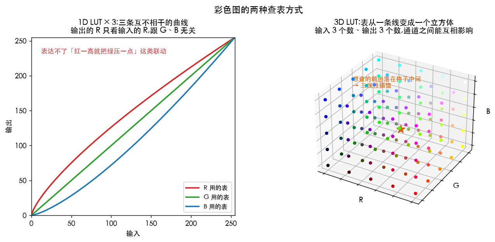

# LUT 是什么

> 从 3.2 节开始,几乎每一篇都在说「建一张 LUT」「查表」。这一篇专门把它讲透:
> 它是什么、为什么能这么干、什么时候不能用、以及你在 ffmpeg 和显示器里早就见过的那些 LUT。

---

> **怎么读这篇**(第一遍真的不用全看)
>
> | 有多少时间 | 看哪几节 |
> | :--- | :--- |
> | **只有 10 分钟** | `一句话` + `小结` —— 知道 LUT 是什么就够了 |
> | **第一遍学** | 再加 `一、为什么能这么干` `二、手把手:建表 + 查表` `三、什么能塌缩成 LUT` —— 这三节是主干 |
> | **踩坑时回来查** | `四、彩色图怎么办`(3D LUT)`五、天花板:位深一高`(位深)`六、你其实早就见过它` |

---

## 一句话

**LUT(Look-Up Table,查找表(look-up table, LUT))就是一张「输入 → 输出」的对照表。**
本来每个像素都要算一遍公式,改成事先把所有可能的答案算好列成表,之后只查表、不算数。

就像你不会每次都去推 `7×8` 等于多少,而是背了乘法口诀表。

---

> **动手验证**:[`Ch01_02_Fundamentals/03_lut_basics.py`](../../Python-Prototyping/Ch01_02_Fundamentals/03_lut_basics.py)
> 把本篇每一条都跑了一遍,下面引用的数字都是它打印出来的。
> 本篇的三张配图由 [`04_doc_figures.py`](../../Python-Prototyping/Ch01_02_Fundamentals/04_doc_figures.py) 生成。

---

## 一、为什么能这么干

一张 1080p 的灰度图有 **207 万个像素**,但每个像素的值**只有 256 种可能**(0~255)。

也就是说,207 万次计算里,**真正不同的输入只有 256 个**,剩下的全是重复劳动。

```
原来:  对 2,073,600 个像素,每个都算一次 pow()
改成:  对 256 个可能的值各算一次 pow(),列成表
       再让 2,073,600 个像素挨个去表里取答案
```

省下的是 207 万 − 256 ≈ **207 万次** 重复计算。

> 这个洞察只对**离散、取值范围有限**的数据成立。
> 8 位图正好是最理想的情况:256 项,一张表 256 字节,小到能整个塞进 CPU 的一级缓存。

---

## 二、手把手:建表 + 查表

先用最简单的例子 —— **图像反转**,公式就是 `s = 255 − r`(黑变白、白变黑)。

**第一步:建表。** 只跑 256 次,和图多大完全无关。

```python
import numpy as np
r   = np.arange(256)                 # 所有可能的输入:0, 1, 2, ..., 255
s   = 255 - r                        # 对每个可能的输入各算一次
lut = s.astype(np.uint8)             # 这就是那张表
```

`lut` 就是一个长度 256 的数组,可以直接把它当成一张对照表来读:

```
下标(输入)   0     1     2    ...   128   ...   254   255
表里的值    255   254   253   ...   127   ...    1     0
             ↑ 原来是 0 的像素,应该变成 255
```

整个套路用伪代码写出来就两步,而且**第一步和图多大完全无关**:

```text
算法:用 LUT 做任意点运算
输入:图 img、一个公式 T(r)
输出:处理后的图

1. 对每个可能的输入 r(8 位图就是 0~255):     // 只跑 256 次
       lut[r] ← clip( round( T(r) ), 0, 255 )
2. 对每个像素 p:                              // 跑几百万次,但只是查表
       输出[p] ← lut[ img[p] ]
```

第 1 步里那个 `clip` 和 `round` 不是收尾工作,是变换的一部分 ——
漏了会出[回绕黑斑](02-rounding-and-float.md)。

**第二步:查表。** 每个像素一次数组访问,没有任何算术。

```python
out = lut[img]               # numpy 花式索引
out = cv2.LUT(img, lut)      # OpenCV 的写法,效果完全相同
```

`lut[img]` 这一行值得单独看懂:`img` 是**一整个二维数组**,拿它去索引 `lut`,
numpy 会对 `img` 里的每个元素各查一次表,返回一个和 `img` 同样大小的新数组。
**一行代码就是全图查表。**

整件事画出来就是下面这三格。左边那条曲线上**只有 256 个点**被算过 ——
右边那几百万个像素,一次乘法都没做:



*中间那张图值得多看两眼:上面一条色带是**下标**(像素原来的值),
下面一条是**表里的值**(它应该变成什么)。伽马校正(gamma correction)这张表做的事,
就是把下标 64 的那格换成 136 —— 暗部被整体抬亮了一大截。*

### 换个公式,表就换一张

LUT 本身跟公式是什么没关系。把第一步那一行公式换掉,别的一个字都不用改:

| 想做什么 | 建表那一行 |
| :--- | :--- |
| 反转 | `s = 255 - r` |
| 整体提亮 50 | `s = np.clip(r + 50, 0, 255)` |
| 对比度 ×1.5 | `s = np.clip(1.5 * r - 64, 0, 255)` |
| 阈值化(T=128) | `s = np.where(r > 128, 255, 0)` |
| 伽马校正 | `s = 255.0 * (r / 255.0) ** (1 / 2.2)` |

> **那个 `2.2` 是什么?** 它跟 LUT 一点关系都没有,是**伽马校正这个公式自己的参数**,
> 叫**伽马值**。屏幕把输入信号变成实际亮度时会按 `亮度 = 输入^2.2` 压一道,
> 所以存图的时候要先反着抬一道 `^(1/2.2)` 抵消掉。换成 `1/1.8`、`1/2.4` 也一样跑,
> 只是效果强弱不同。
> 完整来龙去脉见 [intensity-and-grayscale.md 的伽马一节](../02-intensity/01-intensity-and-grayscale.md)。
>
> 之所以拿它当性能例子,是因为**它是上表里唯一「算起来贵」的**:
> 反转是一次减法,伽马是一次 `pow()`,慢几十倍。**越贵的公式,查表省得越多。**

### 实测:1080p 伽马校正

| 做法 | 耗时 |
| :--- | ---: |
| 逐像素算 `pow`(已经是 numpy 向量化的) | **11.47 ms** |
| `lut[img]`(numpy 花式索引) | 1.56 ms |
| `cv2.LUT(img, lut)` | **0.13 ms** |
| 建表本身(256 次 `pow`) | 0.005 ms |

`cv2.LUT` 比直接算快了 **88 倍**,而建表的开销小到可以忽略 —— 只占查表耗时的 3%,还是一次性的。



*最下面那根几乎看不见的条就是建表。它不是「另一种做法」,是查表之前的一次性准备 ——
一整段视频建一次表,之后每一帧都白赚。*

> 为什么 `cv2.LUT` 又比 numpy 快十倍:它用 SIMD 指令一次处理十几个像素,
> 而且表只有 256 字节,全程待在 L1 缓存里。这类「小表 + 大数据」是 CPU 最擅长的活。

---

## 三、什么能塌缩成 LUT

**判据只有一条:**

> **输出是否只取决于这个像素自己的值?**
> 是 → 能塌缩成 LUT。要看邻居、要看位置 → 不能。

| 操作 | 能不能 | 为什么 |
| :--- | :---: | :--- |
| 线性 / 反转 / 对数 / 伽马 / 分段线性 | ✅ | `s = T(r)`,标准的点运算 |
| 阈值化 | ✅ | 表里只有 0 和 255 两个值 |
| 直方图均衡化 | ✅ | 表是从图统计出来的,但**算好之后仍是一张表** |
| 比特平面(单层) | ✅ | `lut[v] = (v >> i) & 1`,照样只看自己 |
| 高斯模糊 / 中值滤波 / Sobel | ❌ | 要看邻居 |
| **CLAHE** | ❌(单张表不行) | 输出还取决于像素**在哪儿** |
| 几何变换(旋转、缩放) | ❌ | 动的是位置,不是值 |

其中**直方图均衡化(histogram equalization)**这一条最值得琢磨:它需要先扫一遍图做统计,
但统计完之后得到的仍然是一张普普通通的 256 项表,第二遍就是纯查表。
所以它是「**两遍扫描的点运算(point operation)**」,不是别的什么东西。

而 **CLAHE 恰恰是被这条判据卡住的例子**:同一个灰度值在图的不同位置要映射到不同结果,
一张表表达不了。它的解法是**换成 64 张表 + 插值(interpolation)** ——
换句话说,LUT 这个工具没被丢掉,只是从 1 张变成了一个网格。
详见 [05-clahe.md](../03-histogram/05-clahe.md)。

---

## 四、彩色图怎么办

### 1D LUT × 3

`cv2.LUT` 对三通道图的做法是**逐通道查同一张表**:

```python
out = cv2.LUT(bgr, lut)     # B、G、R 三个通道都用这一张 lut
```

要让三个通道各不相同(比如白平衡、单独提红),就得传一张 `(1, 256, 3)` 的表,
或者把通道拆开各查各的。

**但 1D LUT 有个根本限制:它没法表达「通道之间互相影响」。**
输出的 R 只能由输入的 R 决定,跟 G、B 无关。
而真实的颜色变换(色彩空间转换、调色、LOG 转 Rec.709)几乎都是三个通道纠缠在一起的。

### 3D LUT:输入变成 3 个数

解法是把表从一条线变成一个**立方体**:

```
1D LUT:  lut[r]              256 项            输入 1 个数
3D LUT:  lut[r][g][b]        33×33×33 项       输入 3 个数,输出 3 个数
```

完整的 256³ = 1677 万项太大(按 3 通道算约 50 MB),所以实际只存**稀疏网格**
(常见 17³ / 33³ / 65³),中间的值靠**三线性插值**补出来。

> 又是那个套路:**在稀疏网格上算准,中间靠插值补。**
> CLAHE 的 64 张表 + 双线性插值、几何变换的重采样、镜头暗角校正的增益网格,全是同一个思路。



*左边三条曲线各管各的,谁也不看谁 —— 这就是 1D LUT 的天花板。
右边每个格点存一个完整的颜色,想查的颜色落在格子中间时,
用它周围 8 个格点**三线性插值**补出来(和 CLAHE 用 4 张表插值是同一套路,只是从 2 维变成 3 维)。*

你在调色软件里加载的 `.cube` 文件就是 3D LUT,ffmpeg 里对应 `lut3d` 滤镜。

---

## 五、天花板:位深一高

| 位深 | 表的项数 | 表占多大 | 查表还划算吗 |
| :--- | ---: | ---: | :--- |
| 8 bit | 256 | 256 B | ✅ 全程待在 L1 缓存,最理想 |
| 10 bit | 1024 | 2 KB | ✅ 划算,但 `cv2.LUT` 用不了(见下) |
| 12 bit | 4096 | 8 KB | ⚠️ 还行,缓存开始不友好 |
| 16 bit | 65536 | 128 KB | ⚠️ 超出 L1,常改成粗表 + 插值 |
| 浮点(线性光 / HDR) | — | — | ❌ 没有「档」这个概念,只能直接算 |

两个要记的坑:

- **`cv2.LUT` 支持 8 位和 16 位,但表的长度写死了**:8 位输入要 256 项,16 位输入要 **65536 项**,
  中间没有挡位。10 bit 数据装在 `uint16` 里实际只用 0~1023,想用 `cv2.LUT` 就得建一张
  65536 项的表,白白浪费 64 倍;更省的做法是 `np.take(lut1024, img)`,表只要 2 KB
- 浮点没有天然的桶。要查表只能自己定一个范围和分辨率,再插值 —— 这时候 LUT 的「精确」就没了,
  变成了近似。**3D LUT 必须配插值,也是同一个原因**:33³ 的网格不可能精确覆盖所有颜色

> **想做得更好**:位深高或数据是浮点时,改成「**粗表 + 插值**」(3D LUT 就是这么干的);
> 整条链路在 GPU 上时,把表传成 1D/3D 纹理,采样器自带插值,连插值代码都省了;
> 要严谨的色彩管理则别用裸 LUT,上 ICC 配置文件或 OCIO —— 它们带完整的色彩空间定义,
> 而不只是一张对照表。

---

## 六、你其实早就见过它

| 场景 | 它在哪 |
| :--- | :--- |
| **ffmpeg** | `lut` / `lutyuv` / `lutrgb`(1D)、`lut3d`(3D)、`curves` 内部也是建表 |
| **显示器** | 显卡输出端的 gamma ramp / VCGT,校色软件写进去的就是一张 1D LUT |
| **相机 / 手机 ISP** | tone curve、伽马编码,硬件里就是一块查表 RAM |
| **GPU shader** | 把 LUT 传成一张 1D / 3D 纹理,采样器自带插值 |
| **matplotlib** | `cmap="gray"` / `"viridis"` 就是一张「灰度 → RGB」的 LUT |
| **GIF / 索引色 PNG** | 调色板(palette)本身就是 LUT:像素存的是**表里的第几项**,不是颜色 |

最后一条尤其能说明问题:索引色图片里,像素值根本不是亮度,**它就是个下标**。
LUT 不只是个优化手段,有时候它就是数据本身的组织方式。

---

## 小结

| 问题 | 答案 |
| :--- | :--- |
| LUT 是什么 | 一张「输入 → 输出」的对照表,把计算换成查字典 |
| 为什么能这么干 | 8 位图只有 256 种可能的输入,其余全是重复劳动 |
| 快多少 | 1080p 上 11.47 ms → 0.13 ms,**88 倍**;建表开销可忽略 |
| 什么时候能用 | **输出只取决于该像素自己的值**;要看邻居或位置就不行 |
| 均衡化算不算 | 算。先扫一遍统计,但得到的仍是一张 256 项表 |
| CLAHE 为什么不行 | 同一个值在不同位置要有不同结果 → 改成 64 张表 + 插值 |
| 彩色怎么办 | 通道独立用 1D;通道互相影响用 3D LUT + 三线性插值 |
| 什么时候失效 | 位深太高、或者数据是浮点 —— 没有「档」就没法查表 |

---

## 相关文档

- [01-intensity-and-grayscale.md](../02-intensity/01-intensity-and-grayscale.md) —— 灰度变换原理篇,LUT 的主战场
- [02-gray-transform-tutorial.md](../02-intensity/02-gray-transform-tutorial.md) —— 七种灰度变换,每一种都是一张表
- [04-equalization.md](../03-histogram/04-equalization.md) —— 均衡化:表从图自己统计出来
- [05-clahe.md](../03-histogram/05-clahe.md) —— CLAHE:64 张表 + 插值
- [02-rounding-and-float.md](02-rounding-and-float.md) —— 建表时的取整与截断规矩
