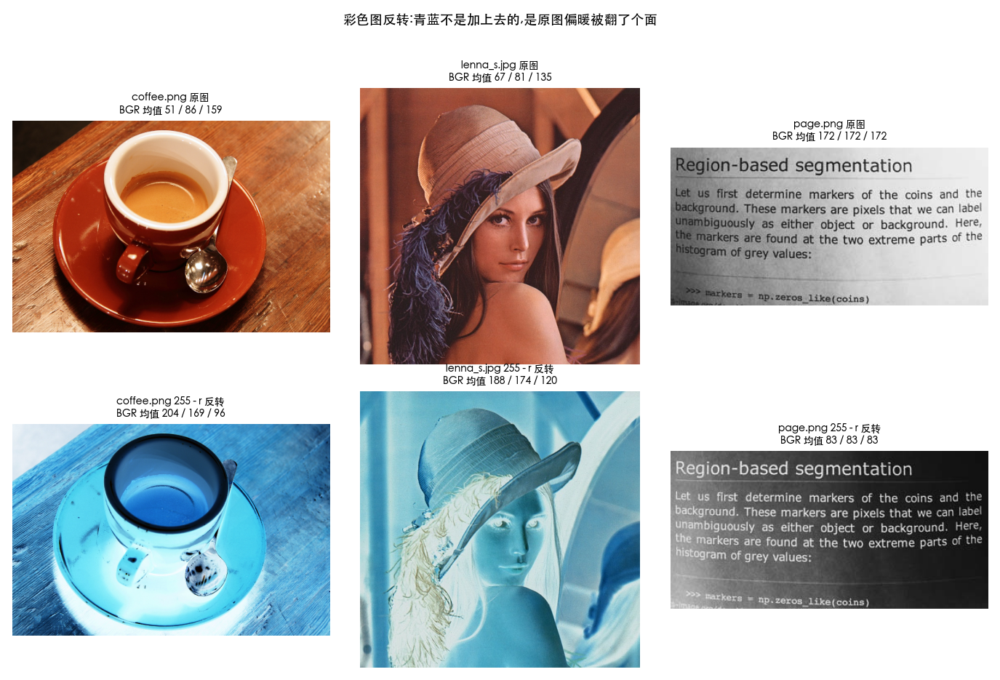

# 灰度变换图解教程

> 改写自知乎文章[《数字图像处理 - 灰度变换基础》](https://zhuanlan.zhihu.com/p/2054856557331067380)(作者 YuHan),
> 配图沿用原文。原文偏教材腔且有几处含糊/出错的地方,这里全部改成大白话并做了修正(见文末「与原文的出入」)。
>
> **和 [01-intensity-and-grayscale.md](01-intensity-and-grayscale.md) 的分工**:
> 那份讲「为什么」(线性/对数/幂律的原理、区别、坑),这份讲「有哪些方法、长什么样、代码怎么写」。

## 先搞懂三件事

**1. 灰度是什么**

就是一个像素**有多亮**,用 0~255 表示。0 是纯黑,255 是纯白,中间是深浅不同的灰。
彩色图每个像素要存红绿蓝三个数,灰度图只存一个,所以数据量只有三分之一。

> "灰度"和"亮度"这两个词是什么关系,见文末**附二** —— 它们回答的其实不是同一个问题。

**2. 灰度变换是什么**

**给每个像素换一个亮度值。** 写成公式就是:

```
s = T(r)      r 是原来的亮度,s 是换完的亮度,T 是"换法"
```

本文讲的所有方法,区别只在于**这个 T 长什么样**。

**3. 什么叫"点运算"**

换牌只看**自己现在多亮**,不看旁边的邻居长什么样。

这是灰度变换和"滤波"的根本分界:滤波(模糊、锐化)要看周围一圈像素才能算出自己的新值,
灰度变换不用。所以灰度变换可以**预先算好一张 256 项的表**,然后全图查表——快得多。

```python
# 所有灰度变换都是这个套路
lut = np.array([算出 r 对应的新值 for r in range(256)], dtype=np.uint8)
out = cv2.LUT(img, lut)     # 207 万个像素,只查表不算数
```

---

## 一、图像反转:黑变白,白变黑

$$s = 255 - r$$

最简单的一种。原来是 0 的变成 255,原来是 200 的变成 55。**就是照片底片的效果。**


上图是乳腺 X 光片。左边原图整体偏黑,病灶埋在暗部里不好找;右边反转后背景变白、病灶变成深色斑点,
**一眼就能看到**。


直方图正好**左右镜像**过来。注意形状完全没变,只是整个翻了个面——
所以**对比度一点没变,变的只是明暗方向**。

```python
out = 255 - img          # 就这一行
# 或者 cv2.bitwise_not(img),结果完全一样
```

**什么时候用**

- 医学影像(X 光/CT):暗背景里找暗目标,反转后变成亮背景里找暗目标,人眼更擅长后者
- 做掩膜(mask):白字反转成黑字当遮罩用
- 想要底片风格的艺术效果

> 上面讲的都是灰度图。**彩色图反转会整体发青蓝** —— 皮肤发青、暖光变蓝。
> 那不是算错了,是每个像素都换成了自己的补色;胶片的橙色罩也参与其中。
> 这一块单独放在文末「附一:彩色反转为什么会发青蓝」,可以先跳过,回头慢慢看。

---

## 二、对数变换:把暗部掰开

$$s = c \cdot \log(1 + r)$$

**暗部拉宽,亮部压扁。** 原来挤在 0~10 的那点细节,被拉开到 0~110,层次就显出来了;
代价是亮部被挤成一团。


上图是医学 CT。原图很多结构埋在黑里,对数变换后整体变亮,暗部结构浮出来了。


曲线左边陡、右边平。**陡 = 拉开,平 = 压扁**,一眼就能看出它在偏袒谁。


原来全挤在左边(暗)的像素,被摊开到了整个范围。

### 公式里的 `+1` 和 `c` 是干什么的

这两个都是**工程上的补丁**,不是数学原理。去掉它俩,核心只剩 `s = log(r)`——
"取对数"这个动作本身才是原理,`+1` 和 `×c` 只是为了让它能在 8 位图像上跑起来。

**补丁一:`+1` —— 躲开 log(0)**

不加 1 会怎样:

```
r = 0    →   log(0) = -inf     ← 程序直接爆
```

`log` 问的是"e 的多少次方等于这个数"。而 e 的任何次方**永远大于 0**,
只有次方数趋向负无穷时才无限接近 0,所以 `log(0)` 没有答案。

偏偏 **r=0(纯黑)是图像里最常见的像素值**,不能不管。加个 1 就绕过去了:

```
r = 0    →   log(1) = 0        ← 正好是 0,黑还是黑
r = 1    →   log(2) = 0.693
r = 255  →   log(256) = 5.545
```

`+1` 就是把输入从 `0~255` 平移成 `1~256`,避开 0 这个雷。
顺带还有个巧合:`log(1)` 刚好等于 0,所以纯黑变换后仍是纯黑,不会莫名其妙变灰。

**补丁二:`×c` —— 把结果撑满 0~255**

看上面那组数字的最大值:`log(256) = 5.545`。

**整个输出范围只有 0~5.5**,而灰度图需要 0~255。直接把 5.5 当灰度值存进去,
整张图的像素全在 0~5 之间——**打开一看就是一片黑**。

所以要把 `0~5.545` 等比放大到 `0~255`,放大倍数就是:

```
255 ÷ 5.545 = 45.99        写成公式就是  c = 255 / log(256)
```

乘上之后两端正好卡住,中间铺满:

| 输入 r | log(1+r) | × 45.99 |
| ---: | ---: | ---: |
| 0 | 0.000 | **0.0** ← 黑还是黑 |
| 1 | 0.693 | 31.9 |
| 10 | 2.398 | 110.3 |
| 100 | 4.615 | 212.2 |
| 255 | 5.545 | **255.0** ← 白还是白 |

**小结**

| | 干什么用 |
| :--- | :--- |
| **+1** | 躲开 `log(0) = -∞` 这个坑 |
| **×c** | 把只有 0~5.5 的结果**撑满** 0~255 |

> 这也解释了原文那个 bug 是怎么来的:原文后面用 `cv2.normalize` 做归一化,
> 而**归一化本身就在干 `×c` 这件事**(把实际范围撑满 0~255)。两个一起用,
> 前面乘的 c 会被后面的归一化重新算一遍,等于白乘。详见文末「与原文的出入」。

```python
c = 255 / np.log(256)
lut = np.array([c * np.log(1 + r) for r in range(256)], dtype=np.uint8)
out = cv2.LUT(img, lut)
```

**什么时候用**

- **看傅里叶频谱**(最经典的用途,也几乎是唯一不可替代的)。频谱里最亮和最暗能差几百万倍,
  不取对数的话屏幕上只有中心一个白点,其他全黑
- 低照度图像提亮

> 详细的「对数 vs 幂律有什么区别、为什么频谱非它不可」,见 [01-intensity-and-grayscale.md](01-intensity-and-grayscale.md) 第二节。

---

## 三、幂律变换(伽马):可调强度的对数

$$s = 255 \cdot \left(\frac{r}{255}\right)^{\gamma}$$

和对数一个思路,但**弯多少由 γ 说了算**,而且能反向:

| γ | 效果 |
| :--- | :--- |
| γ < 1 | 提亮暗部(和对数同方向,但温和可调) |
| γ = 1 | 什么都不做 |
| γ > 1 | 反过来,压暗 |


一族曲线。γ 越小越往上凸(越提亮),γ 越大越往下凹(越压暗),γ=1 就是那条直线。


同一张图从 γ=0.3 到 γ=3.0 的连续变化,从惨白到漆黑。


γ<1 时直方图整体右移(变亮),γ>1 时左移(变暗)。

```python
gamma = 0.5
lut = np.array([255 * (r / 255) ** gamma for r in range(256)], dtype=np.uint8)
out = cv2.LUT(img, lut)
```

**为什么它是三者里最重要的**

**你的屏幕、相机、视频编码每一秒都在做幂律变换。** 人眼对暗部敏感、对亮部迟钝,
8 位只有 256 档,平均分配的话暗部不够用、亮部浪费。所以存图前先做一次 γ≈1/2.2
(把档位往暗部倾斜),显示时屏幕再做一次 γ≈2.2 抵消回来。这一来一回就叫**伽马校正**。

> ⚠️ sRGB 不是纯粹的幂律,它在最暗处接了一小段直线。日常用 `pow(x, 2.2)` 近似够了
> (差约 2 个灰度级),但精确色彩管理不能这么糊。详见 [01-intensity-and-grayscale.md](01-intensity-and-grayscale.md) 第三节。

**动手验证**:[`Ch03_Spatial_Filtering/04_gamma_transform.py`](../../Python-Prototyping/Ch03_Spatial_Filtering/04_gamma_transform.py)
把本节结论逐条跑了一遍(lenna 灰度图):

| 结论 | 实测 |
| :--- | :--- |
| γ=1 什么都不做 | 与原图逐像素相同 |
| γ<1 提亮、γ>1 压暗 | 均值 γ=0.3 → 185、γ=1 → 95、γ=3 → 22 |
| 对数 = 固定档位的幂律 | 扫描后最接近对数的是 **γ=0.21**,两条 LUT 平均差 3.59 个灰阶 |
| **幂律不截断** | 任何 γ 下都有 lut[0]=0、lut[255]=255 且单调递增 —— 不像线性 a=2 会拍平两成像素 |
| **但照样丢信息** | γ=0.3 把 256 个输入灰阶并成 149 个;γ=3.0 并成 158 个 |
| 必须先归一化 | 漏了除以 255:γ=0.5 时输出最大只有 16(全黑);γ=2.2 时 r≥13 全部撑爆成白 |
| 伽马校正一来一回 | 存 γ=1/2.2 再显示 γ=2.2,与原值最大差 1 个灰阶(中间量化了一次) |
| sRGB 不是纯幂律 | 与纯 γ=2.2 最大差 **2.17**、平均 1.13 个灰阶,差异全在最暗处 |

其中「不截断但会合并灰阶」值得单独记:**线性丢信息的方式是把两端拍平,
幂律是把中间挤到一起**,两者都不可逆 —— 点运算只能重排已有灰度级,不能新增。

---

## 四、分段线性:分区间各管各的

前面三种都是**一个公式管全图**。分段线性是把 0~255 切成几段,**每段用不同的规则**。
灵活,但要自己定分界点。

常见三种玩法:

### 4.1 对比度拉伸:把感兴趣的那一段拉满

如果一张图的像素全挤在 80~150 之间(灰蒙蒙的),那 0~80 和 150~255 就是浪费的。
**把 80~150 这一段拉开铺满 0~255**,对比度立刻上来。


曲线是三段折线:中间那段很陡(把窄区间拉开),两头很平(把没用的区间压掉)。
两个红点就是**转折点**,由你指定。


左边是灰蒙蒙的航拍图,右边拉伸后街道、建筑的纹理全出来了。


原来堆在中间的一坨,被摊平到了整个范围。

```python
def contrast_stretch(img, r1, s1, r2, s2):
    """把 [r1,r2] 拉伸到 [s1,s2],两端各自压缩"""
    lut = np.zeros(256, dtype=np.uint8)
    for r in range(256):
        if r < r1:      s = s1 / r1 * r
        elif r < r2:    s = s1 + (s2 - s1) / (r2 - r1) * (r - r1)
        else:           s = s2 + (255 - s2) / (255 - r2) * (r - r2)
        lut[r] = np.clip(s, 0, 255)
    return cv2.LUT(img, lut)

out = contrast_stretch(img, r1=80, s1=0, r2=150, s2=255)
```

> **注意代价**:中间拉开的同时,两头被压缩甚至压平了——那部分的细节是**永久丢失**的。
> 直方图会出现梳子状的缝隙(拉伸只能把已有的灰度级摊开,不能凭空造出中间级)。

**极端情况**:如果 r1 = r2,中间那段变成垂直的,就退化成了**阈值化**(见第五节)。

**动手验证**:[`Ch03_Spatial_Filtering/05_piecewise_linear.py`](../../Python-Prototyping/Ch03_Spatial_Filtering/05_piecewise_linear.py)
拿 `moon.png`(1%~99% 只跨 83 个灰阶,典型的灰蒙蒙)跑了一遍:

| 结论 | 实测 |
| :--- | :--- |
| 它不是新公式,是分段用 s = a·r + b | 三段的 (a, b) 分别是 (0, 0)、(3.40, −238)、(0, 255) |
| 拉伸确实有效 | 标准差 13.3 → 32.4(2.4 倍),1%~99% 跨度 83 → 241 |
| **两头被压平** | 256 个输入灰阶有 182 个被压进相邻值;纯黑像素 240 → 3848,纯白 4 → 2264 |
| **梳齿** | 1~254 里空着的灰阶 78 → 181;用到的灰阶数反而从 178 掉到 75 |
| 自动选转折点 | 按 1%/99% 自动取 [58, 141],标准差 31.1,与手工 [70, 145] 的 32.4 基本持平 |
| r1 = r2 退化成阈值化 | LUT 只剩 {0, 255} 两个值,与 `cv2.threshold` 逐像素相同 |

**「用到的灰阶数从 178 掉到 75」** 这条最该记:拉伸让图变好看了,
可它**没有增加任何信息**,反而少了 —— 对比度是靠牺牲两端换来的。

### 4.2 灰度级分层:只把某一段挑出来

想找"亮度在 100~160 之间"的区域(比如工业检测里的缺陷),其他的都不关心。


三张图:原始缺陷图 / 方法 A(二值突出) / 方法 B(保留背景)。

```python
# 方法 A:选中的变白,其余变黑 —— 干脆,但背景信息全丢
mask = (img >= low) & (img <= high)
out_a = np.where(mask, 255, 0).astype(np.uint8)

# 方法 B:选中的保持不变,其余压暗压平 —— 柔和,还能看见背景在哪
out_b = img.copy()
out_b[~mask] = out_b[~mask] // 3 + 50     # 把其余压进 50~135 这个窄范围
```

方法 B 里 `//3 + 50` 没什么玄机,就是"除一下再抬一点",把不关心的部分压成一片
不刺眼的中灰,让目标显眼。数值随便调。

**动手验证**:脚本里拿 `coins.png` 取 [150, 255] 这一段,硬币被干净地挑了出来
(命中 20.8%)。但同一份输出也暴露了这个方法的天花板:
**右上角那片纯背景里也有 17% 被选中** —— 这张图打光不均,
右上角的背景比左下角的硬币还亮。

**灰度级分层只看像素值,不看位置**,所以光照不均时同一个阈值在画面各处含义不同。
要按局部判断,得上自适应阈值或 CLAHE(见 `13_clahe_walkthrough.py`)。

### 4.3 比特平面分层:把 8 个二进制位拆开

一个 8 位像素,比如 `200`,二进制是 `11001000`。**把这 8 位一位一位拆开**,
每一位单独拿出来就是一张黑白图,一共 8 张。


规律很明显:

- **高位平面**(bit-7 权重 128、bit-6 权重 64):**图像的大致轮廓**都在这里
- **低位平面**(bit-0 权重 1、bit-1 权重 2):**基本是噪声**,看不出内容

```python
planes = [((img >> i) & 1) * 255 for i in range(8)]    # bit-0 到 bit-7
```

**为什么有用**

- **压缩**:高位几张就撑起了大部分画面,低位几张扔掉人眼看不太出来——这是有损压缩的朴素版
- **数字水印**:往最低位里塞信息,肉眼完全看不出来(反正那层本来就是噪声)

**动手验证**:[`Ch03_Spatial_Filtering/06_bit_planes.py`](../../Python-Prototyping/Ch03_Spatial_Filtering/06_bit_planes.py)
把上面这些说法逐条量化了(lenna 灰度图):

**「高位是轮廓、低位是噪声」不用看图说话**。拿「与左邻居同值的比例」当指标 ——
图像的相邻像素本来就高度相关,所以承载轮廓的平面这个值接近 1;
而纯随机的 0/1 就是抛硬币,期望正好 0.500:

| 平面 | bit-7 | bit-6 | bit-5 | bit-4 | bit-3 | bit-2 | bit-1 | bit-0 |
| :--- | ---: | ---: | ---: | ---: | ---: | ---: | ---: | ---: |
| 与邻居同值 | **0.968** | 0.913 | 0.837 | 0.721 | 0.589 | 0.515 | 0.501 | **0.500** |

bit-0 精确落在 0.500 —— 它和噪声没有任何区别。

**压缩**:只保留高 N 位,每砍一位 PSNR 掉约 6 dB(少一位 = 量化步长翻倍):

| 保留位数 | 8 | 7 | 6 | 5 | 4 | 3 | 2 | 1 |
| :--- | ---: | ---: | ---: | ---: | ---: | ---: | ---: | ---: |
| 数据量 | 100% | 87.5% | 75% | 62.5% | **50%** | 37.5% | 25% | 12.5% |
| PSNR (dB) | 无失真 | 51.1 | 42.7 | 35.7 | **29.5** | 23.5 | 16.2 | 10.4 |

高 4 位就是「8 位降到 4 位」:数据量减半,PSNR 还有 29.5 dB。
但平滑渐变处会出现**伪轮廓** —— 连续的过渡被切成一条条台阶,脚本用
`gradient.png` 把它拍得很清楚。

**水印**:把二值图塞进最低位,最大差 1、PSNR 51.1 dB,肉眼看不出来,
直接取 LSB 还原率 100%。**但它极脆**:

| 再保存一次 | PNG(无损) | JPEG q=95 | JPEG q=75 |
| :--- | ---: | ---: | ---: |
| 水印还原率 | **1.0000** | 0.5437 | 0.5014 |

0.5 就是瞎猜。JPEG 按视觉重要性丢信息,而最低位恰恰是它眼里最没用的部分 ——
**藏在噪声层里的东西,重编码一次就一起被丢掉了**。
真正抗攻击的水印要往变换域(DCT/DWT 系数)里塞。

> ⚠️ 顺带一提:比特平面和前面几种**不完全是一类东西**,但区别不在「是不是点运算」。
> 单看一层,`lut[v] = (v >> i) & 1` 照样只取决于像素自己的值,**能塌缩成一张 256 项的表**
> (实测与直接位运算逐像素相同)。它真正特别的地方是**一进八出** —— 把一张图拆成 8 张,
> 而不是 01~05 那种一进一出的 s = T(r);而且常见用法(位深削减、LSB 水印)还要把多层重新拼回去。
> 关于「什么能塌缩成 LUT」的判据,见 [03-lut.md](../01-fundamentals/03-lut.md)。

---

## 五、阈值化:一刀切成黑白

$$s = \begin{cases} 255 & r > T \\ 0 & r \le T \end{cases}$$

设一个门槛 T,过线的变白,没过的变黑。**结果只有黑白两色**,是图像分割最朴素的做法。


OpenCV 提供好几种变体:

| 方法 | 做什么 |
| :--- | :--- |
| `THRESH_BINARY` | 过线变 255,否则 0 |
| `THRESH_BINARY_INV` | 反过来 |
| `THRESH_TRUNC` | 过线的削到 T,没过的不动(削平高光) |
| `THRESH_TOZERO` | 没过线的归 0,过线的不动 |
| `THRESH_OTSU` | **自动**算出最佳 T,不用你猜 |
| `adaptiveThreshold` | **每一小块单独算 T**,专治光照不均 |

```python
_, binary = cv2.threshold(img, 127, 255, cv2.THRESH_BINARY)          # 固定门槛
_, otsu   = cv2.threshold(img, 0, 255, cv2.THRESH_BINARY + cv2.THRESH_OTSU)   # 自动门槛
adaptive  = cv2.adaptiveThreshold(img, 255, cv2.ADAPTIVE_THRESH_GAUSSIAN_C,
                                  cv2.THRESH_BINARY, 11, 2)          # 分块门槛
```

**Otsu 和自适应的区别**(很多人搞混):

- **Otsu**:还是**一个**全局门槛,只是这个门槛由算法自动挑(找让黑白两类分得最开的那个值)
- **自适应**:**每个小窗口一个门槛**。扫描一张一半亮一半暗的文档时,全局门槛必然顾此失彼,
  分块算才能都照顾到

---

## 六、怎么选

| 你想干什么 | 用哪个 |
| :--- | :--- |
| 暗背景里看暗细节 | **反转** |
| 提亮暗部,温和可控 | **幂律 γ<1**(首选) |
| 提亮暗部,数据动态范围极大 | **对数** |
| 压暗、增强亮部细节 | **幂律 γ>1**(唯一选择) |
| 图灰蒙蒙的,想拉开对比 | **对比度拉伸** |
| 只关心某个亮度区间 | **灰度级分层** |
| 压缩 / 水印 | **比特平面** |
| 要分割出前景 | **阈值化**(光照均匀用 Otsu,不均匀用自适应) |

**三条实战经验**

1. **没有万能参数**。γ 值、转折点、阈值都得看图调。写个带滑杆的小工具实时看效果,
   比反复改代码快得多(本仓库的 `ImageAlgorithm` App 就是干这个的)
2. **可以串起来用**。比如先伽马校正 → 再对比度拉伸 → 最后阈值化。**顺序不同结果不同**
3. **当心数据类型**。中间算出来是浮点,要 `clip(0,255)` 再转回 uint8,否则会溢出回绕
   (numpy 里 `uint8` 的 200+100 = 44)

---

## 附一:彩色反转为什么会发青蓝

> 这一节是延伸,不影响主线。什么时候想研究色彩了再回来看。

灰度反转一句话就讲完了。可同样一个 `255 - r` 用在彩色图上,出来的是**青蓝**的一片:
皮肤发青、帽子发蓝,深蓝的羽毛反倒变成黄褐色。看着像 bug,其实那正是负片的样子。
下面把"青蓝到底从哪来"挖到底,顺便纠正一个流传很广的说法。

### 附一.1 直接原因:每个通道各自取反,就是每个像素换成它的补色

`cv2.LUT` 对三通道图的做法是**逐通道查同一张表**,三个通道没有区别对待。
所以它同时具备两个性质:既不会"偏色"(不会把某个通道多算一点),
又必然"整体偏色"(每个像素都变成了自己的补色)。

实测三张图的通道均值(注意顺序是 B/G/R):

| 原图 | 原图 BGR 均值 | 反转后 BGR 均值 | 观感 |
| :--- | :--- | :--- | :--- |
| `coffee.png`(暖色) | 51.5 / 85.8 / **158.6** | 203.5 / 169.2 / 96.4 | 青得很明显 |
| `lenna_s.jpg`(略暖) | 67.5 / 80.9 / **134.6** | 187.5 / 174.1 / 120.4 | 轻微青蓝 |
| `page.png`(纯灰) | 171.5 / 171.5 / 171.5 | 83.5 / 83.5 / 83.5 | **一点都不偏** |

看前两行:原图 R 通道最高,反转后 R 掉到最低,比 B 低 67 和 107 —— 红少了、蓝绿多了,所以是青蓝。
看第三行:`page.png` 是纯灰文档,三通道一模一样,反转后依然一模一样,**零偏色**。

**结论:青蓝不是反转"加上去"的,是原图偏暖被翻了个面。**
换一张冷调图去反转,出来的就是暖的 —— 偏色方向永远跟着原图的主色调走。

(顺带:lenna 的亮度均值 95.4 → 159.6,因为 `255 - 均值`。原图偏暗,反转后就偏亮,这两件事是同一件。)

三张图各反转一次,上面那张表就长这样:



上排原图、下排 `255 - r` 反转,每格标题上的三个数就是该图 B/G/R 的均值。
茶和照片(暖)反转后整片青蓝;右下那张文档本来是纯中灰(172/172/172),
反转后只是整体变暗(83/83/83),**一点偏色都没有** —— 这就是"青蓝来自原图的暖"最直接的证据。

### 附一.2 精确一点:色相准准地转 180°,但饱和度和明度会跟着变

"反色就是把色相盘转半圈"——方向对,但不完整。实测两对颜色:

| 原色 RGB | 原 H | 补色 H | 差 | 原 S | 补 S |
| :--- | ---: | ---: | ---: | ---: | ---: |
| (230, 160, 120) 橙 | 11 | 101 | 90 | 122 | 208 |
| (120, 160, 230) 蓝 | 109 | 19 | 90 | 122 | 208 |

(cv2 的 H 是 0~179 的**半度**刻度,差 90 就是 180°。)

色相分毫不差地转半圈,但 S 变了 —— 因为 `255 - r` 把"最暗的那个通道"翻成了"最亮的那个",
V 也跟着变。所以取反不是干净的"色相盘转半圈",明暗关系被一起翻掉了。

这刚好和第一节对上:**通道内部的差(对比度)一个都没动,通道之间的差(饱和度)动了。**
"反转不改变对比度"和"反转发青"因此并不矛盾 —— 一个说的是单通道之内,一个说的是三通道之间。

### 附一.3 胶片那边:真正的主角是橙色罩

彩色负片(C-41 这类工艺)的三层染料都有点"串味":青染料除了该吸收的红光,顺带也吸收一点蓝绿。
厂家为了补偿,干脆在乳剂里**预先掺进带色的成色剂**(masking coupler),
这就是常说的**橙色罩(orange mask)**。

于是有两个后果:

1. **没曝光的负片也不是透明的,而是橙的**(Dmin 呈橙)。
2. 还原正片 = **取反 + 去罩**(每通道一个增益,本质是一次白平衡)。只取反、不去罩,
   橙色就被翻成它的补色 —— **青**。

所以就有了那个流传很广的说法:

> **常见混淆**:"胶片负片本来就是青的,所以数字图反转发青是对的。"

观感对,推理错。胶片负片**本身是橙的**,青是取反之后才出现的。而且两个青的成因完全不是一回事:

| | 为什么会青 |
| :--- | :--- |
| 数字照片反转 | 原图偏暖,取补色而已 |
| 胶片负片取反 | 橙色罩被一起翻掉了 |

长得像,是巧合,不是因果。

> 再严格一点:专业扫描仪的去罩不只是"取反 + 白平衡"两步。三层染料的密度之间还有串扰,
> 得再上一个 3×3 矩阵或查表才够准。那已经是第 6 章彩色处理的范围了。

### 附一.4 为什么这个青蓝看着格外"像底片"

视网膜有 R-G 和 B-Y 两对拮抗通道,互补色之间的关系被放大了,所以橙↔青的翻转特别刺眼。
反过来,盯久了色适应会把那层青"白平衡"掉 —— 冲印师傅看底片不觉得偏色,是同一个机制。

### 附一.5 想自己研究的话:三步小实验

```python
inv  = 255 - bgr                        # ① 只做点运算 → 一定偏青
m    = inv.reshape(-1, 3).mean(axis=0)  # ② 每通道均值 (B, G, R)
gain = m.mean() / m                     # 灰世界增益:实测 [0.857, 0.923, 1.335]
out  = np.clip(inv * gain, 0, 255)      # ③ 把三通道均值拉平
```

实测第 ③ 步的结果:三通道均值 160.7 / 160.7 / 157.3(基本相等),青蓝退掉。
代价是这种乘法会把高光一起截断,严格做要换成只在暗部压、亮部不动的曲线。

**注意第 ③ 步已经不是点运算了** —— 它要先把整幅图的统计量算出来,超过了本文(3.2 节)的范围,
属于第 6 章白平衡的地盘。摆在这里只是让你看清"扫描仪的负片模式"第一步在干嘛。

想动手,按顺序做这三件事:

1. **换图**:`coffee.png`(暖)、`lenna_s.jpg`(略暖)、`page.png`(纯灰)各反转一次,
   看偏色方向是不是跟着原图主色调走 —— 这条能直接证伪"反转必然发青"
2. **量**:自己算反转后三通道均值,哪一路冒头一目了然(偏差 50 以上就肉眼可见)
3. **修**:用上面 5 行把均值拉平,对比前后 —— 顺带体会"点运算做不到这件事"

对应脚本:[Python-Prototyping/Ch03_Spatial_Filtering/02_negative_transform.py](../../Python-Prototyping/Ch03_Spatial_Filtering/02_negative_transform.py),
跑一次会出两张图板:

- `Assets/results/gray-inversion.png` —— 反转本身(灰度反转、直方图镜像、映射曲线)
- `Assets/results/color-negative-cast.png` —— 上面那张彩色反转对照,均值会直接印在每格标题上

---

## 附二:到底该叫「灰度」还是「亮度」

> 这一节同样是延伸,嫌绕可以跳过,不影响任何算法。

看这篇的时候可能会觉得别扭:标题叫"灰度变换",正文一会儿说"灰度"、一会儿说"亮度",
附一的图板上写的又是"亮度 Y′"。是不是写混了?没有 —— 这两个词回答的压根不是同一个问题。

### 附二.1 一句话:灰度说的是"格式",亮度说的是"数值的含义"

同一张 `uint8` 的二维数组:

| 你在说什么 | 该用哪个词 |
| :--- | :--- |
| 它的形状、通道数、存储(单通道、无色相) | **灰度图** / 单通道图 |
| 它的数值代表什么 | **亮度** / luma `Y′` / 灰度级 |
| OpenCV 里的函数名 | `cvtColor(..., COLOR_BGR2GRAY)` ← 目标格式叫 gray |

所以同一格画面,讲格式时叫"灰度图"、讲数值时叫"亮度",两句话都对。

### 附二.2 但"亮度"自己也是四个东西

中文全叫"亮度",英文是四个词:

| 词 | 是什么 | 有单位吗 |
| :--- | :--- | :--- |
| **灰度级** gray level | 存下来的那个 0~255 的**码值**,只是个编号 | 没有 |
| **Luma** `Y′` | `0.299R+0.587G+0.114B`,在**编码后**的数值上加权 | 没有 |
| **Luminance** `Y` | 物理光强,和光子数成正比(线性光) | cd/m² |
| **Lightness** `L*` | 人眼**觉得**多亮(感知均匀) | 没有 |

所以严格说,灰度图里那个数连"亮度"都不完全够格:它是 `Y′`(带撇),属于**编码域**,
不是物理光强。那一撇不是装饰,就是在提醒这件事。这两份文档拆得更细:

- [01-intensity-and-grayscale.md](01-intensity-and-grayscale.md) 第七节 —— 六种"亮度"定义实测对比
- [03-luma-and-linear-light.md](03-luma-and-linear-light.md) 第一节 —— 三个"亮度"词的区别

### 附二.3 为什么历史上会绑在一起

单色 CRT 时代,一个像素就是一个亮度值,没有色相维度可谈,"灰度"和"亮度"天然同义。
教材自己也在两个词之间摇摆:这一节英文早期版本叫 `Some Basic Gray Level Transformations`,
后来更常写 `Intensity Transformations`。中文版沿用"灰度变换",
OpenCV 又把函数名写死成 `BGR2GRAY` —— 叫法就这么固化下来了。

### 附二.4 什么时候两个词不能互换

"灰度图"只描述形式,**单通道不等于亮度**:

- **深度图 / 法线图**:单通道,但数值是距离、是方向
- **HSV 的 V 通道**:`max(R,G,B)`,纯红和纯蓝都是 255 —— 人眼可不这么看
- **Lab 的 L\***:单通道,是感知亮度,不是 luma
- **伪彩 / 索引色**:存的是索引或温度,颜色是显示器后加上去的

这些场合张口叫"灰度图",听的人会默认"值 = 亮度",直接串台。
所以更中性的说法是 **intensity image(单通道强度图)**。

### 附二.5 这篇的用词约定

- **文件名 / 章节名**:`gray-transform`、"灰度变换" —— 跟教材 3.2 节对号入座,方便和书对照
- **正文和图板标题**:说"亮度 `Y′`" —— 强调那一格数值的含义
- 凡是要区分 luma 和 luminance 的地方,一律写带撇的 `Y′`

---

## 与原文的出入

改写时发现原文几处问题,已在正文中修正:

**1. 反转"保持亮度"的说法不对**

原文说反转"保持图像的对比度和亮度"。**对比度确实不变**(任意两点的亮度差绝对值不变),
但**亮度整个颠倒了**,谈不上保持。本文改成"对比度不变,明暗方向翻转"。

**2. 不同 c 值的对数变换,配图其实是同一个结果**

原文用 c=1.0 / 2.0 / 5.0 演示对数变换,但代码里紧接着做了 min-max 归一化:

```python
log_img = c * np.log(1.0 + img_float)
log_img = cv2.normalize(log_img, None, 0, 255, cv2.NORM_MINMAX)   # ← c 在这一步被抵消了
```

实测三个 c 值的输出**逐像素完全相同**(最大差异 0)。因为归一化会按实际最大最小值重新缩放,
前面乘的常数被整个约掉了。所以那张对比图里的几格看着一样,不是你眼花。

本文改成直接把 c 固定成 `255/log(256)`,不做归一化——这样 c 才真正起作用。

**3. 对比度拉伸的公式在原文渲染坏了**

原文的 LaTeX 出现 `\cdotr` 这样的错误(缺空格),渲染出来是乱的。本文改用代码表达,更直观。

**4. 补充了原文没讲清楚的两点**

- **Otsu 和自适应阈值的区别**:原文只是并列罗列了七种方法,没说 Otsu 仍是全局单阈值、
  自适应才是分块多阈值。这是最容易搞混的地方
- **分段线性的代价**:原文只讲了"增强对比度"的好处,没提被压缩的两端**信息永久丢失**、
  直方图会出现梳状缝隙

---

## 原文没覆盖、但紧接着要学的

- **直方图均衡化**:上面所有方法都要你手动定参数,均衡化能**自动**算出最佳映射(第 5 周)
- **空间滤波**:从"只看自己"进到"要看邻居"(模糊、锐化、边缘检测),第 6~7 周
