# 灰度变换图解教程

> 改写自知乎文章[《数字图像处理 - 灰度变换基础》](https://zhuanlan.zhihu.com/p/2054856557331067380)(作者 YuHan),
> 配图沿用原文。原文偏教材腔且有几处含糊/出错的地方,这里全部改成大白话并做了修正(见文末「与原文的出入」)。
>
> **和 [intensity-and-grayscale.md](intensity-and-grayscale.md) 的分工**:
> 那份讲「为什么」(线性/对数/幂律的原理、区别、坑),这份讲「有哪些方法、长什么样、代码怎么写」。

## 先搞懂三件事

**1. 灰度是什么**

就是一个像素**有多亮**,用 0~255 表示。0 是纯黑,255 是纯白,中间是深浅不同的灰。
彩色图每个像素要存红绿蓝三个数,灰度图只存一个,所以数据量只有三分之一。

**2. 灰度变换是什么**

**给每个像素换一个亮度值。** 写成公式就是:

```
s = T(r)      r 是原来的亮度,s 是换完的亮度,T 是"换法"
```

本文讲的所有方法,区别只在于**这个 T 长什么样**。

**3. 什么叫"点运算"**

换牌只看**自己现在多亮**,不看旁边的邻居长什么样。

这是灰度变换和"滤波"的根本分界:滤波(模糊、锐化)要看周围一圈像素才能算出自己的新值,
灰度变换不用。所以灰度变换可以**预先算好一张 256 项的表**,然后全图查表——快得多。

```python
# 所有灰度变换都是这个套路
lut = np.array([算出 r 对应的新值 for r in range(256)], dtype=np.uint8)
out = cv2.LUT(img, lut)     # 207 万个像素,只查表不算数
```

---

## 一、图像反转:黑变白,白变黑

$$s = 255 - r$$

最简单的一种。原来是 0 的变成 255,原来是 200 的变成 55。**就是照片底片的效果。**

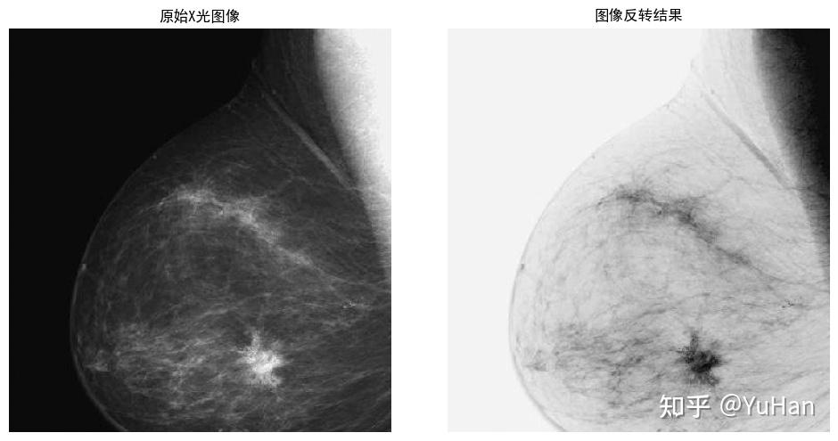

上图是乳腺 X 光片。左边原图整体偏黑,病灶埋在暗部里不好找;右边反转后背景变白、病灶变成深色斑点,
**一眼就能看到**。

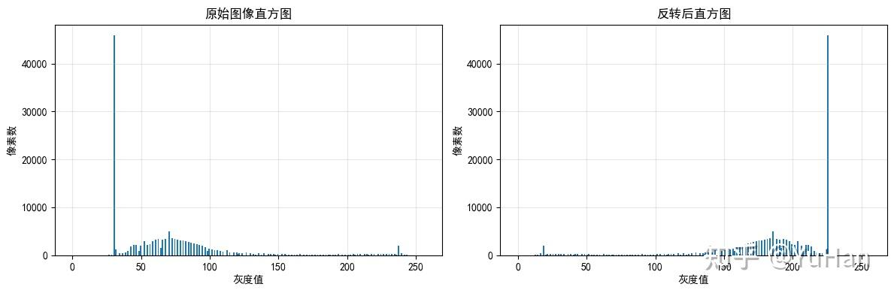

直方图正好**左右镜像**过来。注意形状完全没变,只是整个翻了个面——
所以**对比度一点没变,变的只是明暗方向**。

```python
out = 255 - img          # 就这一行
# 或者 cv2.bitwise_not(img),结果完全一样
```

**什么时候用**

- 医学影像(X 光/CT):暗背景里找暗目标,反转后变成亮背景里找暗目标,人眼更擅长后者
- 做掩膜(mask):白字反转成黑字当遮罩用
- 想要底片风格的艺术效果

---

## 二、对数变换:把暗部掰开

$$s = c \cdot \log(1 + r)$$

**暗部拉宽,亮部压扁。** 原来挤在 0~10 的那点细节,被拉开到 0~110,层次就显出来了;
代价是亮部被挤成一团。

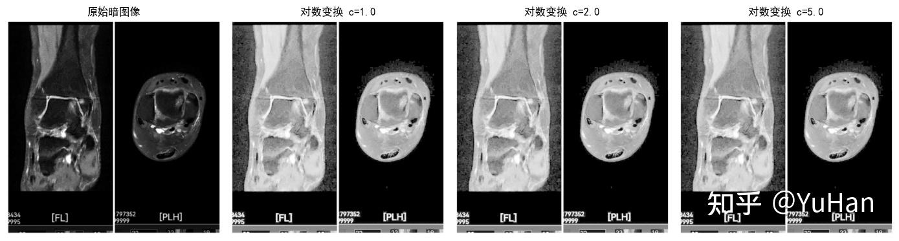

上图是医学 CT。原图很多结构埋在黑里,对数变换后整体变亮,暗部结构浮出来了。

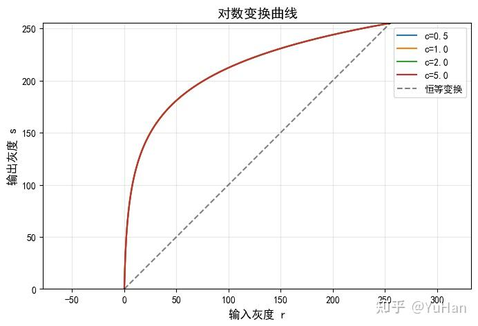

曲线左边陡、右边平。**陡 = 拉开,平 = 压扁**,一眼就能看出它在偏袒谁。

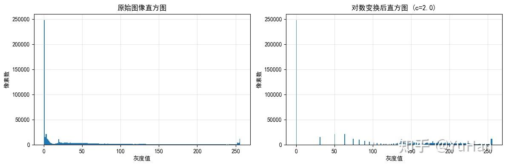

原来全挤在左边(暗)的像素,被摊开到了整个范围。

### 公式里的 `+1` 和 `c` 是干什么的

这两个都是**工程上的补丁**,不是数学原理。去掉它俩,核心只剩 `s = log(r)`——
"取对数"这个动作本身才是原理,`+1` 和 `×c` 只是为了让它能在 8 位图像上跑起来。

**补丁一:`+1` —— 躲开 log(0)**

不加 1 会怎样:

```
r = 0    →   log(0) = -inf     ← 程序直接爆
```

`log` 问的是"e 的多少次方等于这个数"。而 e 的任何次方**永远大于 0**,
只有次方数趋向负无穷时才无限接近 0,所以 `log(0)` 没有答案。

偏偏 **r=0(纯黑)是图像里最常见的像素值**,不能不管。加个 1 就绕过去了:

```
r = 0    →   log(1) = 0        ← 正好是 0,黑还是黑
r = 1    →   log(2) = 0.693
r = 255  →   log(256) = 5.545
```

`+1` 就是把输入从 `0~255` 平移成 `1~256`,避开 0 这个雷。
顺带还有个巧合:`log(1)` 刚好等于 0,所以纯黑变换后仍是纯黑,不会莫名其妙变灰。

**补丁二:`×c` —— 把结果撑满 0~255**

看上面那组数字的最大值:`log(256) = 5.545`。

**整个输出范围只有 0~5.5**,而灰度图需要 0~255。直接把 5.5 当灰度值存进去,
整张图的像素全在 0~5 之间——**打开一看就是一片黑**。

所以要把 `0~5.545` 等比放大到 `0~255`,放大倍数就是:

```
255 ÷ 5.545 = 45.99        写成公式就是  c = 255 / log(256)
```

乘上之后两端正好卡住,中间铺满:

| 输入 r | log(1+r) | × 45.99 |
| ---: | ---: | ---: |
| 0 | 0.000 | **0.0** ← 黑还是黑 |
| 1 | 0.693 | 31.9 |
| 10 | 2.398 | 110.3 |
| 100 | 4.615 | 212.2 |
| 255 | 5.545 | **255.0** ← 白还是白 |

**小结**

| | 干什么用 |
| :--- | :--- |
| **+1** | 躲开 `log(0) = -∞` 这个坑 |
| **×c** | 把只有 0~5.5 的结果**撑满** 0~255 |

> 这也解释了原文那个 bug 是怎么来的:原文后面用 `cv2.normalize` 做归一化,
> 而**归一化本身就在干 `×c` 这件事**(把实际范围撑满 0~255)。两个一起用,
> 前面乘的 c 会被后面的归一化重新算一遍,等于白乘。详见文末「与原文的出入」。

```python
c = 255 / np.log(256)
lut = np.array([c * np.log(1 + r) for r in range(256)], dtype=np.uint8)
out = cv2.LUT(img, lut)
```

**什么时候用**

- **看傅里叶频谱**(最经典的用途,也几乎是唯一不可替代的)。频谱里最亮和最暗能差几百万倍,
  不取对数的话屏幕上只有中心一个白点,其他全黑
- 低照度图像提亮

> 详细的「对数 vs 幂律有什么区别、为什么频谱非它不可」,见 [intensity-and-grayscale.md](intensity-and-grayscale.md) 第二节。

---

## 三、幂律变换(伽马):可调强度的对数

$$s = 255 \cdot \left(\frac{r}{255}\right)^{\gamma}$$

和对数一个思路,但**弯多少由 γ 说了算**,而且能反向:

| γ | 效果 |
| :--- | :--- |
| γ < 1 | 提亮暗部(和对数同方向,但温和可调) |
| γ = 1 | 什么都不做 |
| γ > 1 | 反过来,压暗 |

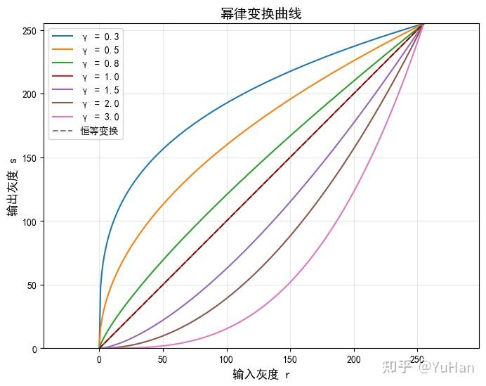

一族曲线。γ 越小越往上凸(越提亮),γ 越大越往下凹(越压暗),γ=1 就是那条直线。

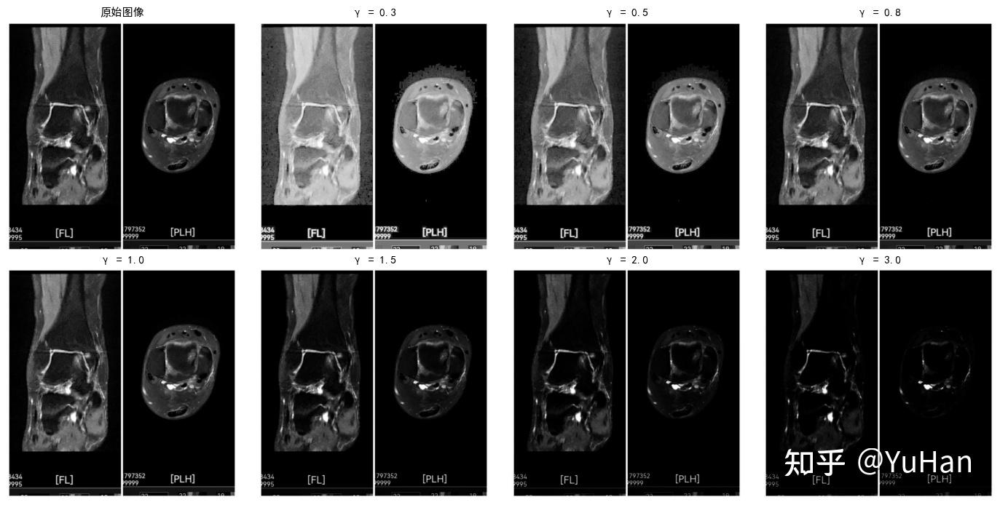

同一张图从 γ=0.3 到 γ=3.0 的连续变化,从惨白到漆黑。

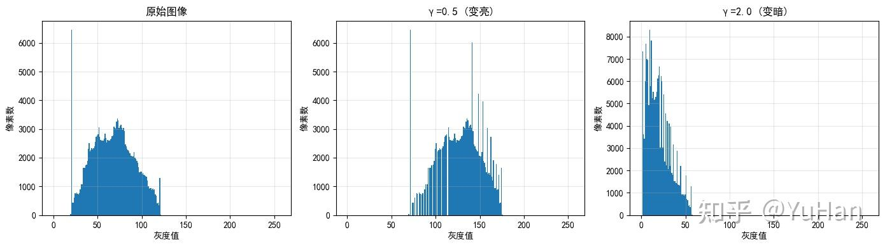

γ<1 时直方图整体右移(变亮),γ>1 时左移(变暗)。

```python
gamma = 0.5
lut = np.array([255 * (r / 255) ** gamma for r in range(256)], dtype=np.uint8)
out = cv2.LUT(img, lut)
```

**为什么它是三者里最重要的**

**你的屏幕、相机、视频编码每一秒都在做幂律变换。** 人眼对暗部敏感、对亮部迟钝,
8 位只有 256 档,平均分配的话暗部不够用、亮部浪费。所以存图前先做一次 γ≈1/2.2
(把档位往暗部倾斜),显示时屏幕再做一次 γ≈2.2 抵消回来。这一来一回就叫**伽马校正**。

> ⚠️ sRGB 不是纯粹的幂律,它在最暗处接了一小段直线。日常用 `pow(x, 2.2)` 近似够了
> (差约 2 个灰度级),但精确色彩管理不能这么糊。详见 [intensity-and-grayscale.md](intensity-and-grayscale.md) 第三节。

---

## 四、分段线性:分区间各管各的

前面三种都是**一个公式管全图**。分段线性是把 0~255 切成几段,**每段用不同的规则**。
灵活,但要自己定分界点。

常见三种玩法:

### 4.1 对比度拉伸:把感兴趣的那一段拉满

如果一张图的像素全挤在 80~150 之间(灰蒙蒙的),那 0~80 和 150~255 就是浪费的。
**把 80~150 这一段拉开铺满 0~255**,对比度立刻上来。

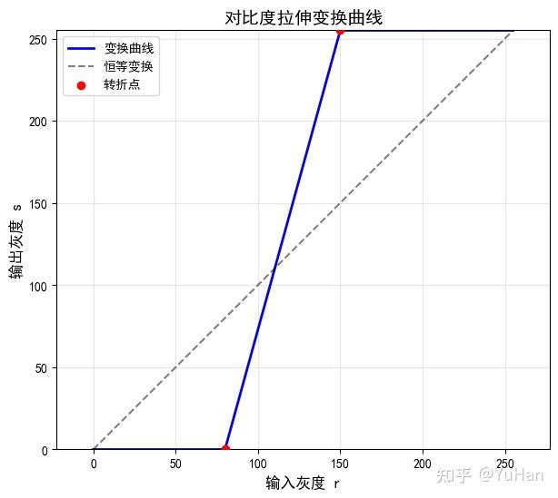

曲线是三段折线:中间那段很陡(把窄区间拉开),两头很平(把没用的区间压掉)。
两个红点就是**转折点**,由你指定。

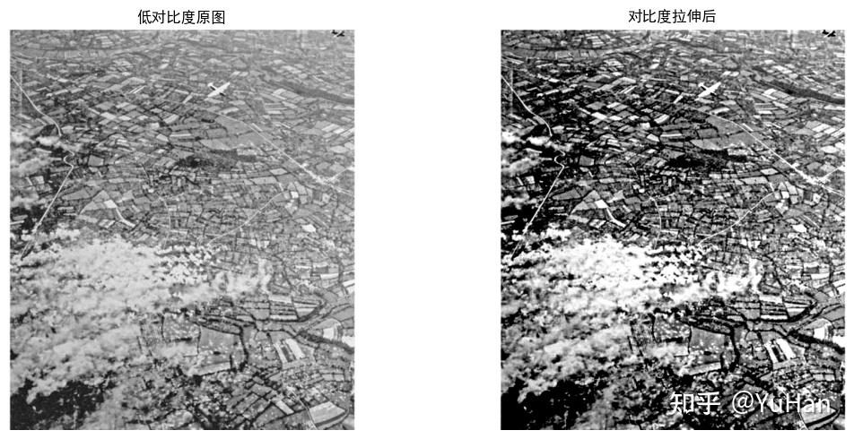

左边是灰蒙蒙的航拍图,右边拉伸后街道、建筑的纹理全出来了。

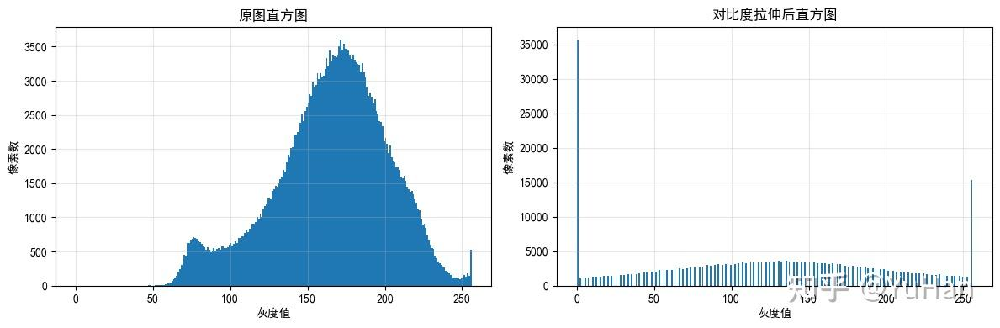

原来堆在中间的一坨,被摊平到了整个范围。

```python
def contrast_stretch(img, r1, s1, r2, s2):
    """把 [r1,r2] 拉伸到 [s1,s2],两端各自压缩"""
    lut = np.zeros(256, dtype=np.uint8)
    for r in range(256):
        if r < r1:      s = s1 / r1 * r
        elif r < r2:    s = s1 + (s2 - s1) / (r2 - r1) * (r - r1)
        else:           s = s2 + (255 - s2) / (255 - r2) * (r - r2)
        lut[r] = np.clip(s, 0, 255)
    return cv2.LUT(img, lut)

out = contrast_stretch(img, r1=80, s1=0, r2=150, s2=255)
```

> **注意代价**:中间拉开的同时,两头被压缩甚至压平了——那部分的细节是**永久丢失**的。
> 直方图会出现梳子状的缝隙(拉伸只能把已有的灰度级摊开,不能凭空造出中间级)。

**极端情况**:如果 r1 = r2,中间那段变成垂直的,就退化成了**阈值化**(见第五节)。

### 4.2 灰度级分层:只把某一段挑出来

想找"亮度在 100~160 之间"的区域(比如工业检测里的缺陷),其他的都不关心。

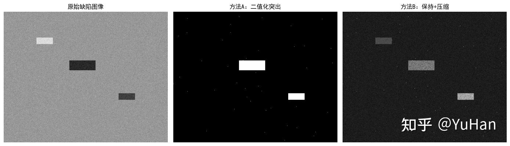

三张图:原始缺陷图 / 方法 A(二值突出) / 方法 B(保留背景)。

```python
# 方法 A:选中的变白,其余变黑 —— 干脆,但背景信息全丢
mask = (img >= low) & (img <= high)
out_a = np.where(mask, 255, 0).astype(np.uint8)

# 方法 B:选中的保持不变,其余压暗压平 —— 柔和,还能看见背景在哪
out_b = img.copy()
out_b[~mask] = out_b[~mask] // 3 + 50     # 把其余压进 50~135 这个窄范围
```

方法 B 里 `//3 + 50` 没什么玄机,就是"除一下再抬一点",把不关心的部分压成一片
不刺眼的中灰,让目标显眼。数值随便调。

### 4.3 比特平面分层:把 8 个二进制位拆开

一个 8 位像素,比如 `200`,二进制是 `11001000`。**把这 8 位一位一位拆开**,
每一位单独拿出来就是一张黑白图,一共 8 张。

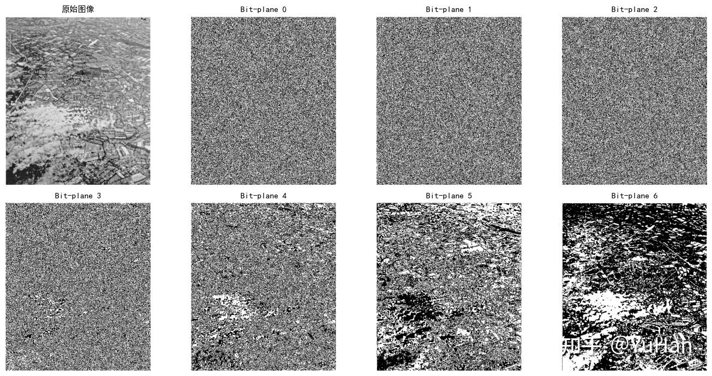

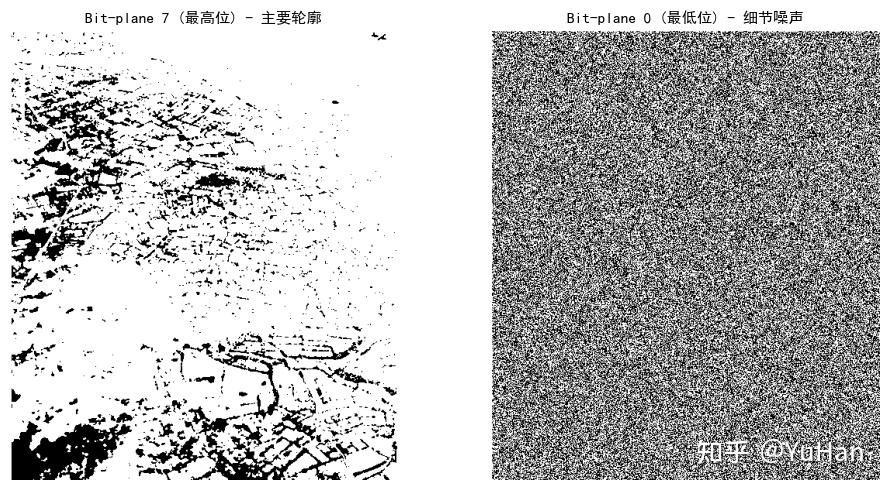

规律很明显:

- **高位平面**(bit-7 权重 128、bit-6 权重 64):**图像的大致轮廓**都在这里
- **低位平面**(bit-0 权重 1、bit-1 权重 2):**基本是噪声**,看不出内容

```python
planes = [((img >> i) & 1) * 255 for i in range(8)]    # bit-0 到 bit-7
```

**为什么有用**

- **压缩**:高位几张就撑起了大部分画面,低位几张扔掉人眼看不太出来——这是有损压缩的朴素版
- **数字水印**:往最低位里塞信息,肉眼完全看不出来(反正那层本来就是噪声)

---

## 五、阈值化:一刀切成黑白

$$s = \begin{cases} 255 & r > T \\ 0 & r \le T \end{cases}$$

设一个门槛 T,过线的变白,没过的变黑。**结果只有黑白两色**,是图像分割最朴素的做法。

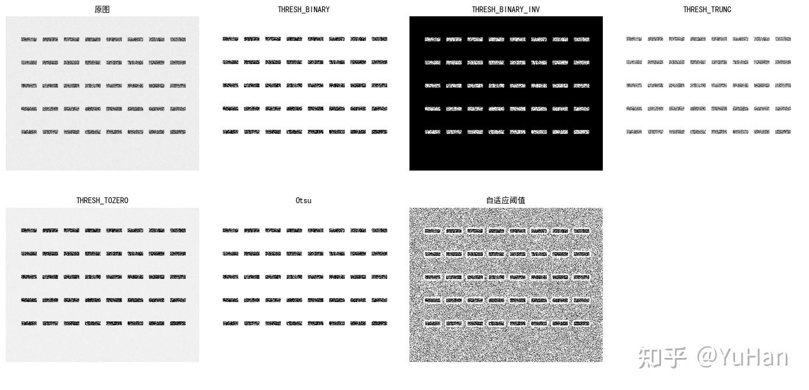

OpenCV 提供好几种变体:

| 方法 | 做什么 |
| :--- | :--- |
| `THRESH_BINARY` | 过线变 255,否则 0 |
| `THRESH_BINARY_INV` | 反过来 |
| `THRESH_TRUNC` | 过线的削到 T,没过的不动(削平高光) |
| `THRESH_TOZERO` | 没过线的归 0,过线的不动 |
| `THRESH_OTSU` | **自动**算出最佳 T,不用你猜 |
| `adaptiveThreshold` | **每一小块单独算 T**,专治光照不均 |

```python
_, binary = cv2.threshold(img, 127, 255, cv2.THRESH_BINARY)          # 固定门槛
_, otsu   = cv2.threshold(img, 0, 255, cv2.THRESH_BINARY + cv2.THRESH_OTSU)   # 自动门槛
adaptive  = cv2.adaptiveThreshold(img, 255, cv2.ADAPTIVE_THRESH_GAUSSIAN_C,
                                  cv2.THRESH_BINARY, 11, 2)          # 分块门槛
```

**Otsu 和自适应的区别**(很多人搞混):

- **Otsu**:还是**一个**全局门槛,只是这个门槛由算法自动挑(找让黑白两类分得最开的那个值)
- **自适应**:**每个小窗口一个门槛**。扫描一张一半亮一半暗的文档时,全局门槛必然顾此失彼,
  分块算才能都照顾到

---

## 六、怎么选

| 你想干什么 | 用哪个 |
| :--- | :--- |
| 暗背景里看暗细节 | **反转** |
| 提亮暗部,温和可控 | **幂律 γ<1**(首选) |
| 提亮暗部,数据动态范围极大 | **对数** |
| 压暗、增强亮部细节 | **幂律 γ>1**(唯一选择) |
| 图灰蒙蒙的,想拉开对比 | **对比度拉伸** |
| 只关心某个亮度区间 | **灰度级分层** |
| 压缩 / 水印 | **比特平面** |
| 要分割出前景 | **阈值化**(光照均匀用 Otsu,不均匀用自适应) |

**三条实战经验**

1. **没有万能参数**。γ 值、转折点、阈值都得看图调。写个带滑杆的小工具实时看效果,
   比反复改代码快得多(本仓库的 `ImageAlgorithm` App 就是干这个的)
2. **可以串起来用**。比如先伽马校正 → 再对比度拉伸 → 最后阈值化。**顺序不同结果不同**
3. **当心数据类型**。中间算出来是浮点,要 `clip(0,255)` 再转回 uint8,否则会溢出回绕
   (numpy 里 `uint8` 的 200+100 = 44)

---

## 与原文的出入

改写时发现原文几处问题,已在正文中修正:

**1. 反转"保持亮度"的说法不对**

原文说反转"保持图像的对比度和亮度"。**对比度确实不变**(任意两点的亮度差绝对值不变),
但**亮度整个颠倒了**,谈不上保持。本文改成"对比度不变,明暗方向翻转"。

**2. 不同 c 值的对数变换,配图其实是同一个结果**

原文用 c=1.0 / 2.0 / 5.0 演示对数变换,但代码里紧接着做了 min-max 归一化:

```python
log_img = c * np.log(1.0 + img_float)
log_img = cv2.normalize(log_img, None, 0, 255, cv2.NORM_MINMAX)   # ← c 在这一步被抵消了
```

实测三个 c 值的输出**逐像素完全相同**(最大差异 0)。因为归一化会按实际最大最小值重新缩放,
前面乘的常数被整个约掉了。所以那张对比图里的几格看着一样,不是你眼花。

本文改成直接把 c 固定成 `255/log(256)`,不做归一化——这样 c 才真正起作用。

**3. 对比度拉伸的公式在原文渲染坏了**

原文的 LaTeX 出现 `\cdotr` 这样的错误(缺空格),渲染出来是乱的。本文改用代码表达,更直观。

**4. 补充了原文没讲清楚的两点**

- **Otsu 和自适应阈值的区别**:原文只是并列罗列了七种方法,没说 Otsu 仍是全局单阈值、
  自适应才是分块多阈值。这是最容易搞混的地方
- **分段线性的代价**:原文只讲了"增强对比度"的好处,没提被压缩的两端**信息永久丢失**、
  直方图会出现梳状缝隙

---

## 原文没覆盖、但紧接着要学的

- **直方图均衡化**:上面所有方法都要你手动定参数,均衡化能**自动**算出最佳映射(第 5 周)
- **空间滤波**:从"只看自己"进到"要看邻居"(模糊、锐化、边缘检测),第 6~7 周
