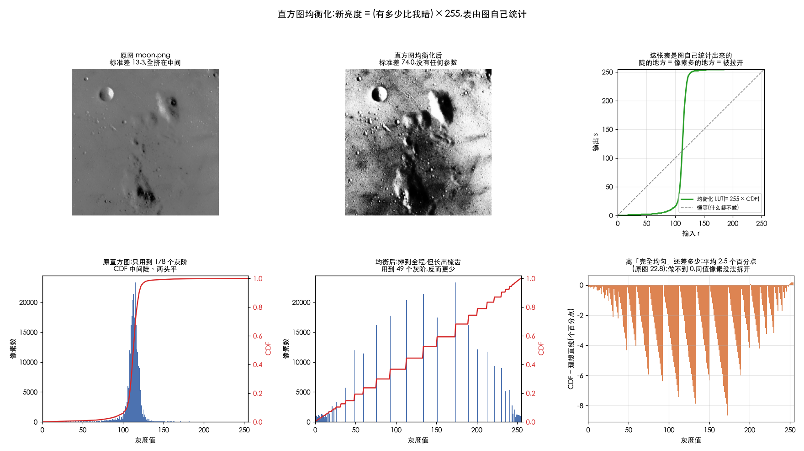
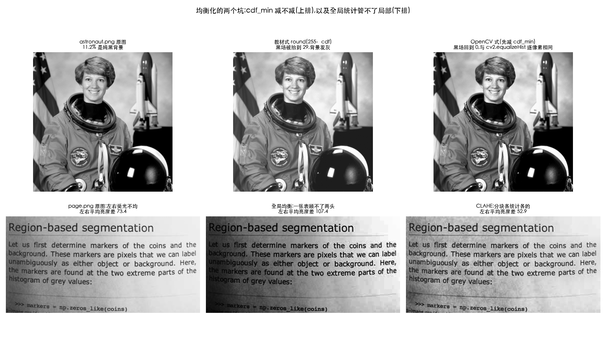
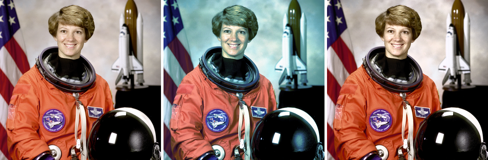

# 直方图均衡化

> 对应 Gonzalez《数字图像处理》3.3.1 节。
> 前置阅读:[01-histogram-basics.md](01-histogram-basics.md)(直方图、PDF、CDF 这三个词在那儿)

> **怎么读这篇**
>
> | 有多少时间 | 看哪几节 |
> | :--- | :--- |
> | **只有 10 分钟** | `一、问题出在哪` `二、把挤的摊开` `小结` |
> | **第一遍学** | 再加 `三、动手算一遍` `四、和灰度变换的区别` `六、它的三个毛病` |
> | **踩坑时回来查** | `五、为什么 CDF 就是对的`(唯一的数学核心)`七、彩色图怎么做` |

均衡化是全书第一个「让图自己决定怎么调」的算法 —— 你不给参数,
它先看一眼这张图长什么样,再自己配一张映射表。
这一篇从「为什么需要它」讲到「它凭什么管用」,最后讲它的三个死穴。

---

## 一、问题出在哪

想象 100 个人排队,要站进 0~7 号共 8 个格子。结果他们全挤在 3、4、5 三个格子里,0、1、2、6、7 空着。

人挤在一起你就分不清谁是谁 —— 对应到照片上,就是"这几块区域亮度太接近,看着糊成一团"。

**空着的格子,就是被浪费掉的表现力。**

---

## 二、把挤的摊开

直方图均衡化(Histogram Equalization)只干一件事:**把挤在一起的摊开,把空着的填上。**

但"摊开"不能乱摊,必须保持顺序 —— 原来比较暗的,摊开后还得比较暗,否则图就乱了。方法特别巧:

> **一个像素的新亮度 = "全图有百分之多少的像素比它暗" × 255**

比如某个像素,全图有 35% 的像素比它暗,那它的新亮度就是 `0.35 × 255 ≈ 89`。

这个"比它暗的占多少"就是**累计分布函数(CDF)**。

为什么这招管用:

- 人多的地方,累计比例涨得快 → 相邻灰度被拉开距离
- 人少的地方,累计比例涨得慢 → 相邻灰度被压到一起

自动就实现了"挤的地方拉开,空的地方压掉",而且天然单调递增,顺序不会乱。

### 公式

$$ s_k = (L-1) \sum_{j=0}^{k} \frac{n_j}{N} $$

- `L` = 灰度级数(8 位图就是 256)
- `n_j` = 灰度值为 j 的像素个数
- `N` = 总像素数
- 求和那一坨就是 CDF

看着唬人,其实就是上面那句大白话。

### 一共就四步

```text
算法:直方图均衡化
输入:灰度图 img(每个像素 0~255)
输出:均衡后的图

1. hist ← 数一遍 img 里每个灰度各出现了几次        // 256 个桶
2. cdf  ← hist 从左到右逐项累加,再除以总像素数     // 「比我暗的占多少」
3. 对每个灰度 r(0~255):
       lut[r] ← round(255 × cdf[r])               // 排名百分比 × 255
4. 对每个像素 p:
       输出[p] ← lut[ img[p] ]                     // 纯查表,没有算术
```

第 1、2 步扫一遍图**做统计**,第 4 步再扫一遍**做替换** —— 这就是它比灰度变换
多出来的那一遍。第 3 步算出来的 `lut` 是一张普普通通的 256 项表,
所以均衡化归根结底还是[查表](../01-fundamentals/03-lut.md),只不过表是图自己给的。

---

---

## 三、动手算一遍

用一张只有 8 个灰度级、共 100 个像素的小图(实测数据):

| 原亮度 r | 有几个像素 | 累计比例 | 新亮度 s = round(累计×7) |
| :---: | :---: | :---: | :---: |
| 0 | 0 | 0.00 | 0 |
| 1 | 0 | 0.00 | 0 |
| 2 | 5 | 0.05 | 0 |
| 3 | **30** | 0.35 | **2** |
| 4 | **40** | 0.75 | **5** |
| 5 | **20** | 0.95 | **7** |
| 6 | 5 | 1.00 | 7 |
| 7 | 0 | 1.00 | 7 |

重点看 3、4、5 三行:

- 原来挤在 3、4、5,彼此**只差 1**,肉眼几乎分不出
- 现在变成 2、5、7,彼此**差 3 和差 2**,明显拉开了

均衡后各灰度的像素数:`[5, 0, 30, 0, 0, 40, 0, 25]`
—— 柱子从原来窄窄一堆,变成散落在 0~7 全程。

复现脚本:

```python
import numpy as np
counts = np.array([0, 0, 5, 30, 40, 20, 5, 0])   # 灰度 0..7 各有多少像素
N, L = counts.sum(), 8
cdf = np.cumsum(counts) / N
s = np.round(cdf * (L - 1)).astype(int)
```

### 柱子不会真的变平

注意上表的结果里还是有 0。**离散图像的均衡化永远做不到完全平坦。**

原因很简单:灰度 4 那 40 个像素是一个整体,它们原来值都一样,变换后也必然还是一样 —— 一张查表把 40 个像素全送到 5,不可能拆开分给 5 和 6。

所以"均衡化"实际做到的是**把柱子在整个范围上摊得更开、更均匀**,不是"把每根柱子削成一样高"。只有连续图像的理想情况才能真正平坦。

---

## 四、和灰度变换的区别

| | 灰度变换 | 直方图均衡化 |
| :--- | :--- | :--- |
| 本质是查表吗 | 是 | **也是** |
| 256 项的表从哪来 | 你定公式(a、b、γ 自己拧) | **图自己统计出来的** |
| 换一张图 | 表不变 | **表跟着变** |
| 扫几遍图 | 一遍 | **两遍**(先统计,再替换) |
| 要调参吗 | 要 | **不用,全自动** |

所以直方图均衡化本质上仍然是"逐像素查表",只是多了一步"先看看这张图长什么样"。
**全自动、不用调参**,是它最大的卖点,也是它最大的局限。

---

---

## 五、为什么 CDF 就是对的

第二节给了做法("新亮度 = 比它暗的占比 × 255"),但没说**为什么这么做就一定能摊平**。这是整个直方图均衡化唯一的数学核心 —— 也是最容易被跳过的一节。

我们先完全不碰图像。

### 第 1 步:一场考试

100 个学生考试,成绩很集中 —— 大部分人都在 70 到 75 分之间,90 分以上和 50 分以下几乎没人。

把成绩画成柱状图,就是一座又高又窄的山峰。**这和"灰蒙蒙的照片"是同一个形状。**

现在做一件事:**把每个人的分数,换成他的排名百分比。**

- 全班最后一名 → 0%
- 排在第 25 位(从低到高)的人 → 25%
- 排在第 50 位的人 → 50%
- 第一名 → 100%

### 第 2 步:关键的一问

换完之后,新的这组数字(0%、1%、2%……100%)是什么分布?

**必然是均匀的。**

想一下就明白:排名本来就是一个一个排下来的。有 100 个人,就必然有一个人是 1%、一个人是 2%、一个人是 3%……**不可能出现"30% 这个位置挤了 40 个人"** —— 因为排名的定义就是"你前面有多少人",一个位置只能站一个人。

> **这就是全部的道理。**
> 原来的分数可以挤成一团,但"排名百分比"天生就是均匀铺开的 —— 它不是被"摊平"的,它**从定义上就不可能不平**。

### 第 3 步:换回图像

现在把学生换成像素,把分数换成亮度:

| 考试 | 图像 |
| :--- | :--- |
| 一个学生 | 一个像素 |
| 他的分数 | 他的亮度(0~255) |
| 分数挤在 70~75 | 亮度挤在 100~140(灰蒙蒙) |
| 他的排名百分比 | **比他暗的像素占全图的百分之多少** |
| 换成排名百分比 | **直方图均衡化** |

"比他暗的像素占多少" —— 这个东西就叫 **CDF**(累计分布函数)。

所以第二节那个公式:

```
新亮度 = CDF(原亮度) × 255
       = "比我暗的像素占比" × 255
       = "我的排名百分比" × 255
```

**直方图均衡化 = 把每个像素的亮度,换成它在全图亮度排名里的位置。**

### 第 4 步:符号版(可跳过)

上面已经讲完了。如果你想看数学书上那行是什么意思:

把 CDF 记作 `F`,新值记作 `y = F(x)`。要证明 `y` 是均匀分布,只需说明:**"新值不超过 t 的像素,恰好占 t"**(这就是均匀分布的定义)。

```
P(y ≤ t)                   ← 问:新值 ≤ t 的占多少?
  = P(F(x) ≤ t)            ← 新值就是 F(x),代进去
  = P(x ≤ F⁻¹(t))          ← F 是递增的,不等式两边同时取反函数
  = F(F⁻¹(t))              ← 这正是 F 的定义:P(x ≤ 某值) = F(某值)
  = t                       ← F 和 F⁻¹ 互相抵消
```

- `P(...)` 读作"……的概率",在这里就是"占多少比例"
- `F⁻¹` 是 `F` 的**反函数**:`F` 是"给分数问排名",`F⁻¹` 就是"给排名问分数"
- 最后一行 `F(F⁻¹(t)) = t`:先由排名 t 查出分数,再拿这个分数查排名 —— **当然还是 t**,转了一圈回到原地

这个性质在概率论里有个名字,叫**概率积分变换**。名字唬人,内容就是上面那场考试。

### 第 5 步:实测

造一个"双峰"的分布(有两座山头,100 万个样本),用它自己的 CDF 变换一遍:

```
原分布  20 桶占比%: [0.0 0.5 3.2 10.2 16.3 13.2 5.4 1.2 0.3 0.7 2.0 4.3 7.4 9.7 9.9 7.7 4.7 2.2 0.8 0.3]
变换后  20 桶占比%: [4.6 5.1 5.2 4.9 5.3 3.9 5.0 5.5 5.5 5.1 4.7 4.8 4.9 5.1 5.5 4.8 5.2 5.0 5.1 5.0]
```

上面一行有两座明显的山(16.3 和 9.9 两处);下面一行全在 5 附近晃 —— 分 20 个桶,理想均匀就是每桶 5.00%。

**各桶占比的标准差(standard deviation)只有 0.35 个百分点**(标准差 = 这些数字彼此差多少;0.35 意味着几乎没差别)。

### 第 6 步:并列名次

上面那场考试有个前提我偷偷绕过去了:**假设没有两个人分数完全相同。**

现实中不可能。真实照片里,亮度 100 的像素可能有几万个。

**这几万个人分数完全一样,他们的排名必须相同** —— 你不能说"你排 30%、你排 31%",他们考得一模一样。所以这几万个像素**只能整体搬到同一个新亮度上,无法拆开分散**。

这就是第三节那个结论的根源。回头看那张手算表:

```
均衡后各灰度的像素数: [5, 0, 30, 0, 0, 40, 0, 25]
```

那些 0 就是"没人排到这个名次"留下的空位,而 40 就是"40 个人并列"挤出来的。

> **两句话记住:**
> - 均衡化 = **换成排名百分比**,排名天生均匀,所以能摊开
> - 摊不平 = **并列名次拆不开**,所以只能变稀疏,不能变平坦

第五步的实验能做得那么平,是因为我用了 100 万个样本、只分 20 个桶 —— 桶少人多,每个桶里"并列"的影响被稀释了。换成 256 个桶的真实照片,空隙就明显了。

**记住这条,[06-histogram-matching.md](06-histogram-matching.md) 还会再撞上一次同样的问题。**

---

---

## 六、它的三个毛病

### 1. 没法控制力度

均衡化是"一把梭",效果好不好全看图,你没有旋钮可拧。有时候会调过头,原本柔和的过渡变得生硬。

### 2. 会放大噪声

暗部本来平坦的一片被强行拉开,藏在里面的噪声也跟着被放大。原图越暗、噪声越明显,这个副作用越严重。

### 3. 只看全局,不看局部

一张图"左边暗、右边亮",全局统计会把两边平均掉,结果两边都调不好。

> **想做得更好**:后两条毛病正是下一篇 [CLAHE](05-clahe.md) 要解的
> —— 分块解决「只看全局」,限幅解决「放大噪声」。
> 第一条(没有力度旋钮)则要换思路:直接用[分段线性或伽马](../02-intensity/02-gray-transform-tutorial.md)
> 自己拧参数,或者用[规定化](06-histogram-matching.md)指定想要的目标分布。

---

**动手验证**:[`Ch03_Spatial_Filtering/10_histogram_equalization.py`](../../Python-Prototyping/Ch03_Spatial_Filtering/10_histogram_equalization.py)
把本篇一~六节从零跑了一遍(主图 `moon.png`,均值 112.2、标准差 13.3 的典型灰蒙蒙):

| 结论 | 实测 |
| :--- | :--- |
| 第三节那张手算表 | 脚本原样复现:3、4、5 三档 → 2、5、7;均衡后计数 `[5, 0, 30, 0, 0, 40, 0, 25]` |
| **柱子不会真的变平** | 上表结果里仍有 4 个空档;真图上「CDF 离理想直线」只从 22.8 降到 2.5 个百分点,到不了 0 |
| 摊开确实有效 | 标准差 13.3 → **74.0**,CDF 从「中间一个陡坎」变成接近对角线 |
| **代价是灰阶被合并** | 用到的灰阶 178 → **49**;LUT 把 256 个输入只映射到 49 个输出,直方图长出梳齿 |
| 保序 | LUT 单调非降 —— 这就是「摊开但不能乱摊」的数学保证 |
| **幂等** | 均衡两次 vs 一次最大差 1 —— 第二次几乎什么都没做,这正是「没有力度旋钮」的另一种说法 |
| 毛病 2:放大噪声 | 加 σ=3 的高斯噪声,均衡后噪声标准差变成 39.9,**放大 13.3 倍** |
| 毛病 3:只看全局 | `page.png` 左右平均亮度差 73.4,全局均衡后不降反升到 107.4;CLAHE 压到 52.9 |

**一个教材不会讲、但不知道就对不上 `cv2.equalizeHist` 的细节**:

直接照公式写 `s = round(255 × cdf(r))`,在 `camera.png` 上和 OpenCV 逐像素相同,
但在 `astronaut.png` 上最大差到 **29 个灰阶**。原因是最暗那一档的累计比例不是 0
—— 它自己也被算进去了,于是整张图的黑场被抬起来。OpenCV 先把这一档的计数减掉:

对照着看,OpenCV 实际做的是把上面第 3 步换成:

```text
3'. first ← 最暗的、真的有像素的那一档
    对每个灰度 r:
        lut[r] ← round( (累计计数[r] − hist[first]) × 255 / (总像素数 − hist[first]) )
                                       ↑ 把最暗那一档自己的计数也减掉
```

```python
first = np.nonzero(hist)[0][0]          # 最暗的、真的有像素的那一档
s = (cdf - hist[first]) * (255.0 / (N - hist[first]))
```

`astronaut.png` 有 11.2% 的画面是纯黑太空背景,教材式把这一大坨直接抬到 29,背景整片发灰。
图里纯黑/纯白占比越大,两种写法差得越远。





---

---

## 七、彩色图怎么做

**不要对 R、G、B 三个通道各自独立做均衡。** 这里给数字说明为什么。

同一张彩色照片,两种做法:

- **A**:R、G、B 三个通道各自 `equalizeHist`
- **B**:转 YCrCb,只对 Y 通道 `equalizeHist`,色度通道原样保留

测量**色相(hue)**相对原图偏移了多少度。

> **色相(hue)是什么**:一个颜色「是什么颜色」,不管它多亮多暗。
> 深红、浅红、暗红 —— 明暗不同,但色相都是「红」。
> 色相排成一个圈来表示,一圈 360°:红 0°、黄 60°、绿 120°、青 180°、蓝 240°、洋红 300°,转回 360° 又是红。
> **所以「偏移 60°」的意思是:红变成了黄。**


| 做法 | 色相平均偏移 | 中位数 | 偏移超过 10° 的像素 |
| :--- | :---: | :---: | :---: |
| **A 分通道各自均衡** | **77.35°** | 64.00° | **66.83%** |
| **B 只均衡 Y 通道** | 2.80° | 0.00° | 5.98% |



*左:原图 / 中:分通道均衡(严重偏色)/ 右:只均衡亮度*

**77° 是什么概念** —— 红到黄才 60°,红到绿是 120°。

平均偏移 77°,意思是**平均每个像素的颜色都跑过了「红变黄」这么远的距离**,已经是完全不同的色系了。而且三分之二的像素偏移超过 10°(10° 大约是肉眼开始明确察觉的门槛)。

对比之下,只均衡 Y 通道那一行,偏移中位数是 **0.00°** —— **一半以上的像素色相分毫未动**。

### 为什么会偏色

颜色是由三个通道的**比例**决定的。比如某个像素 `(200, 100, 50)` 是橙色,关键在 4:2:1 这个比例。

三个通道各自均衡,用的是**三张不同的映射表**(因为三个通道的直方图不同)。R 可能被映射到 220,G 到 150,B 到 30 —— 比例从 4:2:1 变成了 7.3:5:1,**颜色就变了**。

只动 Y 通道则不同。

> **YCrCb 是什么**:另一种记录颜色的方式,把「多亮」和「什么颜色」**拆成两组数**分开存:
> - **Y** = 明暗(和灰度图是一回事)
> - **Cr、Cb** = 颜色偏向(偏红还是偏青、偏蓝还是偏黄)
>
> 它和 RGB 描述的是同一个颜色,只是换了个记法 —— 就像同一个地点,可以用经纬度说,也可以用街道门牌说。
> **你做推流天天打交道的 YUV,就是这一家的。**

Y 变了、Cr/Cb 原样不动,等于只调了「多亮」,没碰「什么颜色」。所以画面整体变亮变暗,但**红的还是红,蓝的还是蓝**。

### 正确做法

```python
ycc = cv2.cvtColor(bgr, cv2.COLOR_BGR2YCrCb)
ycc[:, :, 0] = cv2.equalizeHist(ycc[:, :, 0])   # 或 clahe.apply(...)
out = cv2.cvtColor(ycc, cv2.COLOR_YCrCb2BGR)
```

用 Lab 的 L 通道或 HSV 的 V 通道也可以,区别见 [01-intensity-and-grayscale.md](../02-intensity/01-intensity-and-grayscale.md) 的六种亮度定义。

> **对你是零成本的**:推流管线里图像本来就是 YUV,`Y` 平面直接拿来处理,连颜色空间转换都省了。
> 这也是为什么视频里的亮度增强几乎都在 Y 平面上做 —— 不只是为了正确,更是因为**便宜**。

---

---

## 小结

| 概念 | 一句话 |
| :--- | :--- |
| 均衡化在干什么 | 新亮度 = 「比它暗的像素占比」× 255,也就是换成排名百分比 |
| 为什么管用 | 排名天生均匀铺开 —— 概率积分变换 `P(F(x) ≤ t) = t` |
| 为什么柱子不平 | 并列名次拆不开:同一个原灰度的像素只能整体搬走 |
| 和灰度变换的区别 | 同样是查表,但表由图自己统计出来,换张图表就变 |
| 三个毛病 | 没有力度旋钮、放大噪声、只看全局 |
| 对不上 OpenCV 时 | 查是不是漏了减 `cdf_min`(最暗那一档的计数) |
| 彩色图 | **只动亮度通道**。分通道做会让色相平均偏 77° |

三个毛病里的后两个,正是下一篇 CLAHE 存在的理由。

---

## 相关文档

- [01-histogram-basics.md](01-histogram-basics.md) —— 直方图是什么
- [05-clahe.md](05-clahe.md) —— 工程上真正在用的那个版本
- [06-histogram-matching.md](06-histogram-matching.md) —— 不追求摊平,而是照着目标分布变
- [03-contrast.md](03-contrast.md) —— 为什么均衡化天然免疫「对比度(contrast)怎么量」这个问题
