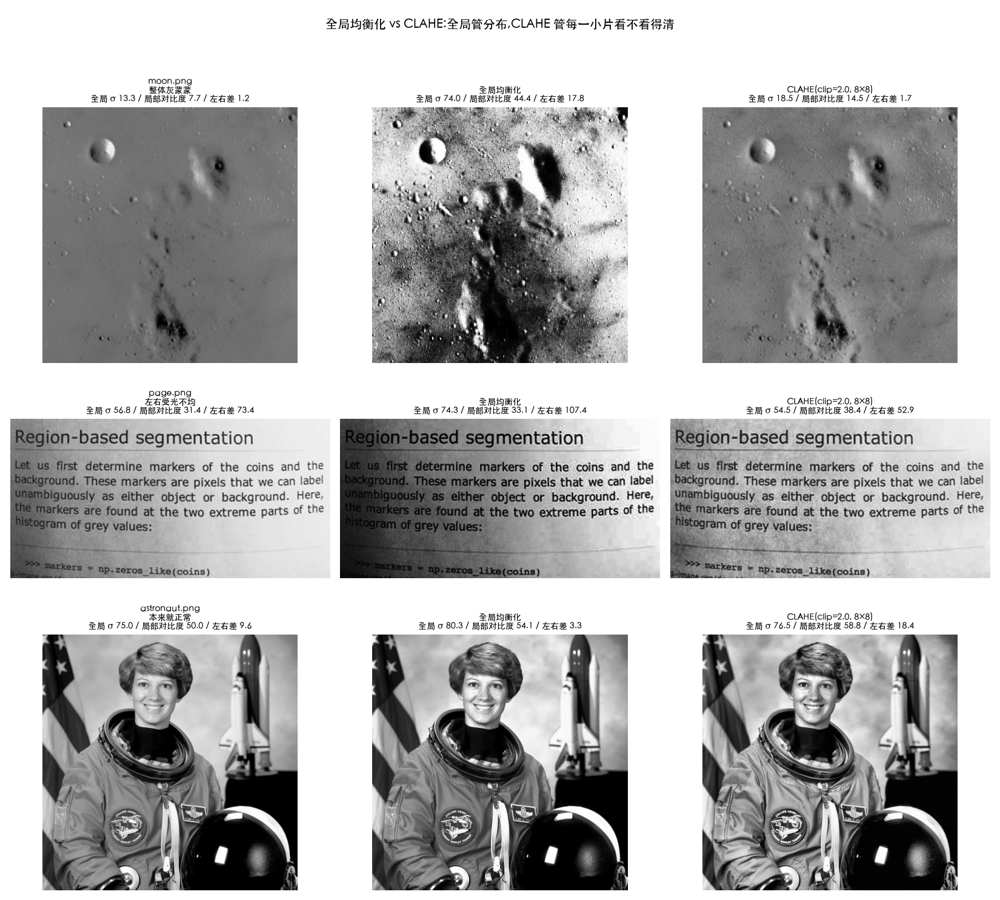
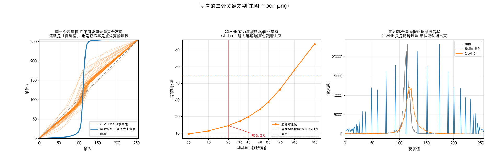
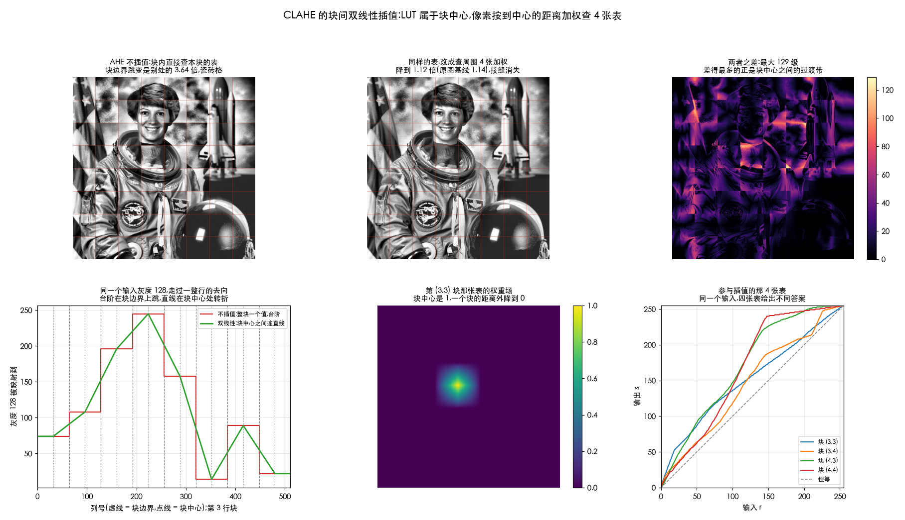
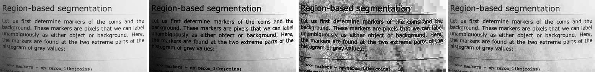

# CLAHE

> 对应 Gonzalez《数字图像处理》3.3.3 节(局部直方图处理)。
> 前置阅读:[04-equalization.md](04-equalization.md)(它补的就是那篇里的三个毛病)

> **怎么读这篇**
>
> | 有多少时间 | 看哪几节 |
> | :--- | :--- |
> | **只有 10 分钟** | `一、它补了哪两个洞` `七、两个参数怎么调` |
> | **第一遍学** | 再加 `二、和全局均衡化比` `三、从头造一遍` —— 到这儿为止就够用了 |
> | **踩坑时回来查** | `四、把它写出来`(对齐 OpenCV)`五、割裂感消掉了吗`(块状感、光晕) |

名字 **C**ontrast **L**imited **A**daptive **H**istogram **E**qualization 看着吓人,
其实是**三个词记录了三次修补** —— 这一篇就按修补的顺序,一个坑一个坑地讲。

---

## 一、它补了哪两个洞

CLAHE = Contrast Limited Adaptive Histogram Equalization(限制对比度的自适应直方图均衡)。
它同时解决了全局均衡化三个毛病里的后两个 —— 放大噪声、只看全局:

- **Adaptive(自适应)**:把图切成一个个小块(比如 8×8),**每块单独做均衡**,再把块与块之间用双线性插值平滑接上,避免出现方格边界。→ 解决"只看全局"
- **Contrast Limited(限制对比度)**:统计时给每个桶设一个上限,超出的部分**均匀分摊给其他桶**,防止某个灰度被拉得过开。→ 抑制噪声放大

```python
clahe = cv2.createCLAHE(clipLimit=2.0, tileGridSize=(8, 8))
out = clahe.apply(gray)
```

实际项目里用到"直方图均衡"时,九成场合指的是 CLAHE,而不是教科书里的全局版本。

---

## 二、和全局均衡化比

同一张图,一个用 `cv2.equalizeHist`,一个用 CLAHE,差别有多大?
这一节只回答一个问题:**什么时候该用哪个。**

**动手验证**:[`Ch03_Spatial_Filtering/16_equalize_vs_clahe.py`](../../Python-Prototyping/Ch03_Spatial_Filtering/16_equalize_vs_clahe.py)
把两者摆在一起横向比了一遍(13 号脚本拆的是 CLAHE 内部步骤,这一篇只回答「该用哪个」):

| 结论 | 实测 |
| :--- | :--- |
| **1 张表 vs 64 张表** | 同一个灰度 r=109,在最亮的块和最暗的块里分别被映射到 77 和 170,**差 94 级** |
| 所以 CLAHE 不是点运算 | 结果取决于像素**在哪儿**,不只取决于它的值 —— 和 3.2 那六篇的根本区别 |
| 「细节看得清」要用局部对比度量 | `astronaut.png`:全局标准差是均衡化涨得多(75.0 → 80.3),**局部对比度**是 CLAHE 涨得多(50.0 → 58.8) |
| 低对比度图 | `moon.png` 两个都能救,全局均衡化下手猛得多(σ 13.3 → 74.0 vs CLAHE 18.5) |
| 光照不均图 | `page.png` 左右亮度差 73.4,全局均衡化做到 **107.4(更糟)**,CLAHE 压到 52.9 |
| **噪声的代价** | σ=3 的噪声:全局均衡化放大 **12.4 倍**,CLAHE(clip=2)只放大 **2.7 倍** |
| 灰阶的代价 | 全局均衡化把 178 个灰阶并到 **49** 个(梳齿);CLAHE 还剩 246 个 |
| 耗时 | 512×512 上 0.16 ms vs 0.25 ms —— CLAHE 贵不了多少 |
| **CLAHE 有力度旋钮** | clipLimit 1→40,局部对比度 11.4 → 63.5,噪声放大 1.9× → **17.4×**(比全局均衡化还猛) |
| 两个旋钮拧到底 = 退化 | `tileGridSize=(1,1)` + `clipLimit=40` 与 `cv2.equalizeHist` 最大差 1 级 |

> **怎么选**:整张图偏灰偏暗、分布挤在一起 → 全局均衡化够用且便宜;
> 光照不均、要看暗部细节、有噪声、或者需要能调力度 → CLAHE。
> 视频里默认选 CLAHE,但注意它**逐帧独立**会闪烁(见本节末尾的提醒)。





---

---

## 三、从头造一遍

上面两节说的是「它是什么、效果怎么样」。这一节把它**从头造一遍** ——
从最原始的版本开始,一个坑一个坑地补,补完就是 CLAHE。

### 第 0 版:全局均衡化

就是上一篇讲的那个:统计全图直方图 → 算 CDF → 每个像素换成自己的排名百分比。

**问题:它只有一张映射表,全图共用。**

想象一张照片:**左边是背光的暗房间,右边是明亮的窗户。**

- 全图统计出来的直方图,是"暗房间"和"窗户"两坨**混在一起**的
- 算出来的映射表是两边**折中**的结果
- 于是暗房间提亮得不够,窗户又被压得过头 —— **两边都没调好**

根本原因:**一张图的不同区域,需要的处理是不一样的。**

#### 实测:反而更糟

拿 `page.png`(一张扫描文档,左边暗右边亮)量一下"左半均值"和"右半均值"的差:

| | 左半均值 | 右半均值 | **左右差** | 全图标准差 |
| :--- | :---: | :---: | :---: | :---: |
| 原图 | 134.8 | 208.3 | **73.4** | 56.8 |
| 全局均衡化 | 74.8 | 182.2 | **107.4** ↑ | 74.3 |
| CLAHE | 146.1 | 199.0 | **52.9** ↓ | 54.5 |

**全局均衡化把左右差从 73.4 拉大到了 107.4** —— 它只管"把整体分布摊开",完全不知道这个差异是光照不均造成的,反而把它一起放大了。

CLAHE 降到 52.9。

### 第 1 版:AHE

修补思路很直接:**一张表不够,那就一块一块地来。**

把图切成小方块(比如 8×8 = 64 块),**每块单独统计自己的直方图、算自己的映射表、只处理自己那块像素。**

这就是 **A**daptive(自适应)—— 根据局部内容自动调整,不是全图一刀切。

现在暗房间那几块按暗房间的分布拉,窗户那几块按窗户的分布拉,**两边都调好了**。

但它带来**两个新问题**。

### 新问题一:拼接痕迹

相邻的两块用的是**两张不同的映射表**。

假设块 A 的表把亮度 100 映射到 150,块 B 的表把 100 映射到 80。那么在交界线上,**本来连续的画面会突然跳变** —— 出现明显的方格网格,像贴了瓷砖。

#### 修法:插值

不要"这个像素属于哪块就用哪块的表",改成:

> **一个像素同时参考它周围 4 个块的映射表,按距离加权平均。**

离哪块的中心越近,那块的表权重越大。从块 A 走到块 B 的过程中,权重是**平滑过渡**的,不会突然切换,网格痕迹就消失了。

这一步用的是**双线性插值** —— 和你做几何变换时用的是同一个东西,只不过那边插的是像素值,这边插的是**映射结果**。

> 这句话听着容易,真写起来有个坑:**「周围 4 个块」到底是哪 4 个?权重怎么算?**
> 答案是「LUT 属于块的**中心**,不属于块本身」。完整推导和代码见下一节。

### 新问题二:噪声被放大

这个更麻烦,而且是**分块带来的必然后果**。

想想一块**平坦的暗部** —— 比如一面墙的阴影。这块里所有像素亮度都差不多,只有一点点传感器噪声。

它的局部直方图长这样:

```
[2, 1, 40, 15, 3, 2, 1, 0]
        ↑
     全挤在这里
```

均衡化看到这个会想:"挤得这么厉害,**我得狠狠摊开**"。于是把原本只差 1 的两个灰度,拉开成差 5。

可那点差异**本来就是噪声**。噪声被放大 5 倍,平坦的墙面变成一片沙粒。

> **全局均衡化也有这毛病,但没这么严重** —— 全图统计里,平坦区域会被其他有内容的区域稀释掉。
> 一旦分块,**一个纯噪声块的直方图里只剩噪声**,它就会被当成"急需增强的细节"。

#### 实测:放大 32 倍

造一块纯粹的平坦暗部:256×256 像素,亮度都在 60 附近,噪声标准差只有 **2**。理想的处理应该让它保持平坦。

| | 标准差 | 相对原图放大 |
| :--- | :---: | :---: |
| 原图(平坦暗部) | 2.02 | 1.00× |
| **AHE(clipLimit=40,几乎不限幅)** | **65.79** | **32.58×** |
| **CLAHE(clipLimit=2)** | 6.02 | 2.98× |

**不限幅时噪声被放大了 32 倍**,平坦区域彻底变成雪花。限幅后只有 3 倍。

### 第 2 版:CLAHE

这就是名字最前面那两个词。

思路:**给直方图的每根柱子设一个高度上限,超出的削掉。**

拿上面那个 64 像素的小块走一遍(数字都是实际算的):

**第 1 步 —— 定上限。** `clipLimit = 2.0` 的意思是"平均高度的 2 倍"。
平均高度 = 64 ÷ 8 = 8,所以上限 = **16**。

**第 2 步 —— 削顶。**

```
原始:   [2, 1, 40, 15, 3, 2, 1, 0]
削顶后: [2, 1, 16, 15, 3, 2, 1, 0]     削下来 40 − 16 = 24 个
```

**第 3 步 —— 把削下来的均分回填给所有桶。**

```
回填后: [5, 4, 19, 18, 6, 5, 4, 3]     每桶 +3(24 ÷ 8)
```

> **为什么要回填而不是扔掉**:总数必须守恒。否则累加到最后 CDF 不等于 1,映射表整体就偏了。
> 回填后可能又有桶超限,严格的实现会迭代几轮;OpenCV 做了简化,一轮就收工。

**第 4 步 —— 用修改后的直方图算映射表。**

| 原灰度 | 0 | **1** | **2** | 3 | 4 | 5 | 6 | 7 |
| :--- | :-: | :-: | :-: | :-: | :-: | :-: | :-: | :-: |
| 不限幅 → | 0 | **0** | **5** | 6 | 7 | 7 | 7 | 7 |
| 限幅后 → | 1 | **1** | **3** | 5 | 6 | 6 | 7 | 7 |

看灰度 1 → 2 这一步:

- **不限幅**:从 0 跳到 5,**一步跨 5 级**
- **限幅后**:从 1 到 3,只跨 2 级

### 本质:削的是斜率

回到 [01-histogram-basics.md](01-histogram-basics.md) 第三节那条链子:

```
柱子高  →  CDF 涨得陡  →  映射表斜率大  →  对比度增益大
```

> **映射表的斜率,就是对比度增益。**
> **削掉高柱子,就是给"最大对比度增益"设了个天花板。**

这就是 "Contrast **Limited**" 的字面含义 —— **限制的不是对比度本身,是增益的上限**。

### 完整流程

```text
算法:CLAHE
输入:灰度图 img、clipLimit、tileGridSize(比如 8×8)
输出:增强后的图

【第一阶段:每块各算各的表】
1. 把 img 切成 tiles×tiles 个小块
2. 对每个小块:
       hist ← 这一块自己的直方图
       limit ← max(round(clipLimit × 块面积 / 256), 1)     // 桶高上限
       excess ← 所有超出 limit 的部分加起来                  ← Contrast Limited
       hist ← 逐桶削到不超过 limit
       hist ← hist + excess/256                            // 削下来的均分回填
       lut[块] ← round( hist 的累加 × 255 / 块面积 )        ← Histogram Equalization
                                        ↑ 除的是块面积,不是总像素数

【第二阶段:每个像素向周围 4 块的表要答案】
3. 对每个像素 (y, x):
       u ← x / 块宽 − 0.5      // 减的这半块是块中心的偏移,漏了整图偏半块
       v ← y / 块高 − 0.5
       左块 ← floor(u), 右块 ← 左块 + 1, 横向权重 ← u − 左块
       上块 ← floor(v), 下块 ← 上块 + 1, 纵向权重 ← v − 上块
       把四个块号 clamp 到合法范围                          // 边界自动退化,不用写特判
       输出[y,x] ← 四张表对 img[y,x] 的结果,按双线性权重加权  ← Adaptive
```

三件事对应名字里的三个词:**C**ontrast **L**imited 是削顶那两行,
**H**istogram **E**qualization 是算 lut 那行,**A**daptive 是「每块一张表」
加上第二阶段的插值。下面两节分别把这两个阶段展开。

---

## 四、把它写出来

上面五步里,第 1~4 步都是「一块一块算」,直来直去;真正需要想清楚的是第 5 步 —— 插值。
这一节把它拆到代码级别,手写版能和 `cv2.createCLAHE` 逐像素对齐。

> **动手验证**:[`Ch03_Spatial_Filtering/17_clahe_from_scratch.py`](../../Python-Prototyping/Ch03_Spatial_Filtering/17_clahe_from_scratch.py)
> 把下面每一条都跑了一遍。手写版在 512×512 的图上与 `cv2.createCLAHE` **逐像素完全相同**(最大差 0),
> 需要补边的图差 1(定点数 vs float64 的舍入)。本篇引用的数字都是它打印出来的。

### 前提:LUT 挂在块中心

这是整件事的枢纽。每张 LUT 是从一整块像素统计出来的,但我们**把它当成挂在这个块的几何中心上的一个样本点**。

```
     列块号:      0         1         2         3
              ┌─────────┬─────────┬─────────┬─────────┐
              │    ●    │    ●    │    ●    │    ●    │      ● = 块中心,LUT 挂在这里
              └─────────┴─────────┴─────────┴─────────┘
    像素 x:   0        64       128       192       256
    块中心 x:      32        96       160       224
```

于是问题就变成了一维插值里最普通的那个问题:**x 落在哪两个样本点之间,离两边各多远。**

第 `j` 列块的中心在 `x = (j + 0.5) · tw`(`tw` = 块宽)。反解出「像素 x 在第几个块中心的位置上」:

$$ u = \frac{x}{tw} - 0.5 $$

**减的这 0.5 就是半块**,是最容易漏的一步。漏掉它,整张图会朝左上角偏半块,块边界上照样留痕迹。

拿到 `u` 之后:

```python
j1 = floor(u)        # 左边那张表的列块号
j2 = j1 + 1          # 右边那张
xa = u - j1          # 右表的权重(0~1),也就是「离左中心多远」
```

纵向同理得到 `i1, i2, ya`。四个权重就是两个方向的乘积,加起来正好是 1:

$$ s = (1-y_a)(1-x_a)\,L_{i_1 j_1}[v] + (1-y_a)\,x_a\,L_{i_1 j_2}[v] + y_a(1-x_a)\,L_{i_2 j_1}[v] + y_a x_a\,L_{i_2 j_2}[v] $$

`v` 是这个像素的原始灰度,`L[v]` 是某张表对它的映射结果。

### 算一个具体的像素

`astronaut.png`,8×8 块(每块 64×64),像素 (y=100, x=200),原始灰度 54:

```
u = 200/64 − 0.5 = 2.625   →  左表列号 2,右表权重 xa = 0.625
v = 100/64 − 0.5 = 1.062   →  上表行号 1,下表权重 ya = 0.062
```

| 参与的块 | 权重 | 这张表把 54 映射到 | 贡献 |
| :--- | ---: | ---: | ---: |
| 左上 (1,2) | 0.352 | 105 | 36.91 |
| 右上 (1,3) | 0.586 | 106 | 62.11 |
| 左下 (2,2) | 0.023 | 102 | 2.39 |
| 右下 (2,3) | 0.039 | 48 | 1.88 |
| | **1.000** | | **103.29 → 103** |

注意最后一列:同一个灰度 54,四张表分别给出 105、106、102、**48**。
右下那块显然是另一种光照环境。**这个分歧就是「自适应」本身** ——
也正因为如此,CLAHE 的结果取决于像素**在哪儿**,它已经不是 3.2 节那种点运算了。

### 边界不用写特例

图最外圈半块(上下各 `th/2` 行、左右各 `tw/2` 列)没有外侧的邻居,`u` 会落到 `[−0.5, 0)` 或 `[tiles−1, tiles−0.5)`。

处理办法是**把块号 clamp 到合法范围**:

```python
j2 = min(j1 + 1, tiles - 1)
j1 = max(j1, 0)
```

这么一夹,两张表变成同一张,那个方向的加权自动退化成「只用这一张」;
四个角上两个方向都退化,等于直接用角块的表。**代码里一个 `if` 都不用写。**

实测在 512×512 / 8×8 的配置下,真正用上 4 张**不同**表的像素占 **76.9%**,其余 23.1% 在边上或角上。

### 台阶 vs 折线

固定一个输入灰度(比如 128),沿着一整行走过去,看它被映射到哪:

- **不插值**:整块用同一个值 → 一串**台阶**,每到块边界跳一下,这就是瓷砖格
- **双线性**:块中心之间连直线 → **折线**,转折点在块中心,块边界上完全连续



量化一下「接缝」:用**块边界上的平均像素跳变 ÷ 别处的平均跳变**,越接近原图基线越看不出接缝。
`astronaut.png` 原图基线 1.14:

| clipLimit | 不插值(AHE 的做法) | 双线性插值(CLAHE) |
| ---: | ---: | ---: |
| 2.0 | 2.57 | 1.13 |
| 5.0 | 3.18 | 1.16 |
| 40.0 | 3.64 | 1.12 |

**拉得越狠,相邻两张表分歧越大,接缝越明显**;而插值不管在哪一档都能把它压回基线。
插值和限幅是**两件独立的事**,各修各的问题 —— 这也是为什么名字里两个词都要有。

### 两种等价的实现

有人写成「先把 4 张表按权重混成 1 张,再查」,有人写成「先各查各的,再加权」。**两者数值完全相同**(实测差 0.00e+00),因为加权求和是线性运算,而查表只是「取第 v 项」,可以交换顺序。

工程上选后者:混表要对 256 项全算一遍,查表只需要 1 项。

### 完整实现

```python
def tile_luts(img, clip=2.0, tiles=8):
    h, w = img.shape
    th, tw = h // tiles, w // tiles
    area = th * tw
    limit = max(int(clip * area / 256), 1)      # ← 注意是块面积,且和 1 取大
    luts = np.empty((tiles, tiles, 256), np.uint8)
    for i in range(tiles):
        for j in range(tiles):
            hist = np.bincount(img[i*th:(i+1)*th, j*tw:(j+1)*tw].ravel(),
                               minlength=256).astype(np.int64)
            excess = int(np.maximum(hist - limit, 0).sum())
            hist = np.minimum(hist, limit)
            batch = excess // 256
            hist += batch                        # 均分回填
            residual = excess - batch * 256      # 除不尽的零头
            if residual:                         # 按固定步长挑几个桶各 +1
                step = max(256 // residual, 1)
                hist[np.arange(0, 256, step)[:residual]] += 1
            luts[i, j] = np.clip(np.rint(np.cumsum(hist) * (255.0 / area)), 0, 255)
    return luts

def interpolate(img, luts, th, tw):
    h, w = img.shape
    v = np.arange(h) / th - 0.5;  y1 = np.floor(v).astype(int);  ya = v - y1
    u = np.arange(w) / tw - 0.5;  x1 = np.floor(u).astype(int);  xa = u - x1
    y2 = np.clip(y1 + 1, 0, 7);  y1 = np.clip(y1, 0, 7)
    x2 = np.clip(x1 + 1, 0, 7);  x1 = np.clip(x1, 0, 7)
    L = lambda iy, ix: luts[iy[:, None], ix[None, :], img]   # 三重索引,一次查完整幅图
    out = (L(y1, x1) * ((1-ya)[:, None] * (1-xa)[None, :])
         + L(y1, x2) * ((1-ya)[:, None] *    xa[None, :])
         + L(y2, x1) * (   ya[:, None] * (1-xa)[None, :])
         + L(y2, x2) * (   ya[:, None] *    xa[None, :]))
    return np.clip(np.rint(out), 0, 255).astype(np.uint8)
```

三个容易写错、但不写对就对不上 OpenCV 的细节:

1. **上限是 `clip × 块面积 / 256`,再和 1 取大**。小块上不取大会算成 0,直方图被削成全 0
2. **回填要处理余数**。`excess // 256` 之后剩下的零头不能扔 —— 总数不守恒的话 CDF 末端就不是 1,整张表偏掉
3. **CDF 乘的是 `255 / 块面积`**,不是 `255 / 总像素数`。每张表只管自己那块

### OpenCV 的补边怪癖

图的尺寸除不尽 `tileGridSize` 时要补边,OpenCV 的判断是:

> **只要有一边除不尽,就两边都补 `tiles − (n % tiles)`。**

宽本来整除的话余数是 0,于是它补了满满**一整块**。这不是文档写的,是源码的实际行为。
拿 `page.png`(191×384,高除不尽、宽正好整除)对照:

| 补边方式 | 补完尺寸 | 与 `cv2` 最大差 |
| :--- | :--- | ---: |
| 不补 | 191×384 | 27 |
| 只补除不尽的那一边(补 1 行) | 192×384 | 12 |
| **补 1 行 + 8 列**(OpenCV 的做法) | 192×392 | **1** |

块大小从 48 变成 49,所有块的边界跟着挪,结果就完全不同了。
自己实现时**要不要和 OpenCV 对齐,是个选择**:不对齐的话随便补都行,效果没有优劣之分;
但要拿它当参考实现做回归测试,这一条必须照抄。

---

## 五、割裂感消掉了吗

**没有。插值没有消灭割裂,它把割裂搬了家。**

**(a) 双线性是 C⁰,不是 C¹**

双线性插值保证的是**值连续**,不保证**斜率连续**。固定一个输入灰度,看它的映射结果沿一整行怎么走,再求二阶差分(`astronaut.png`,8×8 块):

| 输入灰度 | 块中心处 \|二阶差分\| | 其它位置 | 最大值 |
| ---: | ---: | ---: | ---: |
| 60 | 0.309 | **0.0000** | 0.609 |
| 128 | 0.762 | **0.0000** | 1.469 |
| 200 | 0.617 | **0.0000** | 1.609 |

其它位置**严格是 0**(线性段),所有转折全部落在**块中心**。于是:

- **不插值** → 块边界上的**台阶**(值跳变),一眼看见
- **插值后** → 块中心上的**折痕**(斜率跳变),一般看不见

之所以通常看不见,是因为人眼对一阶跳变敏感得多。但在**大面积极平滑的渐变**上
(天空、灯箱、渐变背景),Mach band 效应会放大二阶不连续 —— 这时可能隐约看到网格。

> **一个现成的判据**:看到的网格线在**块中心** = 插值的折痕,正常现象;
> 在**块边界** = 插值没生效,或者坐标算错了(多半是漏了那个 `−0.5`)。

**(b) 更常见的残留:相邻两块对同一个输入的分歧**

这个比折痕严重得多,而且和插值无关。前面那个像素的例子里,四张相邻的表把同一个灰度 54 分别映射到 105、106、102、**48**。量一下全图相邻块之间的最大分歧:

| clipLimit | 相邻块 LUT 最大分歧 | 摊到一个块宽(64 px)的坡度 |
| ---: | ---: | ---: |
| 1.0 | 67 级 | 1.05 级/像素 |
| **2.0** | **109 级** | **1.70 级/像素** |
| 4.0 | 136 级 | 2.12 级/像素 |
| 40.0 | 220 级 | 3.44 级/像素 |

插值做的事,是把这个分歧**摊到一个块宽上变成一道缓坡** —— 不再是硬接缝,
但**一个横跨两块的物体仍然会被非均匀地处理**。脸的左半在暗块、右半在亮块,
插值后不会有硬边,但会有一道看得出来的明暗渐变 —— 这就是 CLAHE 典型的**光晕(halo)**。

**插值只能让它平滑,消不掉。** 根源是「相邻块需要的处理本来就不一样」,
而这恰恰是 CLAHE 存在的理由。

**(c) 增益成块 → 脏背景**

一块纯天空的局部直方图里全是噪声,它的 LUT 极陡;旁边有建筑的块 LUT 温和。
插值让过渡平滑,但天空那片的**噪声增益整体就是高的**,于是背景出现云斑。
`clipLimit` 压的就是这个 —— 能压小,压不到 0。

### 那怎么办

| 手段 | 效果 | 代价 |
| :--- | :--- | :--- |
| **降 `clipLimit`** | 最有效。相邻 LUT 分歧小了,上面三类残留一起变小 | 增强力度也一起下去 |
| 减少块数(块变大) | 折痕变少 | 越来越接近全局均衡化 |
| 换双三次插值 | C¹ 连续,折痕消失 | 要 16 张表,更慢;部分实现这么做 |
| 积分图 + 真·滑动窗口 | 根本没有「块」这个概念 | 贵,但积分图可做到 O(1)/像素 |
| 换思路:引导滤波 / 局部拉普拉斯 | 本身不分块,光晕控制也更好 | 已经不是直方图方法了 |

> **一句话**:CLAHE 的块是一个工程妥协 —— 用 64 张表 + 插值去近似「每个像素一张表」。
> 插值把最刺眼的台阶抹掉了,但妥协本身留下的痕迹(折痕、光晕、增益成块)还在,
> 只是从「一眼看见」降到了「盯着找才看得见」。
>
> **想做得更好**(上表已列,这里点一下名字):折痕换**双三次插值**能消掉;
> 想根本不要「块」这个概念,用**积分图 + 真·滑动窗口**;
> 要彻底摆脱光晕,那已经不是直方图方法的事了 ——
> 查**引导滤波(guided filter)**或**局部拉普拉斯滤波**。

### 为什么不逐像素滑窗

最"正确"的自适应均衡是:**每个像素都用自己周围一个窗口的直方图**算一张表。
那是真正的 AHE,效果最好,但每个像素都要统计一次直方图,慢到没法用。

分块 + 插值是它的**廉价近似**:只算 64 张表,再用插值把中间填上。
64 次统计 + 每像素 4 次查表,和逐像素统计比,便宜了几个数量级,
而且因为插值是线性的,结果在块中心处与真解完全吻合,块之间平滑过渡。

> 这是图像处理里反复出现的套路:**在稀疏的网格上算准,中间靠插值补** ——
> 几何变换的重采样、色彩管理的 3D LUT、镜头暗角校正的增益网格,都是同一个思路。

---

---

## 六、四种做法并排看



*依次:原图 / 全局均衡化 / AHE(不限幅)/ CLAHE*

- **第 2 张(全局均衡化)**:整体压暗了,左右不均没解决,背景反而变脏
- **第 3 张(AHE 不限幅)**:背景炸成一片一片的斑块,**还能明显看到方格状的块痕**
- **第 4 张(CLAHE)**:文字清晰,背景干净均匀

## 七、两个参数怎么调

```python
clahe = cv2.createCLAHE(clipLimit=2.0, tileGridSize=(8, 8))
out = clahe.apply(gray)
```

| 参数 | 含义 | 调大 | 调小 |
| :--- | :--- | :--- | :--- |
| **`clipLimit`** | 对比度增益上限 | 效果强,**噪声明显** | 效果弱,趋近原图 |
| **`tileGridSize`** | 切成几块 | 局部性强,**可能出现块状感** | 趋近全局均衡化 |

推到极端会退化成什么(实测):

- **`tileGridSize=(1,1)` + `clipLimit` 极大** → 和 `cv2.equalizeHist` 的最大逐像素差只有 **1**,**完全退化成全局均衡化**
- **`clipLimit → ∞`** → 退化成 AHE(噪声爆炸)

`clipLimit` 从小到大对输出标准差的影响(`tileGridSize` 固定 8×8):

| clipLimit | 1.0 | 2.0 | 5.0 | 10.0 | 40.0 |
| :--- | :-: | :-: | :-: | :-: | :-: |
| 输出标准差 | 54.08 | 54.49 | 58.44 | 62.69 | 62.72 |

注意 10.0 到 40.0 几乎不再变化 —— **超过某个点之后就等于没限幅了**,再调大只是徒增噪声。

**默认的 `2.0` + `(8,8)` 是个稳妥起点。**

---

## 八、为什么工程上只用它

实际项目里说"做直方图均衡",九成指的是 CLAHE,不是教科书里的全局版本。因为全局版本**既搞不定光照不均,又会放大噪声**,两个致命伤 CLAHE 都补上了。

典型战场:

| 场景 | 为什么适合 |
| :--- | :--- |
| **医学影像**(X 光、CT) | 光照本来就不均,而且只要"看清",没有美学负担 |
| **逆光人像** | 脸暗背景亮,正是"一张图两种曝光" |
| **雾天 / 水下** | 整体低对比度 |
| **红外、夜视** | 噪声大,`clipLimit` 就是为它准备的 |

> **对做视频的提醒**:CLAHE 是**逐帧独立**计算的。相邻两帧内容稍有变化,映射表就会变,连续播放会出现**亮度闪烁**。
> 实时视频里通常要对映射表做时间平滑(比如和上一帧的表做加权混合),或者降低更新频率。

---

---

## 小结

| 问题 | 答案 |
| :--- | :--- |
| 三个词分别在修什么 | **A**daptive 修「只看全局」;**C**ontrast **L**imited 修「放大噪声」;插值修分块带来的拼接痕 |
| clip 在削什么 | 削映射曲线的**最大斜率**,也就是对比度增益的上限 |
| 插值在插什么 | 插的不是像素值,是**映射结果** —— 一个像素同时参考周围 4 个块中心的表 |
| 最容易写错的一处 | `u = x/tw − 0.5` 里的那半块。漏了它,整图偏半块,块边界照样留痕 |
| 割裂感消掉了吗 | 没有,只是搬了家:台阶(块边界)变成折痕(块中心),外加光晕 |
| 默认参数 | `clipLimit=2.0` + `tileGridSize=(8,8)` 是稳妥起点 |
| 做视频要注意 | 逐帧独立计算 → 亮度闪烁,要对映射表做时间平滑 |

---

## 相关文档

- [04-equalization.md](04-equalization.md) —— 它修的那三个毛病在这篇
- [01-histogram-basics.md](01-histogram-basics.md) —— 「柱子高 → 增益大」那条链子在这篇第三节
- [07-further-topics.md](07-further-topics.md) —— 局部统计增强等其它局部方法
