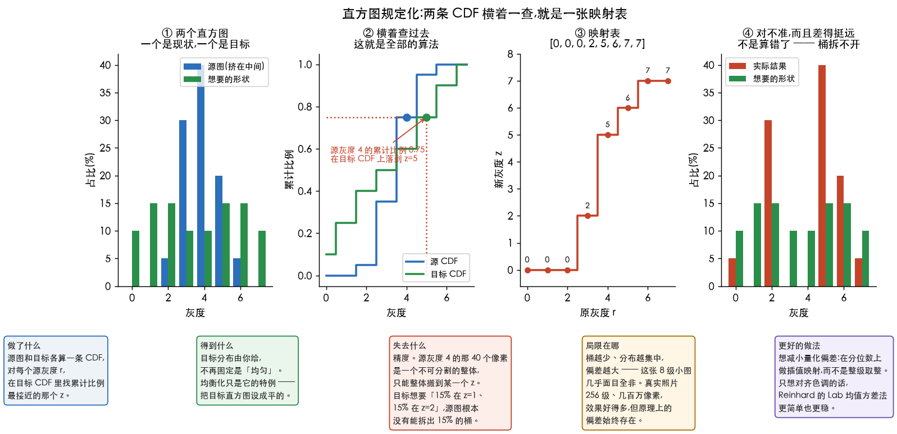
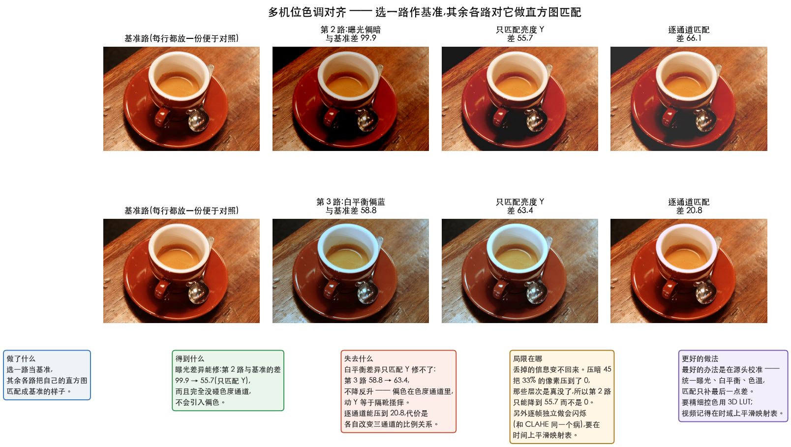

# 直方图规定化

> 也叫直方图匹配(Histogram Specification / Matching)。
> 对应 Gonzalez《数字图像处理》3.3.2 节。
> 前置阅读:[04-equalization.md](04-equalization.md)

> **怎么读这篇**
>
> | 有多少时间 | 看哪几节 |
> | :--- | :--- |
> | **只有 10 分钟** | `一、它和均衡化差在哪` |
> | **第一遍学** | 再加 `二、手算一遍` —— 重点是看它**做不到**什么 |
> | **踩坑时回来查** | `三、多机位色调对齐` |

---

## 一、它和均衡化差在哪

均衡化的目标是"摊平"。但有时候我们想要的不是摊平,而是**变成某个指定的样子**。

**直方图规定化 / 直方图匹配(Histogram Specification / Matching)**:给定一张目标直方图,把源图变换成那个分布。

做法:源图和目标图各自算出 CDF,然后对每个源灰度 r,在目标 CDF 里找一个 z,使得两边的累计比例最接近,建立 `r → z` 的映射表。

```text
算法:直方图规定化(匹配)
输入:源图 img、目标直方图 ref_hist
输出:分布接近 ref_hist 的图

1. src_cdf ← img 的直方图累加后归一化
2. ref_cdf ← ref_hist 累加后归一化
3. 对每个源灰度 r(0~255):
       lut[r] ← 让 |ref_cdf[z] − src_cdf[r]| 最小的那个 z    // 并列时取小的
4. 对每个像素 p:
       输出[p] ← lut[ img[p] ]
```

看第 2 步:把 `ref_cdf` 换成一条直线(也就是「目标分布是均匀的」),
第 3 步当场退化成 `lut[r] = round(255 × src_cdf[r])` ——
**[均衡化](04-equalization.md)是规定化的一个特例**,不是另一个算法。

**对推流/多路视频开发很有用的场景**:多机位画面拼接时,不同摄像机的曝光和白平衡不一致,拼在一起色调突兀。选一路作为基准,其余各路做直方图匹配,就能把色调拉齐。

彩色图要注意:**不要对 R、G、B 三个通道各自独立做均衡**,那会破坏通道间的比例关系,导致明显偏色。正确做法是转到 YUV / Lab / HSV,只对亮度通道(Y 或 L 或 V)做,色度通道保持不变。

---

---

## 二、手算一遍

用 [04-equalization.md](04-equalization.md) 里那张同样的小图跑一遍,顺便看看它的**局限**。

- **源直方图**(挤在中间):`[0, 0, 5, 30, 40, 20, 5, 0]`
- **目标形状**(想要的分布):`[10, 15, 15, 10, 10, 15, 15, 10]`

做法:两边各自算 CDF,然后对每个源灰度 `r`,**在目标 CDF 里找累计比例最接近的那个 z**。

| 源 r | 源 CDF | 找到的 z | 目标 CDF |
| :---: | :---: | :---: | :---: |
| 0 | 0.000 | 0 | 0.100 |
| 1 | 0.000 | 0 | 0.100 |
| 2 | 0.050 | 0 | 0.100 |
| 3 | 0.350 | 2 | 0.400 |
| 4 | 0.750 | **5** | 0.750 ← 完美命中 |
| 5 | 0.950 | 6 | 0.900 |
| 6 | 1.000 | 7 | 1.000 |
| 7 | 1.000 | 7 | 1.000 |

得到映射表 `[0, 0, 0, 2, 5, 6, 7, 7]`,套用后:

```
目标形状(占比%): [10, 15, 15, 10, 10, 15, 15, 10]
实际结果(占比%): [ 5,  0, 30,  0,  0, 40, 20,  5]
```

**差得挺远。** 这不是算法写错了 —— 又是 [04-equalization.md](04-equalization.md) 第五节最后那个限制:

> 源图灰度 4 的那 40 个像素是一个不可分割的整体,只能整体搬到某一个 z。目标想要"15% 在 z=1、15% 在 z=2",而源图根本没有可以拆出 15% 的桶。



*第 ② 格就是全部的算法:从源 CDF 上的一点横着拉过去,落在目标 CDF 上的哪一级,
那一级就是答案。第 ④ 格是结果和目标的对照 —— 差得挺远,但**不是算错了**。*

> **一个实现上的分歧,不说清楚就对不上账**:「找累计比例**最接近**的 z」和
> 「找**第一个不小于**它的 z」(`np.searchsorted`)是两条不同的规则,在并列处结果不同。
> 上表源灰度 5 就是:源 CDF = 0.95,目标 CDF 里 0.90 和 1.00 与它**距离相等** ——
> 「最接近」取 z=6,`searchsorted` 取 z=7。两种写法都有人用,
> 但你的代码、文档、测试必须用同一条。本文和配套脚本统一用「最接近,并列取小」。

所以:**规定化在离散图像上只能"尽量靠近",桶越少、分布越集中,偏差越大。** 真实照片有 256 级、几百万像素,效果会好得多,但原理上的偏差始终存在。

**实际用途**(重申一下,对你最相关的那个):多机位视频拼接时,选一路作基准,其余各路对它做直方图匹配,把色调拉齐。这时候"尽量靠近"就完全够用了 —— 你要的是消除突兀,不是数学上的严格吻合。

---

---

## 三、多机位色调对齐

对做推流 / 多路视频的人来说,这是规定化最实在的用途。

多机位画面拼接时,不同摄像机的曝光和白平衡不一致,拼在一起色调突兀。
**选一路作为基准,其余各路对它做直方图匹配**,就能把色调拉齐。

这个场景恰好避开了上一节那个局限:你要的是「消除突兀」,
不是数学上的严格吻合 —— 「尽量靠近」完全够用。



**彩色图该匹配哪个通道,得看你要修的是什么** —— 这一点比"一律只动亮度通道"要细。

| 各路的差异在哪 | 只匹配亮度 Y | 逐通道匹配 |
| :--- | :--- | :--- |
| **曝光**不一致 | 99.9 → **55.7** ✅ 能修,而且完全不碰颜色 | 66.1,反而不如只匹配 Y |
| **白平衡**不一致 | 58.8 → **63.4** ❌ 不降反升 | 58.8 → **20.8** ✅ 只有它能修 |

> *表里的数字是三通道直方图的总变差距离(%),0 表示逐桶完全相同。*

道理是直白的:**偏色住在色度通道里,你只动亮度,等于隔靴搔痒。**

- [04-equalization.md](04-equalization.md) 第七节那条「只动亮度通道」的规矩,
  针对的是**单张图自增强**(均衡化)—— 那时动色度纯粹是副作用,有害无益;
- 而**跨机位对齐**的目的本来就包含"把颜色拉到一致",该动就得动。
  代价是逐通道匹配会各自改变三通道的比例关系,可能引入新的偏色,
  所以只在确实存在白平衡差异时才用。

> **两个必须知道的边界**:
>
> 1. **丢掉的信息变不回来。** 上表第 2 路只降到 55.7 而不是 0,
>    是因为"压暗"这一步已经把一部分暗部压到了 0,那些层次是真没了 ——
>    直方图匹配只能重排现有的值,变不出不存在的细节。
>    所以多机位要**在源头把曝光调接近**,匹配是补最后一点差,不是万能药。
> 2. **逐帧独立匹配会闪烁**,和 CLAHE 是同一个病。
>    实际做法是让映射表在时间上平滑过渡,或者隔若干帧才更新一次。

---

## 小结

| 问题 | 答案 |
| :--- | :--- |
| 和均衡化差在哪 | 均衡化的目标分布**固定是均匀**;规定化的目标分布**由你给** |
| 怎么做 | 两边各算 CDF,对每个源灰度 r 在目标 CDF 里找累计比例最接近的 z |
| 能做到多准 | 只能逼近。桶不可拆分,桶越少、分布越集中,偏差越大 |
| 最实在的用途 | 多机位 / 多路视频的色调对齐 |
| 彩色图 | 仍然是只动亮度通道 |

---

## 相关文档

- [04-equalization.md](04-equalization.md) —— 均衡化(目标分布固定为均匀的特例)
- [05-clahe.md](05-clahe.md) —— 另一条路:不换目标分布,而是分块
- [07-further-topics.md](07-further-topics.md) —— 直方图还能做什么
