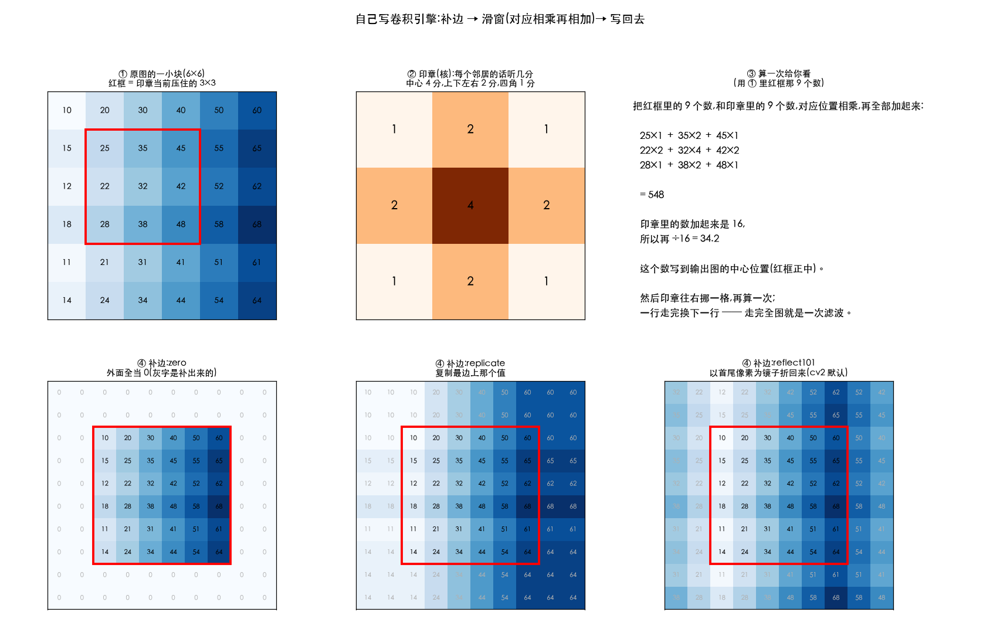
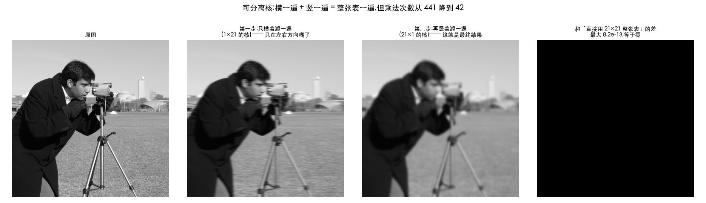

# 空间滤波基础

> 对应冈萨雷斯第四版 3.4 节。这是整个第 3 章的分水岭:
> 前面 3.2、3.3 的所有方法都能塌缩成一张查找表,从这里开始不行了。
>
> 本篇只讲**原理和机制**,具体的滤波器(平滑、锐化、边缘)在 3.5~3.6。
> 配套脚本从 `Ch03_Spatial_Filtering/20_` 起,随后补。

---

> **动手验证**:本篇每个数字都有脚本跑出来 ——
> [`20_convolution_basics.py`](../../Python-Prototyping/Ch03_Spatial_Filtering/20_convolution_basics.py)
> 验证 OpenCV 的行为(冲激响应、五种补边、秩、计时、溢出统计);
> [`21_conv_engine.py`](../../Python-Prototyping/Ch03_Spatial_Filtering/21_conv_engine.py)
> 不调库自己写一个引擎,与 `cv2.filter2D` 对齐到 **0 差别**(第八节)。

---

> **怎么读这篇**(第一遍真的不用全看)
>
> | 有多少时间 | 看哪几节 |
> | :--- | :--- |
> | **只有 10 分钟** | `先讲人话` + `十、小结` —— 12 个问答,全部结论都在里面 |
> | **第一遍学** | 再加 `零、先定位` `一、一次滤波在算什么` `二、相关 vs 卷积` `三、边界怎么办` `四、核的和` `六、可分离核` —— 这六节是主干 |
> | **踩坑时回来查** | `五、线性 vs 非线性` `七、ddepth 与溢出` `八、自己动手写一个` `九、常见坑清单` —— 第八节是想亲手写引擎时再看的,不看不影响理解 |

---

## 先讲人话

前面学的那些(调亮、反色、伽马、直方图均衡)有个共同点:
**每个像素自己说了算** —— 一个值为 100 的像素,不管它在图的哪个角落,
结果都一样。因为规矩早就写在一张表里了。

从这一节开始变了:

> **每个像素在决定自己变成多少之前,要先问一圈邻居的意见。**

- **模糊**,就是「跟邻居商量一下,取个折中」 —— 谁也别太突出,画面就柔了
- **锐化**,就是「跟邻居对着干」 —— 我本来就比邻居亮,那就让我更亮,反差拉大
- **找边缘**,就是「只看我和邻居差多少」 —— 差得多的地方就是轮廓

「问一圈邻居」这个动作,怎么问、听谁的话多一点,就是这一节的全部内容。

---

## 零、先定位

[03-lut.md](../01-fundamentals/03-lut.md) 里那条判据:

> **输出是否只取决于这个像素自己的值?**

3.2 的线性/对数/伽马/分段线性/比特平面、3.3 的直方图均衡化 —— 全都是「是」,
所以它们统统能塌缩成一张 256 项的表。

**空间滤波是第一个「否」。**

```
点运算:   输出(x,y) = T( 输入(x,y) )                    只看这一个像素
空间滤波: 输出(x,y) = T( 输入在 (x,y) 附近的一小片 )      要看一圈邻居
```

一个直接后果:**同一个灰度值,在不同位置会得到不同结果**。
实测在 `astronaut.png` 上做 5×5 高斯模糊,原图里 653 个值为 100 的像素,
模糊后变成了 **67 种**不同的值 —— 一张表根本表达不了。

> CLAHE 其实已经踩在这条线上了(它的结果也取决于像素在哪儿),
> 但它的解法是「换成 64 张表 + 插值」,本质还是查表。
> 空间滤波是真的每个像素都要现算。

---

## 一、一次滤波到底在算什么

### 术语先统一

| 叫法 | 说的是同一个东西 |
| :--- | :--- |
| 核(kernel) | 最常用,也是 OpenCV 的叫法 |
| 模板、掩膜(mask) | 冈萨雷斯书里的叫法 |
| 滤波器(filter) | 强调它的作用 |
| 窗口(window) | 强调它在图上滑动 |

说白了就是**一张小表格**,常见 3×3、5×5,里面填的是数字。

**这张表是干什么用的?它是一张「打分表」,规定了每个邻居的话该听几分。**

比如这张:

```
┌───┬───┬───┐
│ 1 │ 2 │ 1 │      正中间那个 4 = 我自己的意见,权重最高
├───┼───┼───┤      上下左右的 2 = 挨着我的邻居,听一半
│ 2 │ 4 │ 2 │      四个角的 1  = 斜着的邻居,离得远,只听四分之一
├───┼───┼───┤
│ 1 │ 2 │ 1 │
└───┴───┴───┘
```

数字大 = 这个位置的邻居说话算数;数字小 = 随便听听;
数字是负的 = **反着听**(它越亮我越暗)—— 锐化和找边缘就靠负数。

换一张打分表,就是换一种滤镜。**整个空间滤波,就是在设计这张小表格。**

### 一次计算

把核压在图像的某个位置上,**对应位置相乘,再全部加起来**,结果写到输出图的中心位置:

```
      图像的一小片              核              一次计算
    ┌────┬────┬────┐    ┌────┬────┬────┐
    │ 10 │ 20 │ 30 │    │ 1  │ 2  │ 1  │     10×1 + 20×2 + 30×1
    ├────┼────┼────┤    ├────┼────┼────┤   + 40×2 + 50×4 + 60×2
    │ 40 │ 50 │ 60 │  × │ 2  │ 4  │ 2  │   + 70×1 + 80×2 + 90×1
    ├────┼────┼────┤    ├────┼────┼────┤   ─────────────────────
    │ 70 │ 80 │ 90 │    │ 1  │ 2  │ 1  │     = 800,再 ÷16 = 50
    └────┴────┴────┘    └────┴────┴────┘
```

然后核往右挪一格,再算一次;一行走完换下一行。**整幅图走一遍,就叫一次滤波。**

> 注意上面那个 `÷16`:核里所有数加起来是 16,除掉它才能保证「均匀的一片经过滤波还是原样」。
> 这个「和」很关键,第四节专门讲。

### 为什么核的边长一般是奇数

因为**要有一个明确的中心**。3×3 的中心是正中间那一格,4×4 就没有正中间。

偶数核不是不能用,但 OpenCV 会把「锚点」放在 `k/2` 的位置,窗口就变得左右不对称。
实测 1×4 的均值核作用在 `[10 20 30 40 50]` 上,输出 `[20 20 25 35 40]` ——
其中 25 = (10+20+30+40)/4,窗口覆盖的是 `i−2 … i+1`,**向左多伸了一格**,
结果整体带了半个像素的位移。要用偶数核就得自己指定 `anchor`,否则图会悄悄偏。

---

## 二、相关 vs 卷积

这是本节最容易含糊过去、但必须说清的一点。先给直觉。

### 先打个比方:核是一枚印章

把那张打分表想成**一枚刻好的印章**,要盖到图上去。

- **相关**:印章**直接盖**下去。印章的左上角对着图的左上角,很符合直觉
- **卷积**:印章**先转半圈(180°)再盖**。印章的左上角对着图的右下角

就差这一下。为什么要转?这是数学上的历史包袱(后面第四小节会讲它换来了什么),
不是谁故意刁难。

**关键结论先说**:图像处理的书讲的是**卷积**,而 OpenCV 的 `cv2.filter2D` 做的是**相关**。
大多数时候这不影响结果,但有些时候会把方向搞反 —— 下面一条一条说清楚。

### 两个定义(可跳过)

**相关(correlation)** —— 核直接盖上去,对应位置相乘求和:

$$ g(x,y) = \sum_{s=-a}^{a}\sum_{t=-b}^{b} w(s,t)\, f(x+s,\; y+t) $$

**卷积(convolution)** —— 核**先转 180°**,再盖上去:

$$ g(x,y) = \sum_{s=-a}^{a}\sum_{t=-b}^{b} w(s,t)\, f(x-s,\; y-t) $$

注意区别只在 `f` 的下标是 `+` 还是 `−`。翻译成人话:

> **相关**:核的左上角对着图像的左上角。
> **卷积**:核的左上角对着图像的右下角(核转了半圈)。

### 拿一粒芝麻去试

办法很土但很有效:**做一张全黑的图,只在正中间点一个白点**,拿它去过这个滤波器。

(这张图数学上叫**单位冲激**,名字唬人,就是「一粒白芝麻」的意思。)

想一想会发生什么:整张图只有中心那一个点不是 0,
所以印章盖上去的时候,只有压在这个白点上的那一格权重能起作用。
于是**输出图上会原样印出那张打分表** —— 只不过:

- 如果是**卷积**(印章转了半圈再盖),印出来的正好**转回来**,是**核本身**
- 如果是**相关**(印章直接盖),印出来的是**核翻转 180°** 的样子

换句话说:**看印出来的东西正不正,就知道它偷没偷偷转印章。**

实测 `cv2.filter2D`,核取 `[[1,2,3],[4,5,6],[7,8,9]]`:

```
冲激响应 = [[9,8,7],
            [6,5,4],
            [3,2,1]]      ← 是核翻转 180° 的样子
```

**所以 `cv2.filter2D` 做的是相关,不是卷积。** 名字里带 filter,但数学上是 correlation。

想要真卷积,自己先把核翻过来:

```python
out = cv2.filter2D(img, ddepth, cv2.flip(kernel, -1))   # flip(-1) = 上下 + 左右都翻
```

### 什么时候这个区别不重要

**核是中心对称的时候,翻不翻都一样。** 实测:

| 核 | 相关 vs 卷积 最大差 |
| :--- | ---: |
| 5×5 高斯(对称) | **0.0** |
| 3×3 Sobel-x(反对称) | **1720.0**,而且卷积结果正好等于 −相关结果 |

平滑类的核(盒式、高斯)全是对称的,所以日常根本感觉不到差别 ——
这也是为什么很多人写了一辈子 `filter2D` 都没意识到它是相关。
**但方向性的核(Sobel、Prewitt、各种梯度算子)一翻就变号**,梯度方向整个反过来。

### 那为什么教材非要区分

因为**只有卷积有交换律和结合律**,相关没有。实测(一维):

```
conv(a,b) = [0 0 1 2 3]    conv(b,a) = [0 0 1 2 3]     ← 一样
corr(a,b) = [1 2 3 0 0]    corr(b,a) = [0 0 3 2 1]     ← 不一样
```

「交换律」说人话就是:**先加糖再加奶,和先加奶再加糖,结果一样。**
卷积满足这个,相关不满足。

这条性质是整个信号处理的地基:

- **结合律** `(f*g)*h = f*(g*h)` → 两个滤波器可以**先合成一个**再作用,省一遍扫描
- **交换律** → 「谁是信号、谁是滤波器」可以互换,傅里叶那一套才能成立
- 后面第 4 章「空间卷积 ↔ 频域相乘」的定理,说的是**卷积**,不是相关

所以:**理论上讲卷积,代码里用相关**,只要核对称就不会出事;核不对称时自己翻一下。

---

## 三、边界怎么办

3×3 的核压在图的第一行第一列时,有 5 个格子悬空。必须给个说法。

### 五种补边,实测对照

原始一行 `[10 20 30 40 50]`,左右各补 3 个:

| 模式 | 补出来的结果 | 说人话 |
| :--- | :--- | :--- |
| `BORDER_CONSTANT` | `0 0 0 ｜10 20 30 40 50｜ 0 0 0` | 外面全当 0(黑) |
| `BORDER_REPLICATE` | `10 10 10 ｜…｜ 50 50 50` | 边缘像素**复制**出去 |
| `BORDER_REFLECT` | `30 20 10 ｜…｜ 50 40 30` | 以边缘**外侧**为轴镜像,**边缘那个值出现两次** |
| `BORDER_REFLECT_101` | `40 30 20 ｜…｜ 40 30 20` | 以边缘**那个像素**为轴镜像,**不重复它**。**OpenCV 默认** |
| `BORDER_WRAP` | `30 40 50 ｜…｜ 10 20 30` | 从另一头绕回来(当成环状) |

### 各自的后果

| 模式 | 问题 |
| :--- | :--- |
| 补 0 | 边框会**变暗**。一张亮图的四边会出现一圈黑边,平滑核越大越明显 |
| 复制 | 最安全、最常用。缺点是把边缘那个值的权重放大了,边上的梯度会偏小 |
| 镜像 101 | 数学上最平滑(导数在边界连续),OpenCV 默认;`REFLECT` 会在边界造出一个假的平台 |
| 环绕 | 只有在图像本身就是周期性的(纹理贴图、FFT 的隐含假设)时才对,否则左右内容会串味 |

> **为什么 `REFLECT_101` 是默认**:它保证边界处的一阶差分连续。
> `REFLECT` 把边缘像素写了两遍,等于人为造了一个「平的地方」,
> 在做梯度/锐化时会在四周留下一圈伪响应。

`cv2.filter2D` 通过 `borderType` 指定,实测同一个核不同模式下第一个像素的差别:

```
BORDER_REFLECT_101   [20, 10, 20, 30, 40]
BORDER_REPLICATE     [10, 10, 20, 30, 40]
BORDER_CONSTANT      [ 0, 10, 20, 30, 40]
```

### 还有第四条路:根本不补

直接**只算核能完整覆盖的区域**,输出图会比输入小一圈(`k−1` 个像素)。
numpy/scipy 里叫 `mode='valid'`,深度学习框架里叫 `padding='valid'`。
好处是没有任何编造的数据,坏处是尺寸会缩 —— 卷积网络里堆几十层就缩没了,
所以那边默认 `padding='same'` + 补 0。

> **这是三选一,没有标准答案**:要么编造边界数据(补边),要么让图变小(valid),
> 要么接受边缘不可靠(算了但不信)。工程上按用途选:
> 显示用补边,测量用 valid,检测类任务通常直接把边缘一圈的结果丢掉。

---

## 四、核的和决定用途

这是个非常好用的速判方法。

| 核的和 | 它是什么 | 例子 |
| :---: | :--- | :--- |
| **= 1** | **平滑 / 加权平均**,整体亮度不变 | 盒式 `1/9 × ones(3,3)`、高斯 |
| **= 0** | **求导 / 找边缘**,平坦区域输出 0 | Sobel、Prewitt、拉普拉斯 |
| **= 1 且含负数** | **锐化**,原图 + 边缘 | `[[0,-1,0],[-1,5,-1],[0,-1,0]]` |
| 其他 | 顺带改了亮度,一般是写错了 | — |

**为什么**:

- 一片**均匀的区域**(所有像素都是 `v`)经过核,结果是 `v × (核的和)`。
  和为 1 → 还是 `v`,亮度不变;和为 0 → 输出 0,平坦区变黑,只剩变化的地方
- 所以**求导核必须和为 0**,否则平坦区会留下一层底色
- 锐化核 = 「原图(和为 1)」 **减** 「拉普拉斯(和为 0)」,和仍然是 1:
  `[[0,0,0],[0,1,0],[0,0,0]] − [[0,1,0],[1,−4,1],[0,1,0]] = [[0,−1,0],[−1,5,−1],[0,−1,0]]`

**忘了归一化的后果**:盒式核如果直接写 `ones(3,3)` 不除以 9,整幅图会亮 9 倍,
8 位下基本全白。这是新手最常见的一个错。

---

## 五、线性 vs 非线性

上面讲的全是**线性滤波**。这个词吓人,意思其实很简单:

> **「打分表是固定的」** —— 不管盖到图的哪一块,那几个权重永远是那几个数,
> 最后做的事都是「每个邻居的值 × 它的分数,加起来」。

```
输出 = 邻居1×权重1 + 邻居2×权重2 + …     (权重永远不变)
```

只要能写成这个样子,就叫线性滤波。它的好处是性质特别好:能拆(第六节)、
能搬到频域去算、两个滤波器能先合成一个。

**非线性滤波**就是写不成这个样子的 —— 它根本没有一张固定的打分表:

| 滤波器 | 它干什么 | 为什么非线性 |
| :--- | :--- | :--- |
| **中值滤波** | 取邻域的中位数 | 排序,不是加权和。去椒盐噪声一绝 |
| 最大/最小值滤波 | 取邻域最大/最小 | 形态学膨胀/腐蚀的雏形 |
| **双边滤波** | 加权平均,但权重**看像素值** | 权重依赖内容 → 不是固定的核 |
| 非局部均值 (NLM) | 拿整幅图里相似的块来平均 | 同上,且邻域不再是一小片 |

> **一句话判据**:打分表是不是**写死的**?写死 → 线性;要看当前这块内容临时决定 → 非线性。
>
> 拿**双边滤波**举例最直观:普通模糊会把边缘一起糊掉,因为它不管三七二十一,
> 邻居是谁都按距离给分。双边滤波多问一句「你跟我像不像?」——
> **跟我差太多的邻居(说明中间有条边),我就不听你的**。
> 于是它能把平坦区糊掉、把边缘保住。代价是打分表每到一处都要重算,
> 拆不了、搬不进频域、也慢得多。

---

## 六、可分离核

### 先讲人话:乘法口诀表

看这张 3×3 的打分表:

```
        ×   1    2    1        ← 横着的表头
      ┌───┬────┬────┬────┐
    1 │   │ 1  │ 2  │ 1  │
    2 │   │ 2  │ 4  │ 2  │      每一格 = 它的行表头 × 列表头
    1 │   │ 1  │ 2  │ 1  │      比如正中间 4 = 2 × 2
      └───┴────┴────┴────┘
    ↑ 竖着的表头
```

表格里 9 个数字,其实全是由**边上那两组数字(1,2,1)乘出来的** ——
就像小学的乘法口诀表,你只要记住 1~9,整张表自然就有了。

这种表叫**可分离**的。它的好处非常实在:

> **既然整张表是两组数乘出来的,那就别整张用了 —— 先横着滤一遍,再竖着滤一遍。**
> 两次结果**完全一样**,但计算量少得多。

为什么少?算一下就知道:

- 整张表来一遍:每个像素要做 **3×3 = 9** 次乘法
- 横一遍 + 竖一遍:每个像素做 **3 + 3 = 6** 次

3×3 上省得不多,核一大就吓人了:

```
k=3 :   9 次 → 6 次     省 33%
k=15: 225 次 → 30 次    省 87%
k=31: 961 次 → 62 次    省 94%
```

一句话记住:**从「边长的平方」降到「边长的两倍」。**

### 公式版(可跳过)

「能写成一行乘一列」这件事,数学上写作**外积**:

$$ K_{k \times k} = \mathbf{c}_{k \times 1} \cdot \mathbf{r}_{1 \times k} $$

`c` 是竖表头(一列),`r` 是横表头(一行),乘出来就是整张 `k×k` 的表。

### 怎么判断能不能拆

土办法:拿第一行当「横表头」,拿第一列当「竖表头」,乘一遍看看对不对得上。

标准办法:**算这张表的「秩」,等于 1 就能拆。**

> **「秩」是什么?** 一句话:这张表里有多少行是「真正不一样」的。
> 如果每一行都只是第一行乘个倍数(2,4,2 就是 1,2,1 的 2 倍),那说到底只有一行是新的,
> 秩就是 1 —— 这正好就是「乘法口诀表」的特征。
> numpy 里 `np.linalg.matrix_rank(k)` 一行就能算。

实测:

| 核 | 秩 | 能拆吗 |
| :--- | :-: | :--- |
| 15×15 高斯 | 1 | ✅ 拆出来重新乘回去,误差 0.0 |
| 15×15 盒式(全 1) | 1 | ✅ |
| 3×3 Sobel-x | 1 | ✅ 正好是 `[1,2,1]` 竖着 × `[−1,0,1]` 横着(实测相等) |
| 3×3 拉普拉斯 | 2 | ❌ 拆不了 |

Sobel 那一行值得记:它天生就是「竖着平滑 `[1,2,1]` × 横着找差异 `[−1,0,1]`」。
**可分离不是巧合,是人家设计的时候就这么设计的。**

### 实测加速(1920×1080)

| 核大小 | `filter2D`(2D) | `sepFilter2D`(分离) | 加速 |
| :---: | ---: | ---: | ---: |
| 5×5 | 0.54 ms | 0.24 ms | 2.2× |
| 15×15 | 14.86 ms | 0.62 ms | **约 24×** |
| 31×31 | 17.07 ms | 1.27 ms | 13.5× |

两者结果最大差 **1 个灰阶**(中间取整一次的差别)。耗时随机器和负载浮动,量级是稳定的。

> ⚠️ **注意那个「k=31 反而只快 13.8×」**:不是分离变慢了,是 `filter2D` 在大核上偷偷换了算法。
> 实测它的耗时曲线根本不是 `k²`:
>
> | k | 3 | 5 | **9** | 15 | 21 | 31 | 63 |
> | :--- | ---: | ---: | ---: | ---: | ---: | ---: | ---: |
> | ms | 0.24 | 0.59 | **16.25** | 16.26 | 19.97 | 18.90 | 23.01 |
>
> `k≥9` 之后几乎持平 —— OpenCV 偷偷换了条近路:**DFT(频域相乘)**。
>
> **这是什么意思?** 有个数学结论:「在图上老老实实滑动核做乘加」这件事,
> 等价于「把图和核都换成另一种表示法,直接相乘,再换回来」。
> 换过去换回来有固定开销,但换过去之后无论核多大,乘一次就完事 ——
> 所以核越大越划算。这就是第 4 章傅里叶变换要讲的东西,
> 现在只要知道**你天天在调的 `filter2D` 里已经藏着它了**。
> 所以「空间卷积是 O(k²)」这个教科书结论,在真实的库里只在小核上成立。
> 频域那条路是第 4 章的内容,但它已经在你天天调的函数里了。

### GaussianBlur 本来就分离

`cv2.GaussianBlur` 的耗时和 `sepFilter2D` 同一量级(15×15 上 0.74 vs 0.62 ms),
因为它内部就是 `getGaussianKernel` + 两遍一维滤波。
**手写高斯时不要去构造 2D 核**,直接 `sepFilter2D` 就是对的做法。

---

## 七、ddepth 和溢出

这是实现时最容易翻车的地方。

先打个比方:**8 位图就像一支只有 0~255 刻度的温度计。**
低于 0 的、高于 255 的,它都只能顶在两头,记成 0 或 255 —— 真实数值就丢了。

而滤波的中间结果**经常会超出这个范围**:

- 含负权重的核(Sobel、拉普拉斯)会算出**负数**
- 锐化核会算出**大于 255** 的值

实测 `camera.png` 过 3×3 Sobel-x:

| | 范围 | 后果 |
| :--- | :--- | :--- |
| `ddepth=cv2.CV_32F`(浮点) | `[−860, 851]` | 真实结果 |
| `ddepth=-1`(跟输入一样,uint8) | `[0, 255]` | **45.3% 的像素是负数,全被截成 0** |

⚠️ 注意是**截断(饱和)成 0,不是取绝对值** —— 和 `convertScaleAbs` 不一样,
后者会把 −860 变成 255(先取绝对值再饱和)。两个都不是「真实结果」,但错法不同。

锐化核同样:真实范围 `[−232, 584]`,**5.5% 的像素越界**,uint8 输出全被压平。

**正确做法**:

```python
# 1. 中间结果一律用浮点或有符号整数
grad = cv2.filter2D(img, cv2.CV_32F, sobel_x)

# 2. 要看的话再映射回来 —— 三种映射方式,含义完全不同
vis_abs  = cv2.convertScaleAbs(grad)                        # 取绝对值(看"变化有多大")
vis_shift = np.clip(grad + 128, 0, 255).astype(np.uint8)    # 0 移到中灰(看"往哪变")
vis_norm = cv2.normalize(grad, None, 0, 255, cv2.NORM_MINMAX).astype(np.uint8)  # 拉满
```

这条和 [02-rounding-and-float.md](../01-fundamentals/02-rounding-and-float.md) 的
「中间结果别落回 uint8」是同一条规矩,只是在滤波里代价更大 —— 那边丢的是半个灰阶,
这边丢的是**接近一半的像素**。

---

## 八、自己动手写一个

前面讲的都是「它是什么」。这一节把它写成代码 —— 不调库,从零做一遍。
你会发现整个卷积引擎只有三件事:

```text
算法:空间滤波(相关)
输入:图 img、核 k(边长 kh×kw,一般是奇数)、补边方式 mode
输出:滤波后的图

1. pad ← (kh/2, kw/2)                          // 核中心到边的距离
2. src ← 按 mode 给 img 四周各补 pad 圈          ← 第 1 件:补边
3. 对每个输出位置 (y, x):
       acc ← 0
       对核里的每个位置 (m, n):                 ← 第 2 件:滑窗
           acc ← acc + k[m,n] × src[y+m, x+n]
       输出[y,x] ← acc                          ← 第 3 件:写回去
```

整个卷积引擎就这三件事:

```text
   第 1 件  补边     核伸到图外面去了,得给外面编个值
   第 2 件  滑窗     印章一格一格挪过去,每次「对应位置相乘再相加」
   第 3 件  写回去   算出来的数写到输出图对应位置
```

> 注意第 3 步里 `k[m,n]` 和 `src[y+m, x+n]` 的下标是**同向**的 ——
> 这是**相关**。改成 `k[kh−1−m, kw−1−n]`(把核转 180°)才是**卷积**,
> 差别就在这一处,详见第二节。

### 先看一次计算长什么样



图里三步:

1. **①** 是原图的一小块,红框是印章现在压住的 3×3
2. **②** 是印章(核):中心听 4 分,上下左右听 2 分,四个角听 1 分
3. **③** 把红框里的 9 个数和印章里的 9 个数对应相乘、全部加起来 = 548,
   再除以印章总分 16,得到 34.2 —— 这个数就写到红框正中那个位置

然后印章往右挪一格,重来一次。走完全图,一次滤波就结束了。

下面一排是**同一小块图的三种补边**:灰色斜体的数字就是「编」出来的,
红框圈的才是原图。三种编法编出来的东西完全不同 —— 这就是第三节那张表的图像版。

### 第 1 件:补边 = 换下标

补边听起来像是要「造一圈新像素」,其实不用。
**只要规定「图外面那些位置,其实是指图里的哪个位置」就行了。**

原图只有 0~5 这 6 列,现在要取 −3 到 8:

| 想取的列号 | −3 | −2 | −1 | **0** | **1** | **2** | **3** | **4** | **5** | 6 | 7 | 8 |
| :--- | :-: | :-: | :-: | :-: | :-: | :-: | :-: | :-: | :-: | :-: | :-: | :-: |
| **zero** | — | — | — | 0 | 1 | 2 | 3 | 4 | 5 | — | — | — |
| **replicate** | 0 | 0 | 0 | 0 | 1 | 2 | 3 | 4 | 5 | 5 | 5 | 5 |
| **reflect101** | 3 | 2 | 1 | 0 | 1 | 2 | 3 | 4 | 5 | 4 | 3 | 2 |

(「—」表示图里没有对应位置,直接填 0)

翻成代码就三行,每种模式一行:

```python
want = np.arange(-pad, n + pad)          # 我想取哪些下标

# zero:      越界的位置标成 -1,取值时填 0
# replicate: 越界就夹回最边上那个
idx = np.clip(want, 0, n - 1)
# reflect101:折回一个周期,超过右端再折一次(以首尾像素为镜子)
period = 2 * (n - 1)
i = np.abs(want) % period
idx = np.where(i > n - 1, period - i, i)
```

拿到下标数组,补边就是**一次花式索引**:`padded = img[rows[:, None], cols[None, :]]`。
实测三种模式都与 `cv2.copyMakeBorder` **逐像素完全相同**。

### 第 2 件:滑窗有两种写法

**写法 A —— 照着定义抄,四重 for 循环。** 慢,但每一行都对得上公式:

```python
for y in range(h):                 # 输出图的每一行
    for x in range(w):             # 每一列
        acc = 0.0
        for m in range(kh):        # 印章的每一行
            for n in range(kw):    # 每一列
                acc += k[m, n] * src[y + m, x + n]
        out[y, x] = acc
```

128×128 的小图配 3×3 的核,这就要跑 **14.7 万次**循环,耗时 **22.9 ms**。
512×512 就是 16 倍,一秒钟处理不了几帧。

**写法 B —— 让图挪,别让印章挪。** 这是个很值得琢磨的转念:

> 印章第 (m,n) 格的那个权重,作用的对象**永远是「整张图朝某个方向挪了 (m,n) 格」之后的那张图**。
> 既然如此,与其让印章一格一格爬过去,不如把整张图挪 9 次,每次乘个权重加进去。

```
   一维的例子,核 = [a, b, c]:

   out = a × (整张图左移一格)
       + b × (整张图原地不动)
       + c × (整张图右移一格)
```

代码里只剩两层循环,而且循环次数只和**核的大小**有关,和图多大无关:

```python
for m in range(kh):
    for n in range(kw):
        out += k[m, n] * src[m:m + h, n:n + w]     # ← 一次「挪位」+ 整图乘加
```

3×3 的核就是 **9 次**,不是 14.7 万次。实测 22.90 ms → **0.20 ms,快 114 倍**,
而且结果和写法 A **一个 bit 都不差**。

> 这不是什么高级技巧,只是把「谁动」换了个角度。
> numpy / OpenCV / GPU 里所有的卷积实现,底子上都是这个思路的变形。

### 第 3 件:和 OpenCV 对答案

写完得验一验。用 `float64`(双精度)跑,和 `cv2.filter2D` 比:

| 补边模式 | 与 `cv2.filter2D` 的最大差 |
| :--- | ---: |
| zero | **0.00e+00** |
| replicate | **0.00e+00** |
| reflect101 | **0.00e+00** |

不是「差不多」,是**一个 bit 都不差**。
(`float64` 下加法顺序造成的误差本来就在 1e-16 量级,这里连那点都没出现。)

想从相关切换到真卷积?**一行**:

```python
k = k[::-1, ::-1]      # 印章转半圈
```

实测这样得到的结果与 `cv2.filter2D(img, d, cv2.flip(k, -1))` 同样是 0 差别,
而且和不翻的版本正好互为相反数(Sobel 是反对称核)。

### 可分离版:横一遍竖一遍

第六节说可分离核能拆成「先横后竖」。自己写一遍,把中间结果打印出来:



第二张图是**只横着滤了一遍**的样子 —— 左右方向糊了,上下方向还是清楚的
(看三脚架的腿:横向变模糊,纵向的边还在)。再竖着滤一遍,就和用整张
21×21 的表滤一遍**完全一样**(最大差 8.2e-13,浮点误差级别)。

手写版的耗时(512×512,15×15 高斯):

| 做法 | 耗时 |
| :--- | ---: |
| 手写,整张 15×15 表 | 24.81 ms |
| 手写,横一遍 + 竖一遍 | **4.66 ms** |
| `cv2.sepFilter2D` | 0.75 ms |

手写版比 OpenCV 慢是正常的(人家有 SIMD 和多线程),
但**「拆开比不拆快一个量级」这个结论,在自己写的代码上同样成立**。

---

## 九、常见坑清单

| 坑 | 症状 | 对策 |
| :--- | :--- | :--- |
| 核忘了归一化 | 整幅图变亮几倍 / 全白 | 平滑核除以总和 |
| 用 `filter2D` 当卷积 | 方向性核的梯度方向反了 | 核对称就无所谓;不对称先 `cv2.flip(k,-1)` |
| `ddepth=-1` 做梯度 | 一半像素变 0,边缘只剩一侧 | 中间用 `CV_32F` |
| 补 0 边界 | 四周一圈黑边 | 用 `BORDER_REPLICATE` 或默认的 `REFLECT_101` |
| 偶数边长的核 | 图整体偏移半个像素 | 用奇数核,或显式给 `anchor` |
| 手写 2D 高斯 | 慢几十倍 | `sepFilter2D` 或 `GaussianBlur` |
| 在 gamma 域做平滑 | 暗部被平均得偏亮 | 要物理正确就先转线性光(见 [03-luma-and-linear-light.md](../02-intensity/03-luma-and-linear-light.md)) |

---

## 十、小结

| 问题 | 答案 |
| :--- | :--- |
| 空间滤波和点运算的分界 | 输出要不要看邻居。要 → 塌缩不成 LUT |
| 核是什么 | 一张装权重的小矩阵,滑过全图做「相乘再相加」 |
| 相关和卷积差在哪 | 核转不转 180°。对称核没区别,方向性核会变号 |
| `cv2.filter2D` 做的是哪个 | **相关**。要真卷积自己 `cv2.flip(k, -1)` |
| 为什么理论上非用卷积 | 只有卷积有交换律/结合律,频域定理也是对卷积说的 |
| 边界怎么办 | 补边(4 种)/ valid 缩图 / 丢掉边缘,三选一 |
| OpenCV 默认补边 | `BORDER_REFLECT_101`,保证边界一阶差分连续 |
| 核的和说明什么 | 1 = 平滑,0 = 求导,1 且带负数 = 锐化 |
| 线性还是非线性 | 核固定 → 线性;权重看内容(中值、双边)→ 非线性 |
| 可分离怎么判断 | 矩阵秩 = 1。高斯/盒式/Sobel 都可分,拉普拉斯不可 |
| 分离能快多少 | 15×15 上实测 **25 倍** |
| 中间结果用什么类型 | 浮点。uint8 会吃掉 45% 的负值 |
| 自己写引擎难不难 | 三件事:补边、滑窗、写回去。补边只是换一套下标 |
| 怎么写得不慢 | 别让印章挪,让**图**挪:核多大就挪几次,实测快 114 倍 |

---

## 相关文档

- [02-smoothing.md](02-smoothing.md) —— 平滑篇(3.5):盒式/高斯/中值/双边,本篇的第一批实际用户
- [03-lut.md](../01-fundamentals/03-lut.md) —— 「输出只取决于该像素自己的值」那条判据,本篇的起点
- [02-rounding-and-float.md](../01-fundamentals/02-rounding-and-float.md) —— 中间结果别落回 uint8
- [05-clahe.md](../03-histogram/05-clahe.md) —— CLAHE:卡在点运算和邻域运算之间的那个例子
- [03-luma-and-linear-light.md](../02-intensity/03-luma-and-linear-light.md) —— 在哪个域做运算
