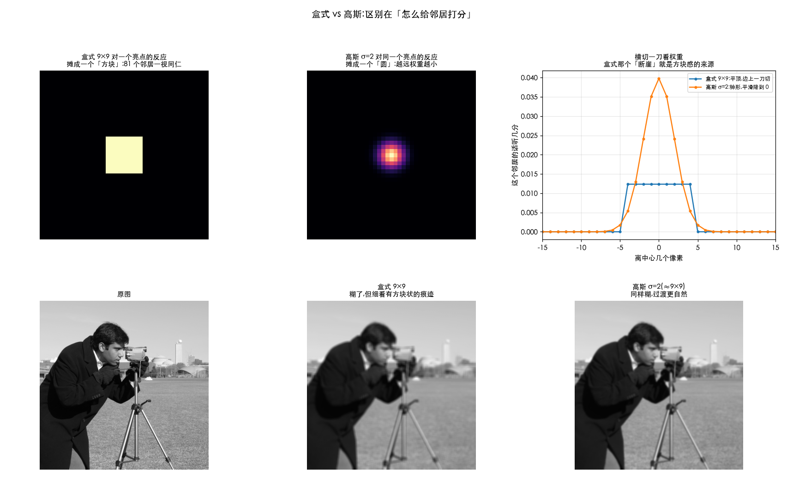
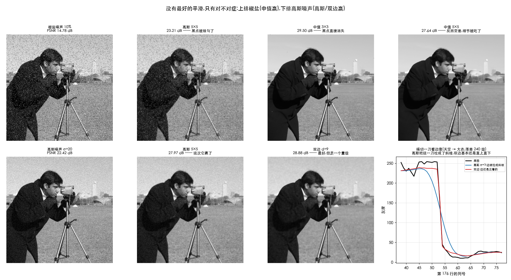

# 平滑(模糊)—— 让每个像素跟邻居商量

> 对应冈萨雷斯第四版 3.5 节。前一篇 [01-spatial-filtering-basics.md](01-spatial-filtering-basics.md)
> 讲的是「机制」(核怎么滑、边界怎么补),这一篇讲**第一种真正干活的滤波器**。

> **动手验证**:[`Ch03_Spatial_Filtering/22_smoothing.py`](../../Python-Prototyping/Ch03_Spatial_Filtering/22_smoothing.py)
> 本篇每个数字都是它跑出来的。

---

> **怎么读这篇**(第一遍真的不用全看)
>
> | 有多少时间 | 看哪几节 |
> | :--- | :--- |
> | **只有 10 分钟** | `先讲人话`(四种做法一张表)+ `九、小结` |
> | **第一遍学** | 再加 `一、盒式` `二、高斯` `六、中值` `八、对症下药` —— 知道什么时候用哪个 |
> | **踩坑时回来查** | `三、勾股定理叠加` `四、盒式变高斯` `五、σ 和核大小` `七、双边滤波` |

---

## 先讲人话

模糊就一句话:

> **每个像素跟周围的邻居商量一下,取个折中。**

四种做法的区别,**只在于怎么商量**:

| 做法 | 怎么商量 |
| :--- | :--- |
| **盒式**(均值) | 一视同仁 —— 不管远近,每个邻居都一样听 |
| **高斯** | 按远近给分 —— 越远的邻居越不听 |
| **中值** | 不算平均了 —— 排个队,取站中间的那个 |
| **双边** | 只听「跟我像」的邻居 —— 跨过边界的那些不听 |

### 为什么要模糊

听起来「把图弄糊」是件坏事,但它是最常用的预处理之一:

1. **去噪** —— 噪声是随机的,一平均就互相抵消;真实内容是有规律的,留得下来
2. **扔掉不关心的细节** —— 找人脸的时候,毛孔是干扰;先糊一下,只剩大块结构
3. **缩小图之前的必修课** —— 不先糊就直接抽行抽列,会出现摩尔纹和锯齿(混叠)
4. **给别的算法打底** —— 边缘检测前先平滑,否则噪声全被当成边缘(第 3.6 节会用到)

---

## 一、盒式滤波 —— 一视同仁的平均

核就是一张**全是 1** 的表,最后除以格子数:

```
    1/9 ×  ┌───┬───┬───┐
           │ 1 │ 1 │ 1 │      每个邻居的话,都听同样多
           ├───┼───┼───┤
           │ 1 │ 1 │ 1 │      加起来是 9,所以除以 9
           ├───┼───┼───┤      (不除的话整张图会亮 9 倍)
           │ 1 │ 1 │ 1 │
           └───┴───┴───┘
```

OpenCV:`cv2.blur(img, (9, 9))`。

**它有个毛病,看一眼就懂**:拿一张全黑、正中间一个白点的图去过它,
这个点被摊成了一个**方方正正的方块**。

因为它对 81 个邻居一视同仁 —— 一个邻居「在不在窗口里」是**突然切换**的,
差一格就从「完全算数」变成「完全不算数」。这个断崖就是**方块感**和**振铃**的来源。

---

## 二、高斯滤波 —— 按远近给分

改一个字:不再一视同仁,**越远的邻居权重越小**,而且是平滑地降下去。

$$ w(x,y) = e^{-\frac{x^2+y^2}{2\sigma^2}} $$

看不懂没关系,它画出来就是一口**钟**:中间高、两边平滑地趴下去。
`σ`(sigma)控制这口钟**有多胖** —— σ 越大,听得越远,糊得越狠。

同样拿那个白点去试,高斯把它摊成了一个**圆**:



右上角那张剖面图是关键:**盒式是个平顶,边上一刀切;高斯是钟形,平滑降到 0。**
那个「断崖」有没有,就是两者画质差别的全部来源。

高斯还有两个盒式没有的好处:

- **旋转对称** —— 各个方向糊得一样多。盒式是方的,斜着和正着糊的程度不同
- **可分离** —— 能拆成横一遍 + 竖一遍(见[基础篇第六节](01-spatial-filtering-basics.md)),
  所以它虽然「讲究」,却不比盒式慢多少

---

## 三、⚠️ 模糊不能直接相加,要按勾股定理加

这条特别容易记错,而且工程上真的会用到。

**问题**:先做一次 σ=3 的高斯模糊,再做一次 σ=4 的,总共等于一次多大的?

**答案不是 3+4=7,是 √(3²+4²) = 5。**

实测(`camera.png`):

| 做法 | 与「先 3 再 4」的最大差 |
| :--- | ---: |
| 一次 σ=5(勾股) | **0.006** |
| 一次 σ=7(直接相加) | **37.1** ← 差得离谱 |

3、4、5 正好是勾股数,拿来记这条规则再方便不过。

**为什么是平方相加**:σ² 叫**方差**,衡量「抖动有多大」。
两次独立的随机抖动叠加起来,**方差才是可加的**,标准差 σ 不是。
(就像两个人各自随机走 3 米和 4 米,合起来的平均距离是 5 米,不是 7 米。)

**实用价值**:一张图已经被模糊过 σ=3 了,你想让它达到 σ=5 的效果 ——
再补一次 σ=4,不是 σ=2。

---

## 四、盒式做几次,会自己变成高斯

一个有点神奇但很实用的事实。

对同一张「一个亮点」的图,反复用 9×9 的盒式滤波:

| 做几次 | 等效 σ | 与同 σ 高斯的差(占峰值) |
| :---: | ---: | ---: |
| 1 | 2.58 | **93.4%** —— 还是个方块 |
| 2 | 3.65 | **8.3%** —— 已经很像了 |
| 3 | 4.47 | 13.7% |
| 4 | 5.16 | 7.4% |

第 1 次还方方正正,**第 2 次起就掉到 10% 上下,肉眼分不出**。

这是概率论里的**中心极限定理**:
一堆各自随便什么形状的东西反复叠加,最后都会趋近正态(高斯)分布。

**工程上真的有人用这一招**:盒式滤波可以借助积分图做到 O(1)/像素
—— 也就是**核多大都一样快**。连做三次得到「近似高斯」,比真高斯还快。
大核背景虚化、毛玻璃效果常这么做。

---

## 五、σ 和核大小,谁说了算

高斯这口钟理论上是**无限宽**的,但核只有那么大,两边一定要切掉一截。
切掉多少,取决于**核的边长是 σ 的几倍**(实测 σ=3):

| ksize | k / σ | 被切掉的比例 | 够不够 |
| :---: | :---: | ---: | :--- |
| 3 | 1.0 | **61.5%** | 太小了,这已经不是高斯 |
| 5 | 1.7 | 40.3% | 太小 |
| 9 | 3.0 | 13.2% | 太小 |
| 13 | 4.3 | 2.95% | 勉强 |
| **19** | **6.3** | **0.15%** | 够了 |
| 25 | 8.3 | 0.00% | 绰绰有余 |

**经验规则:核边长取 `6σ + 1`**(左右各留 3σ),切掉的不到 0.3%,肉眼绝对看不出。

OpenCV 允许你只给一个,让它推另一个:

```python
cv2.GaussianBlur(img, (0, 0), sigma)   # ksize 给 0 → 按 σ 自动算核多大(推荐)
cv2.GaussianBlur(img, (k, k), 0)       # σ 给 0   → 按 ksize 反推一个 σ
```

**最怕的是两个都自己写死还配不上**,比如 `σ=3` 配 `3×3` ——
名义上在做高斯,实际上 61.5% 都被切了,出来的根本不是高斯。

---

## 六、中值滤波 —— 不算平均,排队取中间

前面三种都是「加权平均」,中值不是。它把窗口里的像素**排个序,取站中间的那一个**。

一字之差,对付某种噪声却是碾压级的。

### 椒盐噪声:中值完胜

**椒盐噪声**长这样:随机一部分像素被打成**纯黑(椒)或纯白(盐)**。
特点是**极端** —— 不是「有点偏」,是直接跳到 0 或 255。传感器坏点、传输误码都这样。

10% 椒盐噪声下(原图 `camera.png`):

| 做法 | PSNR |
| :--- | ---: |
| 带噪图 | 14.78 dB |
| 盒式 5×5 | 23.54 dB |
| 高斯 5×5 | 23.21 dB |
| **中值 3×3** | **29.50 dB** |
| 中值 5×5 | 27.64 dB |

中值 3×3 比高斯高了 **6 个多 dB**,差距非常大。为什么?

> 一个纯黑点(0)混进 9 个邻居里:
>
> - **求平均**:它照样有 1/9 的发言权,把结果往下拽 → 黑点没消失,变成灰点**糊开了**
> - **取中位数**:排好队它站在最边上,中间那个根本不是它 → **直接出局,像没来过**

这就是「极端值」和「排序」天生的克制关系。

### 顺带一个反直觉:窗口不是越大越好

上表里**中值 5×5 反而比 3×3 差**(27.64 vs 29.50)。
因为 3×3 就已经把噪声清干净了,再放大窗口只是在**糊掉真正的细节**。

调参的时候别默认「效果不够就加大」,先想清楚它在去掉什么。

---

## 七、双边滤波 —— 只听「跟我像」的邻居

普通模糊的毛病:它不管三七二十一,**把边缘也一起糊了**。

双边滤波在高斯的基础上多问一句:**「你跟我像不像?」**

```
最终权重 = 距离权重(离我多远)  ×  值差权重(跟我差多少)
             ↑ 这就是普通高斯      ↑ 多出来的这一项
```

跟我差得太多的邻居(说明我俩中间有条边),权重直接压到很小 —— **不听他的**。
于是它能把平坦区糊平,同时把边缘立住。



右下角那张剖面图最说明问题:从天空(≈250)跨到大衣(≈15),落差 240 级。

- **黑线**(原图)是一刀直下
- **蓝线**(高斯 σ=3)被拉成了一道宽斜坡 —— 边糊了
- **红线**(双边)几乎贴着黑线走 —— 边还立着

代价是:**它不是线性滤波了**(权重每个像素都要重算),
所以拆不开、搬不进频域,而且慢。

---

## 八、对症下药 —— 没有最好的,只有对不对症

换一种噪声,排名就反过来。**高斯噪声**(每个像素轻轻推一下,没有极端值):

| 做法 | 椒盐噪声 | 高斯噪声 |
| :--- | ---: | ---: |
| 带噪图 | 14.78 dB | 22.42 dB |
| 高斯 5×5 | 23.21 | **27.97** ✅ |
| 中值 | **29.50** ✅ | 26.86 |
| 双边 | — | **28.88** ✅✅ |

**为什么会反过来**:高斯噪声里没有极端值可以「踢出局」,
噪声是「大家都偏一点」—— 这种情况**求平均最划算**
(N 个独立的抖动一平均,幅度降到 1/√N)。
排序反而白白丢掉了信息。

### 代价(512×512,单位 ms)

| 做法 | 耗时 | 相对盒式 | 为什么 |
| :--- | ---: | ---: | :--- |
| 盒式 `blur` 5×5 | 0.040 | 1× | 最快,还能用积分图做到与核大小无关 |
| 高斯 `GaussianBlur` 5×5 | 0.066 | 1.6× | 可分离,横竖各一遍 |
| 中值 `medianBlur` 5×5 | 0.128 | 3.2× | 要排序,而且不可分离 |
| 双边 `bilateralFilter` d=9 | 0.887 | **22×** | 权重每个像素都要重算 |

实时视频里双边通常用不起,会换成**引导滤波(guided filter)** 这类近似方案。

---

## 九、小结

| 问题 | 答案 |
| :--- | :--- |
| 模糊到底在干嘛 | 每个像素跟邻居商量,取个折中 |
| 盒式和高斯差在哪 | 一视同仁 vs 按远近给分。盒式把一个点摊成方块,高斯摊成圆 |
| 高斯为什么是默认选择 | 没有断崖、旋转对称、可分离所以不慢 |
| **两次模糊怎么叠加** | **勾股定理**:σ=3 再 σ=4,等于一次 σ=5,不是 7 |
| 盒式能冒充高斯吗 | 能。连做 2~3 次就很像了(中心极限定理),而且可以更快 |
| 核多大合适 | `6σ + 1`。σ=3 配 3×3 的话,61.5% 的高斯被切掉了 |
| 椒盐噪声用什么 | **中值**。极端值被排序直接踢出局,比高斯高 6 dB |
| 高斯噪声用什么 | **高斯或双边**。没有极端值可踢,求平均更划算 |
| 窗口越大越好吗 | 不是。中值 5×5 反而比 3×3 差 —— 噪声去完了,剩下在糊细节 |
| 既要平滑又要保边 | **双边**,但贵 22 倍;实时场景换引导滤波 |

---

## 相关文档

- [03-sharpening.md](03-sharpening.md) —— 锐化篇(3.6):平滑的反面,而且锐化前一般要先降噪
- [01-spatial-filtering-basics.md](01-spatial-filtering-basics.md) —— 核怎么滑、边界怎么补、可分离(本篇的地基)
- [03-lut.md](../01-fundamentals/03-lut.md) —— 为什么这些操作塌缩不成一张表
- [03-luma-and-linear-light.md](../02-intensity/03-luma-and-linear-light.md) —— 要物理正确的模糊,该在线性光下做
