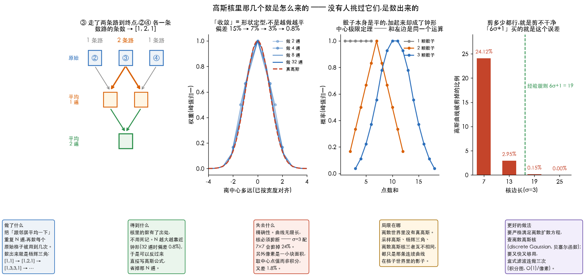

# 平滑(模糊)

> 对应冈萨雷斯第四版 3.5 节。前一篇 [01-spatial-filtering-basics.md](01-spatial-filtering-basics.md)
> 讲的是「机制」(核怎么滑、边界怎么补),这一篇讲**第一种真正干活的滤波器**。

> **动手验证**:[`Ch03_Spatial_Filtering/22_smoothing.py`](../../Python-Prototyping/Ch03_Spatial_Filtering/22_smoothing.py)
> 本篇每个数字都是它跑出来的;第二、五节那几组(核怎么推、截断误差、8 位量化)
> 在 [`26_gaussian_kernel_origin.py`](../../Python-Prototyping/Ch03_Spatial_Filtering/26_gaussian_kernel_origin.py)。

---

> **怎么读这篇**(第一遍真的不用全看)
>
> | 有多少时间 | 看哪几节 |
> | :--- | :--- |
> | **只有 10 分钟** | `先讲人话`(四种做法一张表)+ `九、小结` |
> | **第一遍学** | 再加 `一、盒式滤波` `二、高斯滤波` `六、中值滤波` `八、对症下药` —— 知道什么时候用哪个 |
> | **被公式劝退时** | `二、高斯滤波` 里的 `那三个数是怎么算出来的` —— 不用公式,数出来的 |
> | **踩坑时回来查** | `五、σ 和核大小` 里的 `说到底,这是「假」的高斯`(超纲,第一遍别看)、`三、模糊按勾股定理叠加` `四、盒式做几次变高斯` `五、σ 和核大小,谁说了算` `七、双边滤波` |

---

## 先讲人话

模糊就一句话:

> **每个像素跟周围的邻居商量一下,取个折中。**

四种做法的区别,**只在于怎么商量**:

| 做法 | 怎么商量 |
| :--- | :--- |
| **盒式**(均值) | 一视同仁 —— 不管远近,每个邻居都一样听 |
| **高斯** | 按远近给分 —— 越远的邻居越不听 |
| **中值** | 不算平均了 —— 排个队,取站中间的那个 |
| **双边** | 只听「跟我像」的邻居 —— 跨过边界的那些不听 |

### 为什么要模糊

听起来「把图弄糊」是件坏事,但它是最常用的预处理之一:

1. **去噪** —— 噪声是随机的,一平均就互相抵消;真实内容是有规律的,留得下来
2. **扔掉不关心的细节** —— 找人脸的时候,毛孔是干扰;先糊一下,只剩大块结构
3. **缩小图之前的必修课** —— 不先糊就直接抽行抽列,会出现摩尔纹(moiré)和锯齿(混叠(aliasing))
4. **给别的算法打底** —— 边缘检测(edge detection)前先平滑(smoothing),否则噪声全被当成边缘(第 3.6 节会用到)

---

## 一、盒式滤波

核就是一张**全是 1** 的表,最后除以格子数:

```
    1/9 ×  ┌───┬───┬───┐
           │ 1 │ 1 │ 1 │      每个邻居的话,都听同样多
           ├───┼───┼───┤
           │ 1 │ 1 │ 1 │      加起来是 9,所以除以 9
           ├───┼───┼───┤      (不除的话整张图会亮 9 倍)
           │ 1 │ 1 │ 1 │
           └───┴───┴───┘
```

OpenCV:`cv2.blur(img, (9, 9))`。

**它有个毛病,看一眼就懂**:拿一张全黑、正中间一个白点的图去过它,
这个点被摊成了一个**方方正正的方块**。

因为它对 81 个邻居一视同仁 —— 一个邻居「在不在窗口里」是**突然切换**的,
差一格就从「完全算数」变成「完全不算数」。这个断崖就是**方块感**和**振铃**的来源。

---

## 二、高斯滤波

改一个字:不再一视同仁,**越远的邻居权重越小**,而且是平滑地降下去。

$$ w(x,y) = e^{-\frac{x^2+y^2}{2\sigma^2}} $$

看不懂没关系,它画出来就是一口**钟**:中间高、两边平滑地趴下去。
`σ`(sigma)控制这口钟**有多胖** —— σ 越大,听得越远,糊得越狠。

同样拿那个白点去试,高斯把它摊成了一个**圆**:


右上角那张剖面图是关键:**盒式是个平顶,边上一刀切;高斯是钟形,平滑降到 0。**
那个「断崖」有没有,就是两者画质差别的全部来源。

高斯还有两个盒式没有的好处:

- **旋转对称** —— 各个方向糊得一样多。盒式是方的,斜着和正着糊的程度不同
- **可分离(separable)** —— 能拆成横一遍 + 竖一遍(见[基础篇第六节](01-spatial-filtering-basics.md)),
  所以它虽然「讲究」,却不比盒式慢多少

### 那三个数是怎么算出来的

上面那个公式是「答案」,不是「过程」。先不看公式 —— **`[1, 2, 1]` 其实是数出来的,
而且数法笨得可以。**



先拿一行像素手算。做的事只有一件:**每格 = (自己 + 左邻) / 2**,做两遍。

```
位置:      ①    ②    ③    ④    ⑤
原始:      0    0   100    0    0        ← 中间一个亮点

做一遍:    -    0    50   50    0        ③=(0+100)/2   ④=(100+0)/2
做两遍:    -    -    25   50   25        ③=(0+50)/2    ④=(50+50)/2   ⑤=(50+0)/2
```

亮点被摊平、摊宽了 —— 这就是「模糊」。**关键在下一步:盯住两遍后的 ④,
问它到底用到了原始的哪几格。**

```
④(两遍后)  ←  ③(一遍后)  和  ④(一遍后)
                 ↑                ↑
            ②(原) ③(原)      ③(原) ④(原)

展开:  ④(两遍后) = (②+③)/2/2 + (③+④)/2/2
                  =  ②/4 + ③/4 + ③/4 + ④/4
                          └─── ③ 出现了两次 ───┘
                  = ( 1×② + 2×③ + 1×④ ) / 4
```

**`[1, 2, 1]` 就这么冒出来了。** 中间那个 `2` 不是谁规定的,
**是因为 ③ 走了两条路到达终点**(配图最左那张画的就是这件事):
一条经过一遍后的 ③,一条经过一遍后的 ④。而 ② 和 ④ 各只有一条路。

**数一数路的条数,就是表里的数。** 继续做下去:

```
做 1 遍:        1  1
做 2 遍:      1  2  1
做 3 遍:    1  3  3  1
做 4 遍:  1  4  6  4  1
```

这就是**杨辉三角(Pascal's triangle)**,小学见过的那个「每个数等于上面两个数相加」。
它出现在这儿不是巧合 —— **「上面两个数相加」正是「路有几条」的算法。**

> 把两遍合成一遍,这个运算的正式名字就是**卷积(convolution)**:
> `[0.5, 0.5] ✻ [0.5, 0.5] = [0.25, 0.5, 0.25]`。
> 上面那段手工展开,就是卷积的定义摊开写。

### 为什么和必须是 1

不是规定,是**「平均」这个词自带的**。平均的意思是把东西重新分配,**总量不变**:

```
(自己 + 左邻) ÷ 2  =  0.5×自己 + 0.5×左邻      系数和 = 1
```

做两遍之后系数变成 `[0.25, 0.5, 0.25]`,和**还是 1**。

不是 1 会怎样?拿一片纯灰(每个像素都是 100)去试:

| 核 | 和 | 输出 |
| :--- | ---: | ---: |
| `[0.25, 0.5, 0.25]` | 1 | **100** —— 没变 |
| `[0.5, 1, 0.5]` | 2 | 200 —— 亮一倍 |
| `[1, 2, 1]` | 4 | 400 —— 亮四倍 |

规律:**一片纯色 `v` 过一遍,出来是 `v × 核的和`。**
所以和必须是 1 —— 不是为了满足某条规矩,**是因为模糊不该改变亮度**。

> **`[1,2,1]` 和 `[0.25, 0.5, 0.25]` 是同一个东西**,实测最大差异 `0.0`。
> 前者只是把 `÷4` 从表里提出来挪到最后一步。写成整数有三个好处:
> 整数乘法快、`÷4` 可以写成右移两位、`1:2:1` 这个比例一眼能看出来。
> 代码里两种写法都常见,你用哪种都对。

### 换别的数行不行

**行。** 在加了噪点的 `camera.png` 上实测:

| 表 | 噪点剩多少 | 图被改动多少 |
| :--- | ---: | ---: |
| (不处理) | 14.69 | 0 |
| `[0, 1, 0]` | 14.69 | 0 |
| `[1, 1, 1]`(盒式) | **4.95** | 16.28 |
| `[1, 2, 1]`(高斯) | 5.55 | 13.61 |
| `[1, 4, 1]` | 7.37 | 10.09 |
| `[1, 10, 1]` | 10.42 | **5.58** |

看头尾两行就懂了:`[0,1,0]` 只听自己 → **什么也没发生**;
`[1,10,1]` 自己嗓门是邻居的 10 倍 → 图几乎没动,噪点也几乎没降。

**这是一笔交易:想去噪点,就得付出「变糊」。** 表里的数决定你站在这笔交易的哪一端。
`[1,2,1]` 站在中间偏保守的位置 —— 它不是「最好」的一组数,
**它的好处是有出处**:你能用一句人话说出它为什么长这样。

### 「收敛到高斯」是什么意思

「收敛」不是「越做越平」(那是废话),而是**形状定型了**:

| 做几遍 | 表有多长 | 与真高斯的最大偏差 |
| ---: | ---: | ---: |
| 2 | 3 格 | 15.2% |
| 4 | 5 格 | 7.4% |
| 8 | 9 格 | 3.3% |
| 16 | 17 格 | 1.6% |
| **32** | 33 格 | **0.78%** |

每多做一倍,偏差砍一半。做到 32 遍时画出来**肉眼完全分不出**
(配图左二把这几条曲线叠在一起了 —— 宽度不同,轮廓是同一个)。

> **想亲手拨一拨?** [`Interactive/高斯收敛实验.html`](../../Interactive/高斯收敛实验.html)
> —— 浏览器直接打开,点一下做一遍,看白点怎么自己长成钟形。
> 上面这张表就是它算出来的,还能看到峰值从 255 一路掉到 5。

**那个轮廓就叫高斯。** 所以人们干脆跳过「做 N 遍」,
直接写下钟形公式 —— 反正结果一样,还省掉 N 遍运算。
**这就是本节开头那个公式的来历。**

### 骰子:同一件事换身衣服

**中心极限定理(central limit theorem)**:
很多个小随机加起来,总和一定是钟形的,**不管每个小随机原本长什么样**。

掷骰子最直观(配图左三是实算的概率):

```
1 颗骰子:  1~6 每个都是 16.7%           ← 平的
2 颗之和:  7 最多(16.7%),2 和 12 最少(2.8%)   ← 三角
3 颗之和:  已经是钟形了
```

**骰子本身是平的,加起来却成了钟形。**

为什么要在平滑这一篇讲骰子?因为**它俩是同一个运算**:

| 掷骰子 | 平滑图像 |
| :--- | :--- |
| 1 颗骰子的分布 `[1,1,1,1,1,1]/6` | 一遍平均的核 `[0.5, 0.5]` |
| 掷 N 颗,看点数和 | 做 N 遍平均 |
| 和的分布 → 钟形 | 合成的核 → 高斯 |

算骰子概率和算 `[1,2,1]`,代码里用的是**同一个函数** `np.convolve`。
所以「反复平滑会变成高斯」不是图像处理的特殊现象 ——
**它是概率论里最出名的那条定理,换了身衣服。**(第四节还会再用到它一次。)

---

## 三、模糊按勾股定理叠加

这条特别容易记错,而且工程上真的会用到。

**问题**:先做一次 σ=3 的高斯模糊,再做一次 σ=4 的,总共等于一次多大的?

**答案不是 3+4=7,是 √(3²+4²) = 5。**

实测(`camera.png`):

| 做法 | 与「先 3 再 4」的最大差 |
| :--- | ---: |
| 一次 σ=5(勾股) | **0.006** |
| 一次 σ=7(直接相加) | **37.1** ← 差得离谱 |

3、4、5 正好是勾股数,拿来记这条规则再方便不过。

**为什么是平方相加**:σ² 叫**方差**,衡量「抖动有多大」。
两次独立的随机抖动叠加起来,**方差才是可加的**,标准差(standard deviation) σ 不是。
(就像两个人各自随机走 3 米和 4 米,合起来的平均距离是 5 米,不是 7 米。)

**实用价值**:一张图已经被模糊过 σ=3 了,你想让它达到 σ=5 的效果 ——
再补一次 σ=4,不是 σ=2。

---

## 四、盒式做几次变高斯

一个有点神奇但很实用的事实。

对同一张「一个亮点」的图,反复用 9×9 的盒式滤波(box filter):

| 做几次 | 等效 σ | 与同 σ 高斯的差(占峰值) |
| :---: | ---: | ---: |
| 1 | 2.58 | **93.4%** —— 还是个方块 |
| 2 | 3.65 | **8.3%** —— 已经很像了 |
| 3 | 4.47 | 13.7% |
| 4 | 5.16 | 7.4% |

第 1 次还方方正正,**第 2 次起就掉到 10% 上下,肉眼分不出**。

还是**中心极限定理**(第二节「骰子」那一小节讲过):
一堆各自随便什么形状的东西反复叠加,最后都会趋近正态(高斯)分布。
盒式核是「平的」,正如一颗骰子是平的 —— 叠够次数照样变钟形。

**工程上真的有人用这一招**:盒式滤波可以借助积分图做到 O(1)/像素
—— 也就是**核多大都一样快**。连做三次得到「近似高斯」,比真高斯还快。
大核背景虚化、毛玻璃效果常这么做。

---

## 五、σ 和核大小,谁说了算

高斯这口钟理论上是**无限宽**的,但核只有那么大,两边一定要切掉一截。
切掉多少,取决于**核的边长是 σ 的几倍**(实测 σ=3):

| ksize | k / σ | 被切掉的比例 | 够不够 |
| :---: | :---: | ---: | :--- |
| 3 | 1.0 | **61.5%** | 太小了,这已经不是高斯 |
| 5 | 1.7 | 40.3% | 太小 |
| 9 | 3.0 | 13.2% | 太小 |
| 13 | 4.3 | 2.95% | 勉强 |
| **19** | **6.3** | **0.15%** | 够了 |
| 25 | 8.3 | 0.00% | 绰绰有余 |

**经验规则:核边长取 `6σ + 1`**(左右各留 3σ),切掉的不到 0.3%,肉眼绝对看不出。

OpenCV 允许你只给一个,让它推另一个:

```python
cv2.GaussianBlur(img, (0, 0), sigma)   # ksize 给 0 → 按 σ 自动算核多大(推荐)
cv2.GaussianBlur(img, (k, k), 0)       # σ 给 0   → 按 ksize 反推一个 σ
```

**最怕的是两个都自己写死还配不上**,比如 `σ=3` 配 `3×3` ——
名义上在做高斯,实际上 61.5% 都被切了,出来的根本不是高斯。

### 说到底,这是「假」的高斯

> **第一遍可跳过。** 这一小节回答的是「我们用的到底是不是真高斯」——
> 属于**采样与量化**那条线(第 2 章)和**频率域**(第 4 章)的地盘,
> 不影响你用好 `GaussianBlur`。
> 第一遍只要记住一句:**`σ` 和核边长必须配得上,`6σ+1`。** 其余的将来再说。

上一句话得说全:**不光 `3×3` 不是高斯 —— 你用的任何一个核都不是。**
不是偷懒,是**数学上做不到**。三条理由各自独立,每条都单独判了死刑。

**一、曲线无限长,必须剪断。** `e^(−x²/2σ²)` 永远不等于 0,
离中心 100 个像素处它还有值。而你的核只有几格,剩下的全剪了 ——
就是上面那张表。**你能把剪掉的压到任意小,但压不到零。**
所以 `6σ+1` 这条规则不是「这样就对了」,**是「这样剪掉的部分小到没人看得出来」**。
它是一笔买卖,不是一条定律。

**二、像素是一小块面积,不是一个点。** 我们取核的值是拿 `x = −1, 0, 1`
代进公式,但严格说应该对整格求**积分**。实测 σ=1.5 时,
中心那格「取点值 `0.265962`」对「求积分 `0.261117`」—— **差 1.8%**。
所有教科书和所有库用的都是前者,因为积分要算误差函数,慢,而且没人看得出来。

**三、结果要塞回 8 位整数。** 同一次 σ=2 的模糊,float64 版和 uint8 版
最大差 **1.08 灰阶**,均方根差 0.30。每个像素都被四舍五入了一下。

> **顺带一个你可能想不到的**:`cv2.getGaussianKernel(3, -1)` 返回
> `[0.25, 0.5, 0.25]`,`ksize=5` 返回 `[1,4,6,4,1]/16` —— **和杨辉三角一模一样
> (差异 0.00e+00)**,OpenCV 连高斯公式都没算。`ksize=7` 是另一张写死的表,
> `ksize=9` 起才真去算公式。

**那要不要紧?** 判断方法:**找一条只有真高斯才成立的性质,拿去考近似版。**
第三节那条勾股定理就是 —— 别的核都没这本事:

```
σ=3 接 σ=4   vs   直接 σ=5      均方根差 0.0007 灰阶(总共 0~255 级)
```

**小数点后三位才开始不一样。** 所以理论照样能拿来用,
不必担心「反正是假的所以算不准」。

**再往深一层**(这段纯属知道有这回事就行,工程上用不到):
离散世界里「正确」的高斯其实另有其人。
真高斯之所以特殊,是因为它满足**扩散方程**(热量在铁棒里怎么散开就是那个形状)。
要求离散版也严格满足离散扩散方程,解出来是用贝塞尔函数写的
**离散高斯核(discrete Gaussian kernel)** —— 它和采样高斯**不一样**,而且几乎没人用。

| | 是「真高斯」吗 |
| :--- | :--- |
| 连续的 `e^(−x²/2σ²)` | 真的 —— 但它不住在像素世界里 |
| 采样 + 截断(所有库都用这个) | 假的 |
| 杨辉三角 / 做 N 遍平均 | 也是假的,而且是**另一种**假法 |
| 离散高斯核(贝塞尔) | 离散世界里最「对」—— 但几乎没人用 |

**没有一个选项是真的。** 高斯是一条连续曲线,图像是格子,**它俩不在同一个世界里**。

所以「假」这个词用在这儿不太合适:不是「本来有个真的,我们凑合用个假的」,
而是**理想的那个东西在像素世界里没有对应物,我们拿的是它能有的最好的影子** ——
而且影子清晰到理论还能继续用。

> 这在工程里到处都是:数字音频没有真正的正弦波,JPEG 没有真正的余弦基,
> 浮点数没有真正的 `0.1`。见 [02-rounding-and-float.md](../01-fundamentals/02-rounding-and-float.md)。

---

## 六、中值滤波

前面三种都是「加权平均」,中值不是。它把窗口里的像素**排个序,取站中间的那一个**。

```text
算法:中值滤波
输入:图 img、窗口边长 k(奇数)
输出:滤波后的图

对每个像素 (y, x):
    win ← 以 (y,x) 为中心、边长 k 的窗口里所有像素
    排序 win
    输出[y,x] ← win 正中间那个值        // 不是平均,是第 k²/2 名
```

和前三种比,变的只有最后一行:**「加权求和」换成了「排序取中」**。
就这一字之差,对付某种噪声却是碾压级的 —— 而代价也藏在这一行里:
排序不是线性运算,所以中值滤波(median filter)**不是卷积**,可分离、频域加速那套全用不上。

### 椒盐噪声:中值完胜

**椒盐噪声**长这样:随机一部分像素被打成**纯黑(椒)或纯白(盐)**。
特点是**极端** —— 不是「有点偏」,是直接跳到 0 或 255。传感器坏点、传输误码都这样。

10% 椒盐噪声下(原图 `camera.png`):

| 做法 | PSNR |
| :--- | ---: |
| 带噪图 | 14.78 dB |
| 盒式 5×5 | 23.54 dB |
| 高斯 5×5 | 23.21 dB |
| **中值 3×3** | **29.50 dB** |
| 中值 5×5 | 27.64 dB |

中值 3×3 比高斯高了 **6 个多 dB**,差距非常大。为什么?

> 一个纯黑点(0)混进 9 个邻居里:
>
> - **求平均**:它照样有 1/9 的发言权,把结果往下拽 → 黑点没消失,变成灰点**糊开了**
> - **取中位数**:排好队它站在最边上,中间那个根本不是它 → **直接出局,像没来过**

这就是「极端值」和「排序」天生的克制关系。

### 窗口不是越大越好

上表里**中值 5×5 反而比 3×3 差**(27.64 vs 29.50)。
因为 3×3 就已经把噪声清干净了,再放大窗口只是在**糊掉真正的细节**。

调参的时候别默认「效果不够就加大」,先想清楚它在去掉什么。

> **中值也有它不灵的地方**:噪声比例一高(超过窗口的一半)中位数本身就被污染了;
> 它还会啃掉细线和尖角(那些位置的「中间值」天然属于背景)。
> **想做得更好**:自适应中值滤波(窗口按需增大)、
> 或者 Non-Local Means / BM3D 这类「找相似块一起平均」的现代去噪。

---

## 七、双边滤波

普通模糊的毛病:它不管三七二十一,**把边缘也一起糊了**。

```text
算法:双边滤波
输入:图 img、窗口半径 r、空间尺度 σ_space、值域尺度 σ_color
输出:保边平滑后的图

对每个像素 (y, x):
    acc ← 0, wsum ← 0
    对窗口里的每个邻居 (i, j):
        w_空间 ← exp( −((i−y)² + (j−x)²) / (2σ_space²) )   // 离得远 → 权重小
        w_值域 ← exp( −(img[i,j] − img[y,x])² / (2σ_color²) ) // 长得不像 → 权重小
        w ← w_空间 × w_值域
        acc ← acc + w × img[i,j]
        wsum ← wsum + w
    输出[y,x] ← acc / wsum                                   // 权重不固定,必须现归一化
```

和高斯的差别只有 `w_值域` 那一行:**高斯只问「你离我多远」,双边多问一句「你跟我像不像」**。
也正因为权重取决于像素值本身,它对每个像素都不一样 ——
**双边滤波(bilateral filter)不是卷积**,不能预先算一张核,也没法用可分离或频域加速。


双边滤波在高斯的基础上多问一句:**「你跟我像不像?」**

```
最终权重 = 距离权重(离我多远)  ×  值差权重(跟我差多少)
             ↑ 这就是普通高斯      ↑ 多出来的这一项
```

跟我差得太多的邻居(说明我俩中间有条边),权重直接压到很小 —— **不听他的**。
于是它能把平坦区糊平,同时把边缘立住。


右下角那张剖面图最说明问题:从天空(≈250)跨到大衣(≈15),落差 240 级。

- **黑线**(原图)是一刀直下
- **蓝线**(高斯 σ=3)被拉成了一道宽斜坡 —— 边糊了
- **红线**(双边)几乎贴着黑线走 —— 边还立着

代价是:**它不是线性滤波了**(权重每个像素都要重算),
所以拆不开、搬不进频域,而且慢。

---

## 八、对症下药

换一种噪声,排名就反过来。**高斯噪声**(每个像素轻轻推一下,没有极端值):

| 做法 | 椒盐噪声 | 高斯噪声 |
| :--- | ---: | ---: |
| 带噪图 | 14.78 dB | 22.42 dB |
| 高斯 5×5 | 23.21 | **27.97** ✅ |
| 中值 | **29.50** ✅ | 26.86 |
| 双边 | — | **28.88** ✅✅ |

**为什么会反过来**:高斯噪声里没有极端值可以「踢出局」,
噪声是「大家都偏一点」—— 这种情况**求平均最划算**
(N 个独立的抖动一平均,幅度降到 1/√N)。
排序反而白白丢掉了信息。

> **四种都不够用的时候**:它们都假设「邻居值得参考」,可噪声一大、细节一细,
> 这个假设就崩了。**想做得更好**:查 **Non-Local Means**(不看邻居,
> 在全图找长得像的块一起平均)和 **BM3D**(目前传统去噪的天花板);
> 视频还能用**时域降噪** —— 相邻帧同一位置的像素是天然的「多次测量」,
> 平均一下比任何空间方法都干净。

### 代价(512×512,单位 ms)

| 做法 | 耗时 | 相对盒式 | 为什么 |
| :--- | ---: | ---: | :--- |
| 盒式 `blur` 5×5 | 0.040 | 1× | 最快,还能用积分图做到与核大小无关 |
| 高斯 `GaussianBlur` 5×5 | 0.066 | 1.6× | 可分离,横竖各一遍 |
| 中值 `medianBlur` 5×5 | 0.128 | 3.2× | 要排序,而且不可分离 |
| 双边 `bilateralFilter` d=9 | 0.887 | **22×** | 权重每个像素都要重算 |

实时视频里双边通常用不起,会换成**引导滤波(guided filter)** 这类近似方案。

---

## 九、小结

| 问题 | 答案 |
| :--- | :--- |
| 模糊到底在干嘛 | 每个像素跟邻居商量,取个折中 |
| 盒式和高斯差在哪 | 一视同仁 vs 按远近给分。盒式把一个点摊成方块,高斯摊成圆 |
| 高斯为什么是默认选择 | 没有断崖、旋转对称、可分离所以不慢 |
| **两次模糊怎么叠加** | **勾股定理**:σ=3 再 σ=4,等于一次 σ=5,不是 7 |
| 盒式能冒充高斯吗 | 能。连做 2~3 次就很像了(中心极限定理),而且可以更快 |
| 核多大合适 | `6σ + 1`。σ=3 配 3×3 的话,61.5% 的高斯被切掉了 |
| 椒盐噪声用什么 | **中值**。极端值被排序直接踢出局,比高斯高 6 dB |
| 高斯噪声用什么 | **高斯或双边**。没有极端值可踢,求平均更划算 |
| 窗口越大越好吗 | 不是。中值 5×5 反而比 3×3 差 —— 噪声去完了,剩下在糊细节 |
| 既要平滑又要保边 | **双边**,但贵 22 倍;实时场景换引导滤波 |

---

## 相关文档

- [03-sharpening.md](03-sharpening.md) —— 锐化(sharpening)篇(3.6):平滑的反面,而且锐化前一般要先降噪
- [01-spatial-filtering-basics.md](01-spatial-filtering-basics.md) —— 核怎么滑、边界怎么补、可分离(本篇的地基)
- [03-lut.md](../01-fundamentals/03-lut.md) —— 为什么这些操作塌缩不成一张表
- [03-luma-and-linear-light.md](../02-intensity/03-luma-and-linear-light.md) —— 要物理正确的模糊,该在线性光(linear light)下做
