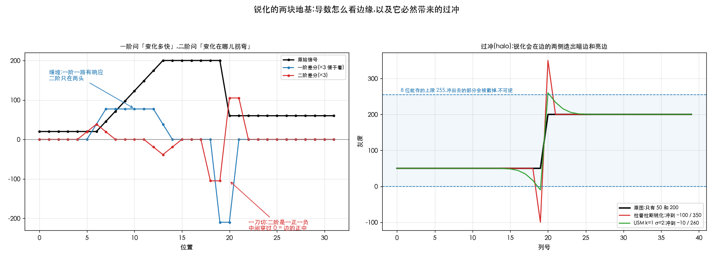
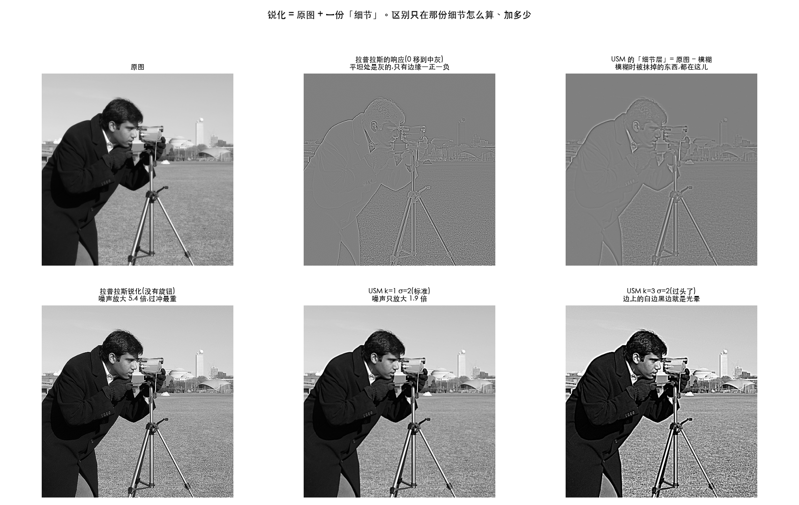
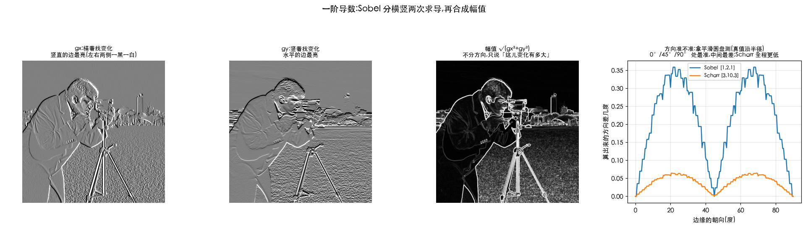

# 锐化 —— 跟邻居对着干

> 对应冈萨雷斯第四版 3.6 节。
> 前一篇 [02-smoothing.md](02-smoothing.md) 讲平滑(跟邻居商量取折中),这一篇讲它的反面。

> **动手验证**:[`Ch03_Spatial_Filtering/23_sharpening.py`](../../Python-Prototyping/Ch03_Spatial_Filtering/23_sharpening.py)
> 本篇每个数字都是它跑出来的。

---

> **怎么读这篇**(第一遍真的不用全看)
>
> | 有多少时间 | 看哪几节 |
> | :--- | :--- |
> | **只有 10 分钟** | `先讲人话` + `八、小结` |
> | **第一遍学** | 再加 `一、先看懂两个导数` `二、拉普拉斯` `三、USM` `六、代价二:噪声`(先降噪再锐化) —— 锐化的道理和最重要的那条实践规矩 |
> | **踩坑时回来查** | `四、USM ≈ 拉普拉斯` `五、过冲` `七、Sobel 梯度` —— 第七节等学到边缘检测时再看也行 |

---

## 先讲人话

平滑是「跟邻居商量,取个折中」。锐化正好相反:

> **我比邻居亮,那就让我更亮;我比邻居暗,就让我更暗。**

把差别放大,边缘就跳出来了,看着就「清楚」。

那怎么知道「我比邻居亮多少」?这就要用到**导数**(在图像里就是差分,相减)。

---

## 一、先看懂两个导数

拿一个一维信号试试:一段平地 → 一个缓坡爬到 200 → 一段平地 → 一刀切到 60。



```
原始  20  20  20 | 20  46  71  97 123 149 174 200 | 200 200 … | 60 60 …
一阶   0   0   0 |  0  26  26  26  26  26  26  13 |   0   0 … | −70 …
二阶   0   0   0 |  6  13   6   0   0   0  −6 −13 |  −6   0 … | −35 +35 …
```

怎么读这张表:

| 在哪儿 | 一阶 | 二阶 |
| :--- | :--- | :--- |
| **平地上** | 0 | 0 |
| **缓坡上** | 一路都是 26(坡多陡就是多少) | 只在坡的**起点和终点**有反应,坡中间是 0 |
| **一刀切** | 一个大尖峰 | **一正一负紧挨着**,中间穿过 0 |

于是两者分工不同:

- **一阶**回答「这儿变化**多快**」 → 拿来**找边缘、算梯度**(Sobel 干的就是这个)
- **二阶**回答「变化在哪儿**拐弯**」 → **定位更准**(那个过零点正好是边的正中),
  而且**对缓坡不敏感** —— 只标出真正的突变,不理会平缓的明暗渐变

锐化用的是**二阶**。道理很直白:平缓的明暗渐变(比如天空从上到下变淡)本来就该是平滑的,
不需要被「强调」;需要强调的是那些突变。

---

## 二、拉普拉斯 —— 把二阶导数做成一张核

```
  四邻域版                 八邻域版(连四个角也看)
 ┌───┬────┬───┐          ┌───┬────┬───┐
 │ 0 │  1 │ 0 │          │ 1 │  1 │ 1 │
 ├───┼────┼───┤          ├───┼────┼───┤
 │ 1 │ −4 │ 1 │          │ 1 │ −8 │ 1 │
 ├───┼────┼───┤          ├───┼────┼───┤
 │ 0 │  1 │ 0 │          │ 1 │  1 │ 1 │
 └───┴────┴───┘          └───┴────┴───┘
      和 = 0                   和 = 0
```

**为什么和必须是 0**:一片均匀的区域经过核,结果 = 值 × 核的和。
和为 0 → 平坦区输出 0,只有变化的地方才有响应。**它检测的就是「不平」。**

### 锐化核是怎么来的

```
    单位核(什么都不做)      拉普拉斯            锐化核
   ┌───┬───┬───┐       ┌───┬────┬───┐      ┌────┬────┬────┐
   │ 0 │ 0 │ 0 │       │ 0 │  1 │ 0 │      │  0 │ −1 │  0 │
   │ 0 │ 1 │ 0 │   −   │ 1 │ −4 │ 1 │  =   │ −1 │  5 │ −1 │
   │ 0 │ 0 │ 0 │       │ 0 │  1 │ 0 │      │  0 │ −1 │  0 │
   └───┴───┴───┘       └───┴────┴───┘      └────┴────┴────┘
       和 = 1               和 = 0               和 = 1 ← 亮度不变
```

这就是那个到处都能见到的 `[[0,-1,0],[-1,5,-1],[0,-1,0]]`。

> ⚠️ **符号是最容易搞错的地方。** 上面这个拉普拉斯的中心是 **−4**(负的),所以用**减号**。
> 如果你手上那个核中心是 **+4**,就得用加号。
>
> **自检方法**:合成出来的锐化核,中心必须是**正的大数**、周围是负数。反了就是在糊图。

「原图 − 拉普拉斯」和「直接用锐化核滤一遍」实测**最大差 0.00e+00** ——
完全等价。因为卷积是线性的,两个核可以先合成一个,省一遍扫描。

---

## 三、USM(反锐化掩模)—— 从摄影暗房传下来的

名字很怪:「**反**锐化」怎么会用来锐化?因为它靠的是一张**不锐**的图。

```
   第 1 步   把原图模糊一下              blur   = GaussianBlur(f, σ)
   第 2 步   原图减去模糊的 = 只剩细节     detail = f − blur
   第 3 步   把细节按倍数加回原图          out    = f + k × detail
```

**第 2 步是关键**:模糊图里装的是「大块的明暗」,原图减掉它,
剩下的正好是**模糊时被抹掉的那些东西** —— 边缘、纹理,还有噪点。
第 3 步再把这份细节加倍还回去,边缘就被强调了。

实测(`camera.png`,σ=2):

| | 范围 |
| :--- | :--- |
| 原图 | [0, 255] |
| 模糊图 | [3, 248] |
| **细节层** | **[−101, 141],均值 0.000** |

细节层单独看就是一张灰扑扑的浮雕图:平坦区是 0,边缘处一正一负。
下面这张图的右上角就是它:



### 三个参数,对得上 Photoshop 的 USM 对话框

| 参数 | 是什么 |
| :--- | :--- |
| **半径 radius**(σ) | 「多大范围算细节」。小 = 只强调最细的纹理;大 = 连大结构一起抬 |
| **数量 amount**(k) | 加多少倍。`k=1` 是标准 USM,`k>1` 叫 high-boost |
| **阈值 threshold** | 细节小于这个值就不加 —— 专门用来避开噪声。OpenCV 没有,要自己写 |

---

## 四、⚠️ USM 和拉普拉斯锐化,其实是同一件事

两者都是「原图 + 一份细节」,区别只在**那份细节怎么算出来的**。
把两份细节直接对比一下(相关系数越接近 1 越说明是同一个东西):

| USM 半径 σ | 与拉普拉斯那一份的相关系数 | 最佳倍率 |
| ---: | ---: | ---: |
| **0.6** | **0.9918** | 6.73 |
| 1.0 | 0.9457 | 3.77 |
| 2.0 | 0.7918 | 2.06 |
| 4.0 | 0.6343 | 1.20 |

半径很小时相关系数 **0.99** —— 几乎就是同一个东西。

数学上也说得通:**高斯模糊做差(DoG)是拉普拉斯的一个近似**,
半径越小越接近;半径大了就变成「强调大结构」,和二阶导数已经不是一回事了。

**那实际该用哪个?USM。** 原因在下面两节:它的半径和倍数给了你**旋钮**,
能在「锐化强度」和「噪声/过冲」之间折中;裸拉普拉斯没有旋钮,一上来就是最猛的那一档。

---

## 五、代价一:过冲(halo)

造一张左半 50、右半 200 的一刀切图,锐化之后看它的范围:

| 做法 | 锐化后范围 | 下冲 | 上冲 |
| :--- | ---: | ---: | ---: |
| 拉普拉斯锐化 | **[−100, 350]** | 150 | 150 |
| USM k=2 σ=2 | [−70, 320] | 120 | 120 |
| USM k=1 σ=2 | [−10, 260] | 60 | 60 |
| USM k=0.5 σ=2 | [20, 230] | 30 | 30 |

**原图明明只有 50 和 200 两个值,锐化后却冲到了 −100 和 350。**

为什么:锐化就是「让差别更大」。在边缘两侧,它把暗的一侧压得更暗、亮的一侧提得更亮 ——
于是边的两边各多出一条**暗边和亮边**,这就是**光晕(halo)**。
上面那张图的右半边画的就是这个:红线(拉普拉斯)直接冲出了 8 位能存的范围。

两个后果:

1. 存成 8 位时,−100 被截成 0、350 被截成 255 —— **信息真的丢了,不可逆**
2. 光晕本身就是「锐化过度」最典型的视觉特征,一眼能认出来的那股「数码味」

`k` 越小、`σ` 越小,过冲越轻。**这就是 USM 那两个旋钮的价值。**

---

## 六、代价二:噪声被一起放大

给图加 σ=3 的噪声,同一个算法分别作用在干净图和带噪图上,两者之差就是「被处理过的噪声」:

| 做法 | 处理后的噪声 σ | 放大倍数 |
| :--- | ---: | ---: |
| **拉普拉斯锐化** | 16.19 | **5.40×** |
| USM k=1 σ=3 | 5.96 | 1.99× |
| USM k=1 σ=1 | 5.57 | **1.86×** |
| USM k=0.5 σ=3 | 4.48 | 1.49× |

原因很直白:**噪声就是「和邻居不一样」**,而锐化干的正是「把和邻居的差别放大」。
**它分不出哪一份差别是真细节、哪一份是噪点。**

裸拉普拉斯放大 5.4 倍,USM(k=1)只有 1.86 倍 —— 差了近 3 倍。
这就是工程上一律用 USM、不用裸拉普拉斯的原因。

> **实用顺序:先降噪,再锐化。**
> 反过来做,等于先把噪声放大,再想办法擦掉。

---

## 七、一阶导数:Sobel 梯度

锐化用二阶,**找边缘用一阶**。Sobel 分两次做:
一次横着找变化(`gx`),一次竖着找(`gy`),再合成幅值。



$$ |\nabla f| = \sqrt{g_x^2 + g_y^2} \quad\text{或者}\quad |g_x| + |g_y| $$

### 省掉开方行不行

行。实测两者**相关系数 0.9921**,比值范围 `[1.000, 1.414]` ——
最多高估 41%,正好是 √2,发生在 **45° 斜边**上。

开方在老硬件上很贵,所以定点实现里几乎都用 `|gx| + |gy|`,代价是斜边偏亮一点。

### Sobel 的核为什么是 `[1,2,1]ᵀ × [−1,0,1]`

- `[−1,0,1]` 是**差分**,负责找变化
- `[1,2,1]` 是**平滑**,负责压噪声

**先平滑再求导** —— 不然噪声会被求导放大得没法看(见上一节,求导本来就放大噪声)。
这也是它天生可分离的原因(见[基础篇第六节](01-spatial-filtering-basics.md))。

### Prewitt / Sobel / Scharr:区别只在平滑那一列

三者的**差分那一列都是 `[−1,0,1]`,完全一样**。

拿一个边缘平滑的圆盘来测 —— 圆盘上梯度的真实方向一定沿着半径,**真值是已知的**:

| 算子 | 平滑那一列 | 平均角度误差 | 最大角度误差 |
| :--- | ---: | ---: | ---: |
| Prewitt | `[1, 1, 1]` | 0.549° | 1.587° |
| Sobel | `[1, 2, 1]` | 0.275° | 0.815° |
| **Scharr** | `[3, 10, 3]` | **0.068°** | **0.225°** |

一视同仁(Prewitt)最差,中间重一点(Sobel)误差减半,
`[3,10,3]`(Scharr)又降到 Sobel 的四分之一。
**`[3,10,3]` 不是拍脑袋来的,是专门解出来让方向误差最小的一组数。**

> **什么时候在意**:要算边缘朝向、做 HOG 特征、图像拼接对齐时,方向准不准直接影响结果。
> 只是想「看看边在哪儿」的话,Sobel 完全够用。
> 用法:`cv2.Scharr(...)` 或 `cv2.Sobel(..., ksize=cv2.FILTER_SCHARR)`。

---

## 八、小结

| 问题 | 答案 |
| :--- | :--- |
| 锐化在干嘛 | 跟邻居对着干 —— 把「我和邻居的差别」放大 |
| 一阶和二阶导数分工 | 一阶答「变化多快」(找边);二阶答「变化在哪儿拐弯」(定位、锐化) |
| 拉普拉斯的核为什么和为 0 | 平坦区输出 0,只对「不平」有反应 |
| 经典锐化核哪来的 | **单位核 − 拉普拉斯** = `[[0,-1,0],[-1,5,-1],[0,-1,0]]`,和为 1 |
| 符号怎么自检 | 合成出的锐化核,中心必须是正的大数、周围是负数 |
| USM 三步 | 模糊 → 原图减模糊 = 细节 → 把细节按 k 倍加回去 |
| USM 和拉普拉斯什么关系 | 半径小时**几乎是同一个东西**(相关 0.9918) |
| 那为什么用 USM | 它有旋钮(radius / amount),拉普拉斯没有 |
| 过冲是什么 | 边两侧冒出的暗边亮边。[50,200] 锐化后能冲到 [−100,350],超出部分被截掉 |
| 噪声怎么办 | 锐化必然放大噪声(拉普拉斯 5.4×,USM 1.86×)。**先降噪,再锐化** |
| 梯度能不能不开方 | 能,`|gx|+|gy|` 相关 0.9921,最多高估 41%(45° 斜边) |
| Sobel / Scharr 选哪个 | 只看位置用 Sobel;要方向精度用 Scharr(误差 0.068° vs 0.275°) |

---

## 相关文档

- [01-spatial-filtering-basics.md](01-spatial-filtering-basics.md) —— 核怎么滑、`ddepth` 与溢出、可分离
- [02-smoothing.md](02-smoothing.md) —— 平滑篇。锐化前先降噪,用的就是那一套
- [03-lut.md](../01-fundamentals/03-lut.md) —— 为什么这些操作塌缩不成一张表
