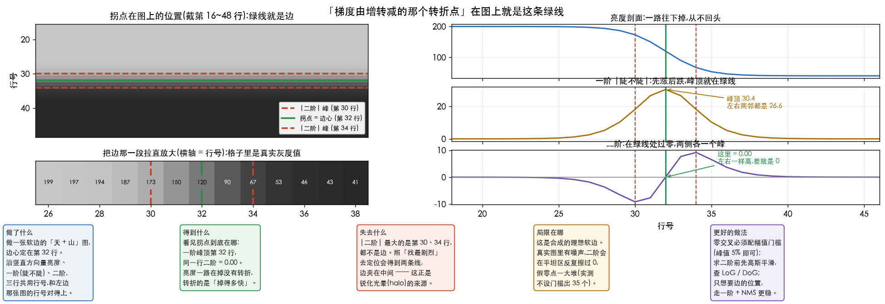
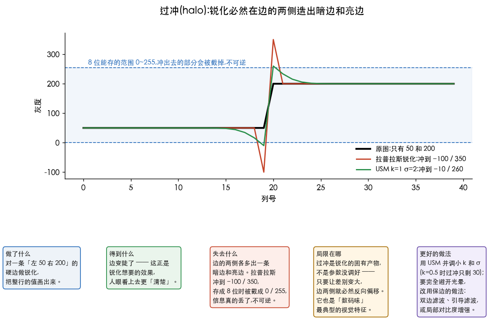
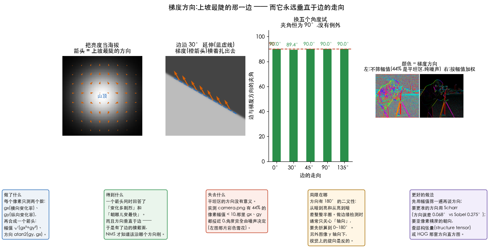

# 锐化

> 对应冈萨雷斯第四版 3.6 节。
> 前一篇 [02-smoothing.md](02-smoothing.md) 讲平滑(跟邻居商量取折中),这一篇讲它的反面。

> **动手验证**:[`Ch03_Spatial_Filtering/23_sharpening.py`](../../Python-Prototyping/Ch03_Spatial_Filtering/23_sharpening.py)
> 本篇每个数字都是它跑出来的。

---

> **怎么读这篇**(第一遍真的不用全看)
>
> | 有多少时间 | 看哪几节 |
> | :--- | :--- |
> | **只有 10 分钟** | `先讲人话` + `八、小结` |
> | **第一遍学** | 再加 `一、先看懂两个导数` `二、拉普拉斯` `三、USM(反锐化掩模)` `六、代价二:放大噪声`(先降噪再锐化) —— 锐化的道理和最重要的那条实践规矩 |
> | **对着图有疑问** | `一、先看懂两个导数` 里的 `一阶根本不看「自己那一格」` `核中间为什么是 0`;`二、拉普拉斯` 里的 `它响应最强的地方,恰恰不是边` `绿线看着没对齐?` `零点是在过渡带正中吗` |
| **想知道核哪来的** | `二、拉普拉斯` 里的 `这个核不是设计出来的` `为什么二阶能直接相加,一阶不行` `−8 那个版本其实有点糙` |
> | **踩坑时回来查** | `四、USM 和拉普拉斯是一回事` `五、代价一:过冲(halo)` `七、一阶导数:Sobel 梯度` —— 第七节等学到边缘检测时再看也行 |

---

## 先讲人话

平滑(smoothing)是「跟邻居商量,取个折中」。锐化(sharpening)正好相反:

> **我比邻居亮,那就让我更亮;我比邻居暗,就让我更暗。**

把差别放大,边缘就跳出来了,看着就「清楚」。

那怎么知道「我比邻居亮多少」?这就要用到**导数**(在图像里就是差分,相减)。

---

## 一、先看懂两个导数

### 先拿骑车当尺子

「导数」这两个字吓人,但它问的事很土。把这一维信号想成**一条路**:

| 图上的东西 | 骑车时对应什么 | 一句话 |
| :--- | :--- | :--- |
| **原始信号** | 你在**多高**(海拔) | 就是像素的亮度 |
| **一阶差分** | 这段路**陡不陡** | 蹬起来多费劲 |
| **二阶差分** | 陡度**在不在变** | 什么时候需要换挡 |

记住这三行,下面那张图就能看懂了。

拿一条路试试:一段平地 → 一个缓坡爬到 200 → 一段平地 → 一刀切到 60。


**图分三行,上下对齐看同一个位置**:最上面是路本身,中间是陡不陡,最下面是陡度在不在变。
三行各有各的 y 轴,**图上的数就是下面表里的数**,没有做任何缩放。

```
原始  20  20  20 | 20  46  71  97 123 149 174 200 | 200 200 … | 60 60 …
一阶   0   0   0 |  0  26  26  26  26  26  26  13 |   0   0 … | −70 …
二阶   0   0   0 |  6  13   6   0   0   0  −6 −13 |  −6   0 … | −35 +35 …
```

**骑过这四段路是什么感觉**:

| 走到哪儿 | 骑车的感觉 | 一阶(陡不陡) | 二阶(陡度在不在变) |
| :--- | :--- | ---: | ---: |
| 平地上 | 不费劲 | **0** | **0** |
| 刚上坡那一下 | 忽然要使劲了 | 0 → 26 | **+6、+13** ← 有反应 |
| 坡的中间 | 一直费劲,但劲道不变 | **26 一路不变** | **0** ← 没反应 |
| 到坡顶那一下 | 忽然轻松了 | 26 → 0 | **−6、−13** ← 反向反应 |
| 悬崖 | 一脚踏空 | **−70 大尖峰** | **−35 / +35** 一正一负 |

**关键就在「坡的中间」那一行:一阶有反应(26),二阶没反应(0)。**
一阶管「陡不陡」,坡上一直陡,所以它一直响;
二阶管「陡度变没变」,坡上陡度一直是 26 没变过,所以它不吭声。

怎么读这张表:

| 在哪儿 | 一阶 | 二阶 |
| :--- | :--- | :--- |
| **平地上** | 0 | 0 |
| **缓坡上** | 一路都是 26(坡多陡就是多少) | 只在坡的**起点和终点**有反应,坡中间是 0 |
| **一刀切** | 一个大尖峰 | **一正一负紧挨着**,中间穿过 0 |

于是两者分工不同:

- **一阶**回答「这儿变化**多快**」 → 拿来**找边缘、算梯度(gradient)**(Sobel 干的就是这个)
- **二阶**回答「变化在哪儿**拐弯**」 → **定位更准**(那个过零点正好是边的正中),
  而且**对缓坡不敏感** —— 只标出真正的突变,不理会平缓的明暗渐变

> **「定位更准」准在哪、代价是什么**,在
> [04-edge-detection.md](04-edge-detection.md) 第二节用一张「蓝天 + 黑山」量过:
> 二阶靠零交叉内插能做到 **0.00 像素**误差(亚像素),
> 代价是把噪声放大 **3.8 倍**。这儿先记结论就够。

锐化用的是**二阶**。道理很直白:平缓的明暗渐变(比如天空从上到下变淡)本来就该是平滑的,
不需要被「强调」;需要强调的是那些突变。

> **别被「导数」这个词吓到。**
> 知乎那篇《数字图像处理:边缘检测》(作者郑泽文)有一句话说得比多数教材都干脆:
>
> > 微积分在图像处理里的表现形式,就是算相邻像素的差值 ——
> > **实际应用不需要求导,只需要简单的加减运算。**
>
> 确实如此。上面那张表里所有的「一阶」「二阶」,算出来全是**减法**:
> 一阶是「右边减左边」,二阶是「一阶的右边再减一阶的左边」。
> 连乘法都没有,更谈不上什么微积分。
> 教材写成 ∂f/∂x 是为了和连续数学接轨,落到代码里就是 `a[i+1] - a[i-1]`。

### 一阶根本不看「自己那一格」

先看一组数,位置 3~9:

```
位置 :    3     4     5     6     7     8     9
值   :   20    20    20    20    46    71    97
                                 ↑
                          从这里才开始爬坡
```

**算位置 5 的一阶**:

```
位置 :    3     4     5     6     7
值   :   20    20    20    20    46
                ↑     ✗     ↑
                左   自己   右
                    (不参与)

(右 − 左) ÷ 2 = (20 − 20) ÷ 2 = 0
```

**算位置 6 的一阶** —— 同一个算法,窗口往右挪一格:

```
位置 :    3     4     5     6     7     8
值   :   20    20    20    20    46    71
                      ↑     ✗     ↑
                      左   自己   右
                          (不参与)

(右 − 左) ÷ 2 = (46 − 20) ÷ 2 = 13
```

**注意那个 `✗`:位置 6 自己的值是 20,而这个 20 在算式里一次都没出现。**

核是 `[−1, 0, 1]`,**中间是 0,意思就是「自己的值不参与」**。所以
「位置 6 是平的」这句话对一阶不成立 —— 一阶压根不看位置 6,
它只看 5 和 7,而**位置 7 是 46,不平**。

> **一阶不是在问「我这儿平不平」,是在问「我左右两边差多少」。**

### 核中间为什么是 0

**因为一个点没有坡度。** 你站在山上某处只看脚下的海拔,说不出这儿陡不陡 ——
必须看前一步和后一步。「位置 6 的坡度」测法是**左右各退一步**,
位置 6 自己是**支点**,不是测量点。

这不只是比方。设核是 `[a, c, b]`,`c` 就是自己那一格的权重,
**两条要求就能把 `c` 逼成 0**:

**要求一:整条路抬高 100,坡度不能变。** 实测:

| 核 | 和 | 抬高前后最大差 | |
| :--- | ---: | ---: | :--- |
| `[−1, 0, 1]/2` | 0 | **0.0** | 不变 |
| `[−1, 0.5, 1]` | 0.5 | 50.0 | ✗ 变了 |
| `[−1, 1, 1]` | 1 | 100.0 | ✗ 变了 |

和不是 0 的核,一抬高就变 —— 算出来的就不是坡度,是掺了海拔的东西。
(这正是[基础篇第四节](01-spatial-filtering-basics.md)「求导核的和必须是 0」那条。)
**→ `a + c + b = 0`**

**要求二:把路左右翻过来,坡度应原样翻转再变号**(上坡翻过来是下坡)。实测:

| 核 | 和 | 与 −(翻转版) 最大差 | |
| :--- | ---: | ---: | :--- |
| `[−1, 0, 1]/2` | 0 | **0.0** | 不偏 |
| `[−1, 1, 0]` | 0 | 25.7 | ✗ 偏了 |
| `[−1.5, 1, 0.5]` | 0 | 25.7 | ✗ 偏了 |

**后两个的和也是 0,第一条它们都通过了** —— 一翻转才露馅:
左右不对称,测量点就偏向了一边。
**→ `a = −b`**

**两条联立**:

```
① a + c + b = 0
② a = −b
      ↓
c = −(a + b) = −(−b + b) = 0
```

**中间那个 0 不是谁规定的,是被这两条逼出来的。** 你没法给它别的值:
给正数 → 和不再是 0 → 平地也会有输出;
保持和为 0 但左右不等 → 测量点偏半格。**只剩 0 这一个选择。**

### 「偏半格」偏在哪儿:拿 f(x)=x² 量一量

上面要求二说的「偏向一边」,是可以量出来的。
照抄导数定义 `( f(x+h) − f(x) ) / h` 会得到**右邻减自己**,核是 `[−1, 1]` ——
它的和也是 0,但左右不对称。拿真导数已知的 `f(x) = x²`(真导数 `2x`)试:

| x | 1 | 2 | 3 | 4 | 5 |
| :--- | ---: | ---: | ---: | ---: | ---: |
| 真导数 `2x` | 2 | 4 | 6 | 8 | 10 |
| **`[−1, 1]` 右减自己** | **3** | **5** | **7** | **9** | **11** |
| `2(x + 0.5)` | 3 | 5 | 7 | 9 | 11 |
| **`[−1, 0, 1]` 右减左** | **2** | **4** | **6** | **8** | **10** |

第二行和第三行**一模一样** —— `[−1, 1]` 算的是 `x + 0.5` 处的导数,不是 `x` 处的。
**核里没有中心格,结果就没处落脚。**

> 半个像素的偏移在找边缘时不致命(边还在那儿,只是整体挪了半格),
> 但做**图像配准、光流、亚像素定位**时会直接变成系统误差,
> 而且横竖两个方向各偏半格,合成的梯度方向也会跟着歪。

### 顺带一个后果:梯度图上的边总是「胖」的

回到位置 6:信号还没开始爬,一阶已经响了 13。
**任何 3 格宽的核,都会在真边界前后各多响一格**:

```
真实的边:       ┃          只有一格
梯度图上的边:  ▁█▁         变成三格宽
```

核越大胖得越厉害。**这个「胖」到了边缘检测那一步就成了必须解决的问题** ——
[04-edge-detection.md](04-edge-detection.md) 里的**非极大值抑制(NMS)**,
干的正是把胖边削回一格宽。

> **同一件事,两个身份。** 在这儿它解释了「一阶为什么定位不如二阶准」
> (二阶的零点正好落在边的正中);到第四节它是 NMS 存在的理由。

---

## 二、拉普拉斯

```
  四邻域版                 八邻域版(连四个角也看)
 ┌───┬────┬───┐          ┌───┬────┬───┐
 │ 0 │  1 │ 0 │          │ 1 │  1 │ 1 │
 ├───┼────┼───┤          ├───┼────┼───┤
 │ 1 │ −4 │ 1 │          │ 1 │ −8 │ 1 │
 ├───┼────┼───┤          ├───┼────┼───┤
 │ 0 │  1 │ 0 │          │ 1 │  1 │ 1 │
 └───┴────┴───┘          └───┴────┴───┘
      和 = 0                   和 = 0
```

**为什么和必须是 0**:一片均匀的区域经过核,结果 = 值 × 核的和。
和为 0 → 平坦区输出 0,只有变化的地方才有响应。**它检测的就是「不平」。**

### 这个核不是设计出来的

一句话:**拉普拉斯 = 横着的二阶导数 + 竖着的二阶导数。**

一维的二阶导数核你已经见过了,是 `[1, −2, 1]`。图像是二维的,
那就横着量一遍、竖着量一遍,加起来:

```
   横着放            竖着放             加起来
 ┌───┬────┬───┐   ┌───┬────┬───┐   ┌───┬────┬───┐
 │ 0 │  0 │ 0 │   │ 0 │  1 │ 0 │   │ 0 │  1 │ 0 │
 │ 1 │ −2 │ 1 │ + │ 0 │ −2 │ 0 │ = │ 1 │ −4 │ 1 │
 │ 0 │  0 │ 0 │   │ 0 │  1 │ 0 │   │ 0 │  1 │ 0 │
 └───┴────┴───┘   └───┴────┴───┘   └───┴────┴───┘
```

**中心的 −4 就是 −2 + −2**,四个 1 是上下左右四个邻居。
脚本里直接比对过:`lx + ly` 和 `LAP4` 完全相等。

> 名字来自 Laplace 算子 ∇² = ∂²/∂x² + ∂²/∂y²,
> 定义本身就是「各方向二阶导之和」。上面这张核只是它的离散版。

### 为什么二阶能直接相加,一阶不行

这是拉普拉斯最值钱的性质。Sobel 那边你得算 `√(gx² + gy²)`(见第七节),
为什么这里加一下就完了?拿两条角度不同的边量一量:

| 边的角度 | gx | gy | 直接相加 | √(gx²+gy²) |
| ---: | ---: | ---: | ---: | ---: |
| 45° | −323.04 | −323.04 | −646.07 | 456.84 |
| 135° | +323.04 | −323.04 | **−0.00** | 456.84 |

**一阶导数是带方向的箭头,两个箭头直接相加会互相抵消** ——
135° 那条边明明在那儿,`gx + gy` 却是 0。所以必须平方、开方,
把方向扔掉只留长度。

**二阶导数量的是「弯曲程度」,没有方向,只有正负。** 往哪边弯的信息在符号里,
不会因为角度不同而抵消,所以横的加竖的天然合法。

> **代价**:加完之后方向信息就没了。
> 拉普拉斯只告诉你「这里不平」,**不会告诉你边朝哪个方向**。
> Sobel 能给你角度(第七节),拉普拉斯给不了 —— 这是它俩分工的根本区别。

### −8 那个版本其实有点糙

八邻域版号称「连对角线也看」。按同样的拼法加上两条对角线的二阶导,确实得到 −8。
但对角线上两个像素的距离是 **√2 ≈ 1.4142,不是 1**,
而二阶导数里有个 `1/h²` —— h 变成 √2,权重就该打对折:

```
  严格按步长折算            图省事的版本
 ┌─────┬───┬─────┐        ┌───┬────┬───┐
 │ 0.5 │ 1 │ 0.5 │        │ 1 │  1 │ 1 │
 │  1  │−6 │  1  │        │ 1 │ −8 │ 1 │
 │ 0.5 │ 1 │ 0.5 │        │ 1 │  1 │ 1 │
 └─────┴───┴─────┘        └───┴────┴───┘
```

**`−8` 不是更准,是更猛** —— 它把对角线当成了跟上下左右一样近,
权重给多了,响应更强,噪声也放大得更狠。

把同一条边转 0°~90°,量 |响应| 峰值的波动(0% = 完全各向同性):

| 核 | 最大/最小 | 波动 |
| :--- | ---: | ---: |
| 四邻域 −4 | 1.0941 | 8.94% |
| 八邻域 −8 | 1.1047 | **9.75%** |
| 步长折算 −6 | 1.0845 | **7.92%** |

⚠️ **八邻域反而比四邻域更不均匀**,跟「加了对角线所以更各向同性」的流行说法相反,
原因就是那个没折算的步长。折算过的 −6 才是三个里最均匀的。

> **说清这个测试的边界**:用的是过渡宽约 1.5 像素的软边(`tanh(t/1.5)`),
> 量的是邻域内 |响应| 的峰值。**换成更宽的边,三者差距会明显缩小。**
> 这个排名只在这个条件下成立,别当普适结论用。

### 锐化核是怎么来的

```
    单位核(什么都不做)      拉普拉斯            锐化核
   ┌───┬───┬───┐       ┌───┬────┬───┐      ┌────┬────┬────┐
   │ 0 │ 0 │ 0 │       │ 0 │  1 │ 0 │      │  0 │ −1 │  0 │
   │ 0 │ 1 │ 0 │   −   │ 1 │ −4 │ 1 │  =   │ −1 │  5 │ −1 │
   │ 0 │ 0 │ 0 │       │ 0 │  1 │ 0 │      │  0 │ −1 │  0 │
   └───┴───┴───┘       └───┴────┴───┘      └────┴────┴────┘
       和 = 1               和 = 0               和 = 1 ← 亮度不变
```

这就是那个到处都能见到的 `[[0,-1,0],[-1,5,-1],[0,-1,0]]`。

> ⚠️ **符号是最容易搞错的地方。** 上面这个拉普拉斯的中心是 **−4**(负的),所以用**减号**。
> 如果你手上那个核中心是 **+4**,就得用加号。
>
> **自检方法**:合成出来的锐化核,中心必须是**正的大数**、周围是负数。反了就是在糊图。

「原图 − 拉普拉斯(Laplacian)」和「直接用锐化核滤一遍」实测**最大差 0.00e+00** ——
完全等价。因为卷积(convolution)是线性的,两个核可以先合成一个,省一遍扫描。

### 它响应最强的地方,恰恰不是边

很容易把拉普拉斯理解成「找变化最剧烈的地方」。**前半句对,后半句要翻个面。**



做一张软边的「天 + 山」图,边心定死在第 32 行,沿竖直方向量三样东西:

| 行 | 亮度 | 一阶(陡不陡) | 涨还是跌 | 二阶 |
| ---: | ---: | ---: | :--- | ---: |
| 30 | 173.12 | 18.148 | 涨 ↑ | −9.158 |
| 31 | 150.40 | 26.561 | 涨 ↑ | −7.669 |
| **32** | **120.00** | **30.396** | 涨 ↑ | **0.000** ← 拐点 |
| 33 | 89.60 | 26.561 | 跌 ↓ | +7.669 |
| 34 | 66.88 | 18.148 | 跌 ↓ | +9.158 |

**亮度从 193 一路掉到 46,从头到尾没有回过头** —— 高度上没有任何转折。
转折的是**掉的速度**:先越掉越快,到第 32 行掉得最凶,之后越掉越慢。

> **骑车下坡**:坡越来越陡,到某一刻最陡,之后开始变缓。
> 那个「最陡的一刻」就是**拐点(inflection point)**。
> 你的高度一直在降,但脚下的费力程度在那里翻了篇。

**为什么最陡的那一行二阶恰好是 0**:第 32 行左右两边的一阶**都是 26.561**,
一模一样。左邻和右邻一样高,那这一格既没在涨也没在跌,变化量 = 0。
不是巧合,是「峰顶两侧对称」的直接结果。

于是有了那条贯穿两篇的等式:

> **一阶的峰顶 = 二阶的零点。** 同一件事的两种说法。

**但 `|二阶|` 最大的是第 30 行和第 34 行,它俩都不是边。**
照「找最剧烈」去定位,你会得到**两条线**,真边夹在中间(30 和 34 的中点正好 32.0)。

这两条线就是**光晕(halo)的物理来源** —— 锐化时被推得最狠的就是它们,
一边更黑一边更白,离边心各 2 格。边越糊(σ 越大)两条线离得越远,光晕就越宽。
代价那一面见[第五节](#五代价一过冲halo)。

| 拉普拉斯的两种读法 | 读出来是什么 | 用在哪 |
| :--- | :--- | :--- |
| 看**强响应** | 边两侧各一条(第 30、34 行) | 锐化 —— 制造对比正好 |
| 看**零点** | 边的正中(第 32 行) | 定位 —— 零交叉检测 |

**一个算子,两种读法,读错了位置就偏半格。**

### 绿线看着没对齐?那条边有 11 行厚

对着上面那张图,很容易冒出一个疑问:**绿线画在第 32 行,可图上的明暗交界好像不在那儿。**

这不是错觉,但也不是绿线偏了。量一量那条边有多厚:

| 掉完多少幅度 | 从第几行到第几行 | 共几行 |
| :--- | :--- | ---: |
| 90% | 30 → 35 | 5 行 |
| 95% | 29 → 36 | 7 行 |
| **99%** | **27 → 38** | **11 行** |

**这条边有 11 行厚。** 你的眼睛在一条 11 行宽的渐变里找「分界线」,
本来就找不到 —— **不是绿线偏了,是压根没有一条线可以让它对齐。**

数值上它一点没错:`(200 + 40) / 2 = 120`,而第 32 行的灰度正好是 **120.0**。

> **一个被实测推翻的猜测**:我本来怀疑是人眼感知非线性(暗部被压缩)造成的偏移。
> 按 CIE L\* 算了一遍:天 L\*=80.6、山 L\*=16.1,感知中点 L\*=48.4 —— **也落在第 32 行,偏 0 行**。
> **不是感知的问题,就是过渡带太宽。** 记在这儿免得别人再往这条路上走。

### 反过来,硬边肉眼看得见,零点却落在缝里

同样的算法,把边换成一刀切(第 31 行还是 200,第 32 行直接 40):

| 行 | 亮度 | 一阶 | 二阶 |
| ---: | ---: | ---: | ---: |
| 30 | 200.0 | 0.00 | 0.00 |
| 31 | 200.0 | −80.00 | **−160.00** |
| 32 | 40.0 | −80.00 | **+160.00** |
| 33 | 40.0 | 0.00 | 0.00 |

这回肉眼一眼就能指出边在哪。**但二阶从 −160 直接跳到 +160,中间没有 0** ——
真边界在 **31.5**,落在两格的**缝里**,没有哪一格的二阶是 0。

于是有了这张互补表:

| | 肉眼能看出边吗 | 零点落在哪 |
| :--- | :--- | :--- |
| **软边**(有过渡) | ✗ 看不出,是一条 11 行宽的带 | ✓ 精确落在第 32 行 |
| **硬边**(一刀切) | ✓ 一眼就是那道缝 | ✗ 落在 31 和 32 的缝里,没有零点 |

> **你肉眼能对齐的那种边,算法反而得靠内插;
> 算法能精确落点的那种边,你肉眼反而看不出。**

真实图像里两种都有,所以零交叉检测必须带**线性内插** ——
[04-edge-detection.md](04-edge-detection.md) 里那组「蓝天 + 黑山」的真边界是 59.5,
就是靠 `59 + 129.49/(129.49+130.00)` 内插回 **59.4990**,误差 0.0010。

### 那零点是在过渡带的正中吗:只有对称边才是

看完上面那张图,很自然会总结成一句:**「零点在整个过渡区间的中间」**。

这句话**只在边对称时成立**。构造三条边,都从 200 掉到 40,只是两侧的快慢不同:

| 边的形状 | 过渡带 | 几何中点 | 二阶零点 | 一阶峰顶 | 零点 − 中点 |
| :--- | ---: | ---: | ---: | ---: | ---: |
| 对称(两侧一样快) | 43~54 行 | 48.50 | 48.000 | 48.000 | −0.500 |
| 亮侧缓、暗侧陡 | 25~53 行 | 39.00 | 48.563 | 48.667 | **+9.563** |
| 亮侧陡、暗侧缓 | 44~72 行 | 58.00 | 47.437 | 47.333 | **−10.563** |

后两行的零点**偏离几何中点近 10 格**,根本不在中间。

> 第一行那个 −0.500 不是真偏:`transition_band()` 返回的是整行号,
> 端点取整带来的,真边心就是 48.0。

**但三行里零点都紧贴一阶峰顶(差不到 0.15 格)。** 这条永远成立,
因为它是定义决定的:**零点的意思就是「一阶不再变化」,
而一阶不再变化的地方就是它的峰顶。**

所以准确的说法是:

> **拉普拉斯的零点落在「下降最快的那一点」,不是「过渡带的正中」。**
> 对称边上这两个位置恰好重合,所以看起来像在中间 —— **那是巧合,不是规律。**

真实图像里的边很少是对称的(一侧是天空的缓慢渐变、另一侧是山体的硬轮廓,
就是典型的不对称),**拿「找中点」去估边的位置会错得很离谱**。

> ⚠️ **另一个坑**:缓变区域的任何小拐弯都会制造零交叉。
> 上面表里找零点时必须先挑出「离一阶峰顶最近的那个」,否则会选中假零点 ——
> 这正是[第 04 篇](04-edge-detection.md)里「不设门槛出 35 个过零点、
> 设峰值 5% 门槛只剩 1 个」的同一件事。
零交叉那条路怎么走(以及必须配的幅值门槛),见
[04-edge-detection.md](04-edge-detection.md) 第二节。

---

## 三、USM(反锐化掩模)

名字很怪:「**反**锐化」怎么会用来锐化?因为它靠的是一张**不锐**的图。

```text
算法:USM(反锐化掩模)
输入:图 f、半径 σ、强度 k、可选阈值 T
输出:锐化后的图

1. blur   ← GaussianBlur(f, σ)          // 第 1 步:先糊一张
2. detail ← f − blur                    // 第 2 步:原图减糊的,剩下的就是细节
3. 若给了阈值 T:
       把 |detail| < T 的位置置 0        // 细节太小 → 多半是噪声,不放大
4. out ← clip( f + k × detail, 0, 255 ) // 第 3 步:细节按倍数加回去
```

> 🖱 **这四步可以一步一步点着看**:
> [`Interactive/USM分步演示.html`](../../Interactive/USM分步演示.html)
> —— 浏览器直接打开就能跑。每按一次「下一步」走一步,
> 三个滑块(σ / k / T)随时可拖,还能勾上「用 uint8 存细节」亲眼看那个坑。
> **第 2 步那张有正有负的图最值得多看两眼。**

注意第 2 步的 `detail` 是**有正有负**的(实测范围 `[−101, 141]`,均值 0.000),
所以它必须存在有符号或浮点类型里 —— 用 uint8 接的话负的那一半当场归零,
锐化就只剩「一边」了,这是新手最常踩的坑之一。

**第 2 步是关键**:模糊图里装的是「大块的明暗」,原图减掉它,
剩下的正好是**模糊时被抹掉的那些东西** —— 边缘、纹理,还有噪点。
第 3 步再把这份细节加倍还回去,边缘就被强调了。

实测(`camera.png`,σ=2):

| | 范围 |
| :--- | :--- |
| 原图 | [0, 255] |
| 模糊图 | [3, 248] |
| **细节层** | **[−101, 141],均值 0.000** |

细节层单独看就是一张灰扑扑的浮雕图:平坦区是 0,边缘处一正一负。
下面这张图的右上角就是它:


### 三个参数对得上 PS

| 参数 | 是什么 |
| :--- | :--- |
| **半径 radius**(σ) | 「多大范围算细节」。小 = 只强调最细的纹理;大 = 连大结构一起抬 |
| **数量 amount**(k) | 加多少倍。`k=1` 是标准 USM,`k>1` 叫 high-boost |
| **阈值 threshold** | 细节小于这个值就不加 —— 专门用来避开噪声。OpenCV 没有,要自己写(上面伪代码第 3 步) |

---

## 四、USM 和拉普拉斯是一回事

两者都是「原图 + 一份细节」,区别只在**那份细节怎么算出来的**。
把两份细节直接对比一下(相关系数越接近 1 越说明是同一个东西):

| USM 半径 σ | 与拉普拉斯那一份的相关系数 | 最佳倍率 |
| ---: | ---: | ---: |
| **0.6** | **0.9918** | 6.73 |
| 1.0 | 0.9457 | 3.77 |
| 2.0 | 0.7918 | 2.06 |
| 4.0 | 0.6343 | 1.20 |

半径很小时相关系数 **0.99** —— 几乎就是同一个东西。

数学上也说得通:**高斯模糊做差(DoG)是拉普拉斯的一个近似**,
半径越小越接近;半径大了就变成「强调大结构」,和二阶导数已经不是一回事了。

**那实际该用哪个?USM。** 原因在下面两节:它的半径和倍数给了你**旋钮**,
能在「锐化强度」和「噪声/过冲(overshoot)」之间折中;裸拉普拉斯没有旋钮,一上来就是最猛的那一档。

---

## 五、代价一:过冲(halo)

造一张左半 50、右半 200 的一刀切图,锐化之后看它的范围:

| 做法 | 锐化后范围 | 下冲 | 上冲 |
| :--- | ---: | ---: | ---: |
| 拉普拉斯锐化 | **[−100, 350]** | 150 | 150 |
| USM k=2 σ=2 | [−70, 320] | 120 | 120 |
| USM k=1 σ=2 | [−10, 260] | 60 | 60 |
| USM k=0.5 σ=2 | [20, 230] | 30 | 30 |



**原图明明只有 50 和 200 两个值,锐化后却冲到了 −100 和 350。**

为什么:锐化就是「让差别更大」。在边缘两侧,它把暗的一侧压得更暗、亮的一侧提得更亮 ——
于是边的两边各多出一条**暗边和亮边**,这就是**光晕(halo)**。
上面那张图画的就是这个:红线(拉普拉斯)直接冲出了 8 位能存的范围,
绿线(USM k=1)只轻轻越界一点。

两个后果:

1. 存成 8 位时,−100 被截成 0、350 被截成 255 —— **信息真的丢了,不可逆**
2. 光晕本身就是「锐化过度」最典型的视觉特征,一眼能认出来的那股「数码味」

`k` 越小、`σ` 越小,过冲越轻。**这就是 USM 那两个旋钮的价值。**

---

## 六、代价二:放大噪声

给图加 σ=3 的噪声,同一个算法分别作用在干净图和带噪图上,两者之差就是「被处理过的噪声」:

| 做法 | 处理后的噪声 σ | 放大倍数 |
| :--- | ---: | ---: |
| **拉普拉斯锐化** | 16.19 | **5.40×** |
| USM k=1 σ=3 | 5.96 | 1.99× |
| USM k=1 σ=1 | 5.57 | **1.86×** |
| USM k=0.5 σ=3 | 4.48 | 1.49× |

原因很直白:**噪声就是「和邻居不一样」**,而锐化干的正是「把和邻居的差别放大」。
**它分不出哪一份差别是真细节、哪一份是噪点。**

裸拉普拉斯放大 5.4 倍,USM(k=1)只有 1.86 倍 —— 差了近 3 倍。
这就是工程上一律用 USM、不用裸拉普拉斯的原因。

> **实用顺序:先降噪,再锐化。**
> 反过来做,等于先把噪声放大,再想办法擦掉。

> **锐化的天花板在哪**:它只是把已有的差别放大,**变不出原本就没被记录下来的细节** ——
> 一张糊掉的照片锐化之后只会得到「带光晕的糊照片」。
> 而且它对噪声和真细节一视同仁,这个缺陷是原理性的,调参调不掉。
>
> **想做得更好**:阈值化 USM(细节小于阈值就不放大,伪代码第 3 步那行)是最省事的一招;
> 要保边不放大噪声,先过一遍**双边滤波**或**引导滤波**再锐化;
> 真要「找回」丢失的细节,那是**反卷积(deconvolution)**或**超分辨率**的活,
> 查 Richardson–Lucy、Real-ESRGAN。

---

## 七、一阶导数:Sobel 梯度

锐化用二阶,**找边缘用一阶**。Sobel 分两次做:
一次横着找变化(`gx`),一次竖着找(`gy`),再合成幅值。


$$ |\nabla f| = \sqrt{g_x^2 + g_y^2} \quad\text{或者}\quad |g_x| + |g_y| $$

### 梯度是个箭头,不是一个数

把灰度图当成一片山:**亮的地方是山顶,暗的地方是山谷**。
站在某个像素上环顾一圈问一句:「往哪边走,海拔升得最快?升多快?」

- **往哪边** = 梯度方向(gradient orientation),`atan2(gy, gx)`
- **多快** = 梯度幅值(gradient magnitude),`√(gx² + gy²)`

就像你知道「往东走升 3 米、往北走升 4 米」,就能推出最陡的方向和坡度(5 米)。
**两个分量合成一个箭头** —— 这就是梯度。



### 关键:梯度方向垂直于边

这条最反直觉,也最该记住。造一批**走向已知**的边量一下
([`25_gradient_direction.py`](../../Python-Prototyping/Ch03_Spatial_Filtering/25_gradient_direction.py)):

| 边的走向 | 算出的梯度方向 | 夹角 |
| ---: | ---: | ---: |
| 0° | 90.0° | **90.0°** |
| 30° | 119.4° | **89.4°** |
| 45° | 135.0° | **90.0°** |
| 90° | 180.0° | **90.0°** |
| 135° | −135.0° | **90.0°** |

**永远差 90°,没有例外。** 道理其实朴素:

> 一条边就像一道**山脊**。**沿着**山脊走,海拔几乎不变(那个方向变化率 ≈ 0);
> **横穿**山脊走,才是从山谷爬到山顶再下去 —— 变化最快的正是这个方向。

所以:**边朝哪儿延伸,梯度就朝垂直那边指。**
下一篇 Canny 的非极大值抑制(non-maximum suppression, NMS)全靠这一条 ——
它要削的是边的「横截面」,而横截面的方向就是梯度方向。

### 两个必须防的坑

**① 平坦区的方向是纯噪声。** 实测 `camera.png` 有 **43.8%** 的像素幅值 < 10,
那里 `gx`、`gy` 都接近 0,`atan2` 算出来的角度完全由噪声决定
(上图右边那格左半张的彩色雪花就是)。
**永远先用幅值筛一遍,再谈方向。**

**② 方向有 180° 的二义性。** 从暗到亮和从亮到暗,方向差整整半圈。
做边缘检测时通常只关心「这条边是横的还是竖的」,不关心明暗谁在哪边 ——
所以要先把方向折算到 0~180°(NMS 就是这么做的,再量化成 4 个档)。

> 顺带:图像的 y 轴向下,所以 `atan2` 算出的角度**视觉上是顺时针**,
> 和数学课本的约定相反。这和[仿射变换篇](../04-geometry/01-图像仿射变换原理解析.md)
> 「正角度 = 屏幕顺时针」是同一个坑。

### 省掉开方行不行

行。实测两者**相关系数 0.9921**,比值范围 `[1.000, 1.414]` ——
最多高估 41%,正好是 √2,发生在 **45° 斜边**上。

开方在老硬件上很贵,所以定点实现里几乎都用 `|gx| + |gy|`,代价是斜边偏亮一点。

### Sobel 的核怎么来的

- `[−1,0,1]` 是**差分**,负责找变化
- `[1,2,1]` 是**平滑**,负责压噪声

**先平滑再求导** —— 不然噪声会被求导放大得没法看(见上一节,求导本来就放大噪声)。
这也是它天生可分离(separable)的原因(见[基础篇第六节](01-spatial-filtering-basics.md))。

### 三者只差平滑那一列

三者的**差分那一列都是 `[−1,0,1]`,完全一样**。

拿一个边缘平滑的圆盘来测 —— 圆盘上梯度的真实方向一定沿着半径,**真值是已知的**:

| 算子 | 平滑那一列 | 平均角度误差 | 最大角度误差 |
| :--- | ---: | ---: | ---: |
| Prewitt | `[1, 1, 1]` | 0.549° | 1.587° |
| Sobel | `[1, 2, 1]` | 0.275° | 0.815° |
| **Scharr** | `[3, 10, 3]` | **0.068°** | **0.225°** |

一视同仁(Prewitt)最差,中间重一点(Sobel)误差减半,
`[3,10,3]`(Scharr)又降到 Sobel 的四分之一。
**`[3,10,3]` 不是拍脑袋来的,是专门解出来让方向误差最小的一组数。**

> **什么时候在意**:要算边缘朝向、做 HOG 特征、图像拼接对齐时,方向准不准直接影响结果。
> 只是想「看看边在哪儿」的话,Sobel 完全够用。
> 用法:`cv2.Scharr(...)` 或 `cv2.Sobel(..., ksize=cv2.FILTER_SCHARR)`。

---

## 八、小结

| 问题 | 答案 |
| :--- | :--- |
| 锐化在干嘛 | 跟邻居对着干 —— 把「我和邻居的差别」放大 |
| 一阶和二阶导数分工 | 一阶答「变化多快」(找边);二阶答「变化在哪儿拐弯」(定位、锐化) |
| 拉普拉斯的核哪来的 | **横着的二阶导 + 竖着的二阶导**,中心 −4 = −2 + −2 |
| 为什么二阶能直接加,一阶要开方 | 二阶没方向,一阶是箭头会互相抵消(135° 边上 gx+gy = −0.00) |
| −8 和 −6 哪个对 | −6 才折算了对角线的 √2 步长;**−8 不是更准是更猛**(各向同性 9.75% vs 7.92%) |
| 拉普拉斯的核为什么和为 0 | 平坦区输出 0,只对「不平」有反应 |
| 它响应最强的地方是边吗 | **不是**。强响应在边两侧各一条,**边在中间的零点上**(halo 就长在那两条上) |
| 为什么图上看不出边在哪一行 | 软边有厚度(实测 11 行)。**肉眼能对齐的边算法要内插,算法能精确落点的边肉眼看不出** |
| 零点在过渡带正中吗 | **只有对称边是**。不对称边实测偏近 10 格。永远成立的是「零点 = 一阶峰顶 = 最陡处」 |
| 经典锐化核哪来的 | **单位核 − 拉普拉斯** = `[[0,-1,0],[-1,5,-1],[0,-1,0]]`,和为 1 |
| 符号怎么自检 | 合成出的锐化核,中心必须是正的大数、周围是负数 |
| USM 三步 | 模糊 → 原图减模糊 = 细节 → 把细节按 k 倍加回去 |
| USM 和拉普拉斯什么关系 | 半径小时**几乎是同一个东西**(相关系数 0.9918) |
| 那为什么用 USM | 它有旋钮(radius / amount),拉普拉斯没有 |
| 过冲是什么 | 边两侧冒出的暗边亮边。[50,200] 锐化后能冲到 [−100,350],超出部分被截掉 |
| 噪声怎么办 | 锐化必然放大噪声(拉普拉斯 5.4×,USM 1.86×)。**先降噪,再锐化** |
| 梯度能不能不开方 | 能,`|gx|+|gy|` 相关系数 0.9921,最多高估 41%(45° 斜边) |
| Sobel / Scharr 选哪个 | 只看位置用 Sobel;要方向精度用 Scharr(误差 0.068° vs 0.275°) |

---

## 相关文档

- [04-edge-detection.md](04-edge-detection.md) —— 边缘检测(edge detection)篇:Canny 四步、LoG 零交叉(zero crossing)(本篇的下一站)
- [01-spatial-filtering-basics.md](01-spatial-filtering-basics.md) —— 核怎么滑、`ddepth` 与溢出、可分离
- [02-smoothing.md](02-smoothing.md) —— 平滑篇。锐化前先降噪,用的就是那一套
- [03-lut.md](../01-fundamentals/03-lut.md) —— 为什么这些操作塌缩不成一张表
