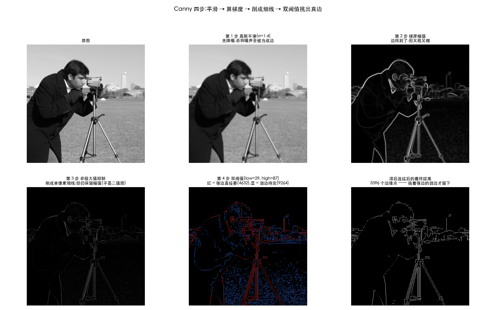
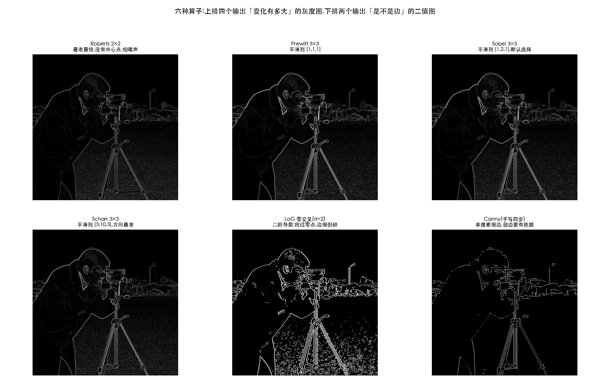

# 边缘检测

> 对应冈萨雷斯第四版 10.2 节(提前学),接在 [03-sharpening.md](03-sharpening.md) 之后。
>
> 素材来自知乎《数字图像处理:边缘检测(Edge detection)》(作者郑泽文)。
> **原文有几处说法是错的,而且会把人带沟里。这一篇把该学的重写了一遍,
> 错的地方全部改正并实测坐实,末尾附一张纠错清单。**

> **动手验证**:[`Ch03_Spatial_Filtering/24_edge_detection.py`](../../Python-Prototyping/Ch03_Spatial_Filtering/24_edge_detection.py)
> 本篇每个数字都是它跑出来的,包括纠错那几条。

> **怎么读这篇**(第一遍真的不用全看)
>
> | 有多少时间 | 看哪几节 |
> | :--- | :--- |
> | **只有 10 分钟** | `先讲人话` + `五、小结` |
> | **第一遍学** | 再加 `一、Canny 四步` —— 这一节是本篇的全部重点 |
> | **踩坑时回来查** | `二、LoG 与零交叉` `三、六种算子横向对比` `四、纠错清单` |

---

## 先讲人话

上一篇的锐化(sharpening)和这一篇的检测,听起来像一回事,其实输出完全不同:

```
   锐化:   一张图  →  一张更清楚的图      (给人看)
   检测:   一张图  →  一张二值图          (给下一步算法用)
                       白的是边,黑的不是
```

**「检测」意味着要做判断**:这个点到底算不算边?算,就是白;不算,就是黑。
而判断就绕不开三个麻烦事:

| 麻烦 | 怎么办 |
| :--- | :--- |
| 噪声会被当成边 | 先平滑 |
| 边太粗(一条边糊成好几像素宽) | 削成单像素细线 |
| 阈值定高了边断、定低了全是伪边 | **用两个阈值** |

Canny 算法就是把这三件事按顺序办完。

---

## 一、Canny 四步



### 第 1 步:高斯平滑

没什么新东西,就是 [02-smoothing.md](02-smoothing.md) 里那个高斯。

**为什么必须先做**:求导会放大噪声(上一篇实测过,拉普拉斯(Laplacian)放大 5.4 倍)。
不先平滑(smoothing),噪声全会被当成边。

> σ 就是这一步的旋钮:**σ 大 = 只要大轮廓,σ 小 = 连细节纹理都要**。

### 第 2 步:算梯度

用 Sobel 分别求横向和纵向的导数,然后:

- **幅值** `√(gx² + gy²)` —— 这儿变化有多大
- **方向** `atan2(gy, gx)` —— 往哪个方向变

方向这一项前面几篇都没用上,这里第一次派上用场 —— **下一步要靠它**。

> 上图第 3 格就是幅值图:边找到了,但**又粗又糊**,一条边宽好几个像素。

### 第 3 步:非极大值抑制

名字吓人,做的事很朴素:

> **沿着梯度方向**(也就是垂直于边的那条线)往前后各看一个像素,
> **只有当前点比这两个都大,才留下来。**

```text
算法:非极大值抑制(NMS)
输入:梯度幅值 mag、梯度方向 angle
输出:被削成单像素宽的 mag(**仍然是幅值,不是 0/1**)

对每个像素 (y, x):
    d ← 把 angle[y,x] 量化到 4 个方向之一(0°/45°/90°/135°)
    (p, q) ← 沿 d 的前后两个邻居
    若 mag[y,x] ≥ mag[p] 且 mag[y,x] ≥ mag[q]:
        输出[y,x] ← mag[y,x]      // 留下,而且留的是原幅值
    否则:
        输出[y,x] ← 0             // 削掉
```

为什么是「垂直于边」的方向?因为边是一条线,**线的粗细是横着量的**。
一条粗边在横截面上像一座小山,山顶那一行才是真正的边,山坡上的都该被削掉。

> ⚠️ **两个必须说清的地方**(原文这里讲错了,见末尾纠错清单):
>
> **(a) 只比梯度方向上那两个点就够了,不要再要求「在 8 邻域内最大」。**
> 沿着边的**走向**上的邻居本来就是边,幅值可能比你还大。
> 实测多加这一条,会误删 **84.3%** 的候选边缘点 —— 一条连续的边被打成断续的点。
>
> **(b) 这一步的输出必须保留幅值,不能置成 0/1。**
> 实测 NMS 输出跨了 **423 个不同档位**,下一步的双阈值正是拿这些幅值去比。
> 二值化是**第 4 步**做的事。

### 第 4 步:双阈值连接

这是 Canny 真正的聪明之处,也是它和「Sobel + 一个阈值」的分界线。

一个阈值的困境:

- 定**高**了 → 只剩最强的边,一条完整的轮廓断成一截一截
- 定**低**了 → 边是连上了,但混进一大堆噪声造的伪边

Canny 的答案是**用两个**:

```
   幅值 ≥ high        →  强边,直接要
   low ≤ 幅值 < high  →  弱边,待定
   幅值 < low         →  直接扔
```

然后关键的一步 —— **滞后连接(hysteresis)**:

> **弱边只有和强边连在一起,才算数。**

理由很直观:一条真实的边,总有一段是强的。中间某几个像素弱一点,
是因为那儿对比度(contrast)低,但它**挨着强边**,大概率还是同一条边。
而噪声造的伪边是孤立的,周围没有强边可挨 —— 直接扔掉。

上图第 5 格把这一步画出来了:**红色是强边,蓝色是待定的弱边**。
注意草地上那一大片蓝色 —— 那些就是噪声造的伪边,因为挨不着红色,最后全被扔了。

实测(阈值取 NMS 结果的 70% / 90% 分位):

| 做法 | 保留的点数 | 结果 |
| :--- | ---: | :--- |
| 只要强边 | 4632 | 边会断成一截一截 |
| **强边 + 滞后连接** | **5396** | 捞回 764 个真边点 |
| 强边 + 全部弱边(不筛) | 13896 | 混进大量伪边 |

```text
算法:双阈值 + 滞后连接
输入:NMS 后的幅值 nms、低阈值 low、高阈值 high
输出:二值边缘图

1. 强 ← nms ≥ high 的位置        // 直接就是边
   弱 ← low ≤ nms < high 的位置  // 待定
   其余直接扔

2. 输出 ← 全 0
   栈 ← 所有强边点
   while 栈非空:                  // 用栈,不要用递归 —— 见下面的实现提示
       p ← 栈.弹出
       若 输出[p] 已经是 1:继续
       输出[p] ← 1
       对 p 的 8 个邻居 q:
           若 q 是弱边 且 输出[q] 还是 0:
               栈.压入(q)          // 弱边挨着强边 → 认了,并以它继续往外找

3. 返回 输出                       // 挨不着强边的弱边,始终没被压进栈,自动丢弃
```

第 2 步那个 while 循环就是「**弱边只有和强边连在一起才算数**」的全部实现 ——
它本质上是从所有强边点出发做一次**洪水填充**,只不过只允许沿着弱边蔓延。

> **实现提示**:滞后连接要用**栈 + 循环**,不要用递归。
> 递归在 512×512 上会直接爆栈(Python 默认递归上限只有 1000)。
> 换成栈就是 O(N) —— 每个像素最多进出栈一次,实测纯 Python 只要 **10 ms**。
> 有的资料说这一步「代价过大所以实际常常舍去」,**那是递归写法的锅,不是算法的锅**。

### 和 OpenCV 对一下

手写四步 vs `cv2.Canny`,容许 1 像素位置误差:**准确率 0.961,召回率 0.848,F1 0.901**。

> 为什么这次不像前面几个脚本那样「逐像素 0 差别」:
> `cv2.Canny` 默认用 `|gx|+|gy|` 当幅值、内部用定点数、方向量化的分界处理也略有不同。
> 而且**边缘检测的输出本来就有一两像素的抖动**,所以用 F1 比,不用逐像素比。

---

## 二、LoG 与零交叉

Canny 走的是一阶导数:**找山峰**(变化最快的地方)。
还有另一条路走二阶导数:**找过零点**。

回顾 [03-sharpening.md](03-sharpening.md) 第一节那张表:一刀切的边上,
二阶导数是**一正一负紧挨着,中间穿过 0** —— 那个过零点正好落在边的正中。

**LoG = Laplacian of Gaussian**,名字拆开就是步骤:先高斯平滑,再拉普拉斯。
而且这两步可以**合成一个核**(卷积(convolution)的结合律,见[基础篇第二节](01-spatial-filtering-basics.md)),
合成出来的东西长得像一顶**墨西哥草帽**:中间一个尖,四周一圈凹陷。

```
  9×9 / σ=1.5 的 LoG 核,中心那一行:
  [−0.077  −0.139  +0.042  +0.619  +0.996  +0.619  +0.042  −0.139  −0.077]
                              ↑ 中间的尖              ↑ 四周的凹陷
  总和 ≈ 0  ← 求导类的核都这样:平坦的地方输出 0
```

> **符号约定**:这里用的是 `−∇²G`,所以中心是正的。写成 `∇²G` 的话整体反号。
> 两种写法都有人用,**看中心是正是负,就知道对方用的哪一种**。

### 零交叉怎么找

相邻两个像素**异号**,就说明中间穿过了 0。查四个方向:左右、上下、两条对角线。

> ⚠️ **必须配一个「落差门槛」**:平坦区的浮点噪声也会反复穿过 0,
> 不设门槛出来的全是雪花。

σ 就是 LoG 的「看多粗的边」旋钮,实测:

| σ | 零交叉点 | 占画面 |
| ---: | ---: | ---: |
| 1.0 | 61130 | 23.32% |
| 2.0 | 19901 | 7.59% |
| 3.0 | 10884 | 4.15% |

σ 越大,细节被平滑掉得越多,只剩大轮廓。

---

## 三、六种算子横向对比



上排四个输出的是**灰度图**(每点一个「变化有多大」),
下排两个输出的是**二值图**(是边 / 不是边)。**这就是「求梯度(gradient)」和「边缘检测(edge detection)」的分界。**

### Roberts 为什么被淘汰了

它是 2×2 的核。上一篇说过「核的边长一般取奇数,因为要有明确的中心」——
Roberts 正好是那个反例,后果可以直接量出来。

**(a) 定位偏半个像素。** 造一条边界正好落在第 127.5 列的理想阶跃:

| 算子 | 响应重心 | 偏差 |
| :--- | ---: | ---: |
| **Roberts 2×2** | 128.00 | **+0.50 像素** |
| Prewitt 3×3 | 127.50 | +0.00 |
| Sobel 3×3 | 127.50 | +0.00 |
| Scharr 3×3 | 127.50 | +0.00 |

这跟噪声、精度都没关系,是**几何上必然的** —— 2×2 的中心就落在四个格子中间。
要拿边缘位置做测量(标定、拼接、亚像素定位),这半个像素是致命的。

**(b) 一个坏点就能造出一条假边。** 在均匀的背景上放一个孤立坏点:

| 算子 | 坏点引起的响应 | 相当于真边的 |
| :--- | ---: | ---: |
| **Roberts 2×2** | 155 | **73.1%** |
| Prewitt 3×3 | 219 | 48.7% |
| Sobel 3×3 | 310 | 51.7% |
| Scharr 3×3 | 1550 | 64.6% |

Roberts 只看 2 个像素,**一个坏点就占了一半的发言权**。
3×3 的算子有平滑那一列兜着,坏点被稀释到 8 个像素里去了。

> (Scharr 偏高是因为它的权重更集中在中心 —— 换来的是方向精度,是另一种取舍。)

> **Canny 也有它够不着的地方**:它只认「亮度变化」,颜色不同但亮度相同的两块之间
> 它看不见任何边;阈值要按图调,换一批素材就得重调;而且它给的是**一堆边缘点**,
> 不是「物体的轮廓」—— 断开的地方它不会替你接上。
>
> **想做得更好**:自适应阈值(按分位数而不是绝对值,本篇实测就是这么取的);
> 要闭合轮廓查**分水岭**或**主动轮廓(snake)**;
> 要「语义上的边界」那已经是深度学习的活了,查 **HED** 或 **Segment Anything**。

### 选型

| 要什么 | 用什么 |
| :--- | :--- |
| 快速看一眼边在哪儿 | **Sobel** |
| 要边缘的**朝向**准(特征匹配、拼接对齐) | **Scharr** |
| 要一张能给下游算法用的**二值边缘图** | **Canny** |
| 想要闭合的轮廓、能接受碎一点 | **LoG 零交叉** |
| —— | Roberts / Prewitt 基本只剩教学价值 |

---

## 四、纠错清单

原文的框架是对的(Canny 四步和 LoG 都讲全了,还给了可跑的 Matlab 代码),
但下面这几处**照着做会出问题**,其中前三条还和原文自己后面的代码互相矛盾。

### ① 核的和为 0 能保亮度?

**反了。** 和为 0 意味着**平坦区输出 0** —— 整幅图会归零,总体灰度怎么可能不变?

实测 `camera.png`(均值 129.1):

| 核 | 处理后的均值 |
| :--- | ---: |
| 和为 0(拉普拉斯) | **0.00** |
| 和为 1(高斯) | 129.06 |

**保证亮度不变的是和为 1。** 和为 0 是**求导类**核的特征,它的含义恰恰相反:
把整体亮度全扔掉,只留变化。

而且原文上文给的高斯滤波(Gaussian filter)器和是 16,根本不是 0 —— 自己就不符合自己定的规则。
正确的分类见[基础篇第四节](01-spatial-filtering-basics.md)。

### ② NMS 之后就置为 1?

**不能。** NMS 必须保留幅值,因为**第 4 步的双阈值要拿幅值去比 high / low**。
实测 NMS 输出跨了 423 个档位;如果这一步就置成 0/1,阈值只能在 `{0,1}` 上比,
双阈值彻底失效。

原文自己的 Matlab 代码里写的是 `magGrad(yy,xx)>=low` —— 用的正是**幅值**,
说明那时候根本不是二值图。**二值化是第 4 步做的。**

### ③ NMS 先比 8 邻域?

**多余,而且有害。** NMS 只该比较**梯度方向上**的那两个点。

实测多加这一条,保留的候选点从 46318 个掉到 7256 个 —— **误删 84.3%**。
原因:沿着边的**走向**上的邻居本来就是边,幅值可能更大;
要求 8 邻域内最大,等于把一条连续的边打成断断续续的点。

### ④ 滞后阈值代价过大?

**代价大是递归写法的锅,不是算法的锅。** 换成栈 + 循环就是 O(N),
实测纯 Python 只要 10 ms;OpenCV 的 `cv2.Canny` 就实现了它,一点不慢。

而且滞后阈值(hysteresis thresholding)**是 Canny 区别于「Sobel + 一个阈值」的核心**,不该被建议舍掉。
原文建议改用的形态学细化 `bwmorph(...,'thin')` 是**另一件事**(把边削细),
不是「把断开的边连起来」的替代品。

### ⑤ 截断还是取绝对值

这两个是**完全不同的操作**,不能用「或者」并列。实测 `camera.png` 过 Sobel-x:

| 做法 | −860 变成 |
| :--- | :--- |
| 饱和截断(`ddepth=-1`) | **0** —— 45.3% 的像素被吃掉 |
| 取绝对值(`convertScaleAbs`) | **255** |

一个把暗侧边缘全抹掉,一个保留 —— 差得很远。详见[基础篇第七节](01-spatial-filtering-basics.md)。

### ⑥ 中间有几个灰色值

数错了。0~255 一共 **256** 个值,去掉全黑全白,中间是 **254** 个。

### ⑦ 滤波公式里的 1/n

归一化写错了。应该除以**核内权重之和**,不是元素个数。
只有核全是 1 时两者才凑巧相同 —— 原文自己在括号里承认了这个特例,却把公式写成了通式。
3×3 高斯的权重和是 **16**,不是 9。

### ⑧ 没区分相关与卷积

原文说「点积」,代码里显式传了 `'conv'`(Matlab 的 `imfilter` **默认是相关(correlation)**),
但从没解释这个区别。对 Sobel 这种反对称核,**翻不翻核会让梯度方向整个反号**
(实测差 1720,且两者正好互为相反数)。见[基础篇第二节](01-spatial-filtering-basics.md)。

### ⑨ 三个核差在哪没说

其实**差分那一列 `[−1,0,1]` 三者完全一样,区别只在平滑那一列**:
`[1,1,1]` / `[1,2,1]` / `[3,10,3]`,方向误差 0.549° / 0.275° / 0.068°。
见[锐化篇第七节](03-sharpening.md)。

### 原文讲得好的地方

也有说得比多数教材干脆的,值得记:

> 微积分在图像处理里的表现形式,就是算相邻像素的差值 ——
> **实际应用不需要求导,只需要简单的加减运算。**

这句话把「导数」这个吓人的词一下子落到了地上。已经收进[锐化篇第一节](03-sharpening.md)。

---

## 五、小结

| 问题 | 答案 |
| :--- | :--- |
| 锐化和检测差在哪 | 锐化输出**更清楚的图**(给人看);检测输出**二值图**(给算法用) |
| Canny 四步 | 高斯平滑 → 算梯度(幅值+方向)→ NMS 削成细线 → 双阈值 + 滞后连接 |
| NMS 在削什么 | 边的**粗细**。沿梯度方向(垂直于边)比前后两点,只留山顶 |
| NMS 输出是二值图吗 | **不是**,必须保留幅值,下一步要拿它比阈值 |
| 双阈值为什么要两个 | 一个定高了边断,定低了全是伪边。两个 + 「弱边要挨着强边」 |
| 滞后连接慢吗 | 不慢。用**栈**是 O(N),实测 10 ms;递归才会爆栈 |
| LoG 是什么 | 先高斯再拉普拉斯,可合成一个核(墨西哥草帽);找**过零点**定位边 |
| 零交叉要注意什么 | 必须配**落差门槛**,否则平坦区的噪声会出一片雪花 |
| Roberts 为什么淘汰了 | 2×2 没中心 → **定位偏 0.5 像素**;只看 2 个像素 → 一个坏点顶真边的 73% |
| 日常怎么选 | 看一眼用 Sobel,要方向用 Scharr,要二值边缘图用 Canny |

---

## 相关文档

- [03-sharpening.md](03-sharpening.md) —— 一阶/二阶导数、Sobel、拉普拉斯(本篇的地基)
- [02-smoothing.md](02-smoothing.md) —— Canny 第 1 步用的高斯
- [01-spatial-filtering-basics.md](01-spatial-filtering-basics.md) —— 核的和、相关 vs 卷积、`ddepth` 与溢出
