# 读懂直方图 —— 摄影视角深度整理

> 整理自三篇知乎文章(见文末来源),做了合并、去重、纠错和补充。
> **和 [histogram-transform.md](histogram-transform.md) 的关系**:那篇讲"怎么用算法改直方图",这篇讲"怎么用眼睛读直方图"。
> 先读这篇建立直觉,再读那篇理解算法,顺序更顺。
>
> 文中所有实测数字均可复现:`Python-Prototyping/Ch03_Spatial_Filtering/02_histogram_photography_checks.py`

## 导读:为什么算法工程师该看摄影文章

Gonzalez 教你"直方图挤在中间 → 做均衡化"。但它不会告诉你:

- **挤在中间到底是缺陷,还是作者故意的**(夜景照片就该挤在中间)
- **两端被切断(死黑死白)是不是一定是错的**(光和阴影本身就该是死黑死白)
- **像素为什么会挤在一起**(相机宽容度不够、曝光失误、镜头起雾)

算法视角只看数据分布;摄影视角看的是**这个分布是怎么来的、该不该动**。
做增强算法最容易犯的错,就是把作者刻意压暗的低调照片"自动优化"成灰蒙蒙的中间调。

---

## 一、地基:两根轴

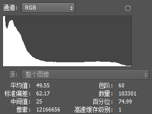

- **横轴 = 亮度**,左黑右白。8 位图就是 0~255。
- **纵轴 = 像素数量**,某处凸起越高,说明这个亮度的像素越多。

上图的凸起集中在左侧,说明这张照片整体偏暗。

摄影上进一步把 0~255 分成五个区域,这是后面所有讨论的共同语言:

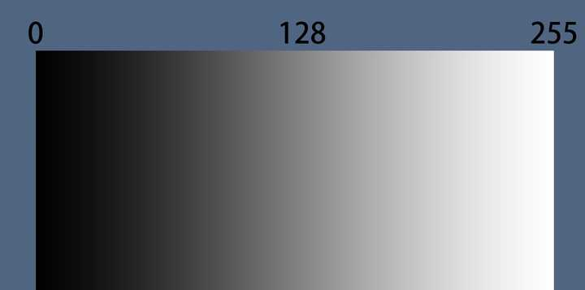

| 区域 | 大致范围 | 说明 |
| :--- | :--- | :--- |
| 黑色 | 0 附近 | 0 就是"死黑",没有任何细节 |
| 阴影 | 偏左 | 深灰,有细节 |
| 中间调 | 中间 | 细节和层次最丰富的地带 |
| 高光 | 偏右 | 浅灰、亮部,有细节 |
| 白色 | 255 附近 | 255 就是"死白",没有任何细节 |

看一个例子 —— 波峰在中间偏左(阴影区),说明画面里深色部分占大头:

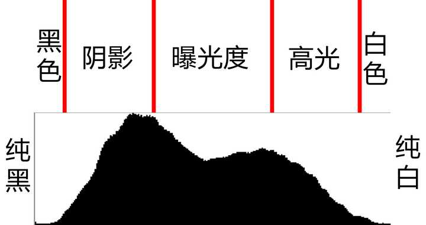

再看一组完整的对照,先看直方图猜,再看照片验证:

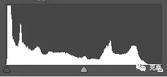

读出来的信息:左边山峰又高又贴边 → **黑色很多**;右边山峰又低又不贴边 → **没有白色,最亮处只是浅灰**。

真身:


结论对上了。

> **一个关键点,后面反复用到**:直方图**只统计"什么亮度有多少个像素",完全不记录这些像素在画面的哪个位置**。
> 把一张照片的像素随机打乱,直方图一模一样。这既是它的简洁之处,也是它的天花板。

---

## 二、四种直方图,别搞混

Photoshop 的直方图面板有个通道下拉,里面是四类东西:

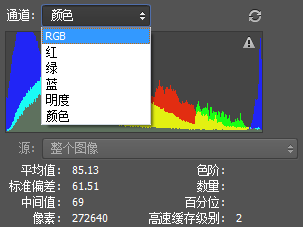

要理解它们,先得回到一个像素是怎么存的。

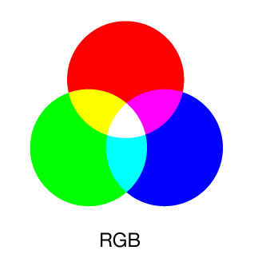

一个像素由红、绿、蓝三个子像素组成,各自 0~255。三个都拉满就是白:

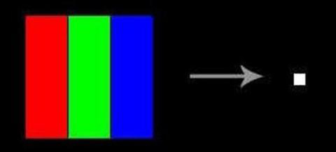

而这样一组值:

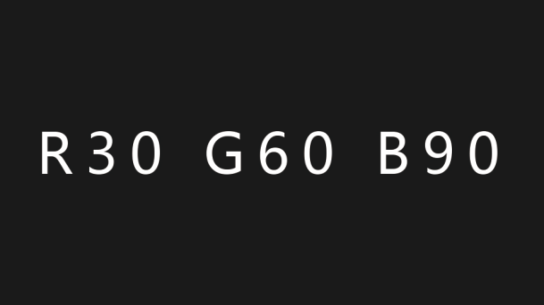

表示红出 30、绿出 60、蓝出 90,混出来是青蓝色。

**所以一张 100 万像素的照片,会产生 100 万个 R 值、100 万个 G 值、100 万个 B 值。**

### 1. 通道直方图 —— 只统计一个通道

单独统计 R(或 G、或 B)的分布。

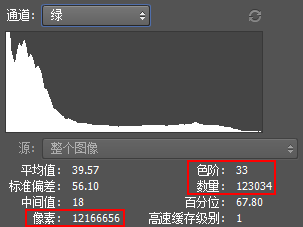

这张图读出来是:在一张 12,166,656 像素的照片里,有 123,034 个像素的 G 值等于 33。

### 2. RGB 直方图 —— 三个通道的计数叠加

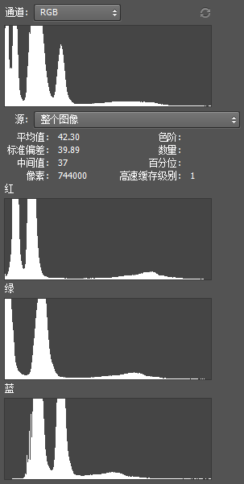

把三条通道直方图**摞在一起**。红通道最左的峰 + 绿通道最左的峰 = RGB 图最左端的双峰,以此类推。

相机回放里通常同时给你 RGB 和三个通道:

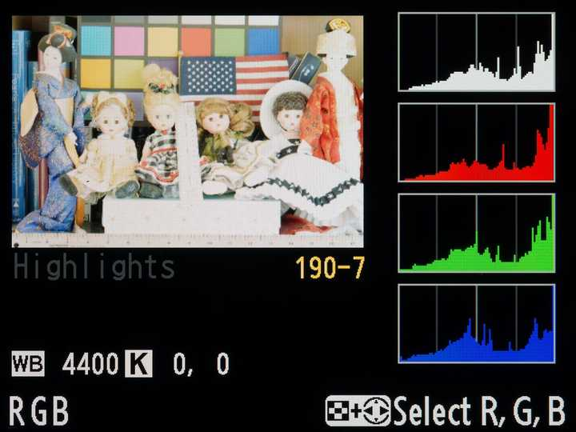

ACR / Lightroom 更省事,直接把三条彩色叠画在一起。灰色 = 三通道重合处,黄色 = 红绿重合处,红色 = 只有红通道:

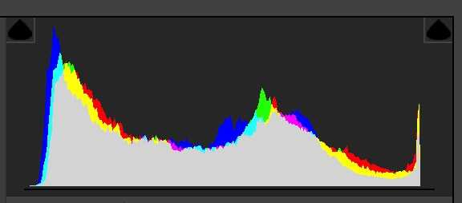

### 3. 明度直方图 —— 先算亮度,再统计

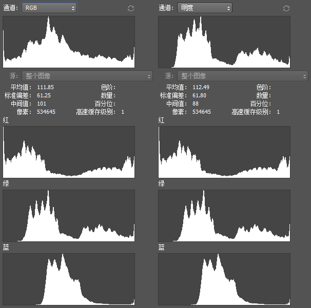

这是和 RGB 直方图**最容易混淆、也是差别最大的一个**。

| | RGB 直方图 | 明度直方图 |
| :--- | :--- | :--- |
| 做法 | 三个通道各自统计,**结果相加** | **每个像素先算出一个亮度值**,再统计 |
| 一个像素贡献几次 | 3 次(R 一次、G 一次、B 一次) | 1 次 |
| 最左端有凸起代表 | **任意一个**通道有 0 | **三个通道同时**为 0 |

第三行是判别它们的关键。举个极端例子最清楚 —— 一张全是**纯红 (255, 0, 0)** 的图,100 个像素(我实际算的):

| | 亮度 0 处 | 亮度 76 处 | 亮度 255 处 |
| :--- | :---: | :---: | :---: |
| RGB 叠加直方图 | **200** | 0 | **100** |
| 明度直方图 | 0 | **100** | 0 |

- 叠加图的结论:"这张图又有大量死黑,又有死白"
- 明度图的结论:"这张图全部是中偏暗的 76,既没有黑也没有白"

**同一张图,两个完全相反的结论。** 后者才是人眼看到的事实 —— 纯红看起来就是个中等偏暗的颜色。

> 复现:`02_histogram_photography_checks.py` 第 1a 节。

在真实照片上差别没这么夸张。我用一张 262,144 像素的实拍图测过:

- 两条直方图的**形状相关系数 0.9785**,最大差 **0.66 个百分点** —— 整体趋势基本一致
  (相关系数 = 两条曲线形状像不像,1 = 完全一样、0 = 毫无关系,0.98 已经非常像了)
- 但端点上差别明显:**至少一个通道为 0** 的像素占 11.49%,而**三通道全为 0** 的只有 10.67%

> 复现:`02_histogram_photography_checks.py` 第 1b 节。

也就是说:**判断整体明暗趋势,两个都能用;判断"有没有死黑死白、溢出了多少",必须看明度直方图**,否则会把"某个通道溢出"误判成"整个像素溢出"。

> 这一点对做算法直接相关:如果你要检测过曝区域,判据应该是 `min(R,G,B) == 255`(全溢出)还是 `max(R,G,B) == 255`(单通道溢出),取决于你想解决什么问题。前者是真的没救了,后者往色彩上偏但亮度信息还在。

### 4. 颜色直方图 —— 加了颜色的 RGB 直方图

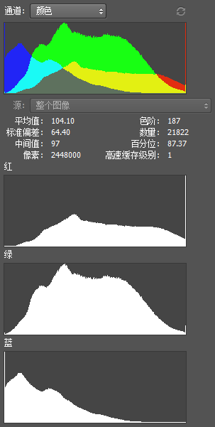

本质还是三通道叠加,只是用颜色标出重合关系:红+绿重合处画黄色,绿+蓝重合处画青色,红+蓝重合处画洋红,三者都重合画灰色,没重合就画自己的颜色。

**纯粹是可视化技巧,没有新信息。**

---

## 三、直方图丢掉的东西:分量图(Waveform)

直方图的天花板在于"不记录位置"。分量图补上了这一半。

- **直方图**:整张图一起统计,横轴是亮度
- **分量图**:**一列一列地统计**,横轴是画面的水平位置,纵轴是亮度

一句话:**分量图和画面位置对应得上,直方图是被打乱的。**

所以分量图看着直观(具象),直方图看着费劲(抽象)。

看例子。这张猫的照片:


它的分量图:

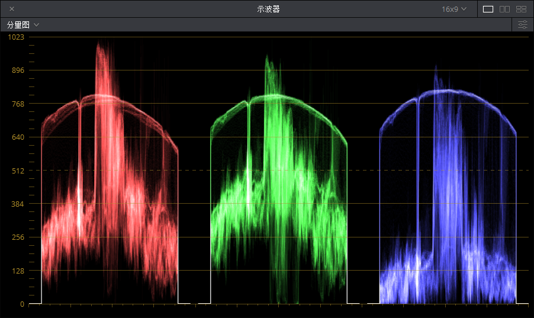

能读出的东西,**直方图完全做不到**:

- 整体上红、绿高,蓝低 → 画面偏黄
- 中间那道**弧线**,三个通道走势几乎重合 → 那是天空,天空接近灰色,所以 R≈G≈B
- 弧线左侧有个**下切** → 一根草伸进了天空,亮度更低
- 中部有个最高的**凸起** → 猫的毛发,画面里最亮的部分

再看一张人像:

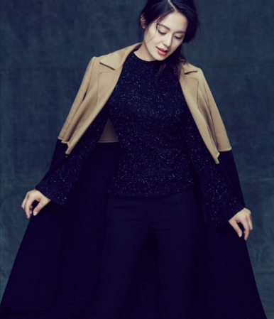

它的直方图:


读法:蓝通道在最左端没有凸起 → 没有任何像素的 B 值是 0 → **阴影部分会偏蓝**。红绿在最左端有大量凸起 → 很多像素 R、G 为 0。

高光部分,红的峰最靠右,绿在中间,蓝在左 → 说明高光处 **R > G > B**,也就是偏暖 —— 那正是人脸和衣服:

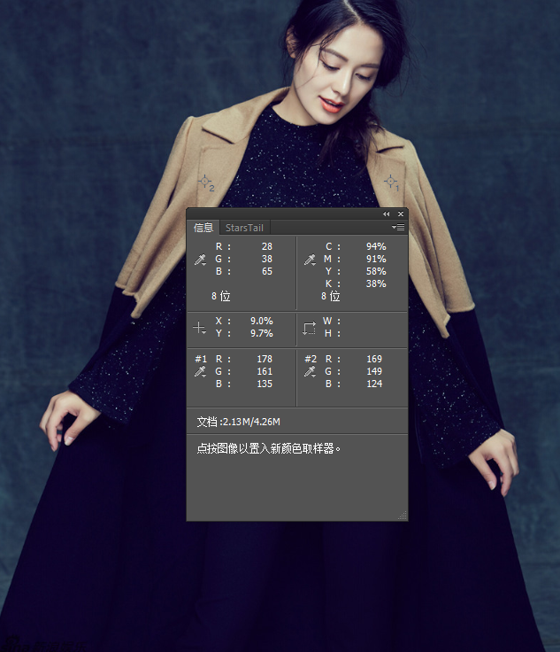

对应的分量图:

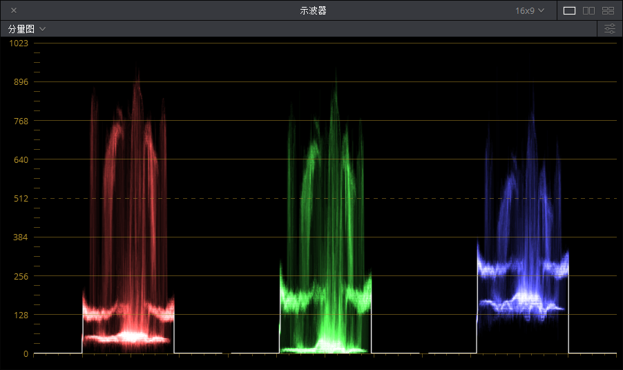

- 蓝色分量的底部最高 → 所有像素的 B 值都不小(印证了"阴影偏蓝")
- 三个通道都有一个**八字形**,位置偏高 → 衣服(亮),且红 > 绿 > 蓝
- 最中间最高的凸起 → 人脸

> **做视频的话这个工具你已经在用了**:广播级监看里的 Waveform / Vectorscope 就是这个东西。分量图 ≈ Waveform(亮度对位置),直方图 ≈ Histogram。调色台上两个都摆着,就是因为它们互补。

---

## 四、前期:用直方图诊断曝光

### 理想曝光

堆积在中部,左右两端都**没有被切断**:

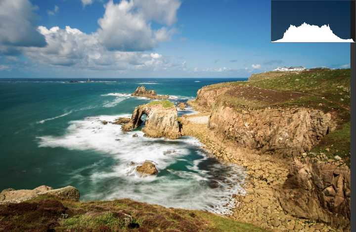

"切断"(clipping / 溢出)指的是:直方图贴着最左或最右边缘,有很高的柱子堆在那里,像被一刀切平了。

### 过曝

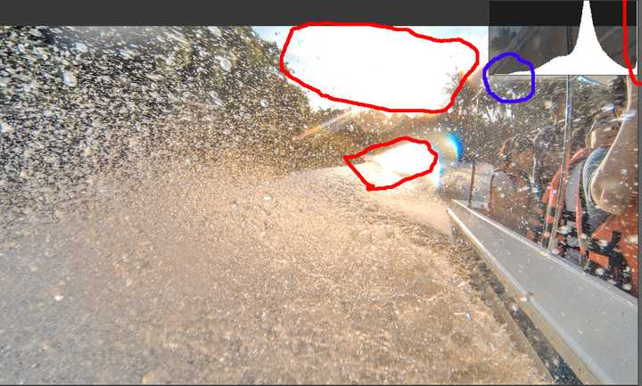

右侧被切断,255 处堆了大量像素。意思是:天空里那些高亮区域,**因为传感器上限,只能全部记成纯白,细节彻底丢了**。同时左边几乎没有像素,说明照片可用的记录空间也没充分利用。

处理:降曝光补偿 / 缩小光圈 / 降 ISO / 提高快门速度。

### 欠曝

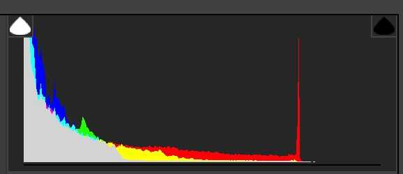

反过来,0 处堆了大量像素,左侧切断。

严重的欠曝长这样,连浅灰都没有,最右端只到中灰:

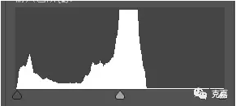

### 为什么不能只看屏幕

这是三篇文章都强调的一点:**相机显示屏和电脑屏的显示一定有差异**(设备间色彩一致是全世界通用的技术难题,ICC 只是事后补救)。很多时候在相机上觉得拍得挺好,导进电脑就崩了。

而**数据不会骗人** —— 直方图准确反映明度分布,这才是判断曝光的依据。

---

## 五、宽容度不够:一张照片装不下

如果直方图**两端同时被切断**(或一端贴边、另一端切断),说明现场光比超出了相机能记录的范围。这时不是曝光参数的问题,是**器材物理极限**。

例子:想保住暗部枯木的细节,太阳周围就全部过曝死白:

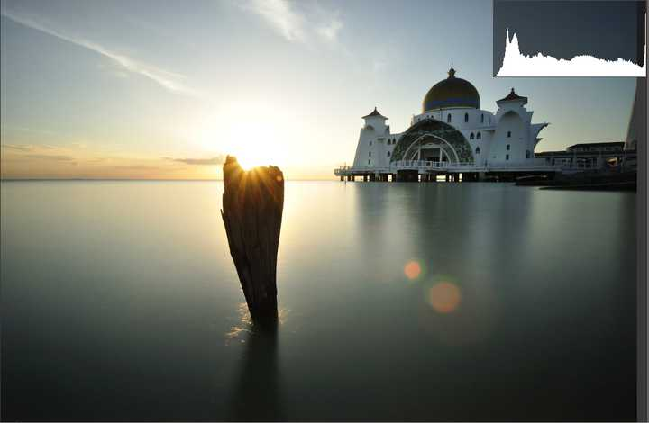

反过来想保住亮部,暗部就全成死黑:

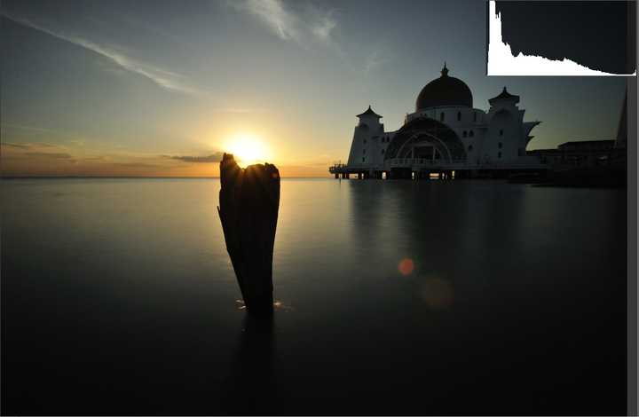

解法是**包围曝光 + 后期合成**:拍两张(或多张)不同曝光的,一张保亮部一张保暗部,再用蒙版合起来:

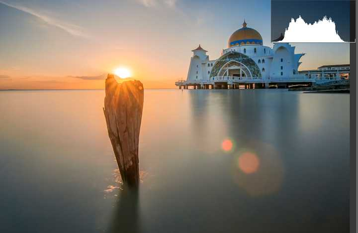

> 这就是 **HDR / 多曝光融合**的原始形态,对应 Gonzalez 第 2 章的图像相加与融合。
> 另一条路是用渐变灰滤镜,在**光进入传感器之前**就压掉天空,属于光学解法。
>
> **术语提醒**:中文摄影圈说的"宽容度"通常就是指 dynamic range(动态范围)。严格说在胶片时代 latitude(宽容度)和 dynamic range 是两个概念,现在混用了,读文章时按上下文理解。

---

## 六、向右曝光(ETTR):一个算法工程师会拍手的技巧

这是三篇里技术含量最高的一节,而且**它的道理完全是算法层面的**。

### 现象

相机在暗部的噪点比亮部明显得多。因为暗部收到的光子少,**信号弱而噪声不变 → 信噪比低**。后期再把暗部提亮,噪点就更刺眼。

### 做法

2003 年摄影师 Michael Reichmann 提出**向右曝光**(Expose To The Right):

> **在亮部不溢出的前提下**,故意让曝光偏亮,让直方图尽量靠右,后期再压暗。

看例子。最终成品像素集中在中间,表现晨雾的朦胧:

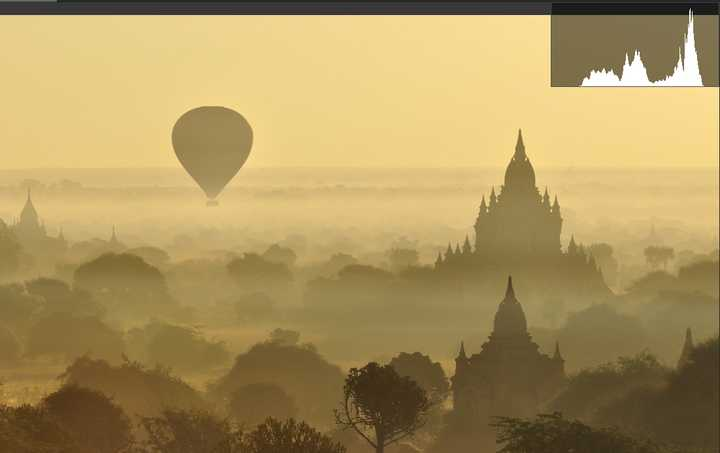

但拍摄时用的是向右曝光,原图直方图明显偏右 —— **推进了右侧区域,但没有在最右端切断**:

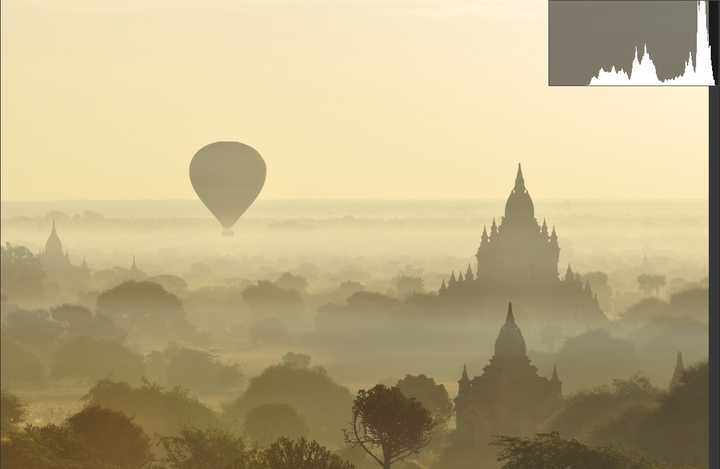

肉眼看原图是轻微过曝的,但压暗之后得到的照片噪点明显更少。

### 为什么有效 —— 算一下就懂了

先说清两个词,这一节全靠它们:

> **一档(曝光)**:摄影里的计量单位。**升一档 = 进到相机里的光翻倍**,降一档 = 减半。
> 光圈开大一级、快门慢一倍、ISO 翻倍,都是"多一档"。
>
> **码值**:数字系统里能表示的一个具体整数。8 位有 256 个码值(0~255),12 位有 4096 个。
> **码值就是格子** —— 格子越多,亮度的层次分得越细。

关键事实:**传感器是线性的** —— 进光量翻倍,读数就翻倍,老老实实成正比。

把这两件事放一起想:一档 = 光翻倍 = 读数翻倍 = **占掉剩下码值的一半**。

于是在 12 位 RAW 的 4096 个码值里,各档分到的格子是这样的(我算的):

| 从最亮往下数第几档 | 分到多少个码值 | 占全部码值 |
| :---: | :---: | :---: |
| 1 | **2048** | 50.00% |
| 2 | 1024 | 25.00% |
| 3 | 512 | 12.50% |
| 4 | 256 | 6.25% |
| 5 | 128 | 3.12% |
| 6 | 64 | 1.56% |
| 7 | 32 | 0.78% |
| 8 | 16 | 0.39% |
| 9 | 8 | 0.20% |
| 10 | 4 | 0.10% |
| 11 | 2 | 0.05% |
| 12 | 1 | 0.02% |

**最亮的一档独占一半格子,最暗的几档只剩个位数。**

打个比方:这 4096 个格子不是平均分给 12 个档的(那样每档 341 个)。
而是**第一档拿走一半,第二档拿走剩下的一半,以此类推** —— 越往暗处,能分到的格子越少,少到最后只剩 1 个。

> 复现:`02_histogram_photography_checks.py` 第 2 节(可改 `bits` 试 14 位)。

所以向右曝光的本质是:**把场景推到码值密集的那几档去记录**。同一个景物,记在第 1 档有 2048 级可用,记在第 8 档只有 16 级。后期压暗只是做一次映射,量化精度已经拿到手了。

这和你做音频推流时"录制时把电平推高、留 headroom 不削顶,后期再降增益"完全是同一个道理 —— **在定点量化系统里,尽量占满码值范围**。

### 两个坑

1. **必须看直方图判断,不能看屏幕**。向右曝光的片子在屏幕上看起来就是过曝的,和"真过曝救不回来"很难用眼睛区分。判据只有一个:**最右端有没有堆积大量像素**。没堆就是 ETTR,堆了就是废片。

2. **⚠️ 相机屏幕上的直方图,不是 RAW 的直方图。** 相机显示的是 JPEG 预览图的直方图,已经过了 gamma 编码和色调曲线;而 ETTR 的推理成立在**线性 RAW 域**。两者对不上,这也是为什么很多相机提供"高光警告"(闪烁提示)作为补充 —— 直接标出溢出的像素,比读 gamma 域的直方图可靠。

> 这个坑非常值得记住:**摄影文章里说的"亮度"几乎都是 gamma 编码后的显示亮度,算法书里说的常常是线性光强。**
> 相关讨论见 [intensity-and-grayscale.md](intensity-and-grayscale.md) 的伽马一节。

---

## 七、后期:影调 —— 直方图形态的美学分类

一张照片的明暗有两种解读方式:

- **科学的**:曝光。对/错,有标准。
- **艺术的**:影调。只有合不合适,没有对错。

影调指照片明暗表现出的层次、变化和气氛。同一张照片,科学上说它"欠曝",艺术上可以说它"低调深沉、有对比、显得神秘"。

影调分三个维度,**每张照片在三个维度上各占一个位置**:

| 维度 | 分类 | 看直方图的什么 |
| :--- | :--- | :--- |
| 整体亮度 | 低调 / 中间调 / 高调 | **波峰在哪** |
| 亮度跨度 | 长调 / 中调 / 短调 | **从最左到最右有多宽** |
| 分布形态 | 软调 / 硬调 | **是平缓的梯形,还是两头各一个峰** |


### 7.1 低调 / 中间调 / 高调 —— 波峰在哪

**低调**:黑色深色占大面积,浓重深沉。波峰堆在阴影和黑色区,高光白色很少像素。

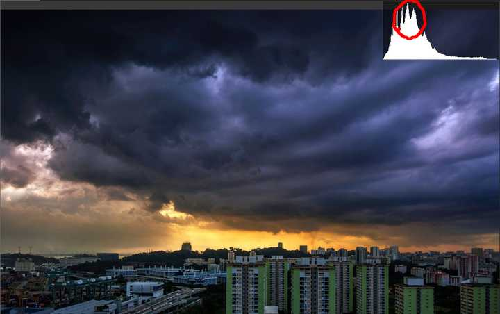

**高调**:大部分是高亮白色影调,清纯、阳光、明朗。波峰堆在右侧。

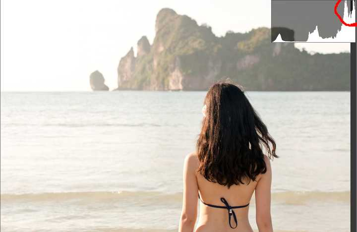

**中间调**:最常见,有黑有白但大部分像素在中间,感觉正常、中性。

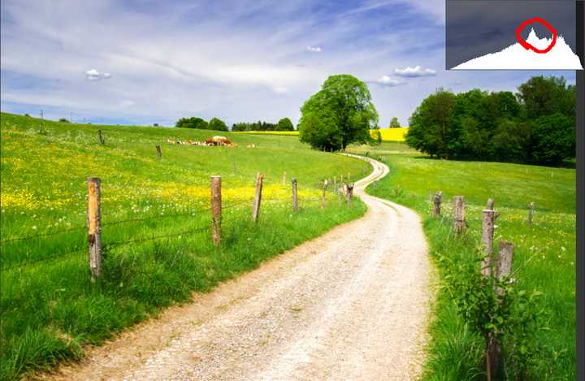

**改影调就是改直方图的位置。** 例子:冰岛原图是典型高调,白色冰川天空把波峰推到高光区,给人明快感:

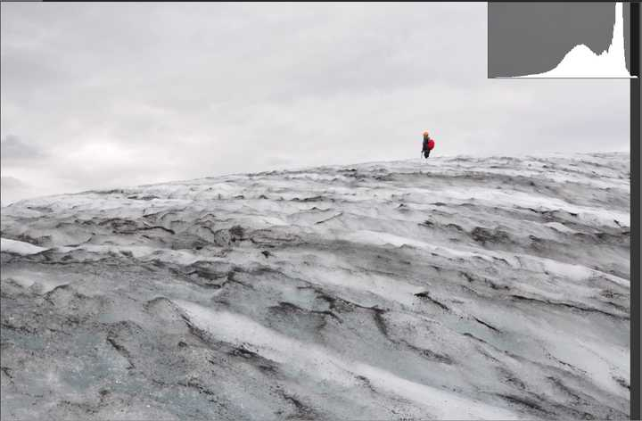

但作者想表达徒步者在天地间的孤寂渺小,于是曝光度 −2、高光 −100,再用渐变滤镜压暗天空,把波峰压到阴影区。**高调变低调,气氛从明快变成压抑、世界尽头**:

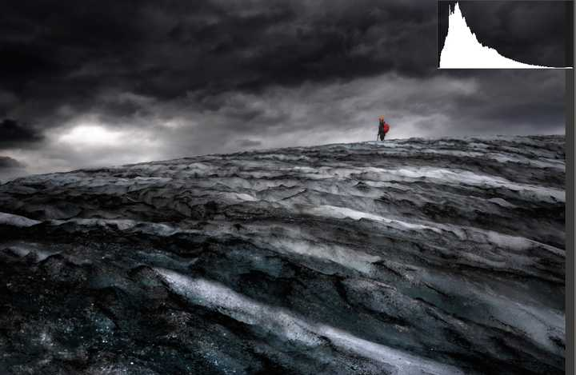

### 7.2 长调 / 中调 / 短调 —— 跨度有多宽

**长调**:最常见,亮度从最暗一直铺到最亮,层次感最强。

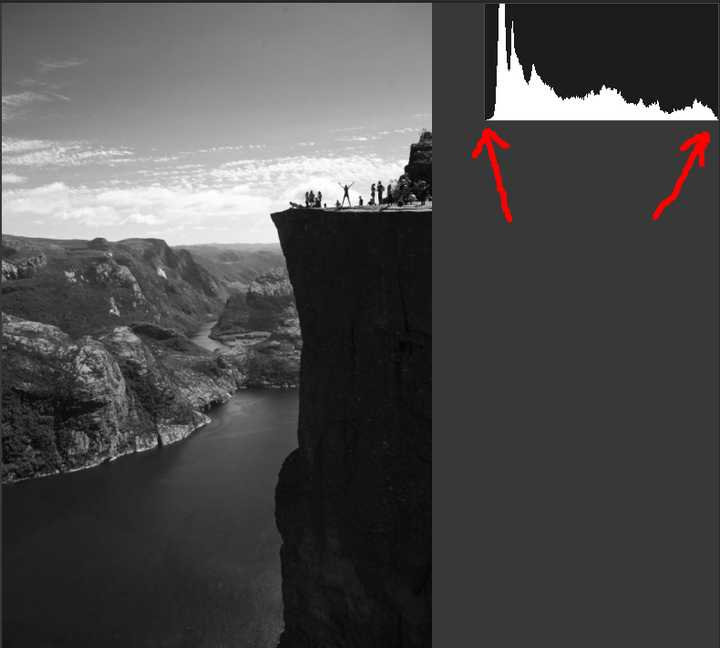

前景悬崖的深黑、中景峡湾的中灰、背景天空的亮白,亮度一下就分开了。

**中调**:跨度约占全长的三分之二,朦胧淡雅。

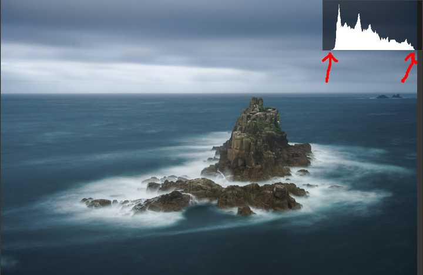

**夜景照片大多是中调** —— 夜晚本身就该是柔和的,高光太多、对比太强反而丢了气氛。把夜景调得跟白天一样,就是影调上的错误。

**短调**:跨度不到三分之一,很少见也很难把握,有强烈的雾霾感和压抑感。

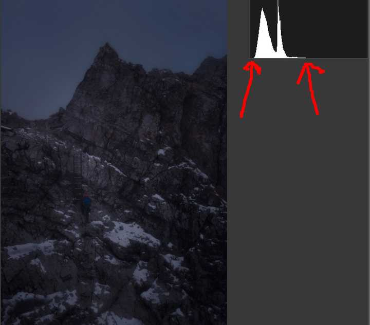

> **注意**:"三分之二""三分之一"是作者的经验值,不是标准定义,别当公式记。

**调性越长越有层次,越短越压抑。** 例子:隔着缆车毛玻璃拍的新天鹅堡,灰蒙蒙的。直方图一看就明白:黑白两端都缺像素,亮度被压在中间,是中调原片:

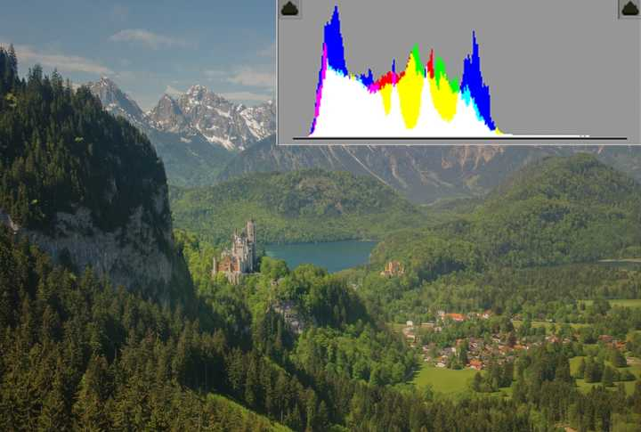

白色 +56、黑色 −37,让像素进入纯黑纯白区、充满整个直方图。中调变长调,层次感出来了:

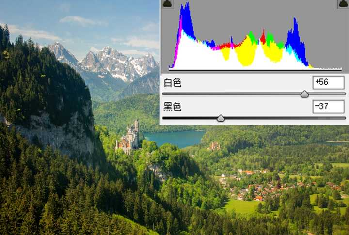

> **这一步在算法上就是对比度拉伸**(contrast stretching),也就是线性变换 `s = a·r + b` 里 `a > 1` 的情况。
> 摄影上叫"提白色降黑色",算法上叫"把直方图两端拉到 0 和 255"。**同一件事的两种叫法。**
> 见 [intensity-and-grayscale.md](intensity-and-grayscale.md) 的线性变换一节。

### 7.3 软调 / 硬调 —— 分布形态

**软调**:朦胧清新、宁静、细节丰富。直方图分布**比较均匀,像梯形**,过渡细腻。

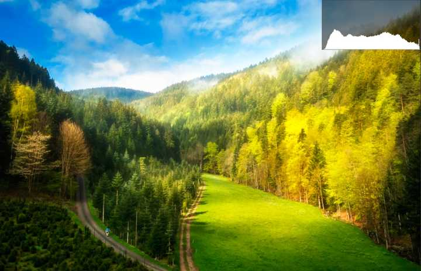

**硬调**:对比强、反差大,靠隐去细节来突出主体。直方图在高光和阴影各有一个波峰,**双峰结构**,中间凹下去。

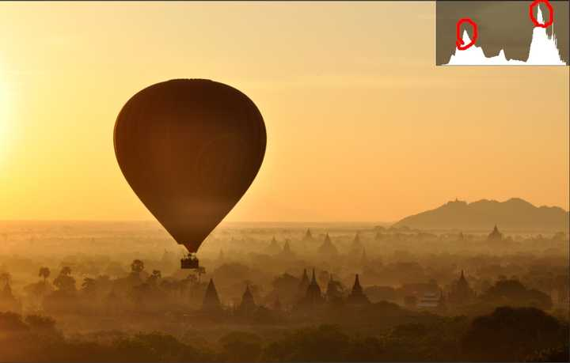

例子:马特洪峰本来就是硬调,但作者觉得还不够硬,山体暗部不够突出。降黑色、降阴影、加对比度:

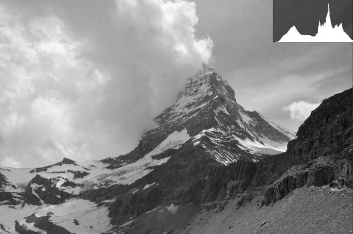

结果阴影的波峰更高更靠左,高光波峰也右移了一些。两峰差距拉开,照片更硬朗雄壮:

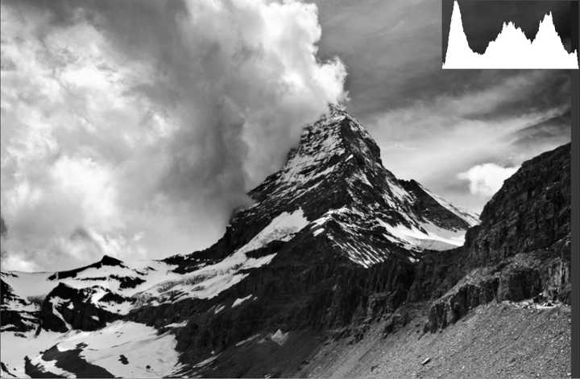

**反向的例子更有实用价值。** 正午阳光下拍人,人黑乎乎、背景也没细节,直方图两个峰分别挤在阴影和高光,反差过大:

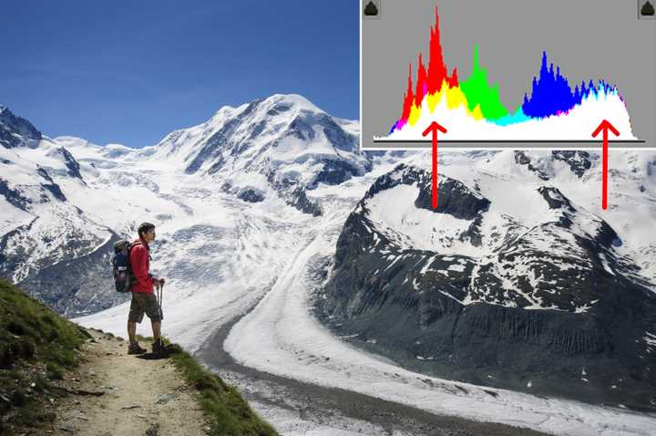

高光 −100、阴影 +53,把两个峰往中间赶,直方图趋近梯形。中间调区域的细节和层次最丰富,所以人物和背景都变好看了:

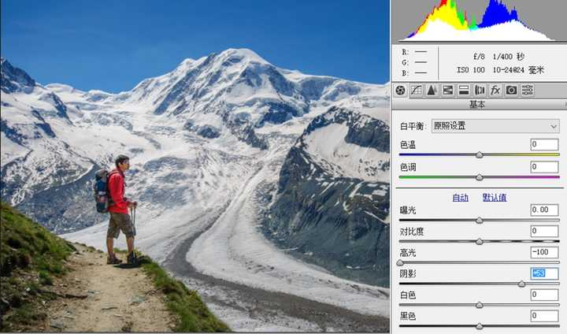

> **⚠️ 一个需要留意的地方**:严格说"长/短调"和"软/硬调"不完全正交 —— 硬调必然跨度大(两峰分别靠两端),所以硬调基本都是长调。
> 这两个维度的真正区别是:**长短讲的是"占了多宽",软硬讲的是"中间有没有塌陷"**。一张长调照片可以是软调(均匀铺满,梯形)也可以是硬调(只有两端有,中间空)。

---

## 八、死黑死白到底能不能有

这是第一篇文章的核心观点,也是最容易被"学院派"误导的地方。

常见说法:"不能有死黑死白,否则照片就没层次,真正的大神作品绝不会出现没有细节的死黑死白。"

**这个说法是错的。** 看这个直方图,两端都有大量堆积:

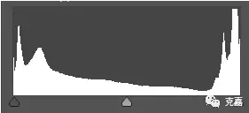

但照片并不失败:

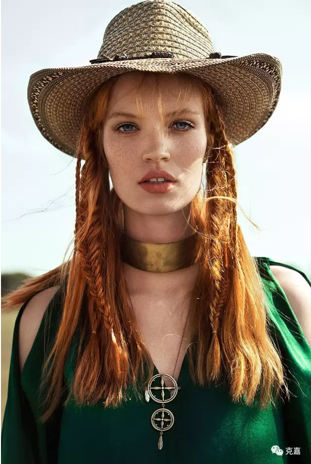

什么时候可以有死黑死白 —— 注意三种措辞的分别:

1. **如果这样好看,就可以有**
2. **光线和阴影本身,就应该是**死黑死白
3. **光线直射、或几乎完全不受光的地方,也可以是**死黑死白,或接近死黑死白

第 2 条最有说服力:**你见过灰色的光吗?**

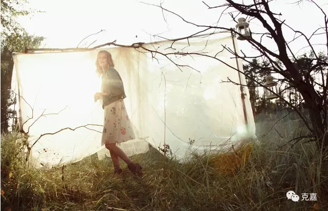

它的直方图就应该是顶到边的:

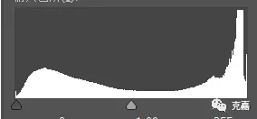

反过来,也不是非得有死黑死白。这张台阶的照片:

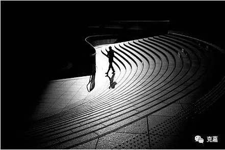

直方图:

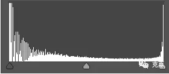

读出来:有死黑死白,但黑比白多;灰色部分过渡细腻平均,稍偏深灰。

另一个常见误区:新手爱夸张地拉对比度。其实**在很黑的环境里,浅灰一样能拉开反差,而且灰色更适合表达细节和层次**。不是非得有死黑死白,也不是非不能有。

> **这一节对做算法的人是一记警钟。**
> "两端有堆积 → 需要修复"这个判据在很多情况下是错的。自动增强算法把作者刻意压成死黑的阴影"救"出来,把光源的死白"找回"细节,结果是把作品毁了。
>
> 所以直方图均衡化这类**全自动、无参数**的算法,在消费级修图里几乎不能直接上 —— 它没有"这是作者的意图"这个概念。
> 医学影像、卫星遥感、工业检测里可以放心用,因为那些场合**没有美学意图,只有"看清"这一个目标**。

第一篇作者的结论值得抄下来:

> 直方图并没有传说中那么强大,它**不能指引你如何调色**,你调色更不可能对着直方图来调。它仅仅反映了这张图的明度分布信息,**参考一下即可**。
> 对摄影师来说,主要用来控制反差和曝光;对修图师来说,主要用来控制死黑死白 —— 什么时候该有,什么时候可以有。

---

## 九、把摄影视角接回算法视角

这是整理这三篇文章最大的收获 —— **摄影师用眼睛做的判断,可以直接翻译成算法该做什么**:

| 直方图形态 | 摄影叫法 | 病因 | 算法对策 |
| :--- | :--- | :--- | :--- |
| 挤在左侧 | 低调 / 欠曝 | 曝光不足 | 伽马 γ<1 / 对数变换(专门提暗部) |
| 挤在右侧 | 高调 / 过曝 | 曝光过度 | 伽马 γ>1 |
| 挤在中间一小段 | 中调 / 短调 | 起雾、隔玻璃、低对比 | **对比度拉伸**(线性 a>1)或直方图均衡化 |
| 铺满全程 | 长调 | 正常 | **别动** |
| 两端各一个峰,中间塌 | 硬调 | 光比大 | 压高光提阴影(分段线性 / S 曲线反向) |
| 均匀梯形 | 软调 | 正常 | 别动 |
| 单端切断 | 过曝或欠曝 | 曝光失误 | **救不回来**,信息已丢 |
| 两端都切断 | 超出宽容度 | 器材极限 | **单帧无解**,需多曝光融合(HDR) |

三条要牢记的:

1. **"切断"意味着信息已经物理丢失,任何单帧算法都救不回来。** 灰度变换和直方图均衡化都只是重新分配已有的 256 个值,不能创造出不存在的细节。
2. **"铺满全程"和"均匀梯形"是不需要处理的。** 增强算法应该先判断有没有必要动,而不是一律套用。
3. **有美学意图的图像,别做全自动增强。** 低调照片被"优化"成中间调是在破坏作品。

---

## 十、与原文的出入(纠错清单)

整理过程中核对出的问题,按重要程度排序:

### 1. ⚠️ "RGB 直方图 = 三通道叠加后除以 3"(文章 3)

**除以 3 只是纵向缩放,不改变形状**,所以这个说法既多余又容易误导 —— 让人以为 RGB 直方图和明度直方图只差个系数。

真正的区别是**统计方式**:一个是"三条计数曲线相加",一个是"每个像素先算一个亮度值再统计"。见第二节的纯红图实测 —— 同一张图,叠加图说"有死黑有死白",明度图说"全是 76",结论完全相反。

文章 2 关于这一点的表述("RGB 直方图是通道直方图的叠加,明度直方图是复合计算单个像素之后绘制的")是准确的。

### 2. "山峰的高度代表相对应的色彩的数量"(文章 1)

应该是"**亮度**的数量"。直方图统计的是亮度分布,**不含色彩信息** —— 前面纯红图的例子就说明了,红、绿、蓝三种完全不同的颜色可以落在同一个亮度桶里。要看色彩得看色相直方图或矢量示波器(Vectorscope)。

### 3. 明度直方图用什么权重算亮度(文章 2 未说明)

不是三通道等权平均(各占 1/3),而是**加权**的:

```
亮度 = 0.299 × 红 + 0.587 × 绿 + 0.114 × 蓝
```

这组系数出自 Rec.601 标准(`luma` 是它的正式叫法)。**绿占了将近六成,蓝只有一成**,因为人眼对绿光最敏感、对蓝光最迟钝。

后果很直观:同样满值的纯绿 (0,255,0) 算出来亮度是 150,纯蓝 (0,0,255) 只有 29 —— 在明度直方图里,**纯蓝会被归到很暗的位置**,尽管它在屏幕上一样刺眼。

这一点很重要:等权平均和加权平均算出的"亮度"差别可以很大。详见 [intensity-and-grayscale.md](intensity-and-grayscale.md) 第五~八节。

### 4. "任意两种原色相加得到另一种原色的补色"(文章 2)

表述绕。准确说法:**两种原色相加,得到的是第三种原色的补色**。红 + 绿 = 黄,黄是蓝的补色;黄 + 蓝 = 白。原文的意思是对的,但字面读着像"相加得到原色"。

### 5. 长/中/短调的"三分之二""三分之一"(文章 3)

是作者的经验判断,不是行业标准定义,别当公式记。

### 6. 长短调与软硬调不完全正交(文章 3)

原文把三个维度并列,但硬调(两端各一峰)必然跨度大,所以硬调基本都是长调。两者的真正区别见 7.3 节末的说明。

### 7. 相机屏幕上的直方图不是 RAW 直方图(三篇均未提)

这是 ETTR 实操中最大的坑,已补在第六节。文章 3 强调"数据不会骗人",但相机显示的直方图本身就已经过了 gamma 和色调曲线处理,和 ETTR 推理所在的线性 RAW 域并不一致。

### 8. 文章 3 和文章 4 是同一篇

`temp/4` 是 `temp/3` 的另一次保存(同一作者同一篇,只是缺了标题层级),内容重复,已丢弃。

---

## 十一、和流媒体开发的关联

按你的背景,这几条最直接:

| 摄影概念 | 流媒体里的对应 |
| :--- | :--- |
| 分量图(Waveform) | 广播级监看的 Waveform Monitor,同一个东西 |
| RGB vs 明度直方图 | 检测过曝该用 `max(R,G,B)==255` 还是 `min(R,G,B)==255` |
| 向右曝光(占满码值) | 音视频定点量化里"推高电平、留 headroom" |
| 宽容度不够 → 多曝光融合 | HDR 视频、多摄像机曝光包围 |
| 死黑死白是意图不是缺陷 | 自动增强 / AI 修复上线前必须能识别作者意图 |
| 影调形态 → 该用什么变换 | 自适应增强的判据设计(第九节的对照表) |
| 相机屏直方图 ≠ RAW 直方图 | 监看的是编码后的信号还是原始信号,一定要搞清楚 |

---

## 来源

| # | 标题 | 作者 | 链接 |
| :--- | :--- | :--- | :--- |
| 1 | 技术篇\|直方图解读,图文并茂 | 克嘉 | https://zhuanlan.zhihu.com/p/25214698 |
| 2 | 直方图,看这一篇就够了! | 叶明 | https://zhuanlan.zhihu.com/p/24507450 |
| 3 | 如何看懂照片的直方图? | Thomas 看看世界 | https://www.zhihu.com/question/20511799/answer/175939464 |

三篇的分工:**#2 讲清了原理(四种直方图 + 分量图),#3 讲清了应用(曝光诊断 + 影调分类),#1 讲清了态度(直方图只是参考,死黑死白不是罪)。**

配图存于 [histogram-images/](histogram-images/),已按主题重命名(`basics-` / `types-` / `waveform-` / `exposure-` / `dr-` / `ettr-` / `tone-` / `span-` / `contrast-` / `clip-` / `read-`)。

---

## 相关文档

- [histogram-transform.md](histogram-transform.md) —— 直方图变换的算法篇:均衡化、CLAHE、规定化
- [intensity-and-grayscale.md](intensity-and-grayscale.md) —— 灰度变换原理篇:线性/对数/伽马、亮度的六种定义
- [gray-transform-tutorial.md](gray-transform-tutorial.md) —— 灰度变换图解篇
