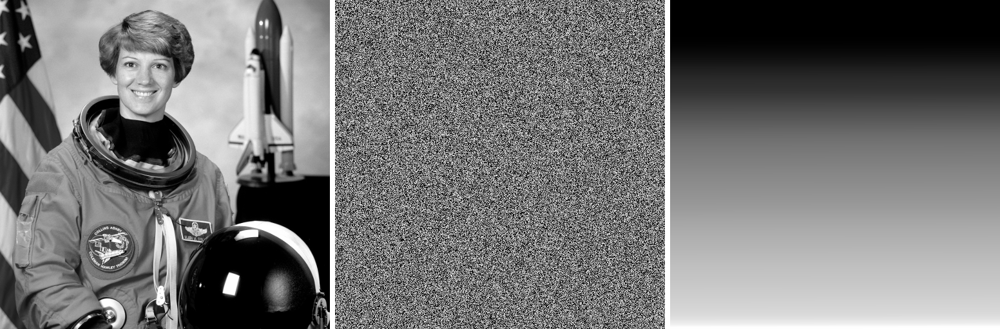

# 直方图变换 —— 大白话入门

> 面向零基础。对应 Gonzalez《数字图像处理》第 3 章 3.3 节。
> 前置阅读:[intensity-and-grayscale.md](intensity-and-grayscale.md)(灰度变换原理篇)

## 零、先定位:它是第几类操作

图像处理的操作,按**"算一个输出像素要看几个输入像素"**可以分成四大类:

| 类别 | 要看几个像素 | 对应章节 |
| :--- | :--- | :--- |
| 灰度变换 (Gray Level Transform) | 1 个(自己) | 3.2 |
| **直方图变换 (Histogram Transform)** | **全图统计后再逐像素** | **3.3** |
| 代数运算 (Algebraic Operation) | 两张图的同位置像素 | 2.6 |
| 空间滤波 (Spatial Filtering) | 自己 + 周围邻居 | 3.4~3.7 |

前三类都不看邻居,一遍扫描就够;第四类开始看邻居,是计算量真正上来的分水岭。

本文讲第二类。

---

## 一、直方图是什么

拿一张照片,准备 256 个桶,编号 0(全黑)到 255(全白)。
把每个像素按亮度扔进对应的桶里,最后数一数每个桶里有多少个。

把这 256 个数画成柱状图,就是**直方图**。

关键一句:**直方图只告诉你"什么亮度的像素有多少个",完全不管这些像素在哪。**

所以两张完全不同的图可能有一模一样的直方图(把像素位置打乱,直方图不变)。它丢掉了空间信息,只保留了亮度的统计分布。

### 看直方图就能诊断照片

```
柱子全挤在左边      → 照片太暗(欠曝)
柱子全挤在右边      → 照片太亮(过曝)
柱子挤在中间一小段  → 灰蒙蒙、没对比度   ← 最常见的毛病
柱子铺满整个范围    → 层次丰富,正常
```

---

## 二、问题出在哪

想象 100 个人排队,要站进 0~7 号共 8 个格子。结果他们全挤在 3、4、5 三个格子里,0、1、2、6、7 空着。

人挤在一起你就分不清谁是谁 —— 对应到照片上,就是"这几块区域亮度太接近,看着糊成一团"。

**空着的格子,就是被浪费掉的表现力。**

---

## 三、均衡化 = 把人摊开

直方图均衡化(Histogram Equalization)只干一件事:**把挤在一起的摊开,把空着的填上。**

但"摊开"不能乱摊,必须保持顺序 —— 原来比较暗的,摊开后还得比较暗,否则图就乱了。方法特别巧:

> **一个像素的新亮度 = "全图有百分之多少的像素比它暗" × 255**

比如某个像素,全图有 35% 的像素比它暗,那它的新亮度就是 `0.35 × 255 ≈ 89`。

这个"比它暗的占多少"就是**累计分布函数(CDF)**。

为什么这招管用:

- 人多的地方,累计比例涨得快 → 相邻灰度被拉开距离
- 人少的地方,累计比例涨得慢 → 相邻灰度被压到一起

自动就实现了"挤的地方拉开,空的地方压掉",而且天然单调递增,顺序不会乱。

### 公式

$$ s_k = (L-1) \sum_{j=0}^{k} \frac{n_j}{N} $$

- `L` = 灰度级数(8 位图就是 256)
- `n_j` = 灰度值为 j 的像素个数
- `N` = 总像素数
- 求和那一坨就是 CDF

看着唬人,其实就是上面那句大白话。

---

## 四、动手算一遍

用一张只有 8 个灰度级、共 100 个像素的小图(实测数据):

| 原亮度 r | 有几个像素 | 累计比例 | 新亮度 s = round(累计×7) |
| :---: | :---: | :---: | :---: |
| 0 | 0 | 0.00 | 0 |
| 1 | 0 | 0.00 | 0 |
| 2 | 5 | 0.05 | 0 |
| 3 | **30** | 0.35 | **2** |
| 4 | **40** | 0.75 | **5** |
| 5 | **20** | 0.95 | **7** |
| 6 | 5 | 1.00 | 7 |
| 7 | 0 | 1.00 | 7 |

重点看 3、4、5 三行:

- 原来挤在 3、4、5,彼此**只差 1**,肉眼几乎分不出
- 现在变成 2、5、7,彼此**差 3 和差 2**,明显拉开了

均衡后各灰度的像素数:`[5, 0, 30, 0, 0, 40, 0, 25]`
—— 柱子从原来窄窄一堆,变成散落在 0~7 全程。

复现脚本:

```python
import numpy as np
counts = np.array([0, 0, 5, 30, 40, 20, 5, 0])   # 灰度 0..7 各有多少像素
N, L = counts.sum(), 8
cdf = np.cumsum(counts) / N
s = np.round(cdf * (L - 1)).astype(int)
```

### 一个必须理解的事实:柱子不会真的变平

注意上表的结果里还是有 0。**离散图像的均衡化永远做不到完全平坦。**

原因很简单:灰度 4 那 40 个像素是一个整体,它们原来值都一样,变换后也必然还是一样 —— 一张查表把 40 个像素全送到 5,不可能拆开分给 5 和 6。

所以"均衡化"实际做到的是**把柱子在整个范围上摊得更开、更均匀**,不是"把每根柱子削成一样高"。只有连续图像的理想情况才能真正平坦。

---

## 五、和灰度变换的区别

| | 灰度变换 | 直方图均衡化 |
| :--- | :--- | :--- |
| 本质是查表吗 | 是 | **也是** |
| 256 项的表从哪来 | 你定公式(a、b、γ 自己拧) | **图自己统计出来的** |
| 换一张图 | 表不变 | **表跟着变** |
| 扫几遍图 | 一遍 | **两遍**(先统计,再替换) |
| 要调参吗 | 要 | **不用,全自动** |

所以直方图均衡化本质上仍然是"逐像素查表",只是多了一步"先看看这张图长什么样"。
**全自动、不用调参**,是它最大的卖点,也是它最大的局限。

---

## 六、它的三个毛病

### 1. 没法控制力度

均衡化是"一把梭",效果好不好全看图,你没有旋钮可拧。有时候会调过头,原本柔和的过渡变得生硬。

### 2. 会放大噪声

暗部本来平坦的一片被强行拉开,藏在里面的噪声也跟着被放大。原图越暗、噪声越明显,这个副作用越严重。

### 3. 只看全局,不看局部

一张图"左边暗、右边亮",全局统计会把两边平均掉,结果两边都调不好。

---

## 七、实际工程用的版本:CLAHE

CLAHE = Contrast Limited Adaptive Histogram Equalization(限制对比度的自适应直方图均衡)。
它同时解决了上面的第 2 和第 3 条:

- **Adaptive(自适应)**:把图切成一个个小块(比如 8×8),**每块单独做均衡**,再把块与块之间用双线性插值平滑接上,避免出现方格边界。→ 解决"只看全局"
- **Contrast Limited(限制对比度)**:统计时给每个桶设一个上限,超出的部分**均匀分摊给其他桶**,防止某个灰度被拉得过开。→ 抑制噪声放大

```python
clahe = cv2.createCLAHE(clipLimit=2.0, tileGridSize=(8, 8))
out = clahe.apply(gray)
```

实际项目里用到"直方图均衡"时,九成场合指的是 CLAHE,而不是教科书里的全局版本。

---

## 八、变体:直方图规定化(匹配)

均衡化的目标是"摊平"。但有时候我们想要的不是摊平,而是**变成某个指定的样子**。

**直方图规定化 / 直方图匹配(Histogram Specification / Matching)**:给定一张目标直方图,把源图变换成那个分布。

做法:源图和目标图各自算出 CDF,然后对每个源灰度 r,在目标 CDF 里找一个 z,使得两边的累计比例最接近,建立 `r → z` 的映射表。

**对推流/多路视频开发很有用的场景**:多机位画面拼接时,不同摄像机的曝光和白平衡不一致,拼在一起色调突兀。选一路作为基准,其余各路做直方图匹配,就能把色调拉齐。

彩色图要注意:**不要对 R、G、B 三个通道各自独立做均衡**,那会破坏通道间的比例关系,导致明显偏色。正确做法是转到 YUV / Lab / HSV,只对亮度通道(Y 或 L 或 V)做,色度通道保持不变。

---

## 九、小结

| 概念 | 一句话 |
| :--- | :--- |
| 直方图 | 每个亮度有多少像素的统计柱状图,不含位置信息 |
| 均衡化 | 新亮度 = 比它暗的像素占比 × 255,自动把挤的摊开 |
| 为什么柱子不平 | 同一个原灰度的像素无法被拆开分配 |
| CLAHE | 分块 + 限幅,工程里真正用的版本 |
| 规定化 | 不追求摊平,而是照着目标分布变,用于多路画面色调对齐 |
| 彩色图 | 只对亮度通道做,别分别处理 RGB |

---

# 深入部分

> 前面九节是"够用"。这部分回答几个再往下追一层的问题,以及三个初学阶段最容易踩的坑。
> 全部数字都可复现:`Python-Prototyping/Ch03_Spatial_Filtering/01_histogram_deep_dive.py`

## 术语小抄

深入部分会用到下面这些词。**每个都只用一句话解释,看不懂就回来翻。**

| 词 | 一句话解释 |
| :--- | :--- |
| **分布** | "什么值有多少个"。直方图画的就是分布 |
| **均匀分布** | 每个值的数量都差不多,画出来是一条平线 |
| **CDF(累计分布)** | "有百分之多少的像素比我暗"。从左往右把直方图的柱子一根根加起来 |
| **标准差** | 一堆数字彼此差多少。都一样 → 0;忽高忽低 → 大 |
| **中位数** | 排队站好后,站在正中间那个人的值。不是平均值 |
| **相关系数** | 两条曲线形状像不像。1 = 完全一样,0 = 毫无关系 |
| **PSNR** | 两张图差多少,单位分贝(dB)。**越大越像**;40 以上肉眼难分,10 以下基本是两张不同的图 |
| **色相(hue)** | 颜色本身(红/黄/绿/蓝),不含明暗。用角度表示,0~360° 转一圈回到红 |
| **YCrCb** | 一种颜色表示法:Y 管明暗,Cr/Cb 管颜色。和 YUV 是近亲 |
| **码值** | 数字系统里能表示的一个具体整数。8 位有 256 个码值,12 位有 4096 个 |
| **一档(曝光)** | 摄影单位。**升一档 = 进光量翻倍**,降一档 = 减半 |
| **gamma / 线性光** | 见第十二节,那一节就是专门讲这个的 |

---

## 十、为什么 CDF 就是对的

第三节给了做法("新亮度 = 比它暗的占比 × 255"),但没说**为什么这么做就一定能摊平**。这是整个直方图均衡化唯一的数学核心 —— 也是最容易被跳过的一节。

我们先完全不碰图像。

### 第 1 步:一场考试

100 个学生考试,成绩很集中 —— 大部分人都在 70 到 75 分之间,90 分以上和 50 分以下几乎没人。

把成绩画成柱状图,就是一座又高又窄的山峰。**这和"灰蒙蒙的照片"是同一个形状。**

现在做一件事:**把每个人的分数,换成他的排名百分比。**

- 全班最后一名 → 0%
- 排在第 25 位(从低到高)的人 → 25%
- 排在第 50 位的人 → 50%
- 第一名 → 100%

### 第 2 步:关键的一问

换完之后,新的这组数字(0%、1%、2%……100%)是什么分布?

**必然是均匀的。**

想一下就明白:排名本来就是一个一个排下来的。有 100 个人,就必然有一个人是 1%、一个人是 2%、一个人是 3%……**不可能出现"30% 这个位置挤了 40 个人"** —— 因为排名的定义就是"你前面有多少人",一个位置只能站一个人。

> **这就是全部的道理。**
> 原来的分数可以挤成一团,但"排名百分比"天生就是均匀铺开的 —— 它不是被"摊平"的,它**从定义上就不可能不平**。

### 第 3 步:换回图像

现在把学生换成像素,把分数换成亮度:

| 考试 | 图像 |
| :--- | :--- |
| 一个学生 | 一个像素 |
| 他的分数 | 他的亮度(0~255) |
| 分数挤在 70~75 | 亮度挤在 100~140(灰蒙蒙) |
| 他的排名百分比 | **比他暗的像素占全图的百分之多少** |
| 换成排名百分比 | **直方图均衡化** |

"比他暗的像素占多少" —— 这个东西就叫 **CDF**(累计分布函数)。

所以第三节那个公式:

```
新亮度 = CDF(原亮度) × 255
       = "比我暗的像素占比" × 255
       = "我的排名百分比" × 255
```

**直方图均衡化 = 把每个像素的亮度,换成它在全图亮度排名里的位置。**

### 第 4 步:符号版(可跳过)

上面已经讲完了。如果你想看数学书上那行是什么意思:

把 CDF 记作 `F`,新值记作 `y = F(x)`。要证明 `y` 是均匀分布,只需说明:**"新值不超过 t 的像素,恰好占 t"**(这就是均匀分布的定义)。

```
P(y ≤ t)                   ← 问:新值 ≤ t 的占多少?
  = P(F(x) ≤ t)            ← 新值就是 F(x),代进去
  = P(x ≤ F⁻¹(t))          ← F 是递增的,不等式两边同时取反函数
  = F(F⁻¹(t))              ← 这正是 F 的定义:P(x ≤ 某值) = F(某值)
  = t                       ← F 和 F⁻¹ 互相抵消
```

- `P(...)` 读作"……的概率",在这里就是"占多少比例"
- `F⁻¹` 是 `F` 的**反函数**:`F` 是"给分数问排名",`F⁻¹` 就是"给排名问分数"
- 最后一行 `F(F⁻¹(t)) = t`:先由排名 t 查出分数,再拿这个分数查排名 —— **当然还是 t**,转了一圈回到原地

这个性质在概率论里有个名字,叫**概率积分变换**。名字唬人,内容就是上面那场考试。

### 第 5 步:实测

造一个"双峰"的分布(有两座山头,100 万个样本),用它自己的 CDF 变换一遍:

```
原分布  20 桶占比%: [0.0 0.5 3.2 10.2 16.3 13.2 5.4 1.2 0.3 0.7 2.0 4.3 7.4 9.7 9.9 7.7 4.7 2.2 0.8 0.3]
变换后  20 桶占比%: [4.6 5.1 5.2 4.9 5.3 3.9 5.0 5.5 5.5 5.1 4.7 4.8 4.9 5.1 5.5 4.8 5.2 5.0 5.1 5.0]
```

上面一行有两座明显的山(16.3 和 9.9 两处);下面一行全在 5 附近晃 —— 分 20 个桶,理想均匀就是每桶 5.00%。

**各桶占比的标准差只有 0.35 个百分点**(标准差 = 这些数字彼此差多少;0.35 意味着几乎没差别)。

### 第 6 步:为什么实际做不到完全平 —— 并列名次

上面那场考试有个前提我偷偷绕过去了:**假设没有两个人分数完全相同。**

现实中不可能。真实照片里,亮度 100 的像素可能有几万个。

**这几万个人分数完全一样,他们的排名必须相同** —— 你不能说"你排 30%、你排 31%",他们考得一模一样。所以这几万个像素**只能整体搬到同一个新亮度上,无法拆开分散**。

这就是第四节那个结论的根源。回头看那张手算表:

```
均衡后各灰度的像素数: [5, 0, 30, 0, 0, 40, 0, 25]
```

那些 0 就是"没人排到这个名次"留下的空位,而 40 就是"40 个人并列"挤出来的。

> **两句话记住:**
> - 均衡化 = **换成排名百分比**,排名天生均匀,所以能摊开
> - 摊不平 = **并列名次拆不开**,所以只能变稀疏,不能变平坦

第五步的实验能做得那么平,是因为我用了 100 万个样本、只分 20 个桶 —— 桶少人多,每个桶里"并列"的影响被稀释了。换成 256 个桶的真实照片,空隙就明显了。

**记住这条,第十四节还会再撞上一次同样的问题。**
---

## 十一、直方图丢掉了什么 —— 一个必须亲眼看到的事实

第一节说过"直方图不记录位置",这句话的分量比听起来重得多。

拿一张真实照片,做两种处理:

1. **把所有像素随机打乱**
2. **把所有像素按亮度排序**



*左:原图 / 中:随机打乱 / 右:按亮度排序*

三张图的直方图 **逐桶完全相同** —— 不是「差不多」,是 256 个桶一个不差(实测 `np.array_equal` 返回 `True`)。

而原图和打乱图的 **PSNR 只有 7.61 dB**。

> **PSNR 是什么**:衡量两张图差多少的指标,单位分贝(dB),**越大越像**。
> 完全相同 = 无穷大;40 以上肉眼基本分不出;20 以下已经明显不同;**7.61 意味着两张图在像素层面毫无关系** —— 拿两张随便找的照片来比,大概也就是这个数。

### 这意味着什么

**直方图是一个极度有损的摘要。** 256 个数字概括了几百万个像素,丢掉的是它们之间的一切空间关系。

三个直接后果:

| 后果 | 说明 |
| :--- | :--- |
| **任何基于直方图的算法都看不见结构** | 均衡化不知道哪块是天空、哪块是人脸,只能一视同仁 |
| **纹理、边缘、噪声在直方图里长得一样** | 一块平坦的噪声区和一块精细纹理区,可能有相同的直方图 |
| **这正是 CLAHE 存在的理由** | 分块处理,等于给算法**部分**恢复了空间信息 |

反过来说,这个"缺陷"也是它的优点:

- **计算便宜**:一遍扫描,`O(N)`,只需 256 个计数器
- **对平移旋转不变**:图像转 90° 直方图不变 —— 所以它能当**图像检索/匹配的特征**用
- **可增量更新**:视频里逐帧算直方图,只需处理变化的像素

> **做视频的话这条很实用**:场景切换检测最经典的做法就是比较相邻帧的直方图差异。它对镜头轻微移动不敏感(空间信息本来就丢了),但对场景切换极其敏感 —— **缺陷正好变成了优点**。

---

## 十二、一个隐藏前提:你的直方图在哪个域

这是初学阶段最难自己发现的坑,因为**没有人会明说**。

### 先问一个看起来很傻的问题

一个像素的亮度值是 **128**,另一个是 **255**。

问:128 那个像素,收到的光是 255 那个的**一半**吗?

**不是。大约只有 22%。**

这不是笔误。理解这件事,就理解了这一节的全部。

### 为什么不是一半 —— 从人眼说起

人眼有个特点:**对暗的地方特别敏感,对亮的地方特别迟钝。**

举个能自己验证的例子。晚上你在房间里:

- 关掉一盏灯(从 2 盏变 1 盏),你**立刻**察觉变暗了
- 大白天在户外,一朵云挡住太阳(光少了一半),你几乎**没感觉**

同样是"光少一半",在暗环境里天翻地覆,在亮环境里毫无察觉。

### 所以存图的时候必须"作弊"

一张 8 位图只有 **256 个格子**可用。怎么分配这 256 个格子最划算?

- **笨办法(线性)**:光强 0~100%,平均切成 256 份,每份 0.39%。
  结果:暗部只分到很少几个格子,而人眼恰恰在暗部最挑剔 —— **暗部会出现一块一块的色阶断层**。亮部倒是分了一堆格子,可人眼根本看不出差别,**纯属浪费**。

- **聪明办法(gamma 编码)**:**暗部多给格子,亮部少给格子。**
  哪里人眼挑剔就把格子堆在哪里。这样 256 个格子全都花在刀刃上。

**gamma 编码就是这个"按人眼敏感度重新分配格子"的动作。**

代价是:**格子的编号,不再正比于实际的光**。编号 128 的格子,对应的实际光强只有 22%,因为前面那一半格子被"浪费"在了暗部的精细划分上。

### 于是就有了两个"亮度"

| | 是什么 | 谁在用 |
| :--- | :--- | :--- |
| **线性光** | 真实的物理光强。翻倍就是翻倍 | 相机传感器、物理计算 |
| **gamma 域 / sRGB** | 按人眼敏感度重新编号后的值 | **你看到的所有图片文件、所有直方图** |

**你平时打开 PS、打开相机看到的直方图,横轴几乎总是 gamma 域的编号,不是真实光强。**

### 差别有多大 —— 实测

同一批像素(模拟自然场景里真实的光强分布),分别在两个域里统计:

| | 中位数 | 最暗那 1/16 区间里塞了多少像素 |
| :--- | :---: | :---: |
| 线性光域 | 0.053 | **54.2%** |
| sRGB 编码域(gamma) | 0.255 | **13.5%** |

> 中位数 = 排队站好后正中间那个人的值。

读一下这张表:

- 按**真实光强**算,这批像素的中间水平只有 **5.3%** —— 极暗,而且**一多半(54.2%)全挤在最暗的那一小格里**
- 按**编码后的值**算,中间水平变成 **25.5%**,最暗格子里只剩 13.5%

**同一批像素,同一张照片,画出来的直方图形状完全是两回事。**
gamma 编码把暗部那一大坨"撑开"了,这正是它的设计目的。

### 什么时候必须注意

| 场景 | 该用哪个域 | 为什么 |
| :--- | :--- | :--- |
| 增强、均衡化、看曝光 | **gamma 域** | 你要迎合人眼,而 gamma 域就是按人眼刻的。**这是常态,不用特意做什么** |
| 曝光融合 / HDR 合成 | **线性域** | 要把几张照片的光"加起来",必须先换回真实光强 |
| 计算平均亮度、缩放图片 | **线性域** | 平均、加权这些运算只对真实物理量成立 |
| 相机 ETTR 判断溢出 | 传感器在线性域,屏幕显示 gamma 域 | **两者对不上**,这是 ETTR 最大的坑 |

一句话判断法:

> **只要你要做"加法"或"平均"(融合、缩放、模糊),就得先转回线性域。
> 只要你是在"迎合人眼"(增强、均衡化、调曲线),就留在 gamma 域。**

> 最后一行见 [histogram-reading.md](histogram-reading.md) 第六节。
> gamma 的完整原理和公式见 [intensity-and-grayscale.md](intensity-and-grayscale.md)。
>
> **一个你能亲眼验证的后果**:把一张图缩小到一半,大部分软件会直接在 gamma 域做平均 —— 数学上是错的,结果是**缩小后的图会偏暗一点点**。这是个真实存在、但被行业普遍容忍的误差。有些软件(如 Photoshop 的"以线性方式混合颜色")提供了开关。
---

## 十三、CLAHE 的 clip 到底怎么削

第七节说了 "超出的部分均匀分摊给其他桶",这里把数字摊开。

拿一个 8×8 = 64 像素的小块,8 个灰度级:

```
原始直方图: [2, 1, 40, 15, 3, 2, 1, 0]
```

灰度 2 占了 40 个,严重集中 —— 这正是"平坦区域 + 噪声"的典型样子。

**第一步:定上限。** `clipLimit = 2.0` 的含义是"平均高度的 2 倍"。
平均高度 = 64 / 8 = 8,所以上限 = **16**。

**第二步:削顶。**

```
削顶后: [2, 1, 16, 15, 3, 2, 1, 0]     削下来 40 - 16 = 24 个
```

**第三步:把削下来的均分回填给所有桶**(注意不是丢掉):

```
均分回填: [5, 4, 19, 18, 6, 5, 4, 3]   每级 +3 (24 ÷ 8)
```

**第四步:用修改后的直方图算映射表。** 对比一下:

| 原灰度 r | 0 | 1 | 2 | 3 | 4 | 5 | 6 | 7 |
| :--- | :-: | :-: | :-: | :-: | :-: | :-: | :-: | :-: |
| 不限幅 → | 0 | 0 | **5** | 6 | 7 | 7 | 7 | 7 |
| 限幅后 → | 1 | 1 | **3** | 5 | 6 | 6 | 7 | 7 |

关键看灰度 1 到 2 这一步:

- **不限幅**:从 0 直接跳到 5,**一步跨 5 级**。原本相差 1 的两个灰度被拉开成 5 —— 如果这个差异是噪声,噪声就被放大了 5 倍
- **限幅后**:从 1 到 3,只跨 2 级,过渡温和

**这就是 "Contrast Limited" 的全部含义:限制映射曲线的最大斜率。** 斜率 = 对比度增益,削掉高柱子就是削掉陡峭的斜率。

> 回填而不是丢弃,是为了保持总数不变(CDF 末端仍然是 1)。回填后可能又有桶超限,严格的实现会迭代几轮,OpenCV 的实现做了简化。

**两个参数怎么调:**

| 参数 | 作用 | 调大 | 调小 |
| :--- | :--- | :--- | :--- |
| `clipLimit` | 对比度上限 | 效果强,噪声明显 | 效果弱,接近原图 |
| `tileGridSize` | 分块数 | 局部性强,可能出现块状伪影 | 接近全局均衡 |

常用起点:`clipLimit=2.0, tileGridSize=(8,8)`。

---

## 十四、规定化手算一遍

第八节讲了原理,这里用第四节那张同样的小图跑一遍,顺便看看它的**局限**。

- **源直方图**(挤在中间):`[0, 0, 5, 30, 40, 20, 5, 0]`
- **目标形状**(想要的分布):`[10, 15, 15, 10, 10, 15, 15, 10]`

做法:两边各自算 CDF,然后对每个源灰度 `r`,**在目标 CDF 里找累计比例最接近的那个 z**。

| 源 r | 源 CDF | 找到的 z | 目标 CDF |
| :---: | :---: | :---: | :---: |
| 0 | 0.000 | 0 | 0.100 |
| 1 | 0.000 | 0 | 0.100 |
| 2 | 0.050 | 0 | 0.100 |
| 3 | 0.350 | 2 | 0.400 |
| 4 | 0.750 | **5** | 0.750 ← 完美命中 |
| 5 | 0.950 | 6 | 0.900 |
| 6 | 1.000 | 7 | 1.000 |
| 7 | 1.000 | 7 | 1.000 |

得到映射表 `[0, 0, 0, 2, 5, 6, 7, 7]`,套用后:

```
目标形状(占比%): [10, 15, 15, 10, 10, 15, 15, 10]
实际结果(占比%): [ 5,  0, 30,  0,  0, 40, 20,  5]
```

**差得挺远。** 这不是算法写错了 —— 又是第十节最后那个限制:

> 源图灰度 4 的那 40 个像素是一个不可分割的整体,只能整体搬到某一个 z。目标想要"15% 在 z=1、15% 在 z=2",而源图根本没有可以拆出 15% 的桶。

所以:**规定化在离散图像上只能"尽量靠近",桶越少、分布越集中,偏差越大。** 真实照片有 256 级、几百万像素,效果会好得多,但原理上的偏差始终存在。

**实际用途**(重申一下,对你最相关的那个):多机位视频拼接时,选一路作基准,其余各路对它做直方图匹配,把色调拉齐。这时候"尽量靠近"就完全够用了 —— 你要的是消除突兀,不是数学上的严格吻合。

---

## 十五、彩色图:为什么不能分通道做

第八节末尾提了一句"不要对 RGB 三个通道各自独立做均衡",这里给数字。

同一张彩色照片,两种做法:

- **A**:R、G、B 三个通道各自 `equalizeHist`
- **B**:转 YCrCb,只对 Y 通道 `equalizeHist`,色度通道原样保留

测量**色相**相对原图偏移了多少度。

> **色相(hue)是什么**:一个颜色「是什么颜色」,不管它多亮多暗。
> 深红、浅红、暗红 —— 明暗不同,但色相都是「红」。
> 色相排成一个圈来表示,一圈 360°:红 0°、黄 60°、绿 120°、青 180°、蓝 240°、洋红 300°,转回 360° 又是红。
> **所以「偏移 60°」的意思是:红变成了黄。**


| 做法 | 色相平均偏移 | 中位数 | 偏移超过 10° 的像素 |
| :--- | :---: | :---: | :---: |
| **A 分通道各自均衡** | **77.35°** | 64.00° | **66.83%** |
| **B 只均衡 Y 通道** | 2.80° | 0.00° | 5.98% |


*左:原图 / 中:分通道均衡(严重偏色)/ 右:只均衡亮度*

**77° 是什么概念** —— 红到黄才 60°,红到绿是 120°。

平均偏移 77°,意思是**平均每个像素的颜色都跑过了「红变黄」这么远的距离**,已经是完全不同的色系了。而且三分之二的像素偏移超过 10°(10° 大约是肉眼开始明确察觉的门槛)。

对比之下,只均衡 Y 通道那一行,偏移中位数是 **0.00°** —— **一半以上的像素色相分毫未动**。

### 为什么

颜色是由三个通道的**比例**决定的。比如某个像素 `(200, 100, 50)` 是橙色,关键在 4:2:1 这个比例。

三个通道各自均衡,用的是**三张不同的映射表**(因为三个通道的直方图不同)。R 可能被映射到 220,G 到 150,B 到 30 —— 比例从 4:2:1 变成了 7.3:5:1,**颜色就变了**。

只动 Y 通道则不同。

> **YCrCb 是什么**:另一种记录颜色的方式,把「多亮」和「什么颜色」**拆成两组数**分开存:
> - **Y** = 明暗(和灰度图是一回事)
> - **Cr、Cb** = 颜色偏向(偏红还是偏青、偏蓝还是偏黄)
>
> 它和 RGB 描述的是同一个颜色,只是换了个记法 —— 就像同一个地点,可以用经纬度说,也可以用街道门牌说。
> **你做推流天天打交道的 YUV,就是这一家的。**

Y 变了、Cr/Cb 原样不动,等于只调了「多亮」,没碰「什么颜色」。所以画面整体变亮变暗,但**红的还是红,蓝的还是蓝**。

### 正确做法

```python
ycc = cv2.cvtColor(bgr, cv2.COLOR_BGR2YCrCb)
ycc[:, :, 0] = cv2.equalizeHist(ycc[:, :, 0])   # 或 clahe.apply(...)
out = cv2.cvtColor(ycc, cv2.COLOR_YCrCb2BGR)
```

用 Lab 的 L 通道或 HSV 的 V 通道也可以,区别见 [intensity-and-grayscale.md](intensity-and-grayscale.md) 的六种亮度定义。

> **对你是零成本的**:推流管线里图像本来就是 YUV,`Y` 平面直接拿来处理,连颜色空间转换都省了。
> 这也是为什么视频里的亮度增强几乎都在 Y 平面上做 —— 不只是为了正确,更是因为**便宜**。

---

## 深入部分小结

| 问题 | 答案 |
| :--- | :--- |
| CDF 为什么能摊平 | 概率积分变换:`P(F(x) ≤ t) = t`,这就是均匀分布的定义 |
| 为什么实际摊不平 | 离散 `F` 是阶梯函数,同一灰度的像素无法拆分 |
| 直方图丢了什么 | 全部空间信息;打乱像素后直方图逐桶相同,PSNR 只有 7.61 dB |
| 丢了空间信息有什么好处 | 便宜、旋转平移不变 → 可做图像检索、**视频场景切换检测** |
| 横轴是什么域 | 几乎总是 gamma 域;做 HDR 融合/求平均必须先转线性 |
| CLAHE 的 clip 在削什么 | 削映射曲线的**最大斜率**,也就是对比度增益上限 |
| 规定化能做到多准 | 只能逼近,受"桶不可拆分"限制;色调对齐够用 |
| 彩色图怎么做 | **只处理亮度通道**。分通道做会让色相平均偏 77° |

---

## 相关文档

- [intensity-and-grayscale.md](intensity-and-grayscale.md) —— 灰度变换原理篇(第一类操作)
- [gray-transform-tutorial.md](gray-transform-tutorial.md) —— 灰度变换图解篇
