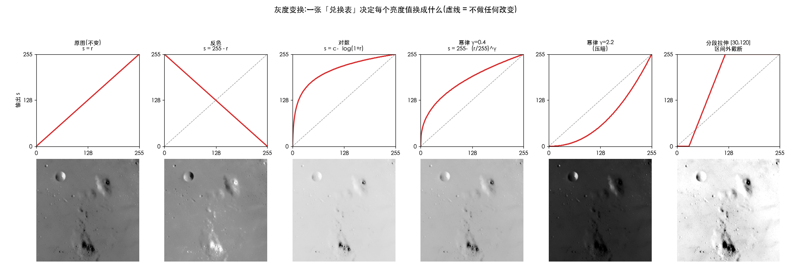
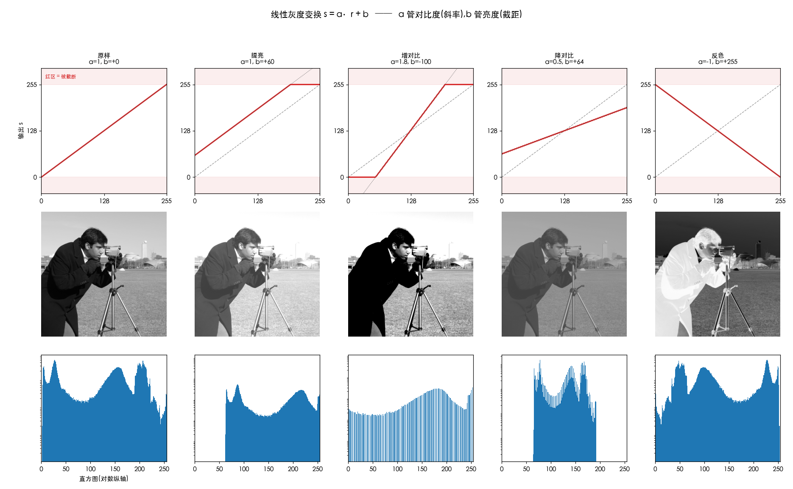
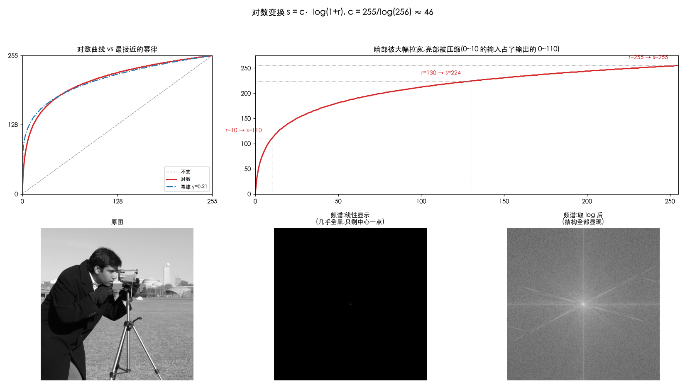
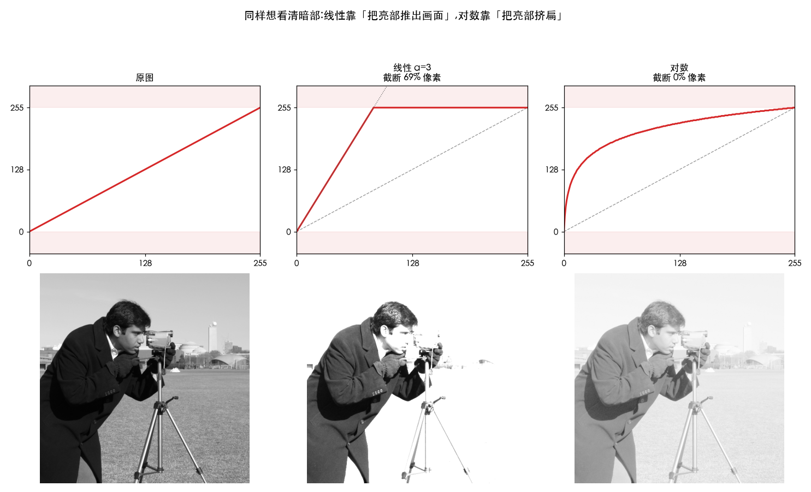
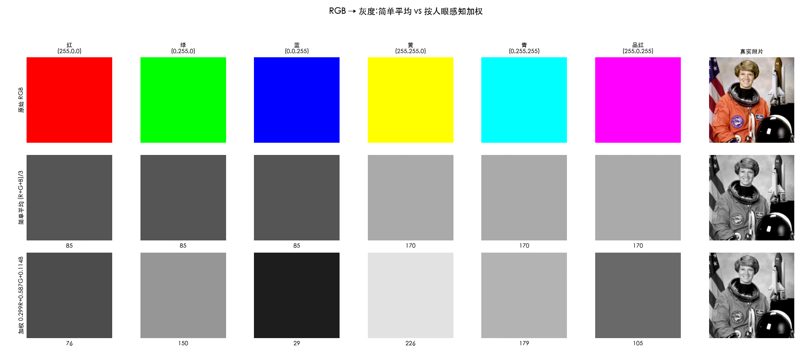
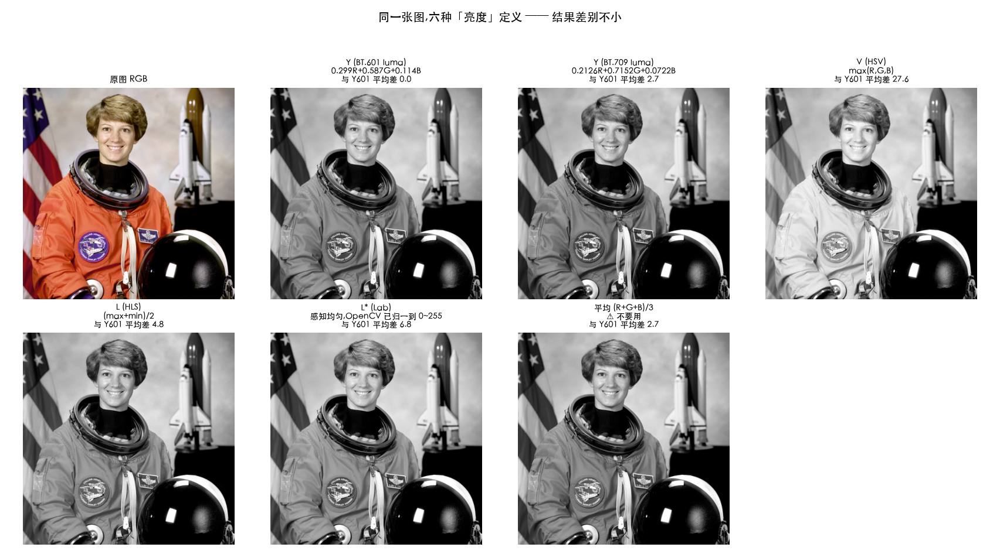

# 灰度与亮度速查

> 覆盖第 3 章 3.2(灰度变换)与"从彩色图取亮度"这一跨章节话题。
>
> **零~四节讲"怎么改亮度"(线性/对数/幂律),五~八节讲"怎么拿到亮度"(从 RGB/YUV/HSV…)。**
>
> 想看**方法大全 + 效果图 + OpenCV 代码**(还包括反转、对比度拉伸、灰度级分层、比特平面、阈值化),
> 见 [gray-transform-tutorial.md](gray-transform-tutorial.md)。
> 相关代码:[IAIntensityModule.m](../ImageAlgorithm/ImageAlgorithm/Modules/IAIntensityModule.m)、
> [00_yuv_warmup.py](../Python-Prototyping/Ch06_Color_Processing/00_yuv_warmup.py)

## 零、三句话看懂

灰度变换就是**给每个像素换个亮度**,换法只看它自己现在多亮,不管旁边的人(这叫**点运算**)。
门口贴一张**兑换表**:举 100 的一律换成 178,举 200 的一律换成 220。全图照表换牌,就变了。

三种换法,一句话各自是:

| | 大白话 |
| :--- | :--- |
| **线性** | 整体调亮 / 调暗,或者加大明暗反差 |
| **对数** | 把暗处**掰开**看清楚,代价是亮处糊成一片 |
| **幂律(伽马)** | 和对数一个思路,但**强度装了个旋钮**,还能反着来压暗 |

它们的关系:

```
        线性(直线)  ——  没法做到"暗部陡、亮部平",只能靠截断
                            ↓
        对数(弯曲线) ——  能了,但弯多少是固定的
                            ↓
        幂律(弯曲线) ——  弯多少你说了算(γ 旋钮),还能反向弯
```



上图第一行就是"兑换表"画成的曲线:横轴是原来举几,纵轴是要换成几,灰虚线代表原样不变。
**曲线往上弯 = 提亮,往下弯 = 压暗,倒过来 = 反色,变陡 = 增对比。**

## 一、线性变换 s = a·r + b



### 两个旋钮,做的事完全不同

很多人以为线性就是"整体提亮",**只说对了一半**:

| 旋钮 | 干什么 | 直线怎么动 |
| :--- | :--- | :--- |
| **b**(截距) | 每个像素**加** b | 整条线**上下平移** |
| **a**(斜率) | 每个像素**乘** a | 整条线绕原点**转动** |

**b 才是真正的整体提亮**——不管明暗一律 +50。

**a 不是**。它是按比例放大,所以绝对增量差很多:

| 输入 | a=3 后 | 增量 |
| :--- | :--- | :--- |
| **0** | **0** | **+0** ← 纯黑一动不动 |
| 5 | 15 | +10 |
| 50 | 150 | +100 |
| 200 | 600 → 截断 255 | 爆了 |

**越亮涨得越多,纯黑不动。** 这是 a 最容易被误解的地方。

### 反色只是它的一个特例

| 名字 | a | b |
| :--- | ---: | ---: |
| 原样 | 1 | 0 |
| 亮度调节 | 1 | ±k |
| **反色** | **−1** | **255** |
| 窗口/拉伸 | 255/(hi−lo) | −lo·a |
| 阈值(二值化) | a→∞ | — |
| 折线变换 | 分段各一组 (a,b) | |

VC++ 参考里第四章那一堆方法(反色/窗口/折线/阈值),**底层只有 `s = a·r + b` 一个公式**,
区别只在 a、b 怎么取、分几段。

### 根本局限:直线做不到"暗部陡、亮部平"

想看清暗部就得把斜率调大,但斜率是**全局统一**的——暗部拉开的同时,亮部必然冲出 255 被拍平。
**截断是不可逆的**,拍平的信息永远回不来。

代码里那句 clamp 就是在做这件事:

```objc
lut[r] = (uint8_t)lround(fmin(fmax(a * r + b, 0.0), 255.0));   // 超出的部分被剪掉
```

App 的灰度模块会实时显示截断比例,拖 a 就能看见它涨起来。

### 顺带一提:它其实是"仿射"不是"线性"

数学上线性要求 f(0)=0,而 `s = a·r + b` 在 b≠0 时不满足。严格说是**仿射变换**。
这和几何那边"仿射变换被口语叫成线性变换"是同一种松散叫法——
`+b` 在灰度空间的地位,正对应 `+平移` 在几何空间的地位。

## 二、对数变换 s = c·log(1+r)



### 它在干什么:把暗处掰开

暗处的细节全挤在 0~10 这一小段里,只有 10 个台阶,人眼分不出来,看着就是一团黑。
对数把这 **0~10 硬拉成 0~110**,台阶变 110 个,层次就出来了。

实测:

| 输入区间 | 变成 | 效果 |
| :--- | :--- | :--- |
| 0 → 10 | 0 → 110 | **放大 11 倍** |
| 245 → 255 | 253 → 255 | **压缩到 0.18 倍** |

总共只有 256 个台阶,暗处多拿,亮处就得少拿。**牺牲亮部,换暗部。**

两个小设计:`1+r` 是为了避开 `log(0) = −∞`(且 log(1)=0,黑还是黑);
`c = 255/log(256) ≈ 46` 是为了让 r=255 正好映射到 255,铺满范围。

### 与线性的关键区别:挤扁 vs 剪掉



同样想看清暗部,两者的代价完全不同:

| | 做法 | 实测截断 |
| :--- | :--- | ---: |
| 线性 a=3 | 把亮部**推出画面**,超出的剪掉 | **69% 像素被截断** |
| 对数 | 把亮部**挤扁**,但都还在画面里 | **0%** |

比喻:把长纸条塞进固定长度的相框。线性是等比放大后**用剪刀剪掉**超出部分;
对数是左端拉长、右端压缩,**整张都还在框里**,只是右端字变小了。剪掉的回不来,压小的还看得见。

而且对数在极暗处的提亮能力**反而远超线性**:

```
r=5    线性 a=3 → 15(还是黑)      对数 → 82(看得见了)
```

因为暗部数值本来就小,乘 3 还是小;但同一个 a=3 已经足以把 85 以上全推爆。
**线性两头不讨好。**

### 杀手级用途:看傅里叶频谱

这是对数最不可替代的场景,也是**第 12~14 周**要用的。实测一张图的频谱:

```
最大值 3.383e+07    最小值 1.031e+01    比值 328 万倍
```

**328 万倍的差距要塞进 256 个灰度级**。线性映射的话,除了最大值那一点,其他除下来都不到 1,
四舍五入全成 0 —— 屏幕上就是一片黑,只剩中心一个点(见上图中间那张)。

取 log 后比值从 328 万变成 7.5,轻松装下,频谱结构全部显现。所以频谱显示的标准写法永远是:

```python
spectrum = np.log(1 + np.abs(F))    # 这个 log 不是可选项,是必需品
```

## 三、幂律 / 伽马变换 s = 255·(r/255)^γ

**一句话:和对数同一个思路,但强度装了个旋钮,还能反向。**

| γ | 曲线 | 效果 |
| :--- | :--- | :--- |
| γ < 1 | 往上弯 | 提亮暗部(和对数同方向) |
| γ = 1 | 直线 | 什么都不做 |
| γ > 1 | 往下弯 | 反过来,压暗 |

实测**最接近对数曲线的是 γ ≈ 0.21**(平均差 3.5 个灰度级)。所以:

> **对数 = 固定档位的幂律**(相当于 γ≈0.2,且只能往提亮方向)
> **幂律 = 可调档位**,温和一点或反向压暗都行

日常调图用幂律(可控);动态范围爆表的数据用对数。

### 幂律 / 伽马 / 伽马校正:三个词的分工

| 词 | 指什么 |
| :--- | :--- |
| **幂律变换** | **数学形式**的名字 —— 输出是输入的幂函数 |
| **伽马 (γ)** | 公式里**那个指数的符号名** |
| **伽马校正** | **用途**的名字 —— 用幂律抵消显示设备的非线性 |

在图像处理语境下前两者可互换,冈萨雷斯书的小节标题就写成 "Power-Law (Gamma) Transformations"。

"伽马**校正**"有时特指**反向那一次**:

```
屏幕物理特性:  发光 ≈ 信号^2.2          ← 天生的非线性
存图时补偿:    存的值 = 亮度^(1/2.2)    ← 这次才叫"校正"
显示时抵消:    发光 = 存的值^2.2 = 亮度  ← 一来一回还原
```

### 为什么屏幕要绕这一圈

人眼**对暗部敏感、对亮部迟钝**(韦伯-费希纳定律:1 根蜡烛加到 2 根很明显,
100 根加到 101 根察觉不到)。8 位只有 256 档,平均分配的话暗部不够用、亮部浪费。
gamma 编码**把档位按人眼敏感度重新分配**——暗部多给几档,亮部少给几档。

这也解释了为什么对数/gamma 变换"看起来自然":它们在模仿眼睛自己的响应曲线。

### ⚠️ sRGB 不是纯粹的幂律

实测:

```
sRGB 曲线 vs 纯幂律 γ=2.2
  最大偏差 0.85%,约 2.2 个灰度级
  根本差异:sRGB 在最暗处 (V<0.04045) 接了一段直线,斜率 0.0774
           纯幂律在 V=0 处切线水平(斜率 0)
```

sRGB 特意在近黑处用直线,因为纯幂律在 0 附近导数为 0,量化和求逆时数值不稳定。

**工程后果**:"gamma 2.2" 只是 sRGB 的近似。日常够用(差 2 级看不出),
但做精确色彩管理、HDR 转换时必须用真正的 sRGB 分段公式,不能拿 `pow(x, 2.2)` 糊过去。
同理 BT.709/BT.2020 各有自己的转移曲线,HDR 的 PQ/HLG 更是完全不同的函数——
所以视频圈现在说 **OETF / EOTF**(光电转移函数),而不笼统说 gamma。

## 四、为什么工程上一律用 LUT

一张 1080p 图有 207 万像素,但像素值**只有 256 种可能**。所以:

```
先算 256 次,列成表  →  207 万个像素挨个查表(一次数组访问)
```

比逐像素调用 `pow()` 快几十倍。任何"只看自己"的亮度调整都能塌缩成一张 256 项的表。

```objc
// 建表:只跑 256 次
for (int r = 0; r < 256; r++) { lut[r] = /* 公式 */; }
// 应用:每像素一次查表
d[0] = lut[s[0]];  d[1] = lut[s[1]];  d[2] = lut[s[2]];
```

> 第 9 周的 3D LUT 是同一思路的彩色版:表从 256 项变成 33×33×33 的立方体,
> 输入从 1 个数变成 RGB 三个数,查表变成三线性插值。

### 一个限制:点运算只能重排,不能新增灰度级

- **a > 1**(拉伸):输入 100 和 101 → 输出 80 和 82,**81 这一级永远没有像素**
  → 直方图变成**梳子状**,带缝隙
- **a < 1**(压缩):输入 100 和 101 → 都变成 114,**两级合并,信息永久丢失**

这是第 5 周直方图均衡化的核心前提:**任何点运算都只能重排/合并灰度级,不能凭空造出新的**。
所以均衡化后的直方图不可能真正平坦。

## 五、从 RGB 拿灰度:加权,不是平均



**简单平均 `(R+G+B)/3` 是错的**:纯红/纯绿/纯蓝都会变成同一个灰 (85),
但人眼明显觉得绿比蓝亮得多。

正确做法是**按人眼感知加权**(视网膜锥状细胞对绿最敏感、对蓝最迟钝):

```
灰度 = 0.299·R + 0.587·G + 0.114·B     (BT.601)
        ~30%      ~59%      ~11%
```

加权后:红 76、绿 150、蓝 29 —— 与视觉一致。三个系数之和为 1,保证纯白仍是 255。

### 三套系数

| 标准 | Kr | Kg | Kb | 场景 |
| :--- | ---: | ---: | ---: | :--- |
| BT.601 | 0.299 | 0.587 | 0.114 | 标清视频、OpenCV 默认、本仓库代码 |
| BT.709 | 0.2126 | 0.7152 | 0.0722 | 高清 (1080p+) |
| BT.2020 | 0.2627 | 0.6780 | 0.0593 | 4K / HDR |

系数不同是因为显示器的三基色变了(现代屏幕的绿更纯更亮),"绿贡献多少亮度"要重算。

### 关键认知:灰度 = YUV 的 Y

**同一个公式,三个名字**:

| 名字 | 出现在 |
| :--- | :--- |
| 灰度图 | 图像处理教材 |
| Y 分量 / luma | 视频、推流 |
| 亮度通道 | 调色软件 |

第 1 周写 `00_yuv_warmup.py` 时算的那个 Y,就是灰度。这也解释了早期黑白电视为什么
能收彩色广播——它只解 Y 这一路。

## 六、不同图像类型怎么取灰度

| 图像类型 | 方法 | 代价 |
| :--- | :--- | :--- |
| 灰度图 | 本身就是 | 0 |
| **YUV / YCbCr / NV12 / I420** | **直接取 Y 平面** | **0** ⭐️ |
| RGB / RGBA | 加权公式 | 每像素 3 乘 2 加 |
| HSV / HSL | V 或 L 通道,**但不是感知亮度** | 0(语义不同) |
| Lab | L* 通道,感知均匀,最"正确" | 0(但 RGB→Lab 很贵) |
| CMYK | 先转 RGB 再加权 | 较贵 |
| 索引色 / 调色板 | 先查调色板拿 RGB,再加权 | 查表 |
| 二值图 | 只有 0/255,已是灰度 | 0 |
| Bayer RAW | **必须先去马赛克** | 很贵 |

### ⭐️ 工程要点:YUV 不要绕道 RGB

```
❌ NV12 → 转 RGB → 加权算灰度       三步,每像素十几次运算
✅ NV12 → 直接读 Y 平面             零运算,连拷贝都不用
```

NV12 / I420 里 Y 是**独立连续的一块内存,就在缓冲区最前面**:

```
┌──────────────────────┐
│  Y 平面 (W × H)       │  ← 这一整块就是灰度图,拿指针直接用
├──────────────────────┤
│  UV (W × H/2)         │  ← 做灰度时完全不用碰
└──────────────────────┘
```

摄像头帧做人脸检测、边缘检测、运动检测等只需亮度的算法,直接把 Y 平面指针递过去。
顺带也解释了 4:2:0 为何合理:**亮度全保留,只砍颜色**。

## 七、六种"亮度"定义的区别



同一张图,不同定义结果差别不小(下表的"差异"是与 Y601 的平均绝对差):

| 定义 | 公式 | 与 Y601 差异 | 该用在哪 |
| :--- | :--- | ---: | :--- |
| **Y (BT.601)** | 0.299R+0.587G+0.114B | — | 灰度图、视频 luma |
| Y (BT.709) | 0.2126R+0.7152G+0.0722B | 2.7 | 高清视频 |
| **V (HSV)** | `max(R,G,B)` | **27.6** | 调饱和度、色彩分层、绿幕判绿 |
| L (HSL) | `(max+min)/2` | 4.8 | 拾色器 |
| L* (Lab) | 感知均匀 | 6.8 | 色彩科学、精确匹配 |
| 平均 | `(R+G+B)/3` | 2.7 | ❌ 不要用 |

### 最常见的坑:把 HSV 的 V 当亮度

`V = max(R,G,B)` 不管颜色是什么,只取最大通道:

- 纯红 (255,0,0) → V = 255
- 纯蓝 (0,0,255) → V = 255 ← 一样亮?人眼可不这么看

**V 不是亮度,它是"这个颜色有多接近纯色"**。上图里橙色宇航服在 V 通道里发白,
就是因为 R 通道很高。

### Lab 的 L*:最"正确"但最贵

L* 是**感知均匀**的:L 从 50→60 和从 20→30,人眼感觉到的变亮程度相同;Y 不具备这个性质。
代价是 RGB→Lab 需要线性化 + 立方根。做算法研究值得,实时视频用不起。

## 八、一个进阶坑:luma vs luminance

上面算的严格叫 **luma (Y′)** —— 在 **gamma 编码后**的数值上加权。
物理意义上真正的**亮度 (luminance, Y)** 应该先把 RGB 转回线性光、加权、再转回来。

工程上几乎都用前者(简单、够用、视频标准如此定义)。做 HDR 或精确色彩科学时,
这个区别会咬人。详见第 8 周。

## 速查结论

**怎么改亮度**

| | 一句话 | 什么时候用 |
| :--- | :--- | :--- |
| **线性** `a·r+b` | b 整体平移,a 放大差距(纯黑不动) | 微调、要精确可控;亮部本来就没内容 |
| **对数** | 把暗处掰开,亮处挤扁(不丢) | 动态范围大到几百万倍(频谱) |
| **幂律** `r^γ` | 可调强度的对数,还能反向压暗 | 日常调图、设备校正 —— 工业标准 |

**怎么拿到亮度**

> 先看数据格式:已经是 YUV 就白捡一个 Y;是 RGB 才需要加权;HSV 的 V 长得像亮度但不是。

**一个永远成立的限制**

> 点运算只能**重排/合并**灰度级,不能凭空造出新的。拉伸出梳子,压缩必丢失,截断不可逆。
