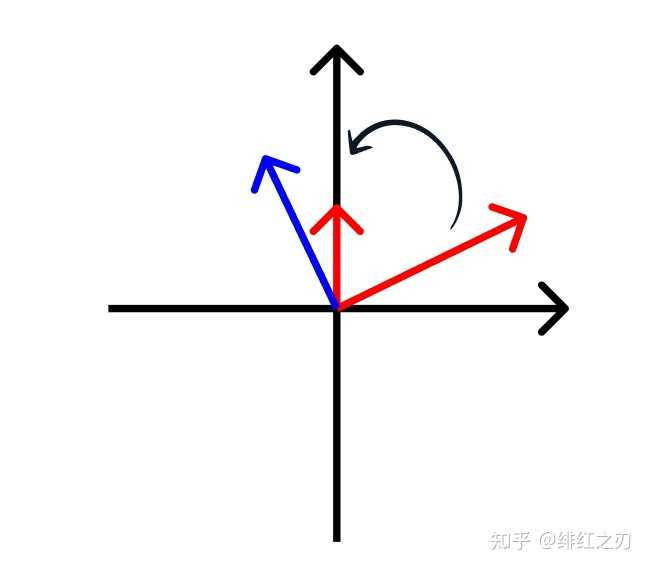
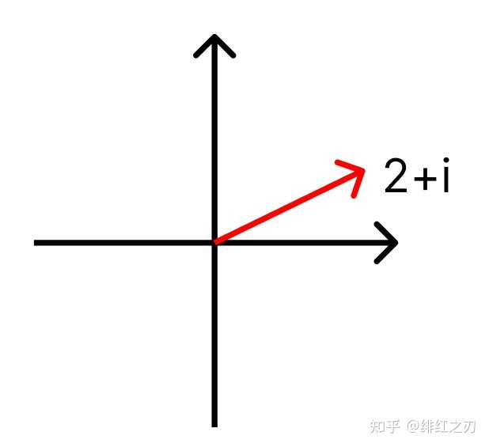
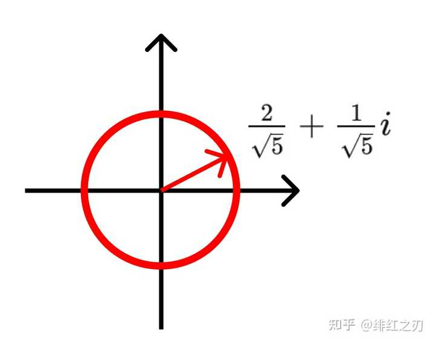
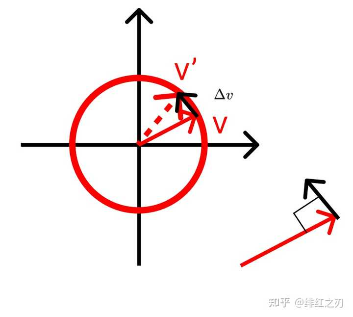
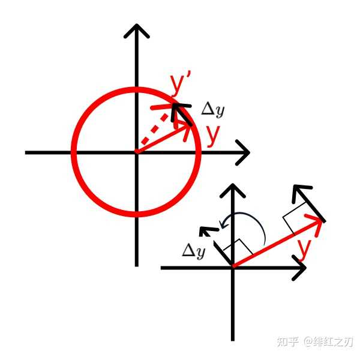
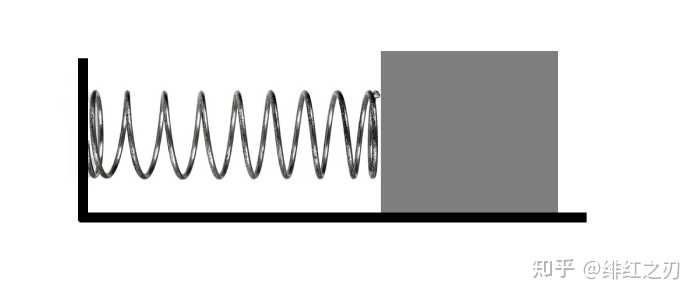
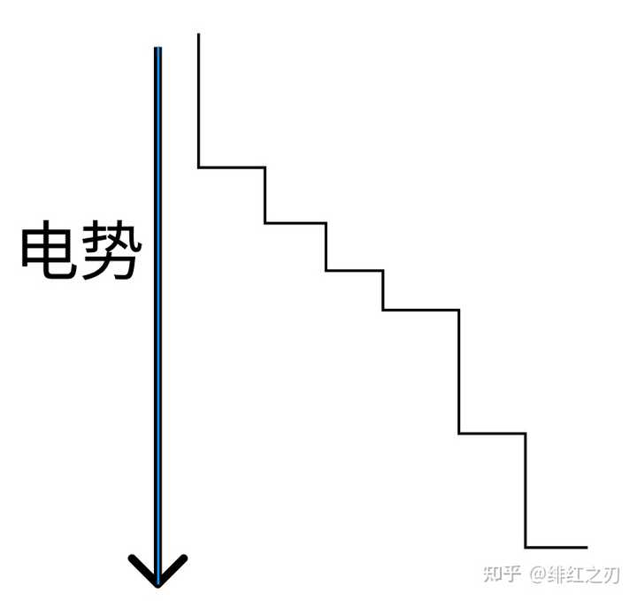
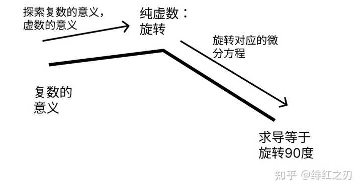

# 如何直观理解欧拉公式？

> **关于这篇**
>
> 正文是一篇外部回答的存档（出处见文首 `source`），**原文一字未改**。凡是带 📝 **补充** 或 ⚠️ **勘误** 的引用块，以及最后两节（`代进去验一遍`、`它在图像处理里干什么`），都是后加的。补充里的每个数字都能用 [`30_euler_formula.py`](../../Python-Prototyping/Ch04_Frequency_Domain/30_euler_formula.py) 复现。
>
> **一句话版**：乘 $i$ 就是转 90°；沿圆转动的向量，它的变化率恰好是它自己转 90°，也就是乘 $i$；于是它满足 $y'=iy$，解出来是 $e^{ix}$，而它本身又等于 $\cos x+i\sin x$。
>
> **怎么读这篇**
>
> | 有多少时间 | 看哪几节 |
> | :--- | :--- |
> | **只有 10 分钟** | 上面那句话 + `证明方法` 一节（读到「妙！」为止，中间的 📝 补充块可先跳过） |
> | **第一遍学** | 再加 `第一种理解`，和最后的 `代进去验一遍` |
> | **踩坑时回来查** | `第二种理解` 里的 ⚠️ 勘误块、`后记`，以及 `它在图像处理里干什么` |

> ## Excerpt
> 欧拉公式 $e^{i\pi}+1=0$ 是一个非常美妙的公式，可以说是充满了艺术。我们在微积分里学的欧拉公式是用指数函数、正弦函数、余弦函数的泰勒展开式通过比对求出来的。但是还有一种极其简单，极其美妙的证明方法。就是你只要稍微对微积分有一点点了解就能看懂这种证法。而且这种证法我个人认为是更接近欧拉公式本质的证法的，而通过泰勒展开式比对那种证法多少有点“奇技淫巧”的意味。这个证法不是我想出来的，是我用的

---
欧拉公式 $e^{i\pi}+1=0$ 是一个非常美妙的公式，可以说是充满了艺术。我们在微积分里学的欧拉公式是用指数函数、正弦函数、余弦函数的[泰勒展开式](https://zhida.zhihu.com/search?content_id=589672036&content_type=Answer&match_order=1&q=%E6%B3%B0%E5%8B%92%E5%B1%95%E5%BC%80%E5%BC%8F&zhida_source=entity)通过比对求出来的。但是还有一种极其简单，极其美妙的证明方法。就是你只要稍微对微积分有一点点了解就能看懂这种证法。而且这种证法我个人认为是更接近欧拉公式本质的证法的，而通过泰勒展开式比对那种证法多少有点“奇技淫巧”的意味。

这个证法不是我想出来的，是我用的别人的思路，本尊在这里：[吾欲揽六龙：利用复数和几何对诱导公式，正弦余弦求导以及欧拉公式推导的优化（这三者明明是一个整体嘛）](https://zhuanlan.zhihu.com/p/585060048?utm_campaign=shareopn&utm_medium=social&utm_oi=1048684872029339648&utm_psn=1653176915774058496&utm_source=wechat_session)。我个人写完他的这个证法以后再对这个思路再进行一点小小的补充。

首先说怎么证吧，说完怎么证以后写写我理解的这种证法是怎么想出来的，然后再加点前言和后记。

## 证明方法

欧拉公式涉及到 $e,\pi,i$ 这三个东西，其中 $e$ 和 $\pi$ 都是实数，而 $i$ 是虚数，是最“神秘”的数字。所以我们就着重看看这个 $i$ 。

### 复数和旋转

这个 $i$ 是虚数单位，虚数的作用是扩充了一个坐标轴，把数字从一个轴（实轴）增加到了两个轴（实轴+虚轴），数字的范围从实数扩张到复数。众所周知，复数一个应用就是表示旋转，任意两个复数相乘，模长等于两个复数模长的乘积，辐角等于两个复数辐角的和。举个简单的例子，比如 $(2+i)\times i=-1+2i$ ，用图像表示是：

相当于对 $(2+i)$ 这个数字旋转了90度。

所以，复数乘法的一个特例是，一个数字乘以 $i$ ，相当于逆时针旋转90度。

> 📝 **补充：为什么坐标是 $(a,b)\to(-b,a)$**
>
> 原文只给了结果。展开一遍：$(2+i)\cdot i=2i+i^2=-1+2i$，坐标 $(2,1)$ 变成了 $(-1,2)$。一般地 $(a+bi)\cdot i=ai+bi^2=-b+ai$，即 $(a,b)\to(-b,a)$。把 $(a,b)$ 想成从原点指出去的箭头，这个变换就是把箭头逆时针掰了 90°，而且**长度不变**：
>
> | 点 $(a,b)$ | 乘 $i$ 之后 | 转了 | 模长 |
> | :--- | :--- | ---: | :--- |
> | $(2,1)$ | $(-1,2)$ | 90.0° | 2.2361 → 2.2361 |
> | $(3,0)$ | $(0,3)$ | 90.0° | 3.0000 → 3.0000 |
> | $(0,2)$ | $(-2,0)$ | 90.0° | 2.0000 → 2.0000 |
> | $(1,1)$ | $(-1,1)$ | 90.0° | 1.4142 → 1.4142 |

### 三角函数求导

三角函数，顾名思义来源于三角，准确讲叫直角三角形。哪里有直角三角形呢？坐标系上，随便一个数字，往 $x$ 轴上连个线，往 $y$ 轴上连个线，就是直角三角形。坐标系这个东西，很显然跟复数可以联系起来：复数就是一个二维平面的坐标系。二维坐标系上的点和复数是一一对应的，这是显然的：

复数有两个性质：一个是模长，一个是辐角。这两个性质可以唯一决定一个复数。我们现在不关心模长，只关心辐角（至于为什么不关心模长，你往下看就知道了），那么我们只寻找模长为1的复数。这时候我们就可以锁定一个单位圆了： $\frac{2}{\sqrt{5}}+\frac{1}{\sqrt{5}}i$

然后我们让这个单位圆旋转起来：在上面随便找个向量，让它逆时针旋转，看它在 $\Delta t$ 时间转了多少：

首先，运动可以理解为函数，函数可以理解为运动。上面这种运动，是在单位圆上的运动，它有什么特点呢？它的角度是任意的，而模长是固定的，当我们锁定某个角度的时候，我们就确定了一个点。那么，角度（可以动的量）就是自变量，那个点（跟着角度动的量）就是因变量。角度是 $x$ ，那个点的坐标是 $y$ 。那个点的坐标，也可以理解为从原点指向那个点的向量。我们用复数表示那个点的坐标。很显然，在单位圆上，那个点的横坐标是 $\cos x$ ，纵坐标是 $\sin x$ 。所以那个点用复数表示是 $\cos x+i\sin x$ 。所以，我们得到了自变量 $x$ 和因变量 $y$ 之间的关系： $y=\cos x+i\sin x$ 。

再说 $y$ 的导数。 $y$ 的导数，就是 $x$ 增加了一个微小的增量后， $y$ 跟着增加了一点点，变成 $y'$ ，这个 $y'$ 和 $y$ 的差值，比上 $x$ 的增量，就是 $y$ 对 $x$ 的导数。很显然， $\Delta y$ 和 $y$ 是垂直的，而且， $\Delta y$ 相当于 $y$ 逆时针旋转90度，如下图：

而刚才我们说了，旋转90度相当于乘了 $i$ 。我们再考虑上 $\Delta y$ 的模长是未知的，所以 $\Delta y$ 的表达式是：

$y'=\frac{dy}{dx}=iky=ik(\cos x+i\sin x)=k(-\sin x+i\cos x)$ ，这个 $k$ 是某个常数。我们根据旋转的物理意义， $\Delta y$ 就是速度，于是有 $\Delta S=r\Delta t=v\Delta t$ ，而 $r=1$（单位圆），所以 $v=1$，也就是 $\Delta y$（也就是 $y'$）模长为1，所以 $k=1$，所以 $y'=iy$ ，

> 📝 **补充：「很显然」那两句，拆开说**
>
> 原文说 $\Delta y$ 与 $y$ 垂直、模长为 1，都用「很显然」带过。拆成两句：
>
> - **垂直**：$y$ 在单位圆上，模长始终是 1。每一小步如果沿半径走，模长就变了，所以只能沿切线走；而切线垂直于半径。
> - **模长等于 $\Delta x$**：弧长 = 半径 × 角度 = $1\times\Delta x$，所以 $|\Delta y|\approx\Delta x$，即 $|y'|=1$（这和原文用「速度 $v=1$」说的是同一件事）。
>
> 取 $x=0.5$、$\Delta x=10^{-6}$ 实测：$y$ 与 $\Delta y$ 的点积是 $-5.0\times10^{-13}$（0 就是垂直），$|\Delta y|/\Delta x=1.000000000$，$\Delta y/\Delta x$ 与 $iy$ 只差 $5.0\times10^{-7}$。$\Delta x$ 从 0.1 缩到 $10^{-4}$，这个差从 $5.0\times10^{-2}$ 一路线性缩到 $5.0\times10^{-5}$ —— 这就是「导数是 $\Delta x\to0$ 的极限」在数上的样子。

写成微分形式 $\frac{dy}{dx}=iy$ ，变型 $\frac{dy}{y}=idx$ ，两边积分 $\ln y=ix+C$ ，由于当 $x=0$ 的时候， $y=1$，带入得 $C=0$ ，所以 $\ln y=ix$ ，两边做指数运算， $y=e^{ix}$ 。刚才说过 $y=\cos x+i\sin x$ ，所以有 $e^{ix}=\cos x+i\sin x$ 。

> 📝 **补充：积分那一步容易卡住，有一种写法可以绕开**
>
> $\ln y=ix+C$ 用到了复数的对数，而复数的对数不像实数那样只有一个值（转一圈回到原处，辐角相差 $2\pi$），读到这儿容易卡住。绕开它的写法：令 $g(x)=y(x)\,e^{-ix}$，则
>
> $$g'=y'e^{-ix}-iy\,e^{-ix}=(y'-iy)\,e^{-ix}=0\quad(\text{因为 }y'=iy)$$
>
> 导数处处为 0，所以 $g$ 是常数，而 $g(0)=1\cdot1=1$，于是 $y=e^{ix}$。数值上看 $g$：$x=0,\,0.5,\,1,\,2,\,\pi,\,5$ 处全是 $1.000000000000+0i$。
>
> 不过两种写法都默认 $e^{ix}$ 已有定义、且求导仍是 $\frac{d}{dx}e^{ix}=ie^{ix}$。真要严格，得把 $e^z$ 定义成幂级数 —— 那就是最后 `代进去验一遍` 里「泰勒展开」那条路。

> 📝 **补充：亲眼看它转起来（每步沿切线走一小步）**
>
> $y'=iy$ 翻译成人话就是：**每一步，$y$ 沿着「它自己转 90°」的方向走一小步**。照这个规矩走，从 $y(0)=1$ 出发，每步 $y\leftarrow y\,(1+i\,\Delta x)$，一共走到 $x=\pi$（$\Delta x=\pi/N$）：
>
> | 步数 $N$ | 终点 | 终点的模长 | 离 $-1$ 有多远 |
> | ---: | :--- | ---: | ---: |
> | 10 | $-1.5934+0.1561i$ | 1.600987 | $6.1\times10^{-1}$ |
> | 100 | $-1.0506+0.0011i$ | 1.050560 | $5.1\times10^{-2}$ |
> | 1000 | $-1.0050+0.0000i$ | 1.004947 | $4.9\times10^{-3}$ |
> | $10^6$ | $-1.0000+0.0000i$ | 1.000005 | $4.9\times10^{-6}$ |
>
> 两件事值得看。**终点确实奔着 $-1$ 去**，也就是 $e^{i\pi}=-1$。**折线总是略微向外飘**（模长大于 1）：每一步 $|1+i\Delta x|=\sqrt{1+\Delta x^2}>1$，因为切线垂直于半径，斜边总比直角边长。步子越小飘得越少，$N\to\infty$ 时飘出的部分趋于 0，这时折线就贴成了圆。

我当时看到这个欧拉公式的证明方法的时候，我的感受就是一个字：妙！太妙了！

于是我马上思考一个问题：这种证法是怎么想出来的？

## 这种证明方法是怎么想出来的？

我说说我个人的理解。有两种理解方法（其中第二种理解是我参考的一个UP主，但是我具体参考的哪个UP主我给忘了）。

### 第一种理解：旋转、微分方程

先说说微分方程这个东西吧。微分方程是用来干什么的？是用来描述物体的微观运动，从而推导出物体的宏观运动模式的。说几个典型的微分方程的应用：

1，弹簧连着物体的运动

假设这个地面没有摩擦，那么物体在水平方向上受到的力，就是弹簧给它的，由弹簧的[胡克定律](https://zhida.zhihu.com/search?content_id=589672036&content_type=Answer&match_order=1&q=%E8%83%A1%E5%85%8B%E5%AE%9A%E5%BE%8B&zhida_source=entity)，有 $F=kx$ ，我们为了方便把弹簧处于平衡位置时物体的位置记为原点，那么我们可以直接用那个公式，加上我们对正负号，有 $F=-kx$ 。然后根据牛顿第二定律 $F=ma$ ，并且根据我们对物理量的定义， $a$ 是 $x$ 对 $t$ 的二阶导数，所以我们有 $-kx=m\frac{d^2x}{dt^2}$ ，把这个方程解出来是 $x=A\sin(\omega t+\varphi)$ ，其中 $\omega$ 和 $\varphi$ 是关于 $k$、$m$ 和初始量的数字。

> 📝 **补充：$\omega$ 到底是多少**
>
> 原文说 $\omega$、$\varphi$ 是「关于 $k$、$m$ 和初始量的数字」。代回去就能算出来：$x=A\sin(\omega t+\varphi)$ 的二阶导是 $x''=-A\omega^2\sin(\omega t+\varphi)=-\omega^2x$，代入 $-kx=mx''$ 得 $-kx=-m\omega^2x$，所以
>
> $$\omega=\sqrt{k/m}$$
>
> 而 $A$、$\varphi$ 才由初始位置和初始速度决定。验证（$k=4,\ m=1$，所以 $\omega=2$）：用二阶差分算 $x''$，$-kx-mx''$ 的残差最大 $8.6\times10^{-7}$；换成一个错的 $\omega=1.5$，残差是 1.22，不是解。

我们不知道这个物体的运动方程是什么，但是我们可以通过对这个物体的受力分析，得出它的微分方程，从而把整个运动规律推导出来。为什么要先得出微分方程？因为我们对物体受力分析的时候，我们是对物体的一个局部的状态进行分析，这是一种静态的分析：把物体暂时视为静态的。而全局是动态的。静态的和动态的东西相比，是可以简化问题的。

2，电势

一个带电物体，它周围电场，我们想知道的是，把另一个带单位电荷的物体移动到它附近的时候，做的功是多少？

为了解这个问题，理论上我们是要建立一个函数，自变量是其他电荷（红色的电荷）到目标电荷（黑色电荷）的距离，因变量是目标电荷的电势。这个电势是个什么东西呢？就是相当于一系列高度不等的台阶：

你想象一个东西从台阶的最顶端往下滚，越滚越快。也就是，越靠下的位置，电势越低。台阶越陡的地方，电势的降落越快，这个降落的速度，就是电势对距离的导数，也就是其他电荷受到目标电荷的力。

也就是，电场力，就是电势对距离（和电场线垂直的距离）的导数： $E=\frac{dF}{dx}$ 。电势我们不好算，因为我们要算一个点的电势，就要看那么一大段上累积的“东西”，但是电场力是好算的，我们只需要把其他电荷放到某个位置上，看它受到的目标电荷的力是多大，就能知道电场力和距离之间的规律。而我们通过实验得到 $F=\frac{kq_1q_2}{r^2}$ ，把 $r$ 换成 $x$ 有 $F=\frac{kq_1q_2}{x^2}$ ，结合 $E=\frac{dF}{dx}$ ，有 $\frac{dE}{dx}=\frac{kq_1q_2}{x^2}$ ，这就是我们得到的微分方程。当然这玩意太简单了，退化为了一个普通的积分问题，直接得出 $E=-\frac{kq_1q_2}{x}$ ，我们把其他电荷的电量 $q_2$ 忽略掉，就是 $E=-\frac{kq_1}{x}$ 。

> ⚠️ **勘误：这一段里 $E$、$F$ 两个字母前后换了身份**
>
> 先说「电场力就是电势对距离的导数：$E=\frac{dF}{dx}$」，这里 $E$ 是力、$F$ 是势；下一句 $F=\frac{kq_1q_2}{x^2}$ 里 $F$ 又成了力；再到 $\frac{dE}{dx}=\frac{kq_1q_2}{x^2}$，$E$ 又成了势。最后的 $E=-\frac{kq_1q_2}{x}$ 其实是势能的**相反数**。
>
> 按通常的约定：势能 $U(x)=\frac{kq_1q_2}{x}$，力 $F=-\frac{dU}{dx}=\frac{kq_1q_2}{x^2}$（忽略 $q_2$ 后 $U/q_2$ 就是电势）。原文的 $E=-U$，所以对它求导得到的是 $+F$。令 $kq_1q_2=1$、取 $x=2$ 数值验过：$F=0.2500$，$-dU/dx=0.2500$，$+dE/dx=0.2500$，三者一致。
>
> 这一节想说的不受影响：**力好测 → 列出「导数 = 力」→ 积分得到势能**。

那么我们可以举一反三，搞一个关于 $i$ 的微分方程。

首先给你几秒钟时间思考一下，关于 $i$ 的微分方程大概长什么样子？会怎么搞出来？

这是一个头脑风暴，你不需要给出明确答案，你只需要想出一个思路就行。

----------公布思路

第一个阶段出发：复数：

第一层：这个 $i$ 是个虚数单位。

第二层：而虚数单位和实数构成复数，所以研究 $i$ 可以考虑研究复数。

第三层1：复数和实数的典型区别是，复数在二维平面，而实数在一维直线。所以，复数增加的性质，就是二维平面对一维直线的“优势”。

第三层2：当然，我们搞出复数以后，要把实数的运算规律推广到复数。实数可以加减，乘除，复数也可以加减，乘除（先不考虑复数除法）。

第四层：把复数乘法后的数字放在坐标轴上看看规律，我们得到：复数乘法可以视为缩放+旋转：我们乘一个复数，相当于把原向量（原复数）缩放一个倍数，这个倍数是复数的模长，然后旋转一个角度，这个角度是复数的辐角。

第五层：我们把问题简单化，找找特例：复数的特例是实数和纯虚数，那么，我们就看一个复数乘一个实数和乘一个纯虚数的情况：乘一个实数，相当于缩放一个倍数，不旋转，乘一个纯虚数，相当于旋转一个角度。

所以，**我们找到了纯虚数的一个意义：表示旋转**。这个结论很重要。

我们再看这个特例的特例：我们找到单位纯虚数，也就是虚数单位 $i$ 。乘这个 $i$ ，相当于旋转90度：

好的，第一个阶段我们结束了。我们得出了重要结论： $i$ 的意义，是复数对应的向量旋转90度。

第二个阶段出发：导数

第一层：刚才说到了旋转90度。那就看看旋转吧。想象一下，在二维平面上，一个向量，绕着原点一直在旋转。那么我们可以看看它的微分（改变了一点点的时候）是什么：

那个向量的导数（微分），就是那个向量的速度。因为，物理上，速度就是距离对时间的导数。那个向量，是原点到单位圆上某个点的距离，那个向量的速度，就是导数。我们知道那个导数（也看成一个向量）和原向量是时时刻刻都垂直的。而且，我们通过观察，发现那个导数所在的向量，是原向量旋转90度。通过对物理意义的分析，我们知道导数那个向量和原向量的模长是一样大的。

第二层1：这个导数的意义是，旋转90度，模长一样，这个和什么联系起来了？和 $i$ 联系起来了！所以，那个向量的导数，等于乘了 $i$ ！

第二层2：把这个过程描述的精确一点：那个向量有什么特点？它是在单位圆上运动的，只有角度在变，模长不变。所以，把它视为一个函数：自变量是角度，因变量是那个向量。我们把这个向量跟数字联系起来，很显然它就是一个复数，横坐标是 $\cos x$ ，纵坐标是 $\sin x$ 。所以，那个向量，是 $\cos x+i\sin x$ 。

第三层：综合一下：

对于一个向量 $y=\cos x+i\sin x$ ，它（对角度）的导数，等于它乘了 $i$ 。所以， $\frac{dy}{dx}=iy$ 。这个东西解出来就是 $y=e^{ix}$ 。于是， $e^{ix}=\cos x+i\sin x$ 。

待会再说说这个图。我故意放了个大图，我觉得这个图对我来说还是比较有启发性的，不知道对你是不是也有一点点启发。

### 第二种理解：补全复数运算：复数幂运算

我有时候喜欢从数学史上看一些问题。数学史上，一个问题怎么诞生的，人们为什么想要解决它，人们当时解决它的思路是什么，解决它以后这个问题怎么衍生的，这些东西，有时候是很有启发性的。

复数在数学史上就是一个比较有意思的东西。我们中学学的复数是解一元二次方程的时候，因为有的方程无解，所以我们制造一些新的数字，给它一个解。比如 $x^2=-4$ ，它的解是 $2i$ 和 $-2i$ 。但是，你当时可能会有个疑问：我们解这个方程有个毛用？这个方程我们没必要非得给它搞两个解啊。

如果你这么想的话，说明你上道了。

因为历史上的复数根本不是这么来的，而是解一元三次方程的时候来的。解一元三次方程的时候有可能会搞出来这种东西： $x=\sqrt[3]{5+\sqrt{-2}}+\sqrt[3]{5-\sqrt{-2}}$ ，这个东西其实是个实数，是有意义的，但是中间过程却出现了根号下负数这种东西。这时候人们没办法了，我们为了解释这个有意义的东西，就只能搞出来虚数这个东西了。

接下来的故事就跟我们的主题相关了。人们搞出虚数以后，就想把实数的运算规则扩充到虚数上。其实数学一直在干这么一个事情：当某种运算结果出现“非法”的东西的时候，我们就定义一些新的东西，让“非法”的操作变得“合法”。

## 证明方法

2.  我们从数学史上的数字看看是怎么做的：

1）一开始没有负数，只有 $0, 1, 2, 3, 4$ 这些自然数，人们知道 $2+3=5,5-2=3$ ，那么 $2-4$ 等于多少？就没人知道了。后来，人们定义了负数，就能算 $2-4$ 了。这时候，数字范围从自然数扩充到整数。

2）人们知道 $2\times 3=6,6\div3=2$ ，但是没人知道 $5\div 7$ 等于多少。后来，人们定义了分数，就能算 $5\div 7$ 了。分数+整数，就是有理数。于是，数字范围从整数扩充到有理数。

3）人们知道 $3^2=9,\sqrt{9}=3$ ，但是没人知道 $\sqrt{2}$ 等于多少。人们一开始以为这个东西也是分数，后来发现不是。后来人们定义这玩意叫无理数， $\sqrt{2}$ 就能算了。于是，数字范围从有理数扩充到无理数。

4）人们知道 $x^2=2$ 的解是 $x=\sqrt{2}$ 和 $x=-\sqrt{2}$ ，但是没人知道 $x^2=-2$ 的解是多少。后来人们定义了虚数，这玩意就能解了。于是，数字范围从有理数扩充到无理数。

> ⚠️ **勘误：这一条写重了**
>
> 第 4 条的后半句和上一条（第 3 条）一字不差，都写成「从有理数扩充到无理数」。虚数这一步应当是：数字范围从**实数**扩充到**复数**（实数 + 虚数 = 复数）。第 3 条严格说也是扩充到「实数」。
>
> 顺着读下来是一条链：自然数 → 整数 → 有理数 → 实数 → 复数。每走一步，都是为了让一种「不合法」的运算变合法。

2. 我们从数学史上看看指数运算是怎么扩充的（这个过程和上面数字的扩充几乎是一一对应的）：

1） $2^3\times 2^5=2^8$，$2^8\div 2^5=2^3$ ，所以 $a^ba^c=a^{b+c},\frac{a^c}{a^b}=a^{c-b}$ 。那么， $2^{0}$ 等于多少？它等于 $2^{3-3}=\frac{2^3}{2^3}=1$ ， $2^{-3}$ 等于多少？它等于 $2^{0-3}=\frac{2^0}{2^3}=\frac{1}{8}$ 。

2） $(2^3)^5=2^{15}$ ，所以 $(a^b)^c=a^{bc}$ 。那么， $2^{\frac{1}{3}}$ 等于多少？也就是 $a^{\frac{1}{c}}$ 等于多少？它等于 $(a^{\frac{1}{c}})^c=a,a^{\frac{1}{c}}=\sqrt[c]{a}$ ，也就是 $2^{\frac{1}{3}}=\sqrt[3]{2}$ ，这个东西的3次方等于2。那么， $2^{\frac{5}{3}}=(2^{\frac{1}{3}})^5$ ，就是3次方等于2那个数字，的5次方。

3） $2^i$ 等于多少？当时没人知道这个问题，后来欧拉对比了 $e^x,\cos x,\sin x$ 的泰勒展开式，告诉我们， $e^{ix}=\cos x+i\sin x$ 。

于是就到了我们今天的主题：复数的幂运算怎么解释？

我们可以类比一下。就是实数的幂运算是什么呢？比如 $2^3$ ，它相当于把实数那个数轴给拉伸了很多。所以，实数幂运算可以理解为拉伸一个数字。复数的幂运算是什么？当复数乘方一个实数的时候，比如 $(2+i)^2=3+4i$ ，它是模长放大到2倍，辐角放大到2倍。所以，复数乘方一个实数，仍然是拉伸。

> ⚠️ **勘误：模长是平方，不是 2 倍**
>
> $(2+i)^2=3+4i$ 没错，但「模长放大到 2 倍」不对：
>
> | | $2+i$ | $(2+i)^2=3+4i$ | 若是「2 倍」 |
> | :--- | ---: | ---: | ---: |
> | 模长 | 2.2361（$=\sqrt5$） | **5.0000**（$=(\sqrt5)^2$） | 4.4721 |
> | 辐角 | 26.565° | **53.130°** | |
>
> **模长是平方，辐角才是 2 倍。** 一般地 $(re^{i\theta})^n=r^n\,e^{in\theta}$：模长取 $n$ 次方，辐角乘 $n$。

那么，复数乘方一个虚数呢？我们可以思考：一维上的坐标变换（如果原点不动，不考虑平移）只有缩放（拉伸），二维上的坐标变换，除了缩放（拉伸），还应该有旋转。而复数乘方一个实数表示的是缩放，所以我们可以盲猜一波，复数乘方一个纯虚数，表示旋转。而我们知道复数乘法的意义是缩放+旋转，单位复数的意义是旋转。所以，复数乘方一个纯虚数，相当于乘了一个单位复数。也就是，大概是这样的： $2^i=\cos 2+i\sin 2$ ，只是大概。我们想到指数运算里有个类似于单位元的东西是 $e$ ，因为 $2^x$ 的导数是 $\ln 2\cdot 2^x$ ，任何一个指数函数的导数都是一个常数乘它自己，除了： $e^x$ 。只有这个指数函数的导数是它本身。也就是，它没有“缩放”这样的性质。

> ⚠️ **勘误：$2^i$ 的真值**
>
> 原文「盲猜」$2^i\approx\cos2+i\sin2=-0.4161+0.9093i$。猜测的**方向对**（纯虚数指数只转不缩，模长恒为 1），但转的角度不是 2 弧度。
>
> 先把底换成 $e$：$2=e^{\ln2}$，所以 $2^i=(e^{\ln 2})^i=e^{i\ln2}=\cos(\ln2)+i\sin(\ln2)=\mathbf{0.7692+0.6390i}$，转了 $\ln2\approx0.6931$ 弧度。一般地 $a^{ix}=e^{ix\ln a}$ —— **任何底的复数指数，最后都归结为一次旋转**。
>
> 指数律在复数里还成立吗？验过，一条不丢：
>
> | 等式 | 左边 | 右边 |
> | :--- | :--- | :--- |
> | $2^i\cdot2^i=2^{2i}$ | $0.1835+0.9830i$ | $0.1835+0.9830i$ |
> | $2^i\cdot2^{-i}=2^0$ | $1.0000+0.0000i$ | $1$ |
> | $2^{1+i}=2\cdot2^i$ | $1.5385+1.2779i$ | $1.5385+1.2779i$ |

那么，我们把底换成 $e$ 怎么样？根据刚才的思路，我们大概猜 $e^i=\cos 1+i\sin 1$ ，然后推而广之： $e^{ix}=\cos x+i\sin x$ 。所以我们就猜出来了欧拉公式。然后我们两边求导看它是不是一样的：

$$e^{ix}=\cos x+i\sin x \qquad (1)$$

两边求导：

$$ie^{ix}=-\sin x+i\cos x \qquad (2)$$

对比 (1) 和 (2)： $ie^{ix}=i(e^{ix})$,$-\sin x+i\cos x=i(\cos x+i\sin x)$，即 (2) 式子的左右两端都是 (1) 式子乘 $i$ 。

也就是，我们大概验证了一下，(1)式子求导以后搞出来的这个(2)没有出现什么矛盾。所以我们可以更笃定地猜：(1)式子是成立的。

当然这只是猜一下，不是什么严格的证明。

## 前言

一般是先写前言，但是我这里把证明过程写完了再写前言。

欧拉公式的背景是什么？是人们发现复数。发现复数的背景，是解一元三次方程，出现了 $x=\sqrt[3]{5+\sqrt{-2}}+\sqrt[3]{5-\sqrt{-2}}$ 这种东西，人们为了处理这个东西里根号下负数的情况，引入了虚数，和实数一起构成复数。然后人们把实数的运算规则扩充到复数。人们定义了复数的加减乘除法则，但是在乘方的时候出问题了：没人知道 $2^i$ 这个东西是什么。欧拉总结了一堆东西以后说， $e^{ix}=\cos x+i\sin x$ 。

这是它的背景。欧拉公式还有个说法是“上帝公式”，传说是欧拉跟一个俄国的数学家讲，他认为上帝存在，因为 $e^{i\pi}+1=0$ ，这个公式太美妙了，只有上帝才能造出来这玩意。

## 后记

人们搞出来复数的指数运算以后，就把三角函数和指数函数给联系起来了。之后，傅里叶变换（把函数写成一堆三角函数的和）就能用复数形式来表示了。而且，用复数来推导三角函数的一些运算法则（比如和差化积和[积化和差公式](https://zhida.zhihu.com/search?content_id=589672036&content_type=Answer&match_order=1&q=%E7%A7%AF%E5%8C%96%E5%92%8C%E5%B7%AE%E5%85%AC%E5%BC%8F&zhida_source=entity)、诱导公式等）就简单多了，比方说 $\cos(x+y)=\cos x\cos y-\sin x\sin y$ ，这个东西用复数表示就简单多了： $\cos(x+y)$ 是 $e^{i(x+y)}$ 的实数部分，我们给 $e^{i(x+y)}=e^{ix}e^{iy}$ 两边取实部，就是上面那个等式。

> 📝 **补充：把那一步写全，一次乘法推出两条公式**
>
> $$e^{i(x+y)}=e^{ix}e^{iy}=(\cos x+i\sin x)(\cos y+i\sin y)=(\cos x\cos y-\sin x\sin y)+i(\sin x\cos y+\cos x\sin y)$$
>
> 左边是 $\cos(x+y)+i\sin(x+y)$。**实部对实部**，是 $\cos(x+y)$ 的公式；**虚部对虚部**，是 $\sin(x+y)$ 的公式。取 $x=0.9,\ y=0.4$：
>
> | | 直接算 | 复数乘法取实/虚部 | 展开式 |
> | :--- | ---: | ---: | ---: |
> | $\cos(x+y)$ | 0.267498828625 | 0.267498828625 | 0.267498828625 |
> | $\sin(x+y)$ | 0.963558185417 | 0.963558185417 | |

而且，我们解微分方程的时候，三角函数可以表示成复数形式： $\cos x=\frac{e^{ix}+e^{-ix}}{2},\sin x=\frac{e^{ix}-e^{-ix}}{2},$ 这样有时候解微分方程的时候会容易一些：有的东西解出来以后是三角函数，但是中间过程会有指数函数，而指数函数求导数和积分的时候会容易一些。

> ⚠️ **勘误：$\sin x$ 的分母少了 $i$**
>
> 正确的是 $\sin x=\dfrac{e^{ix}-e^{-ix}}{2i}$。原文写成除以 2，那样得到的是 $i\sin x$。取 $x=0.7$（$\sin x=0.644218$）：
>
> | 写法 | 结果 |
> | :--- | :--- |
> | $\dfrac{e^{ix}-e^{-ix}}{2}$（原文） | $0.000000+0.644218i$ ← 是 $i\sin x$ |
> | $\dfrac{e^{ix}-e^{-ix}}{2i}$ | $0.644218+0.000000i$ ← 对了 |
>
> 记法：两式**相加**，虚部抵消，剩 $2\cos x$；两式**相减**，实部抵消，剩 $2i\sin x$ —— 减出来的是纯虚数，要除一个 $i$ 才回到实数。$\cos x=\frac{e^{ix}+e^{-ix}}{2}$ 这条原文是对的。

## 代进去验一遍

### 标题结论怎么来的

全文标题级的结论 $e^{i\pi}+1=0$，从头到尾没被推出来过 —— 其实只差最后一步：推出 $e^{ix}=\cos x+i\sin x$ 之后，把 $x=\pi$ 代进去。

$$e^{i\pi}=\cos\pi+i\sin\pi=-1+0\cdot i=-1\quad\Longrightarrow\quad e^{i\pi}+1=0$$

再多代几个特殊值，看 $e^{ix}$ 在复平面上走到哪儿（四位小数）：

| $x$ | $\cos x$ | $\sin x$ | $e^{ix}$ | 在复平面上 |
| :--- | ---: | ---: | :--- | :--- |
| $0$ | 1 | 0 | $1$ | 实轴正方向（起点） |
| $\pi/2$ | 0 | 1 | $i$ | 虚轴正方向（转了 90°） |
| $\pi$ | $-1$ | 0 | $-1$ | 实轴负方向（转了半圈） |
| $3\pi/2$ | 0 | $-1$ | $-i$ | 虚轴负方向 |
| $2\pi$ | 1 | 0 | $1$ | 回到起点（转了一圈） |

第二行 $e^{i\pi/2}=i$，正是开头那句「乘 $i$ 就是转 90°」：把实轴上的 1 转到了虚轴上。实测 $e^{i\pi}+1=0+1.2\times10^{-16}\,i$，那点残余是浮点误差，即 0。

### 泰勒展开对照

引言里说「泰勒展开式比对」多少有点“奇技淫巧”。它在做什么，三行就能讲完。泰勒展开(Taylor expansion)把 $e^x$ 写成无穷多项的和 $e^x=\sum_{n\ge0}\frac{x^n}{n!}$，把 $x$ 换成 $ix$ 就是 $e^{ix}=\sum_{n\ge0}\frac{(ix)^n}{n!}$。$i$ 的幂是循环的：$i^0=1,\ i^1=i,\ i^2=-1,\ i^3=-i,\ i^4=1,\dots$，所以偶数项全是实数、奇数项全带 $i$：

- 实部：$1-\frac{x^2}{2!}+\frac{x^4}{4!}-\cdots=\cos x$
- 虚部：$x-\frac{x^3}{3!}+\frac{x^5}{5!}-\cdots=\sin x$

取 $x=1.3$，偶数项之和 $0.267498828625=\cos1.3$，奇数项之和 $0.963558185417=\sin1.3$（各取 30 项，12 位小数一致）。再看 $x=\pi$ 时前 $N$ 项的部分和怎么在复平面上逼近 $-1$：

| 前 $N$ 项 | 部分和 | 离 $-1$ 有多远 |
| ---: | :--- | ---: |
| 2 | $1.000000+3.141593i$ | $3.7\times10^{0}$ |
| 4 | $-3.934802-2.026120i$ | $3.6\times10^{0}$ |
| 8 | $-1.211353-0.075221i$ | $2.2\times10^{-1}$ |
| 12 | $-1.001829-0.000445i$ | $1.9\times10^{-3}$ |
| 16 | $-1.000004-0.000001i$ | $4.2\times10^{-6}$ |
| 20 | $-1.000000-0.000000i$ | $3.6\times10^{-9}$ |
| 24 | $-1.000000-0.000000i$ | $1.4\times10^{-12}$ |

前几项在复平面上乱跳（$N=4$ 时甚至离得更远），到 12 项以后才稳稳落到 $-1$。两条路各回答一个问题：泰勒这条路把 $e^z$ **定义**成级数，所以不需要先知道旋转就能得到公式；正文那条路从「转动」出发，回答的是**为什么它一定是个圆**。

### 历史上的例子

原文说复数是被一元三次方程「逼出来」的，给了 $x=\sqrt[3]{5+\sqrt{-2}}+\sqrt[3]{5-\sqrt{-2}}$，没说它的值。验一下：两项互为共轭（虚部正负相反），相加虚部抵消，$=3.4495$，确实是实数。

更经典的是 Bombelli 的例子 $x^3=15x+4$，它有一个显然的根 $x=4$（$64=15\cdot4+4$）。套 Cardano 公式，根号里是 $(q/2)^2-(p/3)^3=4-125=-121<0$，于是

$$x=\sqrt[3]{2+11i}+\sqrt[3]{2-11i}$$

而 $(2+i)^3=2+11i$、$(2-i)^3=2-11i$，所以两个立方根就是 $2+i$ 和 $2-i$，加起来恰好是 $4$。**过程里绕了一圈虚数，答案却是个再普通不过的 4** —— 这就是人们不得不承认虚数的原因。

## 它在图像处理里干什么

这套笔记后面（第 4 章）要用傅里叶变换，它的每一步都建立在 $e^{i\omega}=\cos\omega+i\sin\omega$ 上。先拿一个你已经见过的东西预演一遍：卷积核。

卷积核对每一种频率的成分各放大多少倍，叫频率响应(frequency response)。算法是把核里每个数乘上一个旋转因子再加起来（对称核，公式版，可跳过）：

$$H(\omega)=\sum_n k[n]\,e^{-i\omega n}$$

这在说什么：把核当成一串权重，看它对「转速为 $\omega$ 的旋转向量」打多少分；转速不同，分数不同。

**用欧拉公式能把它化成余弦。** 拿 [02-smoothing.md 第二节](../05-spatial-filtering/02-smoothing.md#二高斯滤波)那个 $[1,2,1]/4$，把中心放在 $n=0$：

$$H(\omega)=\frac{e^{i\omega}+2+e^{-i\omega}}{4}=\frac{2+2\cos\omega}{4}=\frac{1+\cos\omega}{2}$$

| $\omega$ | $(1+\cos\omega)/2$ | `np.fft.fft` | 含义 |
| ---: | ---: | ---: | :--- |
| 0 | 1.000000 | 1.000000 | 零频 = 核的和 = 1，亮度不变 |
| $\pi/2$ | 0.500000 | 0.500000 | 中频，幅度减半 |
| $\pi$ | 0.000000 | 0.000000 | 最高频（棋盘格）被完全抹掉 |

同样的办法拿去算 [03-sharpening.md 第六节](../05-spatial-filtering/03-sharpening.md#六代价二放大噪声)的锐化核 $\begin{bmatrix}0&-1&0\\-1&5&-1\\0&-1&0\end{bmatrix}$：

$$H(\omega_x,\omega_y)=5-2\cos\omega_x-2\cos\omega_y$$

| $(\omega_x,\omega_y)$ | $5-2\cos\omega_x-2\cos\omega_y$ | `np.fft.fft2` |
| :--- | ---: | ---: |
| $(0°,0°)$ | 1.000000 | 1.000000 |
| $(180°,0°)$ | 5.000000 | 5.000000 |
| $(180°,180°)$ | 9.000000 | 9.000000 |

零频是 1（正是「核的和 = 1」），最高频是 9。那一节里「噪声若集中在高频，放大会逼近最高频增益 9（实测 8.134×）」，来历就在这儿。

离散傅里叶变换(DFT)做的，就是对一整排 $\omega$ 各算一遍这个和。
