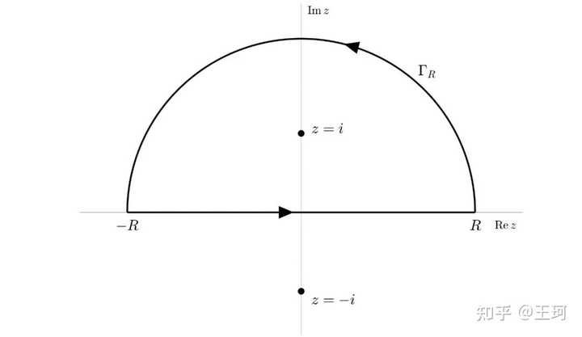

# 留数定理的本质是什么？

> **关于这篇**
>
> 正文是一篇外部回答的存档（出处见文首 `source`），**原文一字未改**；只做了排版清理：去掉每段公式后面重复一遍的转义残留行、去掉混进引用块里的重复小标题、把图片收进同目录的 `assets/`。
>
> **一句话版**：解析函数沿闭合曲线绕一圈，别的项都互相抵消，只有 $\frac{1}{z-z_0}$ 这一项活下来；它的系数就是「留数」，于是 $\oint_C f\,dz=2\pi i\sum_k\operatorname{Res}(f,z_k)$ —— 一整条曲线上的积分，塌缩成几个奇点上的局部数。
>
> **怎么读这篇**
>
> | 有多少时间 | 看哪几节 |
> | :--- | :--- |
> | **只有 10 分钟** | 上面那句话 + `▍为什么偏偏 1/z 特殊？` + `▍留数定理` |
> | **第一遍学** | 从头顺读，重点是 `▍复积分到底是什么意思？`（把 $\oint$ 还原成普通积分）和 `▍洛朗级数是什么？`（留数这个定义从哪来） |
> | **踩坑时回来查** | `▍来一个真正能看出威力的例子`（实积分怎么扔进复平面）、`▍自动控制里，留数其实很常用`（拉氏逆变换的部分分式） |

> ## Excerpt
> 先别管留数，先回顾一下复变函数到底在研究什么。复数写成：z=x+iy z=x+iy 复变函数就是：w=f(z) w=f(z) 例如：f(z)=z2,f(z)=ez,f(z)=1z f(z)=z^2,\quad f(z)=e^z,\quad f(z)=\frac1z 它和实函数最大的区别之一，就是复数有二维平面，每个复数：z=x+iy z=x+iy 对应复平面上的一个点。所以，实积分是沿实轴：∫ab

---

先别管留数，先回顾一下复变函数到底在研究什么。

复数写成：

$$
z=x+iy
$$

复变函数就是：

$$
w=f(z)
$$

例如：

$$
f(z)=z^{2},\,f(z)=e^{z},\,f(z)=\frac{1}{z}
$$

它和实函数最大的区别之一，就是复数有二维平面，每个复数：

$$
z=x+iy
$$

对应复平面上的一个点。所以，实积分是沿实轴：

$$
\int_{a}^{b}f(x)\,dx
$$

而复积分可以沿平面上的**任意曲线**走：

$$
\int_{C}f(z)\,dz
$$

比如可以绕一个圆：

$$
\oint_{C}f(z)\,dz
$$

这个“绕一圈积分”，就是留数真正表演的地方。

## ▍复积分到底是什么意思？

假设，复平面里有一条曲线：

$$
z=z(t),\,a\le t\le b
$$

那么：

$$
dz=z'(t)\,dt
$$

所以定义：

$$
\int_{C}f(z)\,dz=\int_{a}^{b}f(z(t))z'(t)\,dt
$$

本质上还是普通积分。

例如绕单位圆一圈：

$$
z=e^{it},\,0\le t\le 2\pi
$$

于是：

$$
dz=ie^{it}dt
$$

假设：

$$
f(z)=1
$$

那么：

$$
\oint_{C}1\,dz=\int_{0}^{2\pi}ie^{it}dt=0
$$

也就是说：

> 沿一个闭合曲线走一圈，$dz$ 自己的总和是0。

这很正常。

再试：

$$
f(z)=z
$$

于是：

$$
\oint_{C}z\,dz=\int_{0}^{2\pi}e^{it}ie^{it}dt=i\int_{0}^{2\pi}e^{2it}dt=0
$$

还是0。

这其实是个定理。

## ▍柯西积分定理：正常函数绕一圈，积分为0

如果 $f(z)$ 在某个区域里处处解析，那么，沿区域内部任何闭合曲线都有：

$$
\oint_{C}f(z)\,dz=0
$$

这就是**柯西积分定理**。

“解析”先简单理解成：

> 这个函数在这里非常正常，没有断裂、没有爆炸、没有奇点，而且可以做复数意义下的微分。

例如：

$$
z^{2},\,e^{z},\,\sin z
$$

在整个复平面都解析，所以：

$$
\oint_{C}z^{2}dz=0
$$

$$
\oint_{C}e^{z}dz=0
$$

$$
\oint_{C}\sin z\,dz=0
$$

不管这个闭合曲线长什么样。

但是，马上出现一个例外。

## ▍看看这个函数

$$
f(z)=\frac{1}{z}
$$

它在绝大多数地方都正常，唯独 $z=0$ 不行，因为：

$$
\frac{1}{0}
$$

发散了。

所以 $z=0$ 叫做一个**奇点**。

现在，沿单位圆绕原点一圈：

$$
z=e^{it}
$$

那么还是：

$$
dz=ie^{it}dt
$$

于是：

$$
\oint_{C}\frac{1}{z}\,dz=\int_{0}^{2\pi}\frac{1}{e^{it}}ie^{it}dt
$$

惊人的事情发生了：

$$
\frac{1}{e^{it}}ie^{it}=i
$$

所以：

$$
\oint_{C}\frac{1}{z}\,dz=\int_{0}^{2\pi}i\,dt=2\pi i
$$

不再是0！

为什么？

因为圆圈里藏了一个奇点：

$$
z=0
$$

可见：

> 正常的解析部分，闭合积分基本都会互相抵消。  
> 真正留下积分贡献的，是奇点。

于是，“留数”这个名字，就开始有感觉了。

## ▍再换几个函数试试

假设：

$$
f(z)=\frac{1}{z^{2}}
$$

还是绕单位圆，有：

$$
z=e^{it}
$$

所以：

$$
\frac{1}{z^{2}}=e^{-2it}
$$

于是：

$$
\oint_{C}\frac{1}{z^{2}}dz=\int_{0}^{2\pi}e^{-2it}ie^{it}dt=i\int_{0}^{2\pi}e^{-it}dt=0
$$

奇怪，

$$
\frac{1}{z}
$$

有积分 $2\pi i$，但是，

$$
\frac{1}{z^{2}}
$$

居然又没有。

再试

$$
\frac{1}{z^{3}}
$$

也是0。实际上：

$$
\oint_{C}z^{n}dz=0,\,n\ne -1
$$

唯独：

$$
\oint_{C}\frac{1}{z}dz=2\pi i
$$

特殊。

这件事，就是整个留数理论的核心。

## ▍为什么偏偏 $\frac{1}{z}$ 特殊？

我们算一下

$$
z=re^{it}
$$

绕半径 $r$ 的圆一圈，那么：

$$
dz=ire^{it}dt
$$

对于

$$
z^{n}
$$

有

$$
z^{n}=r^{n}e^{int}
$$

因此

$$
z^{n}dz=ir^{n+1}e^{i(n+1)t}dt
$$

所以

$$
\oint_{C}z^{n}dz=ir^{n+1}\int_{0}^{2\pi}e^{i(n+1)t}dt
$$

如果

$$
n+1\ne0
$$

那么指数函数转完整数圈以后全部抵消：

$$
\int_{0}^{2\pi}e^{i(n+1)t}dt=0
$$

唯独

$$
n=-1
$$

的时候，

$$
e^{i(n+1)t}=e^{0}=1
$$

所以：

$$
\oint_{C}\frac{1}{z}dz=i\int_{0}^{2\pi}dt=2\pi i
$$

因此：

> 在闭合积分里，所有 $z^{n}$ 项几乎都会消失，唯独 $z^{-1}$ 项活了下来。

留数就从这里来的。

## ▍那复杂函数怎么办？

现实中的函数当然不会只有 $\frac{1}{z}$，比如：

$$
f(z)=\frac{e^{z}}{z^{2}(z-1)}
$$

怎么办？

思路是：

> 把函数展开成幂级数。

熟悉的泰勒展开是：

$$
f(z)=a_{0}+a_{1}(z-z_{0})+a_{2}(z-z_{0})^{2}+\cdots
$$

但这里有个问题。如果 $z_{0}$ 是奇点，函数可能包含：

$$
\frac{1}{z-z_{0}},\,\frac{1}{(z-z_{0})^{2}},\,\frac{1}{(z-z_{0})^{3}}
$$

普通泰勒级数表示不了这些东西。于是，复变函数引入了一个更广义的展开，即**洛朗级数**。

## ▍洛朗级数是什么？

泰勒级数只有非负次幂：

$$
a_{0}+a_{1}(z-z_{0})+a_{2}(z-z_{0})^{2}+\cdots
$$

洛朗级数允许出现负次幂：

$$
f(z)=\cdots+\frac{a_{-3}}{(z-z_{0})^{3}}+\frac{a_{-2}}{(z-z_{0})^{2}}+\frac{a_{-1}}{z-z_{0}}+a_{0}+a_{1}(z-z_{0})+\cdots
$$

可以把它理解成：

> 泰勒展开 + 奇点部分。

其中

$$
\frac{a_{-1}}{z-z_{0}}
$$

这一项特别重要。

为什么？因为刚才已经证明了，对于所有 $n\ne-1$：

$$
\oint_{C}(z-z_{0})^{n}dz=0
$$

而唯独：

$$
\oint_{C}\frac{1}{z-z_{0}}dz=2\pi i
$$

因此，整个洛朗级数积分：

$$
\oint_{C}f(z)dz
$$

看似有无穷多项，实际上这些项几乎全部都会死掉，只剩：

$$
a_{-1}\oint_{C}\frac{1}{z-z_{0}}dz
$$

所以：

$$
\oint_{C}f(z)dz=2\pi i\,a_{-1}
$$

于是，这个

$$
a_{-1}
$$

就叫做**留数**，英文**Residue**，记为：

$$
\operatorname{Res}(f,z_{0})
$$

因此：

$$
\operatorname{Res}(f,z_{0})=\text{洛朗展开中}\frac{1}{z-z_{0}}\text{的系数}
$$

这就是留数最本质的定义。

## ▍所以“留数”究竟是什么？

现在可以给它一个非常直观的解释。

假设一个函数在奇点附近展开：

$$
f(z)=\frac{7}{(z-z_{0})^{3}}+\frac{3}{(z-z_{0})^{2}}+\frac{5}{z-z_{0}}+8+2(z-z_{0})+\cdots
$$

看起来乱七八糟，但如果你绕 $z_{0}$ 积分一圈：

$$
\oint_{C}f(z)dz
$$

前面的：

$$
\frac{7}{(z-z_{0})^{3}}
$$

没贡献。接着：

$$
\frac{3}{(z-z_{0})^{2}}
$$

也没贡献。后面的：

$$
8,\quad2(z-z_{0}),\cdots
$$

也没贡献。只有：

$$
\frac{5}{z-z_{0}}
$$

留下来了。所以：

$$
\operatorname{Res}(f,z_{0})=5
$$

于是直接得到：

$$
\oint_{C}f(z)dz=2\pi i\times5=10\pi i
$$

你不用再算曲线积分了，这就是留数真正厉害的地方。

## ▍留数定理

如果一条闭合曲线 $C$ 里有多个奇点：

$$
z_{1},z_{2},\cdots,z_{n}
$$

那么，把每个奇点的留数加起来就行：

$$
\oint_{C}f(z)dz=2\pi i\sum_{k=1}^{n}\operatorname{Res}(f,z_{k})
$$

这就是著名的**留数定理**，或者叫**残数定理**。

这条公式值得仔细体会，左边是：

> 沿一整条复杂闭合曲线进行积分。

右边却只是：

> 找几个点，分别算几个数，然后相加。

二维曲线问题，被转换成了几个局部奇点问题，这就是留数理论最神奇的地方之一。

## ▍来一个真正能看出威力的例子

算：

$$
\int_{-\infty}^{\infty}\frac{1}{x^{2}+1}\,dx
$$

学过微积分都知道：

$$
\int\frac{1}{x^{2}+1}dx=\arctan x
$$

所以答案：

$$
\pi
$$

但我们不硬算积分，而是把它推广到复数：

$$
f(z)=\frac{1}{z^{2}+1}
$$

因式分解：

$$
z^{2}+1=(z-i)(z+i)
$$

因此有两个奇点：

$$
z=i,\quad z=-i
$$

现在在复平面上画一个巨大的上半圆，沿实轴从

$$
-R\to R
$$

然后沿上半圆回来，上半平面包住一个奇点：

$$
z=i
$$

于是留数定理告诉我们：

$$
\oint_{C}\frac{1}{z^{2}+1}dz=2\pi i\operatorname{Res}(f,i)
$$

计算留数：

$$
\operatorname{Res}(f,i)=\lim_{z\to i}(z-i)\frac{1}{(z-i)(z+i)}
$$

所以

$$
=\frac{1}{i+i}=\frac{1}{2i}
$$

于是

$$
\oint_{C}f(z)dz=2\pi i\frac{1}{2i}=\pi
$$

另一方面，当 $R\to\infty$ 时，大半圆上的积分趋近于0，所以整个闭合积分只剩实轴：

$$
\int_{-\infty}^{\infty}\frac{1}{x^{2}+1}dx=\pi
$$

原来是一个实积分：

$$
\int_{-\infty}^{\infty}\frac{1}{x^{2}+1}dx
$$

我们却：

> 把它扔进复平面 → 画个半圆 → 找奇点 → 算一个留数 → 答案出来了。

这就是复变函数经常令人感觉“开挂”的地方。

## ▍自动控制里，留数其实很常用

控制里很熟悉：

$$
G(s)=\frac{1}{(s+1)(s+2)}
$$

它有两个极点：

$$
s=-1,\quad s=-2
$$

做部分分式：

$$
G(s)=\frac{1}{s+1}-\frac{1}{s+2}
$$

逆拉普拉斯：

$$
g(t)=e^{-t}-e^{-2t}
$$

这里其实已经在用留数了。即，在 $s=-1$ 附近，

$$
G(s)\sim\frac{1}{s+1}
$$

它的系数就是1，所以

$$
\operatorname{Res}(G,-1)=1
$$

在 $s=-2$ 附近，

$$
G(s)\sim-\frac{1}{s+2}
$$

所以

$$
\operatorname{Res}(G,-2)=-1
$$

于是时域响应就是：

$$
1\cdot e^{-t}+(-1)e^{-2t}
$$

实际上，逆拉普拉斯变换严格地写就是一个复积分：

$$
f(t)=\frac{1}{2\pi i}\int_{\gamma-i\infty}^{\gamma+i\infty}F(s)e^{st}\,ds
$$

但很多情况下，就是用留数定理算。

---

更多精彩**专栏**，请戳**[珂学原理知识库](https://zhida.zhihu.com/search?content_id=799901804&content_type=Answer&match_order=1&q=%E7%8F%82%E5%AD%A6&zhida_source=entity)**。
